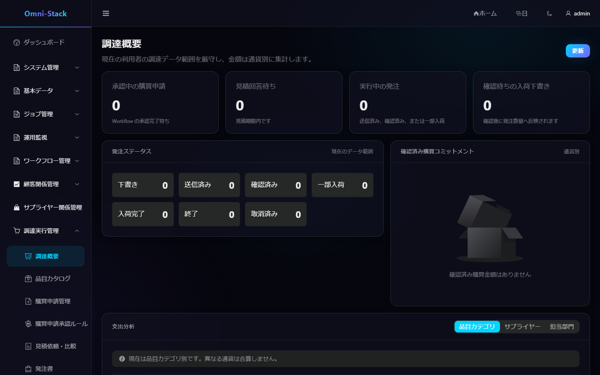
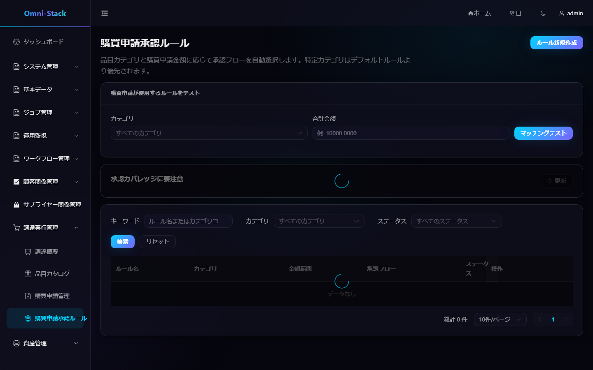

# 購買申請、RFQ、見積、注文、入荷の完全フロー

Procurement は品目、購買申請承認ルール、申請、RFQ、見積、発注、入荷を所有します。承認実行は `omni-workflow` にあり、Procurement は Flowable に依存しません。

## 1. エンドツーエンド

```text
品目保守 → 承認ルール設定 → 購買申請と承認 → RFQ 作成
→ サプライヤー招待 → 見積受信と比較 → 発注 → 確認 → 入荷
```

各段階に独立した状態機械があり、DB 状態変更で前提を飛ばしません。

### スクリーンショット

#### 図 1 `procurement-overview-ja-JP`：調達概要

- 前提条件：`procurement:overview:view` 権限を持つ調達管理者としてログイン
- 操作者：調達管理者
- 操作：「調達実行管理 → 調達概要」を開く
- 期待結果：メイン領域に「調達概要」タイトルと通貨別集計が表示される



## 2. 品目

カテゴリと品目はテナント共有マスタです。コード、名称、カテゴリ、単位、資産管理フラグ、資産数量の意味を持ちます。削除前に参照を確認します。合格した資産管理品目だけが資産候補を生成し、`assetQuantity` は正確な正整数です。

## 3. 購買申請承認ルール

カテゴリ/既定範囲、下限を含み上限を含まない金額区間、現在公開中の購買承認フローを選びます。実経路を確認し、「試算」でカテゴリと金額をサーバー解析器へ渡します。カバレッジの欠落や競合を解消して有効化します。停止・削除前には新しい欠落範囲を表示します。

### スクリーンショット

#### 図 2 `procurement-approval-rules-ja-JP`：承認ルール入口

- 前提条件：`procurement:approval-route:list` を持つ調達管理者としてログイン
- 操作者：調達管理者
- 操作：「調達実行管理 → 購買申請承認ルール」を開く
- 期待結果：メイン領域に「購買申請承認ルール」タイトル、先に一笔テスター、カバレッジリスクカードが表示される



#### 図 3 `procurement-approval-rules-mobile-zh-CN`：390×844 レスポンシブ（レイアウト参照、zh-CN 撮影）

- 前提条件：図 2 と同じ
- 操作者：調達管理者
- 操作：390×844 で同画面を開く
- 期待結果：横向スクロールなしで核心文案が完全に表示される。レスポンシブ撮影は現在 zh-CN のみ提供し、他言語も同一 fixture・ビューポートを使用します。


#### 図 4 `procurement-approval-rules-tablet-zh-CN`：1024×768 レスポンシブ（レイアウト参照、zh-CN 撮影）

- 前提条件：図 2 と同じ
- 操作者：調達管理者
- 操作：1024×768 で同画面を開く
- 期待結果：レイアウトが適応し、機能入口が完全。


## 4. 購買申請

草稿は申請者、組織、目的、明細を持ちます。送信後は重要項目を固定し、永続的な冪等開始要求で Workflow を開始します。`START_FAILED` は二重プロセスを作らず再試行できます。承認、拒否、取下げ、取消はドメイン規則に従います。

## 5. RFQ と見積

承認済み需要から RFQ を作り、有効なサプライヤーへ送信します。Portal の見積は信頼性メッセージで届き、イベント ID で冪等に処理します。価格、税、納期、備考を比較し、通貨、税込基準、締切、資格を確認して採用します。

## 6. 発注

採用結果から草稿、送信、サプライヤー確認、一部入荷、全入荷、取消へ進みます。送信後の主要条件を保護し、取消時は既存入荷を確認します。

## 7. 入荷

受入伝票は実収数量・品質ステータス・資産数量を明細ごとに記録します。`qualityStatus=PASS`、物料が `assetManaged=true`、資産数量が正確な正整数の場合にのみ資産候補イベントを発行します。重複送信・メッセージ再配信・Asset バックフィルは冪等に保たれます。

## 8. 権限と調査

管理者はマスタとルール、申請者は可視申請、購買担当は RFQ/注文/入荷、サプライヤーは自社 Portal 情報だけを扱います。文書番号、Workflow、Outbox、Inbox、Trace ID を関連付けます。

[Procurement 設計](../design/procurement-design.md)を参照してください。

