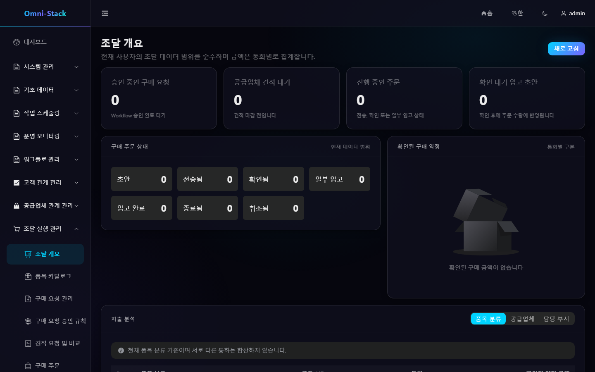
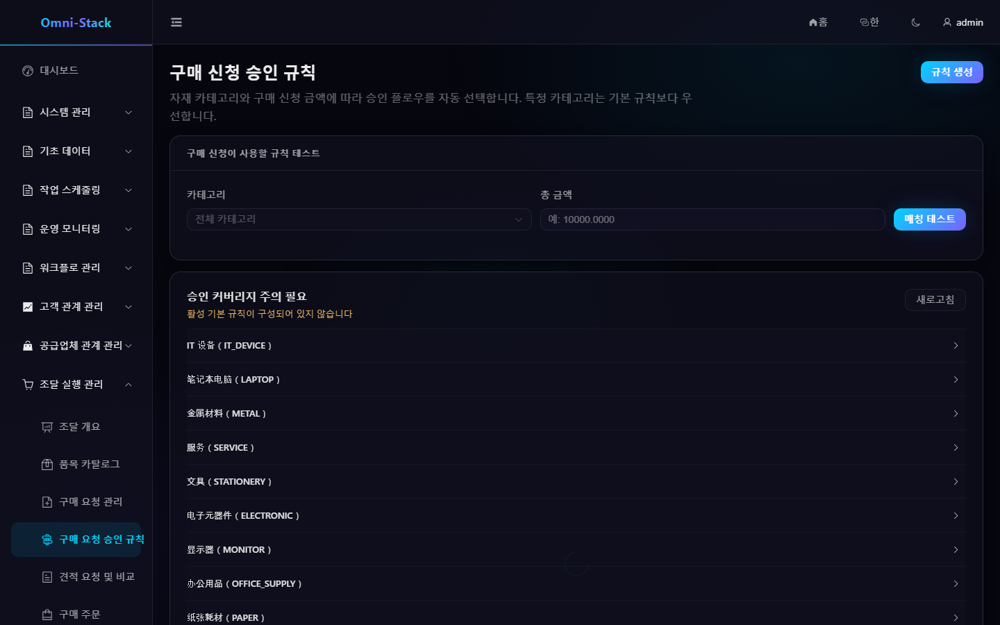

# 구매 요청, RFQ, 견적, 주문과 입고 전체 흐름

Procurement는 품목, 구매 요청 승인 규칙, 요청, RFQ, 견적, 구매 주문과 입고를 소유합니다. 승인 런타임은 `omni-workflow`에 있으며 Procurement는 Flowable에 직접 의존하지 않습니다.

## 1. 종단 간 흐름

```text
품목 유지 → 승인 규칙 설정 → 구매 요청과 승인 → RFQ 생성
→ 공급업체 초대 → 견적 수신과 비교 → 주문 → 확인 → 입고
```

각 단계는 독립 상태 머신을 가지며 DB 상태 변경으로 선행 단계를 건너뛰지 않습니다.

### 스크린숏

#### 그림 1 `procurement-overview-ko-KR`: 조달 개요

- 전제 조건: 조달 개요 조회 권한을 가진 조달 관리자로 로그인
- 작업자: 조달 관리자
- 작업: 조달 실행 관리 → 조달 개요 열기
- 예상 결과: 메인 영역에 '조달 개요' 제목과 통화별 집계가 표시됨



## 2. 품목

카테고리와 품목은 테넌트 공유 마스터입니다. 코드, 이름, 카테고리, 단위, 자산 관리 플래그와 자산 수량 의미를 가집니다. 삭제 전에 참조를 확인합니다. 합격한 자산 관리 품목만 자산 후보를 생성하고 `assetQuantity`는 정확한 양의 정수입니다.

## 3. 구매 요청 승인 규칙

카테고리/기본 범위, 하한 포함·상한 제외 금액 구간, 현재 게시된 조달 승인 흐름을 선택합니다. 실제 경로를 미리 보고 “시험”에서 카테고리와 금액을 서버 해석기에 전달합니다. 커버리지 공백이나 충돌을 해결한 뒤 활성화하며 중지·삭제 전에 새 공백을 표시합니다.

### 스크린숏

#### 그림 2 `procurement-approval-rules-ko-KR`: 승인 규칙 진입

- 전제 조건: `procurement:approval-route:list` 권한을 가진 조달 관리자로 로그인
- 작업자: 조달 관리자
- 작업: 조달 실행 관리 → 구매 요청 승인 규칙 열기
- 예상 결과: 메인 영역에 '구매 요청 승인 규칙' 제목, 시합 테스터, 커버리지 위험 카드가 표시됨



#### 그림 3 `procurement-approval-rules-mobile-zh-CN`: 390×844 반응형(레이아웃 참조, zh-CN 촬영)

- 전제 조건: 그림 2과 동일
- 작업자: 조달 관리자
- 작업: 같은 화면을 390×844로 열기
- 예상 결과: 가로 스크롤 없이 핵심 문안이 완전하게 표시됨. 반응형 촬영은 현재 zh-CN만 제공하며 다른 언어도 동일한 fixture·뷰포트를 사용합니다.


#### 그림 4 `procurement-approval-rules-tablet-zh-CN`: 1024×768 반응형(레이아웃 참조, zh-CN 촬영)

- 전제 조건: 그림 2과 동일
- 작업자: 조달 관리자
- 작업: 같은 화면을 1024×768로 열기
- 예상 결과: 레이아웃이 적응하고 기능 진입점이 완전함.


## 4. 구매 요청

초안은 요청자, 조직, 용도, 상세를 가집니다. 제출 후 중요 필드를 잠그고 영구 멱등 시작 요청으로 Workflow를 시작합니다. `START_FAILED`는 중복 프로세스 없이 재시도합니다. 승인, 거절, 철회, 취소는 도메인 규칙을 따릅니다.

## 5. RFQ와 견적

승인된 수요에서 RFQ를 만들고 활성 공급업체에 보냅니다. Portal 견적은 신뢰성 메시지로 도착하며 이벤트 ID로 멱등 처리합니다. 가격, 세금, 납기, 메모를 비교하고 통화, 세금 기준, 마감, 공급업체 자격을 확인해 선정합니다.

## 6. 구매 주문

선정 결과는 초안, 발송, 공급업체 확인, 부분 입고, 전체 입고, 취소로 진행합니다. 발송 후 주요 조건을 보호하고 취소 전에 기존 입고를 확인합니다.

## 7. 입고

실제 수량, 품질, 자산 수량을 행별 기록합니다. PASS, 자산 관리 대상, 정확한 양의 정수일 때만 자산 후보를 발행합니다. 중복 제출, 메시지 재전송, Asset backfill은 멱등합니다.

## 8. 권한과 진단

조달 관리자는 마스터와 규칙, 요청자는 보이는 요청, 구매 담당은 RFQ/주문/입고, 공급업체는 자기 Portal 정보만 다룹니다. 문서 번호, Workflow, Outbox, Inbox, Trace ID를 연결합니다.

[Procurement 설계](../design/procurement-design.md)를 참고하세요.

