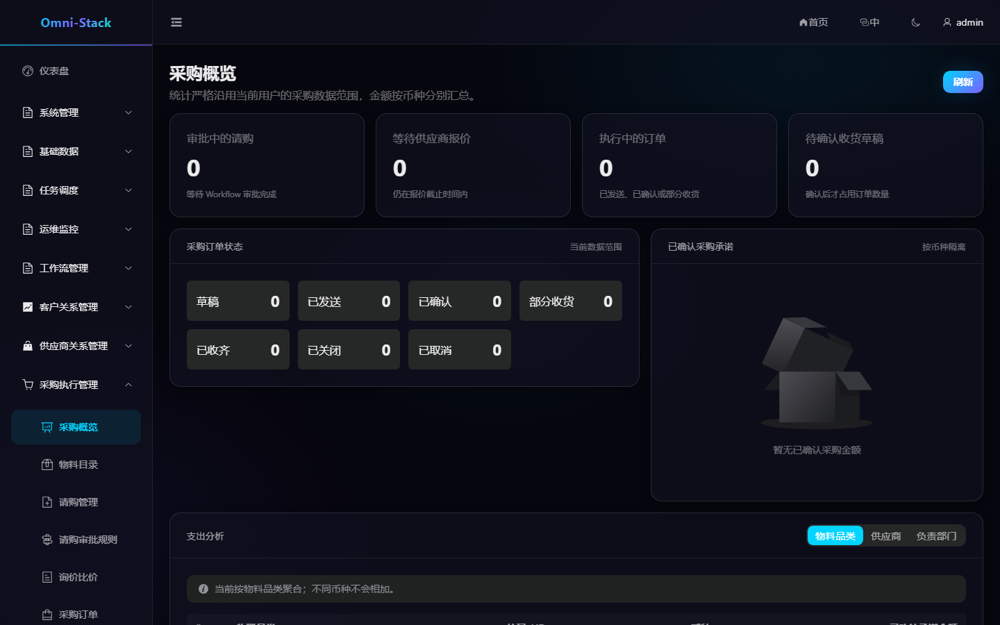
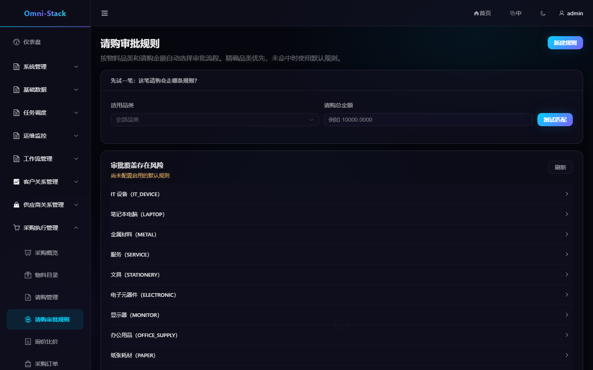

# 采购申请、询价、报价、订单与收货完整业务流程

Procurement 负责物料目录、请购审批规则、请购、RFQ、报价汇聚、采购订单和收货。审批运行时始终位于 `omni-workflow`，采购服务不直接依赖 Flowable。

## 1. 端到端流程

```text
维护物料 → 配置审批规则 → 创建请购 → 提交审批 → 生成 RFQ
→ 邀请供应商 → 接收报价 → 比价定标 → 创建订单 → 供应商确认 → 收货
```

每一步都有独立状态机。不能通过修改数据库状态跳过前置步骤。

### 操作截图

#### 图 1 `procurement-overview-zh-CN`：采购概览

- 前置条件：以采购管理员身份登录，具备 `procurement:overview:view` 权限
- 操作者：采购管理员
- 操作：进入「采购执行管理 → 采购概览」
- 预期结果：主内容区显示「采购概览」标题，金额按币种隔离汇总



## 2. 物料目录

物料分类和物料是租户共享基础数据。物料记录包含编码、名称、分类、单位、是否资产化和默认资产数量规则。删除前必须检查是否已被请购或采购单据引用。

资产化物料在收货合格时才产生资产候选事件。`assetQuantity` 必须是精确正整数，金额和数量按接口契约使用十进制字符串或明确精度。

## 3. 请购审批规则

“请购审批规则”面向采购业务人员，不要求理解模型版本 ID。创建规则时：

1. 选择适用品类或默认范围。
2. 设置包含下限、不包含上限的金额区间。
3. 选择当前已发布的采购审批流程。
4. 查看真实审批路径预览。
5. 使用“先试一笔”输入品类和金额验证匹配结果。
6. 确认覆盖分析无断档或冲突后启用。

停用或删除前页面会展示新增断档和受影响范围。规则按服务端解析器匹配，前端不复制判断算法。

### 操作截图

#### 图 2 `procurement-approval-rules-zh-CN`：请购审批规则入口

- 前置条件：以采购管理员身份登录，具备 `procurement:approval-route:list` 权限
- 操作者：采购管理员
- 操作：进入「采购执行管理 → 请购审批规则」
- 预期结果：主内容区显示「请购审批规则」标题、「先试一笔」与审批覆盖风险卡片



#### 图 3 `procurement-approval-rules-mobile-zh-CN`：390×844 响应式

- 前置条件：同图 2
- 操作者：采购管理员
- 操作：390×844 视口打开同一页面
- 预期结果：页面正常渲染无横向滚动，核心文案完整


#### 图 4 `procurement-approval-rules-tablet-zh-CN`：1024×768 响应式

- 前置条件：同图 2
- 操作者：采购管理员
- 操作：1024×768 视口打开同一页面
- 预期结果：布局自适应，功能入口完整


## 4. 请购

请购包含申请人、组织、用途和明细。草稿可编辑和删除；提交后锁定关键字段并启动 Workflow。启动使用持久化请求与重试协调，出现 `START_FAILED` 时可诊断重试，不能重复创建审批实例。

审批通过后请购进入可采购状态；拒绝、撤回或取消按领域规则恢复。申请人数据范围与 RFQ/订单负责人范围不同。

## 5. RFQ 与供应商报价

从已批准请购创建 RFQ，选择有效供应商并发送。供应商在 Portal 提交报价后，SRM 通过可靠消息通知 Procurement。消费者按事件 ID 幂等更新报价。

比价视图比较价格、税率、交期和备注。业务人员定标前应确认币种、含税口径、截止状态和供应商有效性。取消或截止的 RFQ 拒绝新报价。

## 6. 采购订单

定标后创建采购订单。订单从草稿到发送、供应商确认、部分收货、全部收货或取消。发送后关键价格与供应商不能随意修改；取消需要检查是否已有收货。

## 7. 收货

收货单逐行记录实收数量、质量状态和资产数量。只有 `qualityStatus=PASS`、物料 `assetManaged=true` 且资产数量为精确正整数时，才发布资产候选事件。

重复提交、消息重投和 Asset 回填都必须保持幂等。完成后在采购概览核对订单与收货状态，在资产台账核对实际建卡结果。

## 8. 权限与排查

- 采购管理员维护物料和审批规则。
- 申请人创建并查看自己或组织范围内的请购。
- 采购负责人管理 RFQ、订单和收货。
- 供应商只在 Portal 查看自己的邀请和报价。

跨服务问题按业务单号、Workflow 实例 ID、Outbox 消息 ID、Inbox 事件 ID 和 Trace ID 排查。详细约束见 [Procurement 设计](../design/procurement-design.md)。

