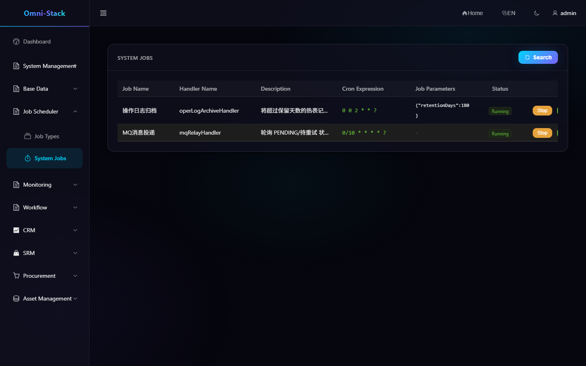
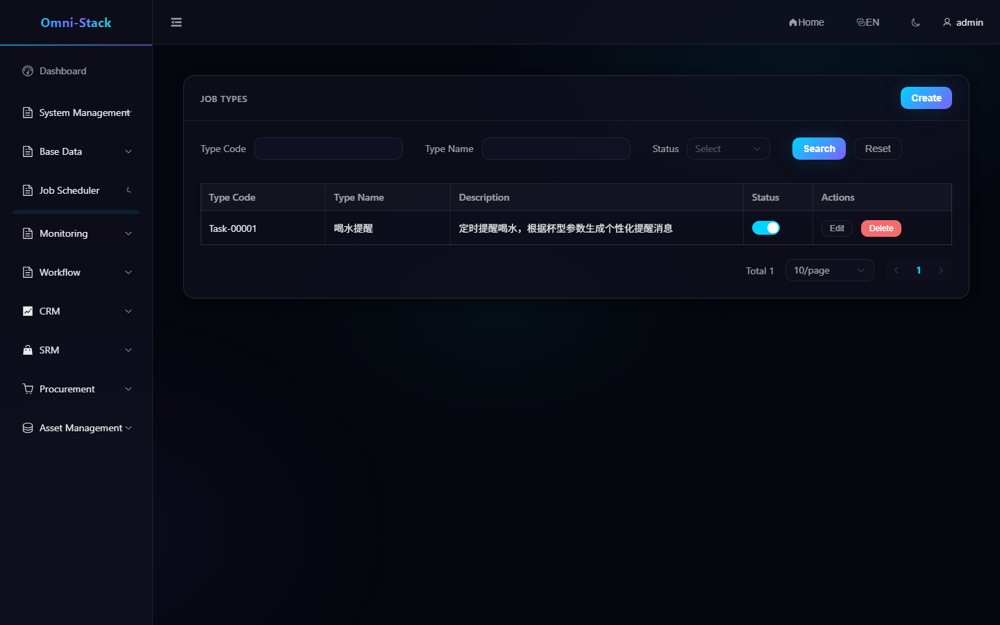
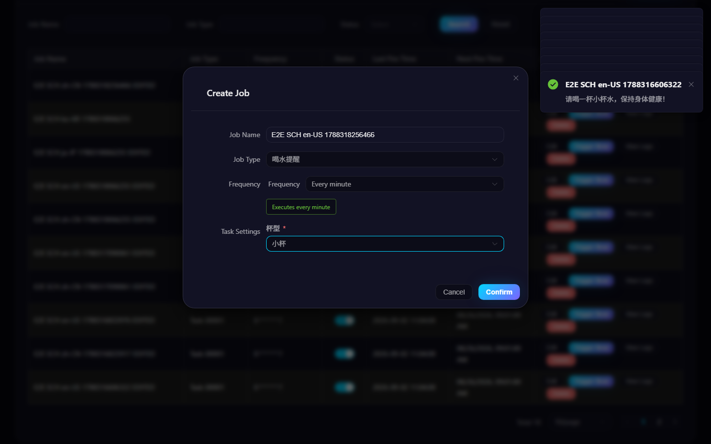
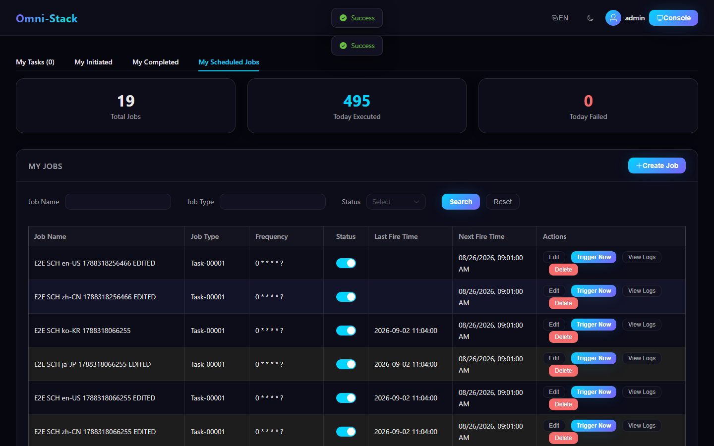

# System Jobs, Personal Jobs, and Job-Type Extensions

Scheduling has two tracks. Code-declared system jobs are operated by administrators; users create personal jobs from approved job types. Both use XXL-JOB but have different ownership and lifecycle rules.

## 1. System Jobs

Platform work such as MQ relay, log archival, and compensation scans requires both annotations:

```java
@XxlJob("handlerName")
@SystemJobMeta(...)
```

Without either one, `SystemJobRegistry` cannot expose the handler. The UI controls registration, start/stop, and immediate execution, while implementation remains versioned code.

### Screenshot

#### Figure 1 `scheduling-system-jobs-en-US`: System job list

- Prerequisites: log in as an administrator with system job access
- Actor: platform administrator
- Action: open Scheduler → System Jobs
- Expected result: the main area shows registered handlers with start/stop and run-once actions



#### Figure 2 `scheduling-job-type-en-US`: Job type management

- Prerequisites: log in as an administrator with scheduling permission
- Actor: platform administrator
- Action: open Scheduler → Job Types
- Expected result: the Job Types list-management UI is shown (consistent across four languages)



#### Figure 3 `scheduling-personal-create-validation-en-US`: Create-API failure prompt

- Prerequisites: log in as an administrator; in the test scenario a deterministic 500 fault is injected into the create API
- Actor: ordinary user
- Action: fill in the job form under My Scheduled Jobs and submit
- Expected result: the page pops an error message (real error-handling path) and the dialog stays retryable



#### Figure 4 `scheduling-personal-lifecycle-en-US`: Personal job create and edit

- Prerequisites: log in as an ordinary user, open My Scheduled Jobs
- Actor: ordinary user
- Action: create a uniquely-named personal job (drink-water reminder, no external side effect), then edit and rename it
- Expected result: the list truly reflects the create and rename results (create/edit/list three-state loop)



## 2. Personal Jobs

In My Workspace:

1. Create a task.
2. Select an enabled job type.
3. Choose a schedule with the Cron generator.
4. Fill dynamic parameters from its JSON Schema.
5. Save, pause, resume, edit, trigger, and inspect logs.

Personal jobs use row ownership (`createBy`) rather than RBAC. All jobs share `userJobExecuteHandler`; `typeCode` in the message selects the actual handler.

## 3. Job Types

A job type defines stable `typeCode`, display name, description, parameter Schema, and state. `typeCode` must exactly equal the `UserJobHandler` bean name. Otherwise execution cannot be routed.

Dynamic parameters accept standard JSON Schema `object/properties` and the compatible flat format. A string field with `enum` renders as a select while APIs still receive stable enum values.

## 4. Adding a Type

1. Implement `UserJobHandler` with a stable bean name.
2. Validate parameters and return a user-readable result.
3. Add the matching `typeCode` and Schema.
4. Build `omni-base` and verify the handler enters `UserJobHandlerRegistry`.
5. Create and trigger a job against isolated XXL-JOB.
6. Verify success/failure logs, pause/resume, update, and delete.

## 5. Consistency

Database creation and XXL-JOB registration must both succeed. Registration failure makes `UserJobServiceImpl.createJob()` remove the new row. The XXL-JOB session cookie remains in memory and is renewed automatically. Handlers must be idempotent because scheduled and manual triggers can overlap.

## 6. Troubleshooting

- No type in the UI: inspect type state and code.
- No XXL-JOB record: inspect Admin configuration and executor registration.
- Silent routing failure: compare bean name and `typeCode` exactly.
- Trigger without result: inspect job and handler logs.
- Missing system handler: inspect both required annotations and `omni-common-job`.

See the detailed [Scheduling Guide](../scheduling.en.md).

