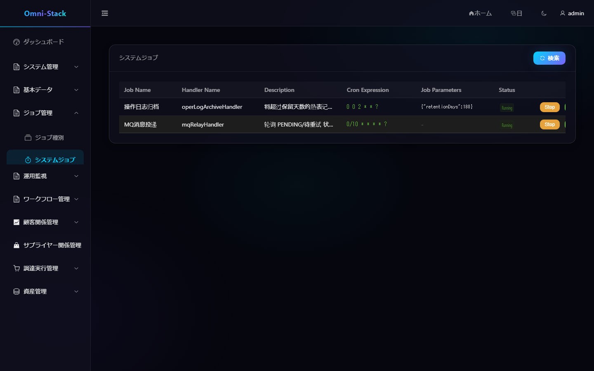
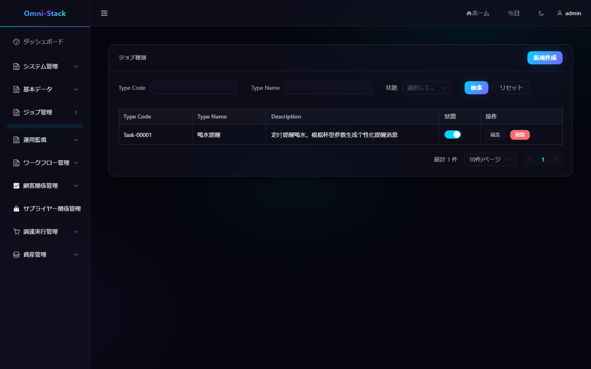
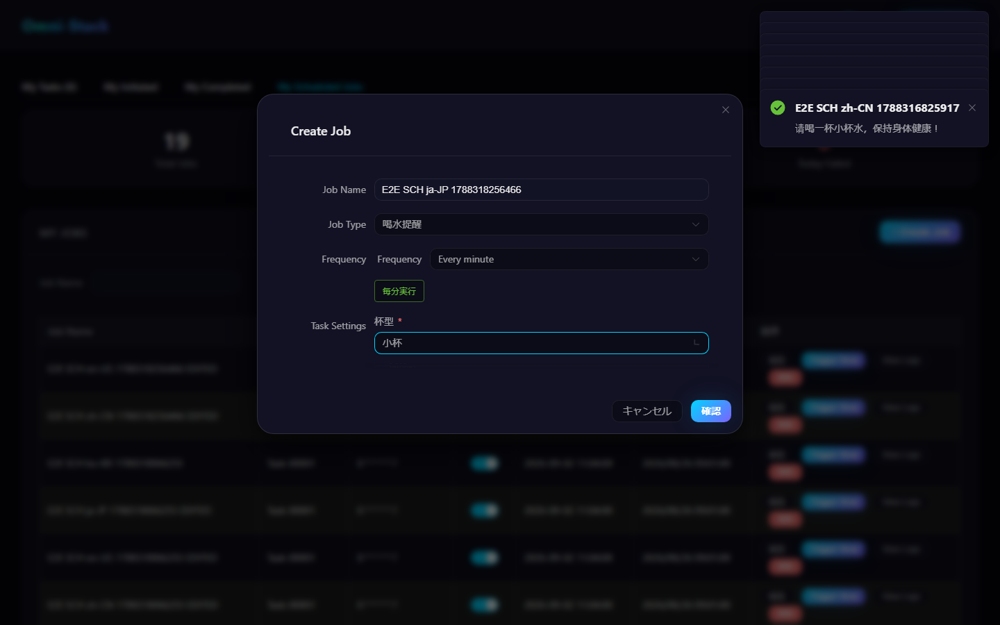
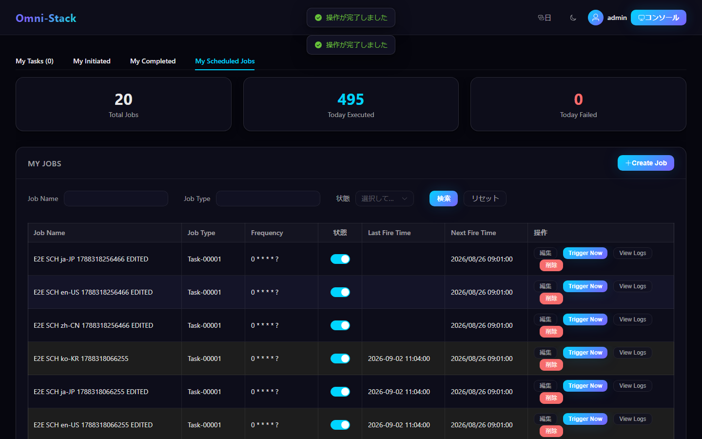

# システムジョブ、個人ジョブ、ジョブ種別拡張

スケジューリングシステムはデュアルトラック構造を採用します：システムジョブはコードで宣言され運用が管理し、個人ジョブはユーザーがワークスペースで承認済みジョブ種別から作成します。両方のジョブが XXL-JOB を使いますが、ライフサイクルと権限が異なります。

## 1. システムジョブ

システムジョブはプラットフォームレベルのバックグラウンド作業（MQ relay、ログアーカイブ、補償スキャンなど）を処理します。各ハンドラは次を同時に宣言しなければなりません：

```java
@XxlJob("handlerName")
@SystemJobMeta(...)
```

どちらかの注釈が欠けると `SystemJobRegistry` に入りません。管理ページは登録状態の閲覧、開始/停止、即時実行を許可しますが、ハンドラ実装は引き続きコードとリリースバージョンで管理されます。

### 操作スクリーンショット

#### 図 1 `scheduling-system-jobs-ja-JP`：システムジョブ一覧

- 前提条件：管理者としてログインし、システムジョブ閲覧権限を持つ
- 操作者：プラットフォーム管理者
- 操作：「ジョブスケジューリング → システムジョブ」に入る
- 期待結果：メイン領域に「ジョブスケジューリング」とハンドラ登録状態、開始/停止操作が表示される



#### 図 2 `scheduling-job-type-ja-JP`：ジョブ種別管理

- 前提条件：管理者でログインし、ジョブスケジューリング権限を持つ
- 操作者：プラットフォーム管理者
- 操作：「ジョブスケジューリング → ジョブ種別」に入る
- 期待結果：「ジョブ種別」リスト管理画面が表示される（4言語一致）



#### 図 3 `scheduling-personal-create-validation-ja-JP`：作成インターフェース失敗プロンプト

- 前提条件：管理者でログイン；テストシナリオでは作成インターフェースに確定的な 500 障害を注入
- 操作者：一般ユーザー
- 操作：「マイ定時ジョブ」でジョブフォームを入力して提出
- 期待結果：ページがエラーメッセージを表示（実際のエラー処理経路）、ダイアログは再試行可能なまま



#### 図 4 `scheduling-personal-lifecycle-ja-JP`：個人ジョブの作成と編集

- 前提条件：一般ユーザーでログインし「マイ定時ジョブ」に入る
- 操作者：一般ユーザー
- 操作：一意な名称の個人ジョブ（飲み物リマインダー、外部副作用なし）を作成後に編集して改名
- 期待結果：リストが作成と改名の結果を実際に反映（作成/編集/リストの3状態クローズドループ）



## 2. 個人ジョブ

ログインユーザーはホームページの「マイ定時ジョブ」で：

1. 「ジョブ作成」をクリック。
2. 有効なジョブ種別を選択。
3. Cron ジェネレーターで実行頻度を選択。
4. その種別の JSON Schema に従い動的パラメータを入力。
5. 保存後に一時停止、再開、編集、即時実行、ログ閲覧が可能。

個人ジョブは `createBy` で帰属を検証し、汎用 RBAC に依存しません。すべての個人ジョブは `userJobExecuteHandler` を共有し、具体的なハンドラはメッセージ内の `typeCode` でルーティングされます。

## 3. ジョブ種別

ジョブ種別は管理者が維持し、安定した `typeCode`、表示名、説明、パラメータ Schema、状態を含みます。`typeCode` はバックエンドの `UserJobHandler` Bean 名と完全一致しなければならず、さもないと登録に成功したジョブが実行時にルーティングできません。

動的パラメータは標準 JSON Schema `object/properties` および互換のフラットフィールド形式をサポートします。`enum` を持つ文字列フィールドはドロップダウンとして表示され、インターフェースは引き続き列挙の安定値を提出します。

## 4. ジョブ種別の新規追加

「飲み物リマインダー」を参考に：

1. `UserJobHandler` を実装し、安定した Bean 名を使用。
2. パラメータを検証し、ユーザーが読みやすい結果メッセージを返す。
3. シードや管理側で同名の `typeCode` とパラメータ Schema を追加。
4. `omni-base` をビルドし、ハンドラが `UserJobHandlerRegistry` に入ることを確認。
5. 隔離された XXL-JOB 環境でジョブを作成し即時実行。
6. 成功ログ、失敗ログ、一時停止、再開、更新、削除を検証。

## 5. 整合性と失敗処理

個人ジョブ作成時、データベース記録と XXL-JOB 登録は両方成功しなければなりません。登録失敗後 `UserJobServiceImpl.createJob()` は挿入済みレコードを削除し、孤児ジョブを残してはいけません。XXL-JOB セッション Cookie はメモリのみ常駐し、期限切れ後はクライアントが自動再ログインします。

ジョブ実行は冪等を保つべきです；即時実行は定時トリガーと並行する可能性があり、ハンドラは同一時刻に一度だけ実行されると仮定してはいけません。

## 6. トラブルシューティング

- 画面にジョブ種別がない：種別状態と `typeCode` を確認。
- 作成後に XXL-JOB 記録がない：Admin アドレス、アカウント、実行器登録を確認。
- 静かなルーティング不可：Bean 名が `typeCode` と完全一致するか確認。
- トリガーはあるが業務結果がない：個人ジョブログと対象ハンドラログを確認。
- システムジョブが見えない：二重注釈と `omni-common-job` 依存を確認。

詳細な拡張規則は[スケジューリングシステム文書](../scheduling.jp.md)を参照。
