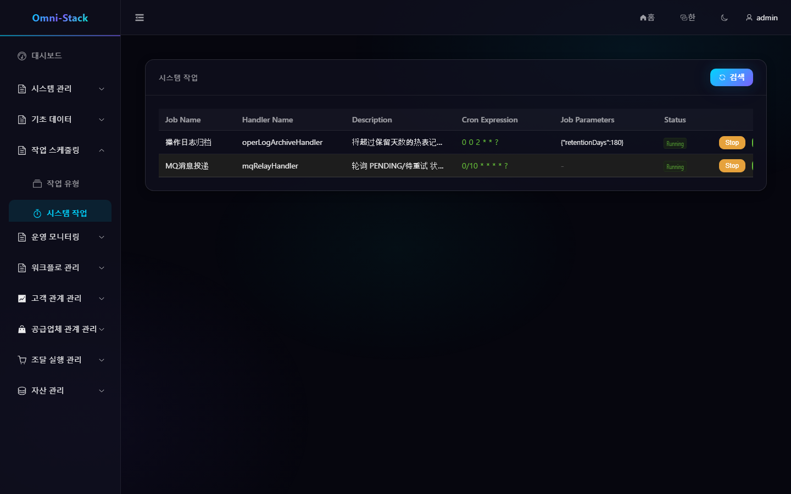
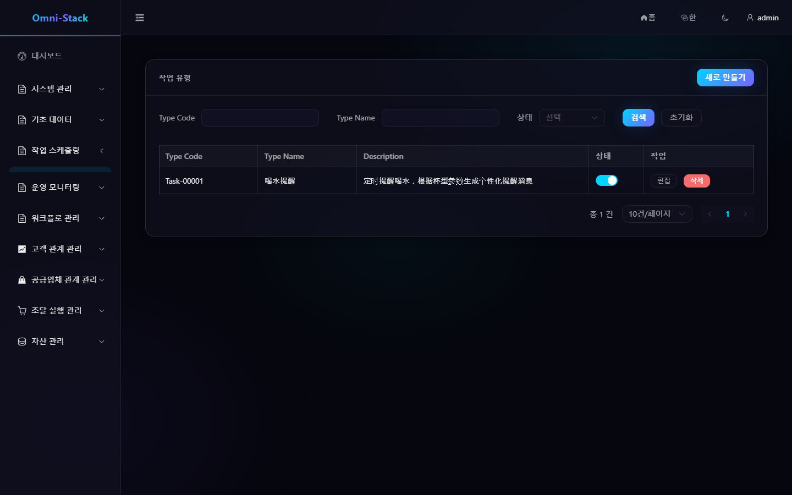
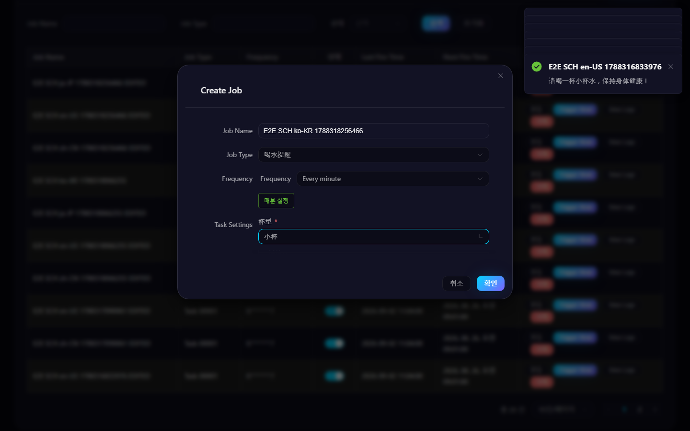
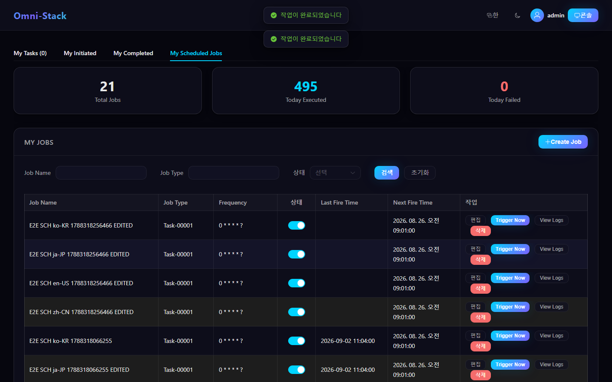

# 시스템 작업, 개인 작업과 작업 유형 확장

스케줄링 시스템은 이중 트랙 구조를 채택합니다: 시스템 작업은 코드로 선언되고 운영자가 관리하며, 개인 작업은 사용자가 워크스페이스에서 승인된 작업 유형으로 생성합니다. 두 작업 모두 XXL-JOB 을 사용하지만 수명주기와 권한이 다릅니다.

## 1. 시스템 작업

시스템 작업은 MQ relay, 로그 보관, 보상 스캔 같은 플랫폼 수준 백그라운드 작업을 처리합니다. 각 처리기는 다음을 동시에 선언해야 합니다:

```java
@XxlJob("handlerName")
@SystemJobMeta(...)
```

어느 하나의 어노테이션이 없으면 `SystemJobRegistry` 에 들어가지 않습니다. 관리 페이지는 등록 상태 조회, 시작/중지, 즉시 실행을 허용하지만, 처리기 구현은 계속 코드와 릴리스 버전으로 관리됩니다.

### 조작 스크린샷

#### 그림 1 `scheduling-system-jobs-ko-KR`: 시스템 작업 목록

- 전제 조건: 관리자로 로그인하고 시스템 작업 조회 권한 보유
- 작업자: 플랫폼 관리자
- 조작: 「작업 스케줄링 → 시스템 작업」 진입
- 예상 결과: 메인 영역에 「작업 스케줄링」과 처리기 등록 상태, 시작/중지 조작이 표시됨



#### 그림 2 `scheduling-job-type-ko-KR`: 작업 유형 관리

- 전제 조건: 관리자로 로그인하고 작업 스케줄링 권한 보유
- 작업자: 플랫폼 관리자
- 조작: 「작업 스케줄링 → 작업 유형」 진입
- 예상 결과: 「작업 유형」 목록 관리 화면 표시(4개 언어 일치)



#### 그림 3 `scheduling-personal-create-validation-ko-KR`: 생성 인터페이스 실패 안내

- 전제 조건: 관리자로 로그인; 테스트 시나리오에서 생성 인터페이스에 확정적 500 장애 주입
- 작업자: 일반 사용자
- 조작: 「내 예약 작업」에서 작업 폼을 작성해 제출
- 예상 결과: 페이지에 오류 메시지가 나타나고(실제 오류 처리 경로), 대화상자는 재시도 가능한 채로 유지



#### 그림 4 `scheduling-personal-lifecycle-ko-KR`: 개인 작업 생성과 편집

- 전제 조건: 일반 사용자로 로그인해 「내 예약 작업」 진입
- 작업자: 일반 사용자
- 조작: 고유 이름의 개인 작업(물 마시기 알림, 외부 부작용 없음)을 생성한 뒤 편집해 이름 변경
- 예상 결과: 목록이 생성과 이름 변경 결과를 실제로 반영(생성/편집/목록 3-state 클로즈드 루프)



## 2. 개인 작업

로그인 사용자는 홈페이지 「내 예약 작업」에서:

1. 「작업 생성」을 클릭.
2. 활성화된 작업 유형을 선택.
3. Cron 생성기로 실행 빈도를 선택.
4. 해당 유형의 JSON Schema 에 따라 동적 파라미터를 입력.
5. 저장 후 일시중지, 재개, 편집, 즉시 실행, 로그 조회 가능.

개인 작업은 `createBy` 로 귀속을 검증하고 범용 RBAC 에 의존하지 않습니다. 모든 개인 작업은 `userJobExecuteHandler` 를 공유하며, 구체적 처리기는 메시지의 `typeCode` 로 라우팅됩니다.

## 3. 작업 유형

작업 유형은 관리자가 유지관리하며 안정적 `typeCode`, 표시 이름, 설명, 파라미터 Schema, 상태를 포함합니다. `typeCode` 는 백엔드 `UserJobHandler` Bean 이름과 완전히 일치해야 하며, 그렇지 않으면 등록에 성공한 작업이 실행 시 라우팅되지 않습니다.

동적 파라미터는 표준 JSON Schema `object/properties` 및 호환 평면 필드 형식을 지원합니다. `enum` 이 있는 문자열 필드는 드롭다운으로 표시되고, 인터페이스는 계속 열거형 안정 값을 제출합니다.

## 4. 작업 유형 추가

「물 마시기 알림」을 참고로:

1. `UserJobHandler` 를 구현하고 안정된 Bean 이름을 사용.
2. 파라미터를 검증하고 사용자가 읽기 좋은 결과 메시지를 반환.
3. 시드나 관리측에 동일 이름의 `typeCode` 와 파라미터 Schema 를 추가.
4. `omni-base` 를 빌드해 처리기가 `UserJobHandlerRegistry` 에 들어가는지 확인.
5. 격리된 XXL-JOB 환경에서 작업을 생성하고 즉시 실행.
6. 성공 로그, 실패 로그, 일시중지, 재개, 갱신, 삭제를 검증.

## 5. 일관성과 실패 처리

개인 작업 생성 시 데이터베이스 기록과 XXL-JOB 등록이 모두 성공해야 합니다. 등록 실패 후 `UserJobServiceImpl.createJob()` 은 삽입된 기록을 삭제하며, 고아 작업을 남겨선 안 됩니다. XXL-JOB 세션 쿠키는 메모리에만 상주하고 만료 후 클라이언트가 자동 재로그인합니다.

작업 실행은 멱등을 유지해야 합니다; 즉시 실행은 예약 트리거와 병행할 수 있으므로 처리기는 같은 시간에 한 번만 실행된다고 가정해선 안 됩니다.

## 6. 문제 해결

- 화면에 작업 유형 없음: 유형 상태와 `typeCode` 확인.
- 생성 후 XXL-JOB 기록 없음: Admin 주소, 계정, 실행기 등록 확인.
- 조용한 라우팅 불가: Bean 이름이 `typeCode` 와 완전히 일치하는지 확인.
- 트리거는 있으나 업무 결과 없음: 개인 작업 로그와 대상 처리기 로그 확인.
- 시스템 작업이 안 보임: 이중 어노테이션과 `omni-common-job` 의존 확인.

상세 확장 규칙은 [스케줄링 시스템 문서](../scheduling.kr.md)를 참고하세요.
