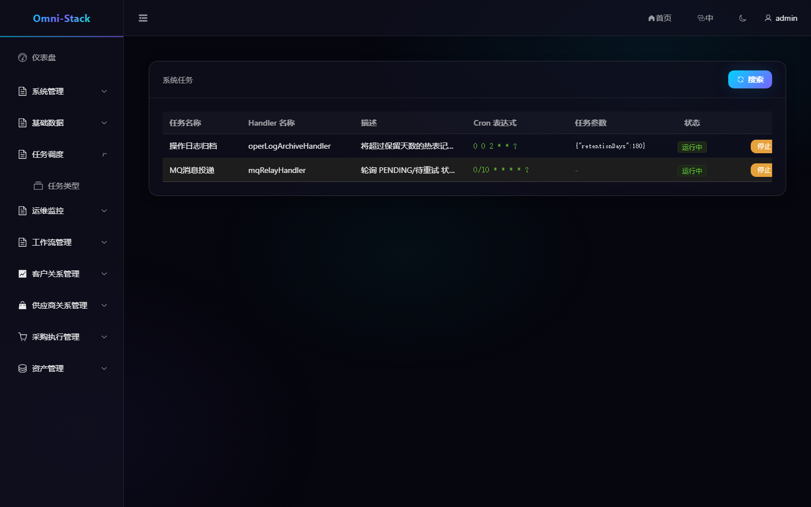
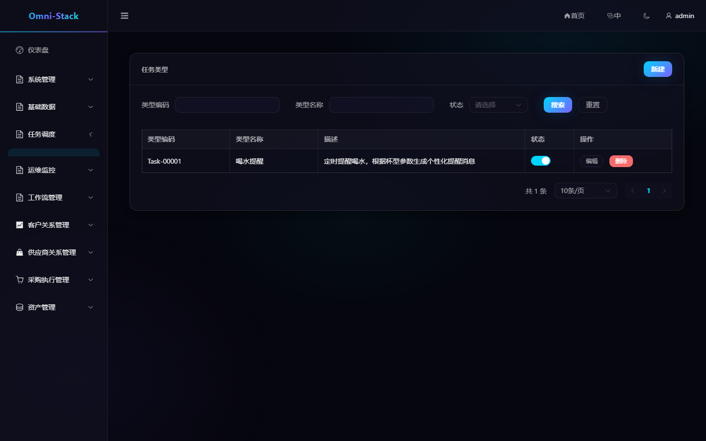
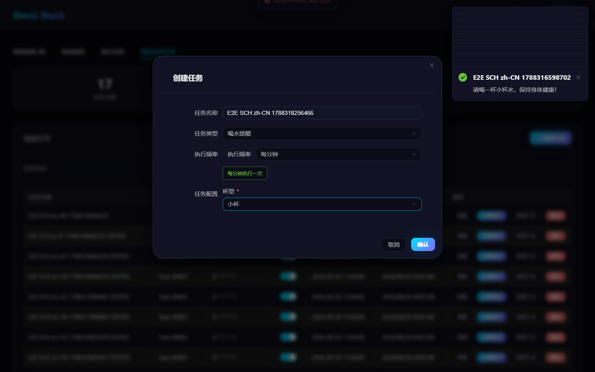
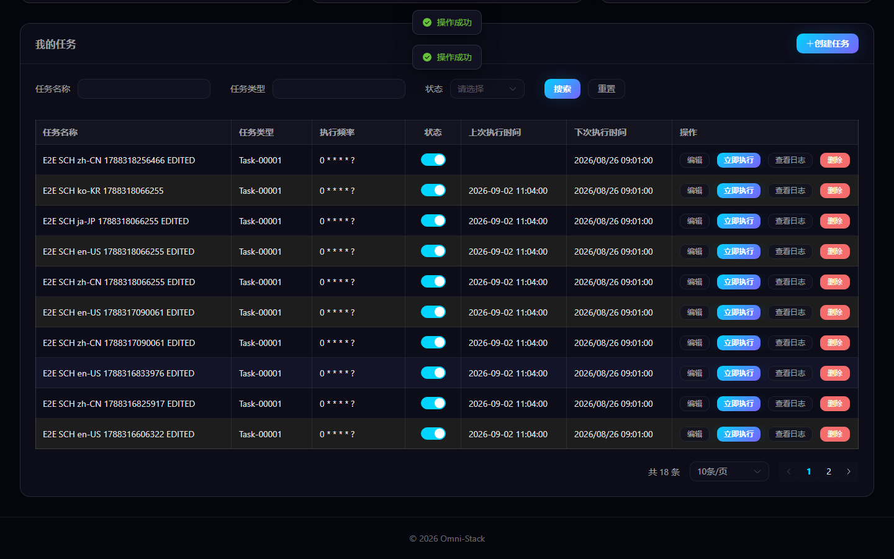

# 系统任务、个人任务与任务类型扩展

调度系统采用双轨结构：系统任务由代码声明和运维管理；个人任务由用户在工作台按已批准的任务类型创建。两类任务都使用 XXL-JOB，但生命周期和权限不同。

## 1. 系统任务

系统任务处理平台级后台工作，例如 MQ relay、日志归档和补偿扫描。每个处理器必须同时声明：

```java
@XxlJob("handlerName")
@SystemJobMeta(...)
```

缺少任一注解都不会进入 `SystemJobRegistry`。管理页面允许查看注册状态、启停和立即执行，但处理器实现仍由代码和发布版本控制。

### 操作截图

#### 图 1 `scheduling-system-jobs-zh-CN`：系统任务列表

- 前置条件：以管理员身份登录，具备系统任务查看权限
- 操作者：平台管理员
- 操作：进入「任务调度 → 系统任务」
- 预期结果：主内容区显示「任务调度」与处理器注册状态、启停操作



#### 图 2 `scheduling-job-type-zh-CN`：任务类型管理

- 前置条件：以管理员登录，具备任务调度权限
- 操作者：平台管理员
- 操作：进入「任务调度 → 任务类型」
- 预期结果：显示「任务类型」列表管理界面（四语言一致）



#### 图 3 `scheduling-personal-create-validation-zh-CN`：创建接口失败提示

- 前置条件：以管理员登录；测试场景下对创建接口注入确定性 500 故障
- 操作者：普通用户
- 操作：在「我的定时任务」填写任务表单并提交
- 预期结果：页面弹出错误消息（真实错误处理路径），对话框保持可重试



#### 图 4 `scheduling-personal-lifecycle-zh-CN`：个人任务创建与编辑

- 前置条件：以普通用户登录，进入「我的定时任务」
- 操作者：普通用户
- 操作：创建唯一名称个人任务（喝水提醒，无外部副作用）后编辑改名
- 预期结果：列表真实反映创建与改名结果（创建/编辑/列表三态闭环）



## 2. 个人任务

登录用户在首页“我的定时任务”中：

1. 点击“创建任务”。
2. 选择启用的任务类型。
3. 使用 Cron 生成器选择执行频率。
4. 按该类型的 JSON Schema 填写动态参数。
5. 保存后可暂停、恢复、编辑、立即执行和查看日志。

个人任务按 `createBy` 校验归属，不依赖通用 RBAC。所有个人任务共享 `userJobExecuteHandler`，具体处理器由消息中的 `typeCode` 路由。

## 3. 任务类型

任务类型由管理员维护，包含稳定 `typeCode`、显示名称、描述、参数 Schema 和状态。`typeCode` 必须与后端 `UserJobHandler` Bean 名完全一致，否则注册成功的任务会在执行时无法路由。

动态参数支持标准 JSON Schema `object/properties` 以及兼容的扁平字段格式。带 `enum` 的字符串字段显示为下拉框，接口仍提交枚举稳定值。

## 4. 新增任务类型

以“喝水提醒”为参考：

1. 实现 `UserJobHandler`，使用稳定 Bean 名。
2. 校验参数并返回适合用户阅读的结果消息。
3. 在种子或管理端增加同名 `typeCode` 和参数 Schema。
4. 构建 `omni-base`，确认处理器进入 `UserJobHandlerRegistry`。
5. 在隔离 XXL-JOB 环境创建任务并立即执行。
6. 验证成功日志、失败日志、暂停、恢复、更新和删除。

## 5. 一致性与失败处理

创建个人任务时，数据库记录和 XXL-JOB 注册必须同时成功。注册失败后 `UserJobServiceImpl.createJob()` 会删除已插入记录，不能留下孤儿任务。XXL-JOB 会话 Cookie 只驻留内存，过期后客户端自动重新登录。

任务执行应保持幂等；立即执行可能与定时触发并发，处理器不能假设同一时间只运行一次。

## 6. 排查

- 页面无任务类型：检查类型状态和 `typeCode`。
- 创建后无 XXL-JOB 记录：检查 Admin 地址、账号和执行器注册。
- 静默无法路由：检查 Bean 名是否与 `typeCode` 完全一致。
- 有触发无业务结果：查看个人任务日志和目标处理器日志。
- 系统任务不可见：检查双注解和 `omni-common-job` 依赖。

详细扩展规则见 [调度系统文档](../scheduling.md)。

