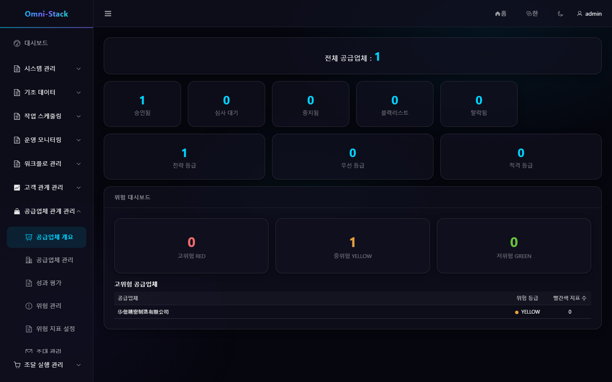

# SRM 관리 화면과 공급업체 포털 전체 흐름

SRM은 초대, Portal 입점, 심사, 수명주기, 평가, 위험, 공급업체 견적을 다룹니다. 내부 사용자와 Portal 사용자는 다른 역할과 데이터 경계를 가집니다.

## 1. 초대와 입점

관리자가 초대를 만들고 공급업체가 `/portal-register`에서 인증 계정을 등록합니다. Portal에서 초대 토큰, 고유 클라이언트 요청 ID, 기업 정보를 제출하면 SRM이 공급업체를 만들고 Saga가 Auth에 `SUPPLIER` 역할을 요청합니다.

`inviteToken`과 `requestId`는 필수이며 재시도는 같은 ID를 사용합니다. Portal 사용자 ID를 내부 owner 열에 쓰지 않습니다.

## 2. 심사와 수명주기

```text
REGISTERING → PENDING_REVIEW → APPROVED
                     ↘ REJECTED → PENDING_REVIEW
APPROVED ↔ SUSPENDED
APPROVED ↔ BLACKLISTED
APPROVED/SUSPENDED → ELIMINATED
```

승인 공급업체만 조달에서 선택됩니다. 반려는 재제출, 중지는 재개, 블랙리스트는 전용 권한이 필요하며 퇴출은 종단입니다. SRM 조정자가 제출·철회·취소·시작 재시도와 Workflow 상태를 맞춥니다.

### 스크린숏

#### 그림 1 `srm-overview-ko-KR`: 공급업체 개요

- 전제 조건: 조달 또는 공급업체 관리자로 로그인
- 작업자: 공급업체 관리자
- 작업: 공급업체 관리 → 공급업체 개요 열기
- 예상 결과: 메인 영역에 '공급업체 개요' 제목과 수명주기 분포가 표시됨



## 3. 기업 정보와 자식 자원

연락처, 자격, 은행 계좌를 포함합니다. Portal은 활성 연결 대상만, 내부 사용자는 공급업체 집계 루트의 데이터 범위로 접근합니다.

## 4. 평가

관리자가 기간과 평가 항목을 만들고 대기, 진행, 완료 상태로 이동합니다. 완료 결과는 권한 있는 Portal 사용자에게 보입니다. 점수 범위, 가중치, 필수 항목은 백엔드가 검증합니다.

## 5. 위험

지표 유형과 기준으로 GREEN, YELLOW, RED를 계산합니다. 규칙 변경 시 재계산하거나 이력 규칙 버전을 명시합니다.

## 6. 견적

Procurement가 RFQ를 보내면 초대된 활성 공급업체가 Portal에서 답합니다. 신뢰성 메시지로 Procurement에 전달하고 이벤트 ID로 멱등 처리합니다. 다른 공급업체 견적은 보이지 않으며 마감·취소·완료 후 제출할 수 없습니다.

## 7. Saga 복구

Auth 역할 할당과 SRM 입점은 서비스 경계를 넘습니다. 실패는 진단 가능한 재시도 상태로 들어가며 완료된 원격 트랜잭션을 단순 롤백하지 않습니다. 요청 ID, 공급업체 ID, 메시지 ID, Trace ID를 연결합니다.

[SRM 문서](../srm.kr.md)와 [SRM 설계](../design/srm-design.md)를 참고하세요.

