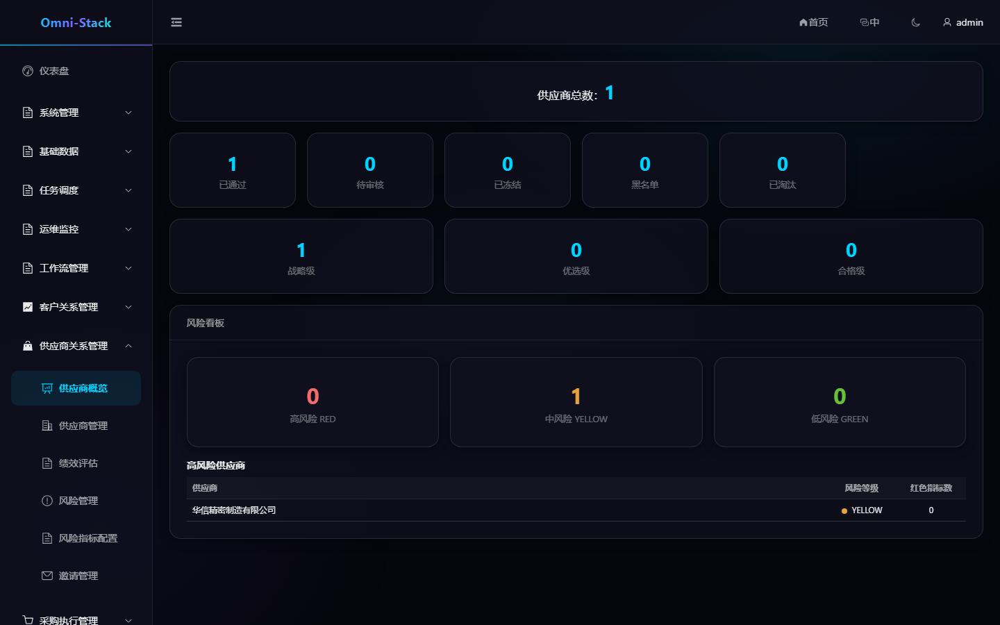

# SRM 管理端与供应商门户完整业务流程

SRM 覆盖邀请、Portal 入驻、供应商准入、生命周期、绩效评估、风险和供应商报价。内部管理用户与供应商 Portal 用户使用不同角色和数据边界。

## 1. 邀请与 Portal 注册

1. 管理员创建供应商邀请。
2. 供应商通过 `/portal-register` 注册认证账号。
3. 登录 Portal，提交邀请令牌、唯一客户端请求 ID 和企业资料。
4. SRM 创建供应商并通过 Saga 请求 Auth 分配 `SUPPLIER` 角色。
5. 角色与 Portal 关联成功后进入待审核。

入驻请求必须同时包含 `inviteToken` 和客户端 `requestId`。重试使用同一请求 ID 保持幂等。Portal 用户 ID 不得写入内部 `owner_user_id` 或 `owner_unit_id`。

## 2. 准入与生命周期

```text
REGISTERING → PENDING_REVIEW → APPROVED
                     ↘ REJECTED → PENDING_REVIEW
APPROVED ↔ SUSPENDED
APPROVED ↔ BLACKLISTED
APPROVED/SUSPENDED → ELIMINATED
```

- 只有 `APPROVED` 供应商可供采购模块正常选择。
- 驳回后可补充资料并重新提交。
- 冻结用于暂停合作，可恢复。
- 黑名单需要专用权限并保留原因。
- 淘汰是终态，不可恢复。

流程提交、撤回、取消和启动失败重试都由 SRM 协调器维护业务状态与 Workflow 状态一致。

### 操作截图

#### 图 1 `srm-overview-zh-CN`：供应商概览

- 前置条件：以采购或供应商管理员身份登录
- 操作者：供应商管理员
- 操作：进入「供应商关系管理 → 供应商概览」
- 预期结果：主内容区显示「供应商概览」标题与生命周期状态分布



## 3. 企业资料与子资源

供应商资料包括基本信息、联系人、资质和银行账户。Portal 用户只能查看和维护与自身有效关联的供应商；内部用户按供应商聚合根继承数据范围。子资源表没有 owner 列时，必须通过供应商关系过滤。

## 4. 绩效评估

管理员创建评估周期和评分项，评估状态经历待评估、评估中、已完成。完成后结果对有权限的 Portal 用户可见。评分范围、权重和必填项必须由后端校验，前端图表只负责展示。

## 5. 风险管理

风险规则由指标类型、评分标准和等级组成。系统汇总供应商风险并显示 GREEN、YELLOW、RED。改变规则后应重算或明确标记历史结果适用的规则版本，不能让旧结果静默改变含义。

## 6. 询价与报价

采购发布 RFQ 后，受邀且有效的供应商可在 Portal 查看邀请、明细和截止时间并提交报价。报价提交通过可靠消息进入 Procurement；重复事件按事件 ID 幂等处理。

Portal 不能查看其他供应商的报价。截止、取消或已完成 RFQ 拒绝新报价。

## 7. Saga 与故障恢复

Auth 角色分配和 SRM 入驻跨服务执行。失败时状态进入可诊断、可重试分支，不回滚已经提交的远程事务。运维人员应按请求 ID、供应商 ID、消息 ID 和 Trace ID 关联排查。

详细边界见 [SRM 文档](../srm.md) 与 [SRM 设计](../design/srm-design.md)。

