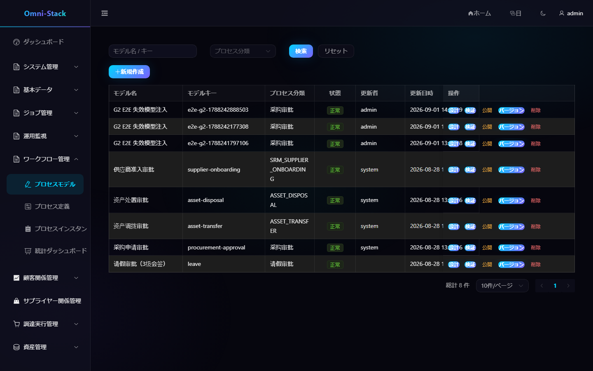

# ワークフローのモデリング、公開、承認、候補者ルール

独立した `omni-workflow` がプロセス実行を所有します。業務サービスはドメイン状態を所有し、内部契約で開始・取下げ・照会を行い、Flowable へ直接依存しません。

## 1. モデルのライフサイクル

```text
作成 → 草稿編集 → サーバー検証 → バージョン公開 → 業務開始 → 承認完了
```

モデルキーはテナント内一意で BPMN `<process id>` と一致します。公開前に `BpmnXmlValidator` を実行し、行ロックで同時公開を防ぎます。公開済みバージョンは不変で、後の草稿変更は実行中インスタンスへ影響しません。

### スクリーンショット

#### 図 1 `workflow-models-ja-JP`：プロセスモデル一覧

- 前提条件：ワークフロー管理者としてログイン
- 操作者：ワークフロー管理者
- 操作：「ワークフロー管理 → モデル」を開く
- 期待結果：メイン領域にモデル一覧と同梱モデルが表示される



## 2. モデリング

プロセスモデルを新規作成し、設計画面でイベント、承認/サービスノード、ゲートウェイ、フローを追加します。右側でプロパティを設定し、草稿保存、検証、公開の順に進めます。DB の BPMN XML を直接変更せず、業務担当者へバージョン ID を要求しません。

## 3. 承認候補者

承認ノードは `omni:assignment` JSON のみを使用します。`roleCode`、`anchorType`/`anchorParams`、`scopeMode`、`fallbackStrategy`、`approvalMode` を設定します。`ScopedRoleAssignmentListener` がタスク開始時に解決します。

新しいアンカーや範囲を追加する場合は、解決器、検証器、プレビュー API、テストを同時に実装します。詳細は [ワークフロー文書](../workflow.jp.md)を参照してください。

## 4. 会签

多重インスタンスは `candidateResolver.resolve(execution)` を使い、`approvedCount`、`rejectedCount`、`requiredApprovals` で完了します。早期終了タスクの削除理由は `MI_END` です。結果判定は `HistoricTaskInstance.getDeleteReason()` を読みます。

## 5. 公開と業務関連付け

業務設定はカテゴリから現在の公開バージョンを選択します。購買承認ルール画面は業務名、範囲、金額、マッチ試算、経路プレビューを提供します。新しい公開は実行中インスタンスを移行しません。

## 6. 開始と承認

開始要求には安定した業務種別/ID、タイトル、起票者、テナント、変数を含め、永続予約で再試行を冪等にします。ワークスペースでは未処理、起票済み、処理済み、進捗、承認履歴を確認します。取消、取下げ、再試行はドメインコーディネーターが管理します。

## 7. 受入確認

保存・検証・公開の明確な結果、プレビューと実行時候補者の一致、任意承認・会签・拒否・候補者なし、新版が既存インスタンスへ影響しないこと、候補タスクの所有権、業務とプロセスの相互追跡を確認します。

