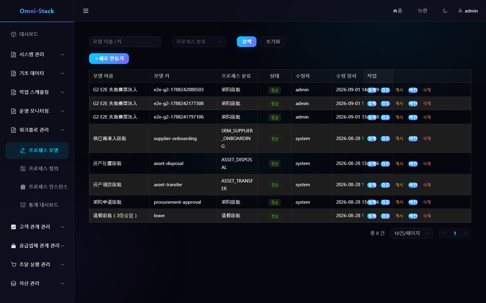

# 워크플로 모델링, 게시, 승인과 후보자 규칙

독립 `omni-workflow` 서비스가 프로세스 런타임을 소유합니다. 업무 서비스는 도메인 상태를 소유하고 내부 계약으로 시작·철회·조회하며 Flowable에 직접 의존하지 않습니다.

## 1. 모델 수명주기

```text
생성 → 초안 편집 → 서버 검증 → 버전 게시 → 업무 시작 → 승인 완료
```

모델 키는 테넌트 내 고유하며 BPMN `<process id>`와 같습니다. 게시 전에 `BpmnXmlValidator`를 실행하고 행 잠금으로 동시 중복 버전을 막습니다. 게시 버전은 불변이며 이후 초안은 실행 중 인스턴스에 영향을 주지 않습니다.

### 스크린숏

#### 그림 1 `workflow-models-ko-KR`: 프로세스 모델 목록

- 전제 조건: 워크플로 관리자로 로그인
- 작업자: 워크플로 관리자
- 작업: 워크플로 관리 → 모델 열기
- 예상 결과: 메인 영역에 모델 목록과 기본 모델이 표시됨



## 2. 모델링

프로세스 모델을 만들고 설계 화면에서 이벤트, 승인/서비스 작업, 게이트웨이와 흐름을 추가합니다. 오른쪽에서 속성을 설정하고 초안 저장, 검증, 게시 순으로 진행합니다. DB의 BPMN XML을 직접 바꾸거나 업무 사용자에게 버전 ID를 요구하지 않습니다.

## 3. 승인 후보자

승인 노드는 `omni:assignment` JSON만 사용합니다. `roleCode`, `anchorType`/`anchorParams`, `scopeMode`, `fallbackStrategy`, `approvalMode`를 설정하고 `ScopedRoleAssignmentListener`가 작업 시작 시 해석합니다.

새 앵커나 범위는 해석기, 검증기, 미리보기 API와 테스트를 함께 구현합니다. [워크플로 문서](../workflow.kr.md)를 참고하세요.

## 4. 다중 승인

다중 인스턴스는 `candidateResolver.resolve(execution)`로 후보자를 얻고 `approvedCount`, `rejectedCount`, `requiredApprovals`로 완료합니다. 조기 종료 작업의 삭제 이유는 `MI_END`이며 결과 판정은 `HistoricTaskInstance.getDeleteReason()`을 사용합니다.

## 5. 게시와 업무 연결

업무 설정은 카테고리로 현재 게시 버전을 선택합니다. 구매 승인 규칙 화면은 업무 이름, 범위, 금액, 매칭 시험과 경로 미리보기를 제공해 버전 ID를 숨깁니다. 새 버전은 실행 중 인스턴스를 이동하지 않습니다.

## 6. 시작과 승인

시작 요청은 안정적인 업무 유형/ID, 제목, 시작자, 테넌트, 변수를 포함하고 영구 예약으로 재시도를 멱등하게 합니다. 작업 공간은 할 일, 내가 시작한 건, 완료한 건, 진행 상황, 승인 기록을 표시합니다. 취소·철회·재시도는 도메인 조정자가 관리합니다.

## 7. 인수 확인

저장·검증·게시 결과, 후보자 미리보기 일치, 단일/다중/거부/후보자 없음, 새 버전의 기존 인스턴스 불변, 후보 작업 소유권, 업무와 프로세스 상호 추적을 검증합니다.

