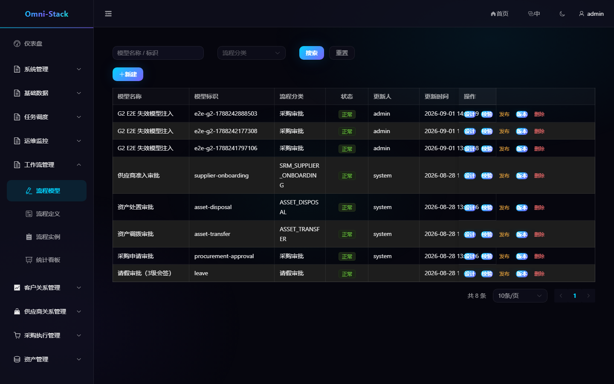

# 工作流建模、发布、审批与候选人规则

Omni-Stack 的流程运行时位于独立的 `omni-workflow` 服务。业务服务保存领域状态并通过内部契约启动、撤回或查询流程，不直接依赖 Flowable。

## 1. 模型生命周期

```text
创建模型 → 编辑草稿 → 服务端校验 → 发布版本 → 业务发起 → 审批完成
```

模型标识在租户内唯一，并且必须与 BPMN `<process id>` 一致。模型发布前由 `BpmnXmlValidator` 校验；发布使用行锁防止并发产生重复版本。发布会部署一个不可变版本，后续编辑只改变新草稿，不影响已启动实例。

### 操作截图

#### 图 1 `workflow-models-zh-CN`：流程模型列表

- 前置条件：以工作流管理员身份登录
- 操作者：工作流管理员
- 操作：进入「工作流管理 → 流程模型」
- 预期结果：主内容区显示「工作流管理」与预置模型列表



## 2. 在设计器中建模

1. 打开“工作流管理 → 流程模型”。
2. 新建模型，填写稳定标识、名称和分类。
3. 进入“设计”，从左侧添加事件、审批节点、服务节点、网关和连线。
4. 选中元素，在右侧属性面板维护名称和业务属性。
5. 保存草稿。
6. 点击“校验”，处理所有错误后再发布。

不要直接在数据库修改 BPMN XML，也不要把模型版本 ID写进业务人员的配置界面。

## 3. 审批候选人

审批节点只使用 `omni:assignment` JSON 扩展配置候选人。常用字段：

- `roleCode`：审批角色。
- `anchorType`：从发起人、业务组织或绝对组织定位锚点。
- `anchorParams`：锚点参数。
- `scopeMode`：同组织、父级、子级等范围。
- `fallbackStrategy`：无人可审批时的处理方式。
- `approvalMode`：任一人通过或全员会签。

`ScopedRoleAssignmentListener` 在任务开始时解析配置。新增锚点或范围策略前必须阅读 [工作流文档](../workflow.md) 的扩展指南，并同时增加解析器、校验器、预览接口和测试。

## 4. 会签规则

多实例审批使用 `candidateResolver.resolve(execution)` 产生候选人集合。完成条件依赖 `approvedCount`、`rejectedCount` 和 `requiredApprovals`。当完成条件提前结束其他任务时，历史删除原因为 `MI_END`；审批结果必须读取 `HistoricTaskInstance.getDeleteReason()`。

## 5. 发布与业务绑定

发布后业务配置应按“分类 + 当前发布版本”选择流程。采购审批规则页面提供业务名称、适用范围、金额区间、匹配试算和审批路径预览，不要求采购人员理解模型版本 ID。

发布新版本不会迁移运行中实例。需要改变旧实例时必须设计单独的补偿或迁移方案，不能直接覆盖历史部署。

## 6. 发起与审批

业务发起时传入稳定业务类型、业务 ID、标题、发起人、租户和变量。Workflow 使用请求预留记录保证重试幂等。用户在工作台查看：

- 我的待办。
- 我发起的。
- 我已处理的。
- 流程进度与审批记录。

审批提交必须带任务 ID、意见和领域需要的乐观锁或业务状态校验。业务取消、撤回或重试由领域协调器决定，不由前端直接操作 Flowable 表。

## 7. 验收清单

- 保存、校验、发布均有明确成功或错误反馈。
- 候选人预览与运行时解析结果一致。
- 任一审批、会签、拒绝和无人候选人路径均有测试。
- 新发布版本不改变已启动实例。
- 普通用户只能处理自己的候选任务。
- 流程实例和业务单据可以双向追踪。

