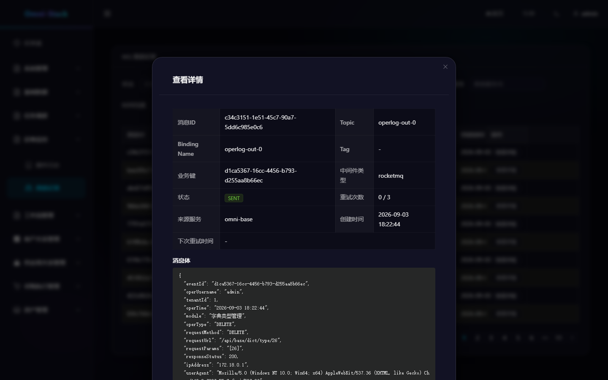
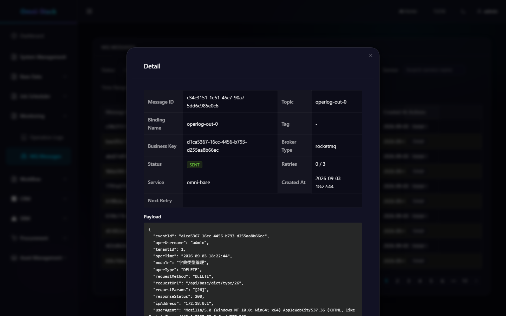
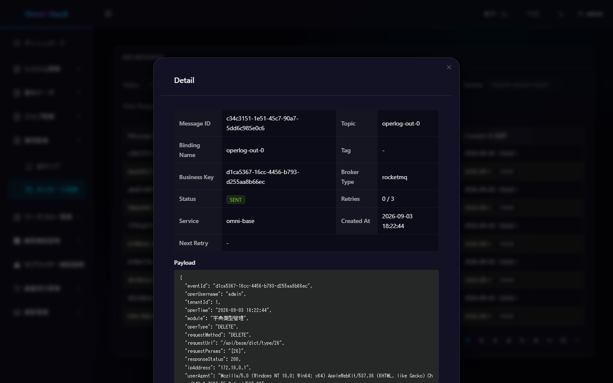
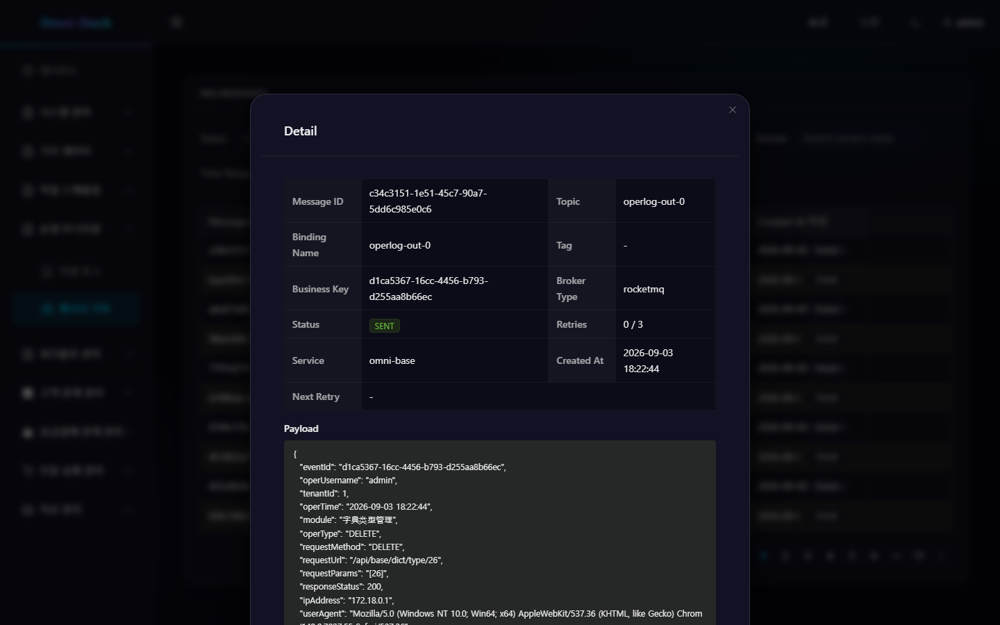

# Reliable Message Sending (Transactional Outbox)

> This document describes Omni-Stack's Transactional Outbox pattern implementation, ensuring at-least-once message delivery.  
> For architecture overview, see [architecture.en.md](architecture.en.md). For Docker deployment configuration, see [docker-deployment.en.md](docker-deployment.en.md).

Omni-Stack uses the **Transactional Outbox** pattern + **XXL-JOB** relay scheduling to guarantee at-least-once message delivery. Instead of sending messages directly to MQ (which risks data loss on transaction rollback), the system writes PENDING records to the local `sys_mq_message` table (within the same database transaction), and a background relay task asynchronously delivers them to the MQ Broker.

## 1. Architecture Overview

```
┌────────────────────────────────────────────────────────────────────────────┐
│                        Business Service (e.g., omni-auth)                 │
│                                                                            │
│  @OperLog method ──> OperLogAspect ──> OperLogProducer                     │
│                                            │                               │
│                                            ▼                               │
│                                    ReliableMessageRelay (interface)         │
│                                            │                               │
│  ┌─────────────────────────────────────────┼─────────────────────────────┐ │
│  │            omni-common-mqlog            │                             │ │
│  │                                         ▼                             │ │
│  │                              ReliableMessageTemplate                   │ │
│  │                                  │                                     │ │
│  │                    INSERT sys_mq_message (PENDING)                      │ │
│  │                    [same local transaction]                             │ │
│  └─────────────────────────────────────────┼─────────────────────────────┘ │
└────────────────────────────────────────────┼───────────────────────────────┘
                                             │
┌────────────────────────────────────────────┼───────────────────────────────┐
│  XXL-JOB Scheduler (every 10s)            ▼                               │
│                                                                            │
│  MqMessageRelayJob (@XxlJob + @SystemJobMeta)                              │
│       │                                                                    │
│       ▼                                                                    │
│  MqMessageRelayService                                                     │
│       │ fetchPendingMessages()  ──> PENDING / FAILED & backoff expired     │
│       │                                                                    │
│       ▼ relayOne(msg)                                                      │
│  MessageSender strategy ──> RocketMqMessageSender (StreamBridge)          │
│       │                                                                    │
│       ├── Success  ──> status = SENT                                       │
│       └── Failure  ──> retry_count++, exponential backoff                  │
│                         └── exceeds max_retry ──> DEAD_LETTER              │
└────────────────────────────────────────────────────────────────────────────┘
```

**Module dependencies**:

| Module | Role |
|--------|------|
| `omni-common-core` | Defines `ReliableMessageRelay` interface (pure POJO, zero Spring dependencies) |
| `omni-common-mqlog` | Implements Outbox pattern: `ReliableMessageTemplate`, `MqMessageRelayService`, `MqMessageRelayJob`, `MessageSender`, auto-configuration |
| `omni-common-operlog` | Optional caller: `OperLogProducer` uses `ReliableMessageRelay` when available, falls back to direct `StreamBridge` otherwise |
| `omni-base` | External admin controller `MqMessageController` for frontend management UI |

**Key design decisions**:

- **Why Outbox over direct send?** Direct MQ send inside a transaction creates a distributed transaction problem — if the MQ send succeeds but the DB transaction rolls back, the consumer receives a phantom message. Outbox pattern keeps everything in a single local transaction.
- **Why XXL-JOB as relay engine?** The project already uses XXL-JOB for scheduling. Reusing it for message relay avoids introducing a separate polling daemon. Each service's executor AppName is different, so the same `mqRelayHandler` name is naturally isolated across services.
- **Why explicit tenantId parameter?** Tenant isolation must be guaranteed at the API level — implicit ThreadLocal resolution is fragile and error-prone. Every caller must pass `tenantId` explicitly.

## 2. Message Lifecycle

### 2.1 Status Machine

```
                         ┌──────────┐
                INSERT   │          │   relay success
  ─────────────────────> │ PENDING  │ ──────────────────> SENT
                         │  (0)     │                      (1)
                         │          │
                         └────┬─────┘
                              │ relay failure
                              ▼
                         ┌──────────┐
                         │          │   retry < max_retry
                         │ FAILED   │ ──────────────────> back to PENDING
                         │  (2)     │   (with next_retry_time = now + 2^count × 10s)
                         │          │
                         └────┬─────┘
                              │ retry >= max_retry
                              ▼
                         ┌──────────┐
                         │DEAD_LETTER│
                         │  (3)     │
                         └────┬─────┘
                              │
                    ┌─────────┴─────────┐
                    │ resend             │ skip
                    ▼                    ▼
               PENDING (0)         SKIPPED (4)
```

| Status | Code | Description |
|--------|------|-------------|
| PENDING | 0 | Awaiting delivery or ready for retry |
| SENT | 1 | Successfully delivered to MQ (terminal) |
| FAILED | 2 | Delivery failed, waiting for next retry (backoff) |
| DEAD_LETTER | 3 | Exceeded max retry count (terminal, manual action required) |
| SKIPPED | 4 | Manually marked as ignored by admin (terminal) |

### 2.2 Write Path

`ReliableMessageTemplate` implements the `ReliableMessageRelay` interface:

```java
// Called by OperLogProducer or any business code
reliableMessageRelay.send("oper-log-out-0", operLogMessage, tenantId);
reliableMessageRelay.send("order-out-0", orderPayload, tenantId, "order:12345");
```

Under the hood:
1. Generate UUID as `msgId` (deduplication key)
2. Serialize payload to JSON via `ObjectMapper`
3. Build `SysMqMessage` record with `status = PENDING`, `brokerType = "rocketmq"`, `tenantId`, `serviceName`
4. INSERT into `sys_mq_message` via MyBatis-Plus (within `@Transactional(REQUIRED)`)

### 2.3 Relay Path

`MqMessageRelayJob` is scheduled by XXL-JOB (default: every 10 seconds, FIRST route strategy):

1. `fetchPendingMessages()` — SELECT records where `status IN (PENDING, FAILED)` AND (`next_retry_time IS NULL` OR `next_retry_time <= NOW()`), ordered by `create_time ASC`, LIMIT 100
2. For each message, look up the `MessageSender` by `broker_type` from the sender map
3. Call `sender.send(msg)` — on success, mark SENT; on failure, increment retry count and apply exponential backoff
4. If `retryCount >= maxRetry`, mark as DEAD_LETTER

### 2.4 Retry Strategy

Exponential backoff formula: **2^retryCount × 10 seconds**

| Retry | Backoff | Next Retry After |
|-------|---------|-----------------|
| 1 | 2^1 × 10 = 20s | ~20 seconds |
| 2 | 2^2 × 10 = 40s | ~40 seconds |
| 3 | 2^3 × 10 = 80s | ~80 seconds |

Default `max_retry = 3`. After 3 failures the message enters DEAD_LETTER status.

### 2.5 Dead Letter Handling

Dead letters require manual admin intervention via the frontend management UI (`Monitoring → MQ Messages`):

- **Resend** (`POST /api/base/mq-message/{msgId}/resend`): Resets status to PENDING, clears retry count and backoff timer. The relay job will pick it up on the next poll.
- **Skip** (`POST /api/base/mq-message/{msgId}/skip`): Transitions DEAD_LETTER → SKIPPED, acknowledging the message will not be delivered.

## 3. Tenant Isolation

### 3.1 Design: Explicit Parameter (No ThreadLocal)

The `ReliableMessageRelay.send()` method requires an explicit `Long tenantId` parameter. This is a deliberate design choice:

- **No ThreadLocal magic**: ThreadLocal-based tenant resolution is fragile — it can be lost across async boundaries, thread pool handoffs, or scheduled tasks.
- **Compile-time safety**: Missing the parameter causes a compilation error, not a silent runtime bug.
- **Caller responsibility**: Each caller extracts tenantId from its own context (e.g., `OperLogMessage.getTenantId()`, `@RequestHeader("X-Tenant-Id")`).

```java
// Correct: explicit tenantId
reliableMessageRelay.send("oper-log-out-0", message, message.getTenantId());

// WRONG: would fail to compile if tenantId is omitted
reliableMessageRelay.send("oper-log-out-0", message);
```

### 3.2 Write: tenantId in Outbox Record

`ReliableMessageTemplate.send()` sets `message.setTenantId(tenantId)` before inserting into `sys_mq_message`. The `tenant_id` column has an index (`idx_tenant_time`) for efficient tenant-scoped queries.

### 3.3 Read: All Query Controllers Filter by tenantId

- **External controller** (`MqMessageController` in `omni-base`): Uses `@RequestHeader("X-Tenant-Id")` to get the tenant ID. All queries include `.eq(SysMqMessage::getTenantId, tenantId)`.
- **Internal controller** (`MqMessageInternalController` in `omni-common-mqlog`): Uses `@RequestParam Long tenantId` for Feign-based cross-service aggregation.

### 3.4 Relay: No Tenant Filter (Intentional)

`MqMessageRelayService` scans ALL PENDING/FAILED messages regardless of `tenant_id`. This is by design — the relay is a background infrastructure process that must deliver all messages. Tenant isolation applies only to user-facing read/write operations.

## 4. Constraints & Pitfalls

### 4.1 tenantId Must Be Explicit

Never introduce a ThreadLocal or SecurityContext-based tenant resolution for `ReliableMessageRelay.send()`. The explicit parameter is the contract — it prevents silent NULL tenantId bugs.

### 4.2 All Query Interfaces Must Filter

Every new endpoint that queries `sys_mq_message` MUST include a `tenantId` filter. No exceptions — even "admin" or "internal" endpoints must respect tenant boundaries.

### 4.3 Idempotent DDL

`schema.sql` uses `CREATE TABLE IF NOT EXISTS` for safe, idempotent table creation. The table is auto-created on service startup when `omni-common-mqlog` is on the classpath. No manual DDL execution is required.

### 4.4 MessageSender Strategy Pattern

Adding a new MQ broker (e.g., Kafka) requires:
1. Implement the `MessageSender` interface: `brokerType()` returns `"kafka"`, `send(SysMqMessage)` handles the actual delivery.
2. Register as a Spring Bean — `MqLogAutoConfiguration` collects all `MessageSender` beans into a map keyed by `brokerType`.
3. Set `broker_type = "kafka"` when calling `ReliableMessageTemplate.send()` (or use the appropriate binding).

No changes to `MqMessageRelayService` or relay logic are needed.

## 5. New Service Onboarding (Tutorial)

To add reliable MQ message sending to a new service (e.g., `omni-order`):

### Step 1: Add Dependency

In `omni-order/pom.xml`:

```xml
<dependency>
    <groupId>com.omni</groupId>
    <artifactId>omni-common-mqlog</artifactId>
    <version>${project.version}</version>
</dependency>
```

This automatically pulls in `omni-common-core` (for the `ReliableMessageRelay` interface) and `omni-common-mybatis` (for `SysMqMessageMapper`).

### Step 2: Table Auto-Creation

`schema.sql` runs automatically on startup (`CREATE TABLE IF NOT EXISTS sys_mq_message`). Verify:

```sql
SELECT COUNT(*) FROM sys_mq_message;
```

### Step 3: Inject and Use

In your business service:

```java
@Service
@RequiredArgsConstructor
public class OrderServiceImpl implements OrderService {

    private final ReliableMessageRelay reliableMessageRelay;

    @Transactional
    public void createOrder(OrderDTO dto, Long tenantId) {
        // ... business logic ...
        Order order = orderMapper.insert(entity);

        // Write to outbox — same transaction, guaranteed atomicity
        reliableMessageRelay.send("order-out-0", order, tenantId, "order:" + order.getId());
    }
}
```

### Step 4: Verify Relay Job Registration

Start the service and check XXL-JOB admin console (`http://localhost:18080`):
- Executor: your service's AppName should appear in the executor list
- Task: `mqRelayHandler` should be registered with cron `0/10 * * * * ?`
- `MqRelayJobRegistrar` registers and starts the task asynchronously once the application is ready; if the scheduler is temporarily unavailable it retries every 10 seconds, up to 12 times
- Start the task if not already running

### Step 5: Check Frontend Admin UI

Navigate to `Monitoring → MQ Messages` in the frontend:
- New messages should appear with `status = PENDING` (0) then transition to `SENT` (1) after relay
- Filter by `tenantId`, `status`, `topic`, `serviceName`, or time range
- Resend failed messages or skip dead letters

The Base admin API aggregates the local Outboxes of onboarded services through Feign calls carrying `X-Internal-Token`. Currently it aggregates `omni-base` and `omni-crm`; when adding a new service its internal `/api/internal/mq-message/**` client must be included in the aggregation, otherwise messages are still delivered reliably but never appear on the unified operations page.

## 6. Extension Guide

### 6.1 Adding a New MQ Broker

Implement the `MessageSender` interface:

```java
@Component
public class KafkaMessageSender implements MessageSender {

    private final KafkaTemplate<String, String> kafkaTemplate;

    @Override
    public String brokerType() {
        return "kafka";
    }

    @Override
    public void send(SysMqMessage msg) {
        kafkaTemplate.send(msg.getTopic(), msg.getMsgKey(), msg.getPayload()).get();
    }
}
```

`MqLogAutoConfiguration` auto-collects all `MessageSender` beans. The relay service routes by `broker_type` column — no relay code changes needed.

### 6.2 Customizing Retry Strategy

Current retry parameters are hardcoded in `MqMessageRelayService`:

| Parameter | Location | Default |
|-----------|----------|---------|
| `BATCH_SIZE` | `MqMessageRelayService` | 100 |
| `BACKOFF_BASE_SECONDS` | `MqMessageRelayService` | 10 |
| `max_retry` | `SysMqMessage.maxRetry` | 3 |

To customize per-message: set `maxRetry` when calling `ReliableMessageTemplate.send()` (requires extending the interface). To customize globally: override `MqMessageRelayService` bean with custom parameters.

### 6.3 Customizing Relay Schedule

The relay job's cron expression is configurable in XXL-JOB admin console. Default is `0/10 * * * * ?` (every 10 seconds). Adjust based on your throughput and latency requirements.

---

## 7. Technology Comparison: Outbox Pattern vs Direct Send

| Consideration | Outbox Pattern (Adopted by Omni-Stack) | Direct MQ Send |
|------|------------------------------|------------|
| **Transactional Consistency** | Business data and messages written in the same DB transaction, guaranteeing atomicity | Distributed transaction problem: DB commit succeeds but MQ send fails, or vice versa |
| **Reliability** | Messages persisted to DB; delivery resumes after service restart | Messages lost on MQ send failure; no retry possible |
| **Decoupling** | Business code only writes to Outbox table; no dependency on MQ Broker availability | Business code directly depends on MQ connection; blocked when Broker is unavailable |
| **Latency** | Max latency = relay task scheduling interval (10s) + delivery time | Real-time sending; lowest latency |
| **Complexity** | Requires Outbox table + relay task + state machine | Simple, but requires handling distributed transactions |
| **Observability** | Message status visualization (PENDING/SENT/FAILED/DEAD_LETTER) | MQ Broker logs only |

**Conclusion**: The Outbox pattern trades a small amount of latency for strong consistency and observability, making it suitable for business scenarios with high message reliability requirements.

### Risk Scenarios with Direct Send

```
Scenario 1: Service crashes before DB commit
  Direct send: MQ already sent, but DB transaction not committed → consumer receives "phantom message"
  Outbox: Message not written to Outbox → not sent

Scenario 2: MQ send fails after DB commit
  Direct send: DB committed, MQ failed → message lost
  Outbox: Message written to Outbox (PENDING) → relay task retries delivery

Scenario 3: MQ Broker goes down
  Direct send: Business code blocked or throws exception → impacts user experience
  Outbox: Message written to Outbox unaffected → auto-delivered after Broker recovery
```

## 8. RocketMQ Docker Deployment Configuration Guide

### Container Configuration

```yaml
# docker-compose.yml
rocketmq-namesrv:
  image: apache/rocketmq:5.3.1
  container_name: omni-rocketmq-namesrv
  ports:
    - "9876:9876"
  command: sh mqnamesrv
  networks:
    - omni-network

rocketmq-broker:
  image: apache/rocketmq:5.3.1
  container_name: omni-rocketmq-broker
  ports:
    - "10911:10911"
    - "10909:10909"
  depends_on:
    - rocketmq-namesrv
  environment:
    NAMESRV_ADDR: rocketmq-namesrv:9876
  command: sh mqbroker -n rocketmq-namesrv:9876
  networks:
    - omni-network
```

### Key Configuration Details

| Config Item | Value | Description |
|---------|-----|------|
| NameServer Port | 9876 | RocketMQ service discovery port |
| Broker Port | 10911 | Broker main port |
| Broker VIP Port | 10909 | Broker VIP channel (fast response) |
| Network | omni-network | Same Bridge network as other services |

### Spring Cloud Stream Configuration

```yaml
# application.yml
spring:
  cloud:
    stream:
      rocketmq:
        binder:
          name-server: ${ROCKETMQ_NAMESRV:rocketmq-namesrv:9876}
      bindings:
        oper-log-out-0:
          destination: omni-oper-log-topic
          content-type: application/json
```

**Environment variable override**: During Docker deployment, override the NameServer address via the `SPRING_CLOUD_STREAM_ROCKETMQ_BINDER_NAME_SERVER` environment variable.

## 9. Troubleshooting Guide

| Issue | Possible Cause | Troubleshooting Steps |
|------|---------|----------|
| **Message stuck in PENDING** | Relay task auto-registration failed or the task was not started | Check `MqRelayJobRegistrar` retry logs, XXL-JOB credentials and the `mqRelayHandler` status |
| **Message send failed, enters FAILED** | RocketMQ Broker not started | Check RocketMQ container status; verify `spring.cloud.stream.rocketmq.binder.name-server` configuration is correct |
| **Message enters DEAD_LETTER** | Exceeded max retry count (3 times) | Check message details and error info in frontend admin UI; fix the issue and manually resend |
| **Consumer did not receive message** | Topic not created or consumer not subscribed | Check Topic and Consumer Group in RocketMQ console; confirm consumer service is started |
| **Tenant isolation failure** | Query not filtering tenantId | Check if Controller includes `.eq(SysMqMessage::getTenantId, tenantId)` |
| **Duplicate delivery** | Relay task scans same message multiple times | Check `msgId` uniqueness constraint; confirm `StreamBridge.send()` idempotency |

## 10. Message Detail UI Screenshots (Four Languages)

Generated by the docs-only Playwright spec `omni-frontend/e2e-docs/flows/detail-overlays.flows.spec.ts` on the real running stack, corresponding to §5 step 5 “Inspect the frontend admin UI”.

- Preconditions: the local Compose full stack is running, `omni-base` healthy and `sys_mq_message` already has real messages (87 rows in the base database at capture time).
- Operator: `admin` (requires message-query permission; the controller filters by `X-Tenant-Id`).
- Steps: enter the message-record page and click “Detail” on the first row to open the read-only detail overlay.
- Expected state: the overlay shows the message ID, Topic, Binding Name, Tag, business key, middleware type, status, retry count, source service, creation time and next-retry time, consistent with the fields described in the §2.1 state machine and §2.4 retry strategy.
- This group is **read-only capture**: it resends, skips or modifies no message, so no write switch is needed and there is no data teardown.

| Page | zh-CN | en-US | ja-JP | ko-KR |
|---|---|---|---|---|
| Message Detail Overlay (message-status) |  |  |  |  |

Registered translation-completeness issue: this overlay's title and all field labels are measured to be in English under **en-US/ja-JP/ko-KR** (ja/ko untranslated, only zh-CN localized).
`npm run ui:i18n:parity` (2319 keys per language, 0 missing) and `npm run ui:i18n:check` (0/0 items) both pass, so this is a language-pack value issue rather than a hardcoding defect; the images and manifest are faithfully registered by the actual rendered values, without beautifying.

Flows not yet covered (all require separate authorization; this round does not construct them arbitrarily):

- `retry` and `dead-letter`: measured `sys_mq_message` across 5 databases totals 809 rows (base 87, procurement 644, srm 34, workflow 23, crm 21), **all status 1, with no FAILED / DEAD_LETTER records at all**. To produce these two states, one must inject necessarily-failing messages into the cross-tenant shared outbox and let the relay retry repeatedly with the §2.4 `2^retryCount × 10s` backoff until it errors — creating a fault on shared infrastructure, which requires explicit authorization before execution.
- `trace-diagnosis`: requires real Trace ID diagnosis-chain evidence, to be designed together with the observability stack ([docs/observability.md](observability.md)).
