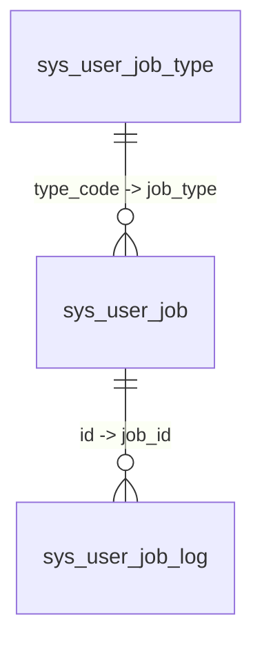

# Scheduled Task System

> This document describes the architecture, implementation details, and extension guide of the Omni-Stack Scheduled Task System.  
> For architecture overview, see [architecture.en.md](architecture.en.md). For Docker deployment configuration, see [docker-deployment.en.md](docker-deployment.en.md).

Omni-Stack provides a dual-track scheduled task architecture based on **XXL-JOB 3.3.1**, covering both system-level operational tasks and user-level self-service tasks.

## 1. Architecture Overview

The scheduling system is organized into two independent tracks sharing the same `omni-common-job` infrastructure:

```
┌────────────────────────────────────────────────────────────────────────┐
│                     Scheduled Task System                              │
├────────────────────────────┬───────────────────────────────────────────┤
│      System Tasks          │           User Tasks                      │
│  ─────────────────         │   ─────────────────                       │
│  @XxlJob + @SystemJobMeta  │   UserJobHandler SPI + Registry           │
│  Admin manages via console │   User self-service via workspace         │
│  Example: OperLogArchiver  │   Example: DrinkWaterRemindHandler        │
│  Handler = XXL-JOB Bean    │   All share userJobExecuteHandler         │
├────────────────────────────┴───────────────────────────────────────────┤
│                    omni-common-job (shared library)                    │
│  XxlJobAutoConfiguration · XxlJobAdminClient · SystemJobRegistry      │
│  XxlJobProperties · SystemJobMeta · ParamDef                          │
├───────────────────────────────────────────────────────────────────────┤
│                    omni-common-core (SPI interfaces)                   │
│  UserJobHandler · UserJobMessage                                      │
├───────────────────────────────────────────────────────────────────────┤
│                       XXL-JOB Admin :18080                             │
│              (Docker: xuxueli/xxl-job-admin:3.3.1)                     │
└───────────────────────────────────────────────────────────────────────┘
```

**Module dependencies**:

- `omni-common-core` — defines `UserJobHandler` SPI interface and `UserJobMessage` POJO (zero Spring dependencies)
- `omni-common-job` — XXL-JOB integration: auto-configuration, admin HTTP client, system job registry, metadata annotations
- `omni-base` — business layer: system job controller, user job service, handler implementations, workspace API

**Key design decisions**:

- **XXL-JOB** as the scheduling engine: mature distributed scheduling with a visual console, cron management, and execution logging
- **Dual-track separation**: system tasks (admin-managed, code-defined) vs user tasks (self-service, data-defined)
- **Single shared handler** for user tasks: all user tasks register as `userJobExecuteHandler` in XXL-JOB, differentiated by JSON `executorParam`

## 2. System Tasks

System tasks are defined in code via dual annotations and managed by administrators through the management console.

### Annotation Pattern

Each system task handler method is annotated with both `@XxlJob` and `@SystemJobMeta`:

```java
@XxlJob("operLogArchiveHandler")
@SystemJobMeta(
    name = "Operation Log Archive",
    description = "Migrate hot table records older than the retention period to the cold table",
    defaultCron = "0 0 2 * * ?",
    routeStrategy = "FIRST",
    params = {
        @ParamDef(name = "retentionDays", label = "Retention Days",
                  type = "number", defaultValue = "180", required = true, min = 1, max = 3650)
    }
)
public void archive() { ... }
```

| Annotation | Source | Purpose |
|-----------|--------|---------|
| `@XxlJob` | XXL-JOB Core | Declares the handler name for XXL-JOB executor routing |
| `@SystemJobMeta` | `omni-common-job` | Declares display metadata (name, description, default cron, route strategy, parameter definitions) for the management UI |
| `@ParamDef` | `omni-common-job` | Defines a configurable parameter (name, label, type, default, min/max) |

### Registry Mechanism

`SystemJobRegistry` scans all Spring Beans at startup (`@PostConstruct`), collecting methods annotated with both `@XxlJob` and `@SystemJobMeta`. The collected metadata is stored in an in-memory `LinkedHashMap<String, SystemJobInfo>` for the controller to query.

Auto-configuration: `XxlJobAutoConfiguration` registers `SystemJobRegistry` as a `@Bean` with `@ConditionalOnMissingBean`.

### Management Workflow

1. Admin views unregistered handlers in the system job management page
2. Admin registers a handler to XXL-JOB with custom cron and parameters
3. Admin can start/stop/trigger/unregister tasks from the same page
4. Execution logs are viewed in the XXL-JOB native console (`http://localhost:18080`)

### REST API

| Method | Path | Permission | Description |
|--------|------|-----------|-------------|
| `GET` | `/api/job/system-job/list` | `job:system-job:list` | List all handlers with XXL-JOB status (UNREGISTERED/RUNNING/STOPPED) |
| `POST` | `/api/job/system-job/register` | `job:system-job:manage` | Register handler to XXL-JOB with custom cron/params |
| `POST` | `/api/job/system-job/{xxlJobId}/start` | `job:system-job:manage` | Start scheduling |
| `POST` | `/api/job/system-job/{xxlJobId}/stop` | `job:system-job:manage` | Stop scheduling |
| `POST` | `/api/job/system-job/{xxlJobId}/trigger` | `job:system-job:manage` | Trigger immediate execution |
| `DELETE` | `/api/job/system-job/{xxlJobId}` | `job:system-job:manage` | Unregister from XXL-JOB |

### Example: OperLogArchiver

The operation log archival task migrates records older than `retentionDays` from the hot table (`sys_oper_log`) to the cold table (`sys_oper_log_archive`):

- **Handler**: `OperLogArchiver.archive()` in `omni-base`
- **Default cron**: `0 0 2 * * ?` (daily at 02:00)
- **Parameters**: `retentionDays` (number, 1-3650, default 180)
- **Batch processing**: 1000 records per batch with `@Transactional` per batch
- **Execution logs**: viewed in XXL-JOB console, not in application UI

## 3. User Tasks

User tasks are self-service scheduled tasks created by end-users through the workspace UI. Each task is directly registered to XXL-JOB, leveraging native cron scheduling precision.

### SPI Interface

`UserJobHandler` (in `omni-common-core`) is the extension point for defining new task types:

```java
public interface UserJobHandler {
    void execute(UserJobMessage message) throws Exception;
    default String getResultMessage(UserJobMessage message) { return null; }
}
```

`UserJobMessage` carries task context:

| Field | Type | Description |
|-------|------|-------------|
| `jobId` | `Long` | Task ID (`sys_user_job.id`) |
| `tenantId` | `Long` | Tenant ID |
| `jobType` | `String` | Task type code (matches `sys_user_job_type.type_code`) |
| `jobName` | `String` | User-defined task name |
| `jobParams` | `String` | Task parameters JSON |

### Handler Registry & Routing

`UserJobHandlerRegistry` auto-discovers all `UserJobHandler` implementations via Spring's `Map<String, UserJobHandler>` injection. The Map key is the Bean name, which **must exactly match** `sys_user_job_type.type_code`.

All user tasks share a single XXL-JOB handler: `@XxlJob("userJobExecuteHandler")`. When XXL-JOB triggers execution, `UserJobExecuteHandler` reads the JSON `executorParam`, deserializes it to `UserJobMessage`, and routes to the correct handler via `UserJobHandlerRegistry.getHandler(jobType)`.

### Execution Flow

```
XXL-JOB Scheduler triggers
    → XxlJobSpringExecutor dispatches to userJobExecuteHandler
    → UserJobExecuteHandler.execute():
        1. XxlJobHelper.getJobParam() → JSON string
        2. objectMapper.readValue(param, UserJobMessage.class)
        3. handlerRegistry.getHandler(jobType) → UserJobHandler
        4. handler.execute(message)
        5. handler.getResultMessage(message) → result text
        6. INSERT INTO sys_user_job_log (status, executeTimeMs, resultMessage, errorMessage)
        7. UPDATE sys_user_job SET last_fire_time = fireTime
        8. XxlJobHelper.handleSuccess() or handleFail()
```

### Service Layer

`UserJobServiceImpl` manages the full lifecycle:

| Operation | Flow |
|-----------|------|
| **Create** | Validate type → INSERT `sys_user_job` → `XxlJobAdminClient.addJob()` → update `xxlJobId` → rollback DB on XXL-JOB failure |
| **Update** | Check ownership → UPDATE `sys_user_job` → `XxlJobAdminClient.updateJob()` if cron/params changed |
| **Delete** | Check ownership → `XxlJobAdminClient.removeJob()` → DELETE `sys_user_job` |
| **Toggle** | Check ownership → UPDATE status → `startJob()` or `stopJob()` |
| **Trigger** | Check ownership → `triggerJob(xxlJobId, executorParam)` |

### Workspace API (MyJobController)

| Method | Path | Auth | Description |
|--------|------|------|-------------|
| `GET` | `/api/base/my-job/list` | JWT | List current user's tasks (paginated) |
| `GET` | `/api/base/my-job/types` | JWT | List enabled task types for dropdown |
| `GET` | `/api/base/my-job/stats` | JWT | Dashboard statistics (total, today executed, today failed) |
| `POST` | `/api/base/my-job` | JWT | Create task |
| `PUT` | `/api/base/my-job/{id}` | JWT + ownership | Update task |
| `DELETE` | `/api/base/my-job/{id}` | JWT + ownership | Delete task |
| `PUT` | `/api/base/my-job/{id}/status` | JWT + ownership | Toggle status |
| `POST` | `/api/base/my-job/{id}/trigger` | JWT + ownership | Trigger immediate execution |
| `GET` | `/api/base/my-job/{id}/logs` | JWT + ownership | List execution logs |

**Ownership model**: `MyJobController` uses `verifyOwnership(id, username)` instead of `@PreAuthorize`. Each operation checks that the task's `createBy` matches the current user. This provides per-row data isolation without role-based permission codes.

## 4. Creating a New User Task Type (Tutorial)

This chapter walks through creating a new user task type using the **Drink Water Reminder** (`Task-00001`) as an example.

### Step 1: Register the Task Type

Insert a record into `sys_user_job_type`:

```sql
INSERT INTO sys_user_job_type (type_code, type_name, description, param_template)
VALUES (
    'Task-00001',
    'Drink Water Reminder',
    'Remind the user to drink water on schedule to stay healthy',
    '[{"fieldKey":"cupShape","fieldLabel":"Cup Size","fieldType":"select","required":false,"options":["Small","Medium","Large"]}]'
);
```

| Column | Value | Purpose |
|--------|-------|---------|
| `type_code` | `Task-00001` | Unique identifier; **must match the Spring Bean name** |
| `type_name` | `Drink Water Reminder` | Display name in the workspace UI |
| `param_template` | JSON array | Defines form fields for the task creation dialog |

The `param_template` JSON Schema drives the dynamic form in the workspace UI. Each field definition supports:

| Property | Description |
|----------|-------------|
| `fieldKey` | Parameter key (used in `jobParams` JSON) |
| `fieldLabel` | Display label |
| `fieldType` | `input`, `select`, `number`, `textarea` |
| `required` | Whether the field is mandatory |
| `options` | Available options for `select` type |

### Step 2: Implement UserJobHandler

Create a handler class with `@Component` where the Bean name matches `type_code`:

```java
@Slf4j
@Component("Task-00001")  // Bean name MUST match sys_user_job_type.type_code
@RequiredArgsConstructor
public class DrinkWaterRemindHandler implements UserJobHandler {

    private final ObjectMapper objectMapper;

    @Override
    public void execute(UserJobMessage message) throws Exception {
        String cupShape = parseCupShape(message.getJobParams());
        log.info("[Drink Water Reminder] Task [{}] triggered: Please drink a {} cup of water", message.getJobName(), cupShape);
    }

    @Override
    public String getResultMessage(UserJobMessage message) {
        try {
            String cupShape = parseCupShape(message.getJobParams());
            return "Please drink a " + cupShape + " cup of water to stay healthy!";
        } catch (Exception e) {
            return "Please drink water to stay healthy!";
        }
    }

    private String parseCupShape(String jobParams) {
        if (jobParams == null || jobParams.isBlank()) return "Medium";
        try {
            JsonNode params = objectMapper.readTree(jobParams);
            JsonNode cupNode = params.get("cupShape");
            if (cupNode != null && !cupNode.isNull() && !cupNode.asText().isBlank()) {
                return cupNode.asText();
            }
        } catch (Exception ignored) { }
        return "Medium";
    }
}
```

**Critical rule**: The `@Component` Bean name (`"Task-00001"`) must exactly match the `type_code` in `sys_user_job_type`. A mismatch causes silent routing failure — the task will be created successfully but execution will fail with "No handler found for the task type".

### Step 3: User Creates a Task

1. User opens the workspace → clicks "Create Task"
2. Selects "Drink Water Reminder" from the type dropdown
3. Fills the dynamic form (e.g., `cupShape = Large`)
4. Sets a cron expression (e.g., `0 */30 9-18 * * ?` for every 30 minutes during work hours)
5. Clicks "Confirm Create"

Behind the scenes:
- `MyJobController.create()` → `UserJobServiceImpl.createJob()`:
  - Validates `type_code` exists and is enabled in `sys_user_job_type`
  - INSERT into `sys_user_job`
  - Builds `UserJobMessage` JSON as `executorParam`
  - Calls `XxlJobAdminClient.addJob()` to register in XXL-JOB
  - Updates `sys_user_job.xxl_job_id` with the returned ID

### Step 4: Verify Execution

1. **XXL-JOB Console** (`http://localhost:18080`): the task appears in the job list with the configured cron
2. **Automatic trigger**: XXL-JOB fires at the scheduled time → `userJobExecuteHandler` → `DrinkWaterRemindHandler.execute()`
3. **Execution log**: `sys_user_job_log` receives a new record with `result_message`
4. **Frontend notification**: workspace polls every 10 seconds, detects the new log, shows an `ElNotification` popup with the result message

## 5. XXL-JOB Admin Client

`XxlJobAdminClient` is an HTTP client that wraps XXL-JOB Admin's REST API. It is instantiated by `SystemJobService` and `UserJobServiceImpl` using configuration from `XxlJobProperties`.

### Authentication

XXL-JOB Admin uses session-based authentication. `XxlJobAdminClient`:
1. Calls `POST /login` with `userName` and `password`
2. Caches the session cookie in a `volatile` field
3. On subsequent API calls, includes the cookie in the `Cookie` header
4. If a 302 redirect (login page) is detected, automatically re-authenticates and retries

### Key API Methods

| Method | XXL-JOB Endpoint | Purpose |
|--------|-----------------|---------|
| `addJob(jobGroup, jobDesc, cron, routeStrategy, handler, param)` | `POST /jobinfo/insert` | Create a new scheduled task |
| `updateJob(xxlJobId, cron, param)` | `POST /jobinfo/update` | Update cron/params of an existing task |
| `removeJob(xxlJobId)` | `POST /jobinfo/remove` | Delete a task |
| `startJob(xxlJobId)` | `POST /jobinfo/start` | Start scheduling |
| `stopJob(xxlJobId)` | `POST /jobinfo/stop` | Stop scheduling |
| `triggerJob(xxlJobId, param)` | `POST /jobinfo/trigger` | Trigger immediate execution |
| `getJobGroupId(appname)` | `POST /jobgroup/pageList` | Look up executor group ID by appname |
| `pageList(jobGroup, handler)` | `POST /jobinfo/pageList` | Query task list (used to merge metadata with live status) |

### Configuration

```yaml
xxl:
  job:
    admin:
      addresses: http://127.0.0.1:18080/xxl-job-admin
      username: admin
      password: 123456
    executor:
      appname: omni-base        # Falls back to spring.application.name if empty
      port: 9999               # Executor callback port
      logPath: /data/applogs/xxl-job/jobhandler
      logRetentionDays: 30
```

All properties are bound via `@ConfigurationProperties(prefix = "xxl.job")` in `XxlJobProperties`.

## 6. Frontend Integration

### Three Frontend Entry Points

| Area | Path | Audience | Permission |
|------|------|----------|-----------|
| System Job Management | `src/views/job/system-job/index.vue` | Admins | `job:system-job:list`, `job:system-job:manage` |
| Task Type Management | `src/views/job/user-job-type/index.vue` | Admins | `job:user-job-type:*` |
| Workspace (My Jobs) | `src/views/home/index.vue` | All users | JWT only (ownership-based) |

### API Modules

| Module | File | Functions |
|--------|------|-----------|
| System Jobs | `src/api/systemJob.ts` | `listSystemJobs`, `registerSystemJob`, `startSystemJob`, `stopSystemJob`, `triggerSystemJob`, `unregisterSystemJob` |
| Task Types | `src/api/userJobType.ts` | `listJobTypes`, `createJobType`, `updateJobType`, `deleteJobType` |
| My Jobs | `src/api/myJob.ts` | `getMyJobs`, `getMyJobStats`, `createMyJob`, `updateMyJob`, `deleteMyJob`, `toggleMyJobStatus`, `triggerMyJob`, `getMyJobLogs`, `getEnabledJobTypes` |

### Key UX Patterns

- **Cron Generator**: A dedicated component (`CronGenerator.vue`) provides a frequency type selector (every minute / every X minutes / every hour / every X hours / daily / weekly / monthly) with a human-readable preview (e.g., "Runs every Monday at 09:00")
- **Dynamic Form Renderer**: `DynamicFormRenderer.vue` renders forms based on `param_template` JSON Schema from `sys_user_job_type`. Supports `input`, `select`, `number`, and `textarea` field types.
- **Global Polling**: The workspace polls every 10 seconds (`setInterval`) for new execution logs across all active tasks. Uses `lastLogIdMap` (Map<jobId, lastSeenLogId>) to detect new logs and show `ElNotification` popups. First poll initializes the baseline without showing notifications (prevents old log popups).

## 7. Configuration

### Docker Deployment

XXL-JOB Admin is deployed as a Docker container via `docker-compose.yml`:

```yaml
xxl-job-admin:
  image: xuxueli/xxl-job-admin:3.3.1
  container_name: omni-xxl-job-admin
  ports:
    - "18080:8080"
  environment:
    PARAMS: >
      --spring.datasource.url=jdbc:mysql://mysql:3306/xxl_job?...
      --spring.datasource.username=root
      --spring.datasource.password=root123
```

The `xxl_job` database is initialized via `scripts/sql/init-xxl-job.sql` mounted into MySQL's `docker-entrypoint-initdb.d/`.

### Database Tables (omni_base schema)

| Table | Purpose |
|-------|---------|
| `sys_user_job_type` | Task type catalog. `type_code` (unique) maps to `UserJobHandler` Bean name. `param_template` (JSON) drives the dynamic form. |
| `sys_user_job` | User task instances. `xxl_job_id` links to XXL-JOB. `cron_expression`, `job_params`, `status`, `last_fire_time`. |
| `sys_user_job_log` | Execution history. `job_id`, `fire_time`, `execute_time_ms`, `status` (0=fail, 1=success), `result_message`, `error_message`. |



### Auto-Configuration

`XxlJobAutoConfiguration` (in `omni-common-job`) is registered via `META-INF/spring/AutoConfiguration.imports` and activates when:
- `XxlJobSpringExecutor` class is on the classpath (`@ConditionalOnClass`)
- `xxl.job.executor.enabled` is not explicitly set to `false` (`@ConditionalOnProperty`, defaults to `true`)

It provides:
1. `XxlJobSpringExecutor` Bean — registers with XXL-JOB Admin on startup
2. `SystemJobRegistry` Bean — scans `@XxlJob` + `@SystemJobMeta` annotated methods (`@ConditionalOnMissingBean`)

### Service Integration Checklist

To add scheduling capabilities to a new microservice:

1. Add POM dependency: `omni-common-job`
2. Configure `xxl.job.admin.*` and `xxl.job.executor.*` in `application.yml`
3. Ensure XXL-JOB Admin is running and accessible
4. For system tasks: annotate handler methods with `@XxlJob` + `@SystemJobMeta`
5. For user tasks: implement `UserJobHandler` with Bean name matching `type_code`
6. The executor auto-registers with XXL-JOB Admin on service startup

---

## 8. Technology Selection: Why XXL-JOB Over Quartz

| Consideration | XXL-JOB | Quartz |
|------|---------|--------|
| **Visual Management** | Built-in web console with task CRUD, execution logs, and scheduling reports | No built-in UI; requires third-party tools (e.g., Quartz Web UI) |
| **Distributed Support** | Native support for multiple executors, sharding broadcast, and failover | Requires additional JDBC JobStore + cluster mode configuration |
| **Dynamic Scheduling** | Runtime cron/parameter changes take effect immediately without restart | Runtime changes require re-scheduling via API |
| **Operational Friendliness** | Visual execution logs, failure retry, and email alerts | Logging requires custom integration |
| **Spring Boot Integration** | Provides `xxl-job-core` SDK for easy integration | Spring has built-in `@Scheduled`, but limited distributed capabilities |
| **Community Activity** | 25k+ stars on GitHub, active community | Long history, but declining community activity |

**Conclusion**: XXL-JOB clearly outperforms Quartz in visual management, distributed scheduling, and operational friendliness, making it especially suitable for scenarios where administrators need to dynamically configure tasks.

## 9. XXL-JOB Docker Deployment Configuration Details

### Container Configuration

```yaml
# docker-compose.yml
xxl-job-admin:
  image: xuxueli/xxl-job-admin:3.3.1
  container_name: omni-xxl-job-admin
  ports:
    - "18080:8080"              # Host 18080 → Container 8080
  environment:
    PARAMS: >
      --spring.datasource.url=jdbc:mysql://mysql:3306/xxl_job?useUnicode=true&characterEncoding=UTF-8&autoReconnect=true&serverTimezone=Asia/Shanghai
      --spring.datasource.username=root
      --spring.datasource.password=root123
  depends_on:
    mysql:
      condition: service_healthy
  networks:
    - omni-network
```

### Key Configuration Details

| Configuration | Value | Description |
|---------|-----|------|
| Container internal port | 8080 | XXL-JOB Admin default port |
| Host mapped port | 18080 | Avoids conflict with Gateway (8102) |
| Database connection | `mysql:3306` | Uses Docker internal network to resolve `mysql` hostname |
| Database initialization | `scripts/sql/init-xxl-job.sql` | Mounted to MySQL's `docker-entrypoint-initdb.d/` |
| Default credentials | admin / 123456 | Must be changed in production |

### Executor Registration

Executors from each microservice register to XXL-JOB Admin via `xxl.job.executor.appname`:

| Service | appname | Port | Description |
|------|---------|------|------|
| omni-base | `omni-base` | 9999 | System tasks + user tasks + MQ relay |
| omni-auth | `omni-auth` | 9998 | Authentication-related tasks (if executor is configured) |
| omni-workflow | `omni-workflow` | 9997 | Workflow-related tasks (if executor is configured) |

---

## 10. Troubleshooting Guide

| Issue | Possible Cause | Troubleshooting Steps |
|------|---------|----------|
| **Executor not registered** | XXL-JOB Admin not started or network unreachable | Check XXL-JOB Admin container status; verify `xxl.job.admin.addresses` configuration |
| **Task not triggered** | Task not started or incorrect cron expression | Check task status in XXL-JOB console; validate expression with an online cron tool |
| **Execution failure** | Handler threw an exception | View execution logs in XXL-JOB console; check exception stack traces in service logs |
| **User task "No handler found"** | Bean name does not match type_code | Ensure the name in `@Component("Task-XXXXX")` exactly matches `sys_user_job_type.type_code` |
| **XXL-JOB registration rollback** | `XxlJobAdminClient.addJob()` returned failure | Check XXL-JOB Admin logs; verify executor appname is registered |
| **Duplicate task registration** | Multiple clicks on create | `dynamicRouteNames` Set prevents duplicates, but re-registration is needed after service restart |
