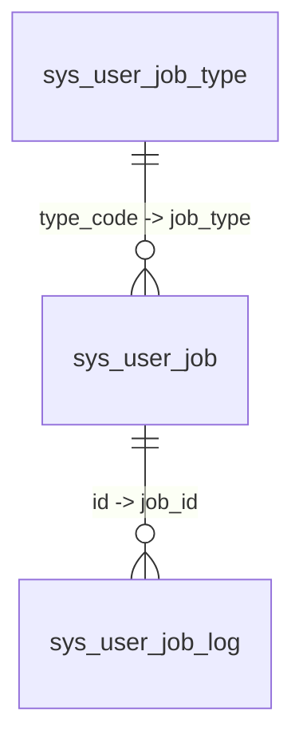

# スケジューリングタスクシステム

> 本ドキュメントは、Omni-Stack スケジューリングタスクシステムのアーキテクチャ、実装詳細、および拡張ガイドについて説明します。  
> アーキテクチャの概要については [architecture.jp.md](architecture.jp.md) を参照してください。Docker デプロイ設定については [docker-deployment.jp.md](docker-deployment.jp.md) を参照してください。

Omni-Stack は **XXL-JOB 3.3.1** ベースのデュアルトラック・スケジューリングタスクアーキテクチャを提供し、システムレベルの運用タスクとユーザーレベルのセルフサービスタスクの両方をカバーします。

## 1. アーキテクチャ概要

スケジューリングシステムは、同じ `omni-common-job` インフラを共有する2つの独立したトラックで構成されています：

```
┌────────────────────────────────────────────────────────────────────────┐
│                     Scheduled Task System                              │
├────────────────────────────┬───────────────────────────────────────────┤
│      System Tasks          │           User Tasks                      │
│  ─────────────────         │   ─────────────────                       │
│  @XxlJob + @SystemJobMeta  │   UserJobHandler SPI + Registry           │
│  Admin manages via console │   User self-service via workspace         │
│  Example: OperLogArchiver  │   Example: DrinkWaterRemindHandler        │
│  Handler = XXL-JOB Bean    │   All share userJobExecuteHandler         │
├────────────────────────────┴───────────────────────────────────────────┤
│                    omni-common-job (shared library)                    │
│  XxlJobAutoConfiguration · XxlJobAdminClient · SystemJobRegistry      │
│  XxlJobProperties · SystemJobMeta · ParamDef                          │
├───────────────────────────────────────────────────────────────────────┤
│                    omni-common-core (SPI interfaces)                   │
│  UserJobHandler · UserJobMessage                                      │
├───────────────────────────────────────────────────────────────────────┤
│                       XXL-JOB Admin :18080                             │
│              (Docker: xuxueli/xxl-job-admin:3.3.1)                     │
└───────────────────────────────────────────────────────────────────────┘
```

**モジュール依存関係**：

- `omni-common-core` — `UserJobHandler` SPI インターフェースと `UserJobMessage` POJO を定義（Spring 依存ゼロ）
- `omni-common-job` — XXL-JOB 統合：自動設定、管理用 HTTP クライアント、システムジョブレジストリ、メタデータアノテーション
- `omni-base` — ビジネス層：システムジョブコントローラ、ユーザージョブサービス、ハンドラ実装、ワークスペース API

**主な設計判断**：

- **XXL-JOB** をスケジューリングエンジンとして採用：視覚コンソール、cron 管理、実行ログを備えた成熟した分散スケジューリング
- **デュアルトラック分離**：システムタスク（管理者管理、コード定義）とユーザータスク（セルフサービス、データ定義）
- **単一共有ハンドラ**：すべてのユーザータスクは XXL-JOB に `userJobExecuteHandler` として登録され、JSON `executorParam` で区別されます

## 2. システムタスク

システムタスクはコード内でデュアルアノテーションにより定義され、管理者が管理コンソールを通じて管理します。

### アノテーションパターン

各システムタスクのハンドラメソッドには、`@XxlJob` と `@SystemJobMeta` の両方が付与されます：

```java
@XxlJob("operLogArchiveHandler")
@SystemJobMeta(
    name = "操作ログアーカイブ",
    description = "保持期間を超えたホットテーブルのレコードをコールドテーブルへ移行する",
    defaultCron = "0 0 2 * * ?",
    routeStrategy = "FIRST",
    params = {
        @ParamDef(name = "retentionDays", label = "保持日数",
                  type = "number", defaultValue = "180", required = true, min = 1, max = 3650)
    }
)
public void archive() { ... }
```

| アノテーション | ソース | 目的 |
|-----------|--------|---------|
| `@XxlJob` | XXL-JOB Core | XXL-JOB エグゼキュータルーティング用のハンドラ名を宣言 |
| `@SystemJobMeta` | `omni-common-job` | 管理UI用の表示メタデータ（名前、説明、デフォルト cron、ルート戦略、パラメータ定義）を宣言 |
| `@ParamDef` | `omni-common-job` | 設定可能なパラメータ（名前、ラベル、型、デフォルト値、最小/最大）を定義 |

### レジストリメカニズム

`SystemJobRegistry` は起動時（`@PostConstruct`）にすべての Spring Bean をスキャンし、`@XxlJob` と `@SystemJobMeta` の両方が付与されたメソッドを収集します。収集されたメタデータはメモリ内の `LinkedHashMap<String, SystemJobInfo>` に保存され、コントローラからクエリできます。

自動設定：`XxlJobAutoConfiguration` は `SystemJobRegistry` を `@ConditionalOnMissingBean` 付きの `@Bean` として登録します。

### 管理ワークフロー

1. 管理者がシステムジョブ管理ページで未登録のハンドラを確認
2. 管理者がカスタム cron とパラメータでハンドラを XXL-JOB に登録
3. 管理者が同じページからタスクの開始/停止/トリガー/登録解除を実行
4. 実行ログは XXL-JOB ネイティブコンソール（`http://localhost:18080`）で確認

### REST API

| メソッド | パス | 権限 | 説明 |
|--------|------|-----------|-------------|
| `GET` | `/api/job/system-job/list` | `job:system-job:list` | すべてのハンドラを XXL-JOB ステータス（未登録/実行中/停止）と共に一覧表示 |
| `POST` | `/api/job/system-job/register` | `job:system-job:manage` | カスタム cron/パラメータでハンドラを XXL-JOB に登録 |
| `POST` | `/api/job/system-job/{xxlJobId}/start` | `job:system-job:manage` | スケジューリング開始 |
| `POST` | `/api/job/system-job/{xxlJobId}/stop` | `job:system-job:manage` | スケジューリング停止 |
| `POST` | `/api/job/system-job/{xxlJobId}/trigger` | `job:system-job:manage` | 即時実行をトリガー |
| `DELETE` | `/api/job/system-job/{xxlJobId}` | `job:system-job:manage` | XXL-JOB から登録解除 |

### 例：OperLogArchiver

操作ログアーカイブタスクは、`retentionDays` より古いレコードをホットテーブル（`sys_oper_log`）からコールドテーブル（`sys_oper_log_archive`）へ移行します：

- **ハンドラ**：`omni-base` 内の `OperLogArchiver.archive()`
- **デフォルト cron**：`0 0 2 * * ?`（毎日02:00）
- **パラメータ**：`retentionDays`（数値、1-3650、デフォルト 180）
- **バッチ処理**：1バッチあたり1000件、バッチごとに `@Transactional` を適用
- **実行ログ**：XXL-JOB コンソールで確認（アプリケーションUIには表示しません）

## 3. ユーザータスク

ユーザータスクは、エンドユーザーがワークスペースUIを通じて作成するセルフサービスのスケジューリングタスクです。各タスクは直接 XXL-JOB に登録され、ネイティブの cron スケジューリング精度を活用します。

### SPI インターフェース

`UserJobHandler`（`omni-common-core` 内）は、新しいタスクタイプを定義するための拡張ポイントです：

```java
public interface UserJobHandler {
    void execute(UserJobMessage message) throws Exception;
    default String getResultMessage(UserJobMessage message) { return null; }
}
```

`UserJobMessage` はタスクコンテキストを保持します：

| フィールド | 型 | 説明 |
|-------|------|-------------|
| `jobId` | `Long` | タスクID（`sys_user_job.id`） |
| `tenantId` | `Long` | テナントID |
| `jobType` | `String` | タスクタイプコード（`sys_user_job_type.type_code` に一致） |
| `jobName` | `String` | ユーザー定義のタスク名 |
| `jobParams` | `String` | タスクパラメータ JSON |

### ハンドラレジストリとルーティング

`UserJobHandlerRegistry` は Spring の `Map<String, UserJobHandler>` 注入により、すべての `UserJobHandler` 実装を自動検出します。Map のキーは Bean 名で、**`sys_user_job_type.type_code` に完全に一致する必要があります**。

すべてのユーザータスクは単一の XXL-JOB ハンドラ `@XxlJob("userJobExecuteHandler")` を共有します。XXL-JOB が実行をトリガーすると、`UserJobExecuteHandler` は JSON `executorParam` を読み取り、`UserJobMessage` にデシリアライズし、`UserJobHandlerRegistry.getHandler(jobType)` で正しいハンドラにルーティングします。

### 実行フロー

```
XXL-JOB Scheduler triggers
    → XxlJobSpringExecutor dispatches to userJobExecuteHandler
    → UserJobExecuteHandler.execute():
        1. XxlJobHelper.getJobParam() → JSON 文字列
        2. objectMapper.readValue(param, UserJobMessage.class)
        3. handlerRegistry.getHandler(jobType) → UserJobHandler
        4. handler.execute(message)
        5. handler.getResultMessage(message) → 結果テキスト
        6. INSERT INTO sys_user_job_log (status, executeTimeMs, resultMessage, errorMessage)
        7. UPDATE sys_user_job SET last_fire_time = fireTime
        8. XxlJobHelper.handleSuccess() or handleFail()
```

### サービス層

`UserJobServiceImpl` がライフサイクル全体を管理します：

| 操作 | フロー |
|-----------|------|
| **作成** | タイプ検証 → `sys_user_job` INSERT → `XxlJobAdminClient.addJob()` → `xxlJobId` 更新 → XXL-JOB 失敗時にDBロールバック |
| **更新** | 所有権確認 → `sys_user_job` UPDATE → cron/パラメータ変更時は `XxlJobAdminClient.updateJob()` |
| **削除** | 所有権確認 → `XxlJobAdminClient.removeJob()` → `sys_user_job` DELETE |
| **切替** | 所有権確認 → ステータス UPDATE → `startJob()` または `stopJob()` |
| **トリガー** | 所有権確認 → `triggerJob(xxlJobId, executorParam)` |

### ワークスペース API（MyJobController）

| メソッド | パス | 認証 | 説明 |
|--------|------|------|-------------|
| `GET` | `/api/base/my-job/list` | JWT | 現在のユーザーのタスク一覧（ページネーション） |
| `GET` | `/api/base/my-job/types` | JWT | ドロップダウン用の有効化されたタスクタイプ一覧 |
| `GET` | `/api/base/my-job/stats` | JWT | ダッシュボード統計（合計、本日の実行回数、本日の失敗回数） |
| `POST` | `/api/base/my-job` | JWT | タスク作成 |
| `PUT` | `/api/base/my-job/{id}` | JWT + 所有権 | タスク更新 |
| `DELETE` | `/api/base/my-job/{id}` | JWT + 所有権 | タスク削除 |
| `PUT` | `/api/base/my-job/{id}/status` | JWT + 所有権 | ステータス切替 |
| `POST` | `/api/base/my-job/{id}/trigger` | JWT + 所有権 | 即時実行をトリガー |
| `GET` | `/api/base/my-job/{id}/logs` | JWT + 所有権 | 実行ログ一覧 |

**所有権モデル**：`MyJobController` は `@PreAuthorize` の代わりに `verifyOwnership(id, username)` を使用します。各操作はタスクの `createBy` が現在のユーザーと一致することを確認します。これにより、ロールベースの権限コードなしで行レベルのデータ分離を実現します。

## 4. 新しいユーザータスクタイプの作成（チュートリアル）

本章では、**水分補給リマインダー**（`Task-00001`）を例に、新しいユーザータスクタイプの作成手順を説明します。

### ステップ1：タスクタイプの登録

`sys_user_job_type` にレコードを挿入します：

```sql
INSERT INTO sys_user_job_type (type_code, type_name, description, param_template)
VALUES (
    'Task-00001',
    '水分補給リマインダー',
    'ユーザーに定期的な水分補給を促し、健康を維持する',
    '[{"fieldKey":"cupShape","fieldLabel":"カップサイズ","fieldType":"select","required":false,"options":["小","中","大"]}]'
);
```

| カラム | 値 | 目的 |
|--------|-------|---------|
| `type_code` | `Task-00001` | 一意の識別子。**Spring Bean 名と一致する必要があります** |
| `type_name` | `水分補給リマインダー` | ワークスペースUIでの表示名 |
| `param_template` | JSON 配列 | タスク作成ダイアログのフォームフィールドを定義 |

`param_template` JSON スキーマがワークスペースUIの動的フォームを駆動します。各フィールド定義は以下をサポートします：

| プロパティ | 説明 |
|----------|-------------|
| `fieldKey` | パラメータキー（`jobParams` JSON で使用） |
| `fieldLabel` | 表示ラベル |
| `fieldType` | `input`、`select`、`number`、`textarea` |
| `required` | 必須フィールドかどうか |
| `options` | `select` 型の選択可能なオプション |

### ステップ2：UserJobHandler の実装

Bean 名が `type_code` と一致する `@Component` でハンドラクラスを作成します：

```java
@Slf4j
@Component("Task-00001")  // Bean 名は sys_user_job_type.type_code と一致する必要があります
@RequiredArgsConstructor
public class DrinkWaterRemindHandler implements UserJobHandler {

    private final ObjectMapper objectMapper;

    @Override
    public void execute(UserJobMessage message) throws Exception {
        String cupShape = parseCupShape(message.getJobParams());
        log.info("[水分補給リマインダー] タスク [{}] がトリガーされました：{}カップの水を飲んでください", message.getJobName(), cupShape);
    }

    @Override
    public String getResultMessage(UserJobMessage message) {
        try {
            String cupShape = parseCupShape(message.getJobParams());
            return cupShape + "カップの水を飲んで、健康を維持しましょう！";
        } catch (Exception e) {
            return "水を飲んで、健康を維持しましょう！";
        }
    }

    private String parseCupShape(String jobParams) {
        if (jobParams == null || jobParams.isBlank()) return "中";
        try {
            JsonNode params = objectMapper.readTree(jobParams);
            JsonNode cupNode = params.get("cupShape");
            if (cupNode != null && !cupNode.isNull() && !cupNode.asText().isBlank()) {
                return cupNode.asText();
            }
        } catch (Exception ignored) { }
        return "中";
    }
}
```

**重要なルール**：`@Component` の Bean 名（`"Task-00001"`）は `sys_user_job_type` の `type_code` と完全に一致する必要があります。不一致があるとサイレントルーティング障害が発生し、タスクは正常に作成されますが、実行時に「タスクタイプに対応するハンドラが見つかりません」で失敗します。

### ステップ3：ユーザーがタスクを作成

1. ユーザーがワークスペースを開く → 「タスク作成」をクリック
2. タイプドロップダウンから「水分補給リマインダー」を選択
3. 動的フォームに入力（例：`cupShape = 大`）
4. cron 式を設定（例：勤務時間中に30分ごと → `0 */30 9-18 * * ?`）
5. 「作成を確認」をクリック

内部処理：
- `MyJobController.create()` → `UserJobServiceImpl.createJob()`：
  - `type_code` が `sys_user_job_type` に存在し、有効であることを検証
  - `sys_user_job` に INSERT
  - `UserJobMessage` JSON を `executorParam` として構築
  - `XxlJobAdminClient.addJob()` を呼び出して XXL-JOB に登録
  - 返されたIDで `sys_user_job.xxl_job_id` を更新

### ステップ4：実行の確認

1. **XXL-JOB コンソール**（`http://localhost:18080`）：設定された cron でジョブリストにタスクが表示されます
2. **自動トリガー**：XXL-JOB が scheduled time に発火 → `userJobExecuteHandler` → `DrinkWaterRemindHandler.execute()`
3. **実行ログ**：`sys_user_job_log` に `result_message` を含む新しいレコードが記録されます
4. **フロントエンド通知**：ワークスペースが10秒ごとにポーリングし、新しいログを検出すると `ElNotification` ポップアップで結果メッセージを表示します

## 5. XXL-JOB Admin クライアント

`XxlJobAdminClient` は XXL-JOB Admin の REST API をラップする HTTP クライアントです。`XxlJobProperties` の設定を使用して、`SystemJobService` と `UserJobServiceImpl` によりインスタンス化されます。

### 認証

XXL-JOB Admin はセッションベースの認証を使用します。`XxlJobAdminClient`：
1. `userName` と `password` で `POST /login` を呼び出し
2. セッションクッキーを `volatile` フィールドにキャッシュ
3. 後続の API 呼び出しで、`Cookie` ヘッダーにクッキーを含める
4. 302 リダイレクト（ログインページ）を検出した場合、自動的に再認証してリトライ

### 主な API メソッド

| メソッド | XXL-JOB エンドポイント | 目的 |
|--------|-----------------|---------|
| `addJob(jobGroup, jobDesc, cron, routeStrategy, handler, param)` | `POST /jobinfo/insert` | 新しいスケジュールタスクを作成 |
| `updateJob(xxlJobId, cron, param)` | `POST /jobinfo/update` | 既存タスクの cron/パラメータを更新 |
| `removeJob(xxlJobId)` | `POST /jobinfo/remove` | タスクを削除 |
| `startJob(xxlJobId)` | `POST /jobinfo/start` | スケジューリングを開始 |
| `stopJob(xxlJobId)` | `POST /jobinfo/stop` | スケジューリングを停止 |
| `triggerJob(xxlJobId, param)` | `POST /jobinfo/trigger` | 即時実行をトリガー |
| `getJobGroupId(appname)` | `POST /jobgroup/pageList` | appname でエグゼキュータグループIDを検索 |
| `pageList(jobGroup, handler)` | `POST /jobinfo/pageList` | タスクリストをクエリ（メタデータとライブステータスのマージに使用） |

### 設定

```yaml
xxl:
  job:
    admin:
      addresses: http://127.0.0.1:18080/xxl-job-admin
      username: admin
      password: 123456
    executor:
      appname: omni-base        # 空の場合は spring.application.name にフォールバック
      port: 9999               # エグゼキュータコールバックポート
      logPath: /data/applogs/xxl-job/jobhandler
      logRetentionDays: 30
```

すべてのプロパティは `XxlJobProperties` 内の `@ConfigurationProperties(prefix = "xxl.job")` によりバインドされます。

## 6. フロントエンド統合

### 3つのフロントエンドエントリポイント

| 領域 | パス | 対象ユーザー | 権限 |
|------|------|----------|-----------|
| システムジョブ管理 | `src/views/job/system-job/index.vue` | 管理者 | `job:system-job:list`、`job:system-job:manage` |
| タスクタイプ管理 | `src/views/job/user-job-type/index.vue` | 管理者 | `job:user-job-type:*` |
| ワークスペース（マイジョブ） | `src/views/home/index.vue` | 全ユーザー | JWT のみ（所有権ベース） |

### API モジュール

| モジュール | ファイル | 関数 |
|--------|------|-----------|
| システムジョブ | `src/api/systemJob.ts` | `listSystemJobs`、`registerSystemJob`、`startSystemJob`、`stopSystemJob`、`triggerSystemJob`、`unregisterSystemJob` |
| タスクタイプ | `src/api/userJobType.ts` | `listJobTypes`、`createJobType`、`updateJobType`、`deleteJobType` |
| マイジョブ | `src/api/myJob.ts` | `getMyJobs`、`getMyJobStats`、`createMyJob`、`updateMyJob`、`deleteMyJob`、`toggleMyJobStatus`、`triggerMyJob`、`getMyJobLogs`、`getEnabledJobTypes` |

### 主な UX パターン

- **Cron ジェネレータ**：専用コンポーネント（`CronGenerator.vue`）が頻度タイプセレクタ（毎分 / X分ごと / 毎時 / X時間ごと / 毎日 / 毎週 / 毎月）と人間が読めるプレビュー（例：「毎週月曜 09:00 に実行」）を提供します
- **動的フォームレンダラー**：`DynamicFormRenderer.vue` は `sys_user_job_type` の `param_template` JSON スキーマに基づいてフォームをレンダリングします。`input`、`select`、`number`、`textarea` フィールドタイプをサポートします。
- **グローバルポーリング**：ワークスペースは10秒ごと（`setInterval`）にすべてのアクティブタスクの新しい実行ログをポーリングします。`lastLogIdMap`（Map<jobId, lastSeenLogId>）を使用して新しいログを検出し、`ElNotification` ポップアップを表示します。最初のポーリングは通知を表示せずにベースラインを初期化します（古いログのポップアップを防止）。

## 7. 設定

### Docker デプロイ

XXL-JOB Admin は `docker-compose.yml` を介して Docker コンテナとしてデプロイされます：

```yaml
xxl-job-admin:
  image: xuxueli/xxl-job-admin:3.3.1
  container_name: omni-xxl-job-admin
  ports:
    - "18080:8080"
  environment:
    PARAMS: >
      --spring.datasource.url=jdbc:mysql://mysql:3306/xxl_job?...
      --spring.datasource.username=root
      --spring.datasource.password=root123
```

`xxl_job` データベースは one-shot の `omni-db-migrator` が `database/changelog/xxl-job/` から初期化します。正式なスケジューラシードは `scripts/sql/seed/xxl-job.sql` にあり、seed manifest で検証します。

### データベーステーブル（omni_base スキーマ）

| テーブル | 目的 |
|-------|---------|
| `sys_user_job_type` | タスクタイプカタログ。`type_code`（一意）は `UserJobHandler` Bean 名にマッピング。`param_template`（JSON）が動的フォームを駆動。 |
| `sys_user_job` | ユーザータスクインスタンス。`xxl_job_id` は XXL-JOB にリンク。`cron_expression`、`job_params`、`status`、`last_fire_time`。 |
| `sys_user_job_log` | 実行履歴。`job_id`、`fire_time`、`execute_time_ms`、`status`（0=失敗、1=成功）、`result_message`、`error_message`。 |



### 自動設定

`XxlJobAutoConfiguration`（`omni-common-job` 内）は `META-INF/spring/AutoConfiguration.imports` を介して登録され、以下の条件で有効化されます：
- `XxlJobSpringExecutor` クラスがクラスパス上に存在する（`@ConditionalOnClass`）
- `xxl.job.executor.enabled` が明示的に `false` に設定されていない（`@ConditionalOnProperty`、デフォルトは `true`）

提供するもの：
1. `XxlJobSpringExecutor` Bean — 起動時に XXL-JOB Admin に登録
2. `SystemJobRegistry` Bean — `@XxlJob` + `@SystemJobMeta` が付与されたメソッドをスキャン（`@ConditionalOnMissingBean`）

### サービス統合チェックリスト

新しいマイクロサービスにスケジューリング機能を追加するには：

1. POM 依存関係に `omni-common-job` を追加
2. `application.yml` に `xxl.job.admin.*` と `xxl.job.executor.*` を設定
3. XXL-JOB Admin が稼働中でアクセス可能であることを確認
4. システムタスクの場合：ハンドラメソッドに `@XxlJob` + `@SystemJobMeta` を付与
5. ユーザータスクの場合：Bean 名が `type_code` と一致する `UserJobHandler` を実装
6. サービス起動時にエグゼキュータが XXL-JOB Admin に自動登録されます

---

## 8. 技術選定の考察：なぜ Quartz ではなく XXL-JOB か

| 検討項目 | XXL-JOB | Quartz |
|------|---------|--------|
| **視覚管理** | 内蔵 Web コンソールでタスク CRUD、実行ログ、スケジューリングレポートをサポート | 内蔵UIなし。サードパーティツール（Quartz Web UI など）が必要 |
| **分散サポート** | 複数エグゼキュータ、シャーディングブロードキャスト、フェイルオーバーをネイティブサポート | JDBC JobStore + クラスタモードの追加設定が必要 |
| **動的スケジューリング** | 実行時に cron/パラメータを変更すると即座に反映。再起動不要 | 実行時変更は API 経由での再スケジューリングが必要 |
| **運用のしやすさ** | 実行ログの可視化、失敗リトライ、メールアラート | ログはカスタム統合が必要 |
| **Spring Boot 統合** | `xxl-job-core` SDK を提供し、簡単に統合 | Spring 内蔵の `@Scheduled` があるが、分散機能は限定的 |
| **コミュニティの活発さ** | GitHub 25k+ stars、活発なコミュニティ | 長い歴史があるが、コミュニティの活発さは低下傾向 |

**結論**：XXL-JOB は視覚管理、分散スケジューリング、運用のしやすさの面で Quartz よりも明らかに優れており、管理者が動的にタスクを設定する必要があるシナリオに特に適しています。

## 9. XXL-JOB Docker デプロイ設定の詳細

### コンテナ設定

```yaml
# docker-compose.yml
xxl-job-admin:
  image: xuxueli/xxl-job-admin:3.3.1
  container_name: omni-xxl-job-admin
  ports:
    - "18080:8080"              # ホスト 18080 → コンテナ内部 8080
  environment:
    PARAMS: >
      --spring.datasource.url=jdbc:mysql://mysql:3306/xxl_job?useUnicode=true&characterEncoding=UTF-8&autoReconnect=true&serverTimezone=Asia/Shanghai
      --spring.datasource.username=root
      --spring.datasource.password=root123
  depends_on:
    mysql:
      condition: service_healthy
  networks:
    - omni-network
```

### 主要設定の説明

| 設定項目 | 値 | 説明 |
|---------|-----|------|
| コンテナ内部ポート | 8080 | XXL-JOB Admin のデフォルトポート |
| ホストマッピングポート | 18080 | Gateway（8102）との競合を回避 |
| データベース接続 | `mysql:3306` | Docker 内部ネットワークで `mysql` ホスト名を解決 |
| データベース構造 | `database/changelog/xxl-job/` | XXL-JOB 起動前に one-shot migrator が適用 |
| スケジューラシード | `scripts/sql/seed/xxl-job.sql` | `database/seed/manifest.yaml` で検証する冪等 DML |
| デフォルトアカウント | admin / 123456 | 本番環境では必ず変更すること |

### エグゼキュータの登録

各マイクロサービスのエグゼキュータは `xxl.job.executor.appname` を介して XXL-JOB Admin に登録されます：

| サービス | appname | ポート | 説明 |
|------|---------|------|------|
| omni-base | `omni-base` | 9999 | システムタスク + ユーザータスク + MQ リレー |
| omni-auth | `omni-auth` | 9998 | 認証関連タスク（エグゼキュータが設定されている場合） |
| omni-workflow | `omni-workflow` | 9997 | ワークフロー関連タスク（エグゼキュータが設定されている場合） |

---

## 10. トラブルシューティングガイド

| 問題 | 考えられる原因 | 調査方法 |
|------|---------|----------|
| **エグゼキュータが未登録** | XXL-JOB Admin が起動していない、またはネットワーク接続不可 | XXL-JOB Admin コンテナのステータスを確認。`xxl.job.admin.addresses` の設定を確認 |
| **タスクがトリガーされない** | タスクが開始されていない、または cron 式の誤り | XXL-JOB コンソールでタスクステータスを確認。オンライン cron ツールで式を検証 |
| **実行失敗** | ハンドラが例外をスロー | XXL-JOB コンソールで実行ログを確認。サービスログの例外スタックトレースを確認 |
| **ユーザータスク「ハンドラが見つかりません」** | Bean 名と type_code の不一致 | `@Component("Task-XXXXX")` の名前が `sys_user_job_type.type_code` と完全に一致していることを確認 |
| **XXL-JOB 登録失敗ロールバック** | `XxlJobAdminClient.addJob()` が失敗を返却 | XXL-JOB Admin ログを確認。エグゼキュータの appname が登録済みであることを確認 |
| **タスクの重複登録** | 作成ボタンの複数回クリック | `dynamicRouteNames` Set が重複を防止するが、サービス再起動後は再登録が必要 |
