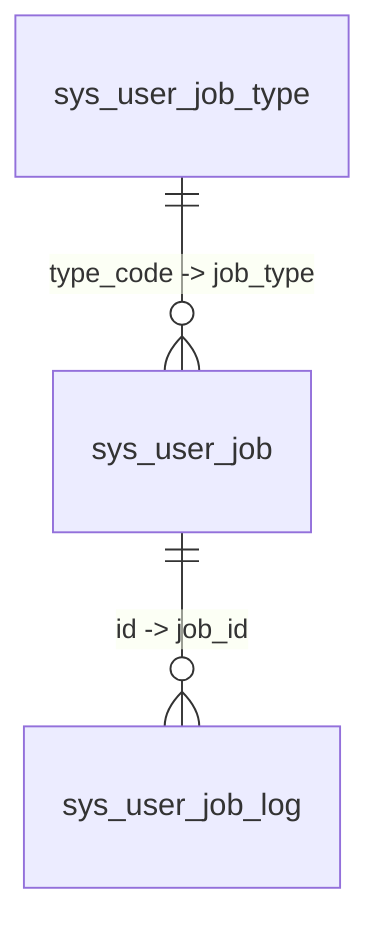

# 스케줄링 작업 시스템

> 본 문서는 Omni-Stack 스케줄링 작업 시스템의 아키텍처, 구현 세부 사항 및 확장 가이드를 설명합니다.  
> 아키텍처 개요는 [architecture.kr.md](architecture.kr.md)를 참조하십시오. Docker 배포 구성은 [docker-deployment.kr.md](docker-deployment.kr.md)를 참조하십시오.

Omni-Stack은 **XXL-JOB 3.3.1** 기반의 듀얼 트랙 스케줄링 작업 아키텍처를 제공하며, 시스템 수준 운영 작업과 사용자 수준 셀프서비스 작업을 모두 포괄합니다.

## 1. 아키텍처 개요

스케줄링 시스템은 동일한 `omni-common-job` 인프라를 공유하는 두 개의 독립적인 트랙으로 구성됩니다:

```
┌────────────────────────────────────────────────────────────────────────┐
│                     Scheduled Task System                              │
├────────────────────────────┬───────────────────────────────────────────┤
│      System Tasks          │           User Tasks                      │
│  ─────────────────         │   ─────────────────                       │
│  @XxlJob + @SystemJobMeta  │   UserJobHandler SPI + Registry           │
│  Admin manages via console │   User self-service via workspace         │
│  Example: OperLogArchiver  │   Example: DrinkWaterRemindHandler        │
│  Handler = XXL-JOB Bean    │   All share userJobExecuteHandler         │
├────────────────────────────┴───────────────────────────────────────────┤
│                    omni-common-job (shared library)                    │
│  XxlJobAutoConfiguration · XxlJobAdminClient · SystemJobRegistry      │
│  XxlJobProperties · SystemJobMeta · ParamDef                          │
├───────────────────────────────────────────────────────────────────────┤
│                    omni-common-core (SPI interfaces)                   │
│  UserJobHandler · UserJobMessage                                      │
├───────────────────────────────────────────────────────────────────────┤
│                       XXL-JOB Admin :18080                             │
│              (Docker: xuxueli/xxl-job-admin:3.3.1)                     │
└───────────────────────────────────────────────────────────────────────┘
```

**모듈 의존 관계**:

- `omni-common-core` — `UserJobHandler` SPI 인터페이스와 `UserJobMessage` POJO를 정의 (Spring 의존성 없음)
- `omni-common-job` — XXL-JOB 통합: 자동 구성, 관리용 HTTP 클라이언트, 시스템 작업 레지스트리, 메타데이터 어노테이션
- `omni-base` — 비즈니스 레이어: 시스템 작업 컨트롤러, 사용자 작업 서비스, 핸들러 구현, 워크스페이스 API

**주요 설계 결정**:

- **XXL-JOB**을 스케줄링 엔진으로 채택: 시각적 콘솔, cron 관리, 실행 로그를 갖춘 성숙한 분산 스케줄링
- **듀얼 트랙 분리**: 시스템 작업(관리자 관리, 코드 정의)과 사용자 작업(셀프서비스, 데이터 정의)
- **단일 공유 핸들러**: 모든 사용자 작업은 XXL-JOB에 `userJobExecuteHandler`로 등록되며, JSON `executorParam`으로 구분됩니다

## 2. 시스템 작업

시스템 작업은 코드에서 이중 어노테이션으로 정의되며, 관리자가 관리 콘솔을 통해 관리합니다.

### 어노테이션 패턴

각 시스템 작업 핸들러 메서드에는 `@XxlJob`과 `@SystemJobMeta`가 모두 부여됩니다:

```java
@XxlJob("operLogArchiveHandler")
@SystemJobMeta(
    name = "운영 로그 아카이브",
    description = "보존 기간을 초과한 핫 테이블 레코드를 콜드 테이블로 마이그레이션",
    defaultCron = "0 0 2 * * ?",
    routeStrategy = "FIRST",
    params = {
        @ParamDef(name = "retentionDays", label = "보존 일수",
                  type = "number", defaultValue = "180", required = true, min = 1, max = 3650)
    }
)
public void archive() { ... }
```

| 어노테이션 | 소스 | 목적 |
|-----------|--------|---------|
| `@XxlJob` | XXL-JOB Core | XXL-JOB 실행자 라우팅을 위한 핸들러 이름을 선언 |
| `@SystemJobMeta` | `omni-common-job` | 관리 UI용 표시 메타데이터(이름, 설명, 기본 cron, 라우트 전략, 파라미터 정의)를 선언 |
| `@ParamDef` | `omni-common-job` | 구성 가능한 파라미터(이름, 레이블, 타입, 기본값, 최소/최대)를 정의 |

### 레지스트리 메커니즘

`SystemJobRegistry`는 시작 시(`@PostConstruct`)에 모든 Spring Bean을 스캔하여 `@XxlJob`과 `@SystemJobMeta`가 모두 부여된 메서드를 수집합니다. 수집된 메타데이터는 메모리 내 `LinkedHashMap<String, SystemJobInfo>`에 저장되어 컨트롤러에서 쿼리할 수 있습니다.

자동 구성: `XxlJobAutoConfiguration`은 `SystemJobRegistry`를 `@ConditionalOnMissingBean`이 적용된 `@Bean`으로 등록합니다.

### 관리 워크플로우

1. 관리자가 시스템 작업 관리 페이지에서 미등록 핸들러를 확인
2. 관리자가 사용자 정의 cron 및 파라미터로 핸들러를 XXL-JOB에 등록
3. 관리자가 동일한 페이지에서 작업 시작/중지/트리거/등록 해제를 수행
4. 실행 로그는 XXL-JOB 네이티브 콘솔(`http://localhost:18080`)에서 확인

### REST API

| 메서드 | 경로 | 권한 | 설명 |
|--------|------|-----------|-------------|
| `GET` | `/api/job/system-job/list` | `job:system-job:list` | 모든 핸들러를 XXL-JOB 상태(미등록/실행 중/중지)와 함께 목록 조회 |
| `POST` | `/api/job/system-job/register` | `job:system-job:manage` | 사용자 정의 cron/파라미터로 핸들러를 XXL-JOB에 등록 |
| `POST` | `/api/job/system-job/{xxlJobId}/start` | `job:system-job:manage` | 스케줄링 시작 |
| `POST` | `/api/job/system-job/{xxlJobId}/stop` | `job:system-job:manage` | 스케줄링 중지 |
| `POST` | `/api/job/system-job/{xxlJobId}/trigger` | `job:system-job:manage` | 즉시 실행 트리거 |
| `DELETE` | `/api/job/system-job/{xxlJobId}` | `job:system-job:manage` | XXL-JOB에서 등록 해제 |

### 예시: OperLogArchiver

운영 로그 아카이브 작업은 `retentionDays`보다 오래된 레코드를 핫 테이블(`sys_oper_log`)에서 콜드 테이블(`sys_oper_log_archive`)로 마이그레이션합니다:

- **핸들러**: `omni-base` 내 `OperLogArchiver.archive()`
- **기본 cron**: `0 0 2 * * ?` (매일 02:00)
- **파라미터**: `retentionDays` (숫자, 1-3650, 기본값 180)
- **배치 처리**: 배치당 1000건, 배치마다 `@Transactional` 적용
- **실행 로그**: XXL-JOB 콘솔에서 확인 (애플리케이션 UI에는 표시되지 않음)

## 3. 사용자 작업

사용자 작업은 최종 사용자가 워크스페이스 UI를 통해 생성하는 셀프서비스 스케줄링 작업입니다. 각 작업은 직접 XXL-JOB에 등록되어 네이티브 cron 스케줄링 정밀도를 활용합니다.

### SPI 인터페이스

`UserJobHandler`(`omni-common-core` 내)는 새로운 작업 유형을 정의하기 위한 확장 포인트입니다:

```java
public interface UserJobHandler {
    void execute(UserJobMessage message) throws Exception;
    default String getResultMessage(UserJobMessage message) { return null; }
}
```

`UserJobMessage`는 작업 컨텍스트를 전달합니다:

| 필드 | 타입 | 설명 |
|-------|------|-------------|
| `jobId` | `Long` | 작업 ID (`sys_user_job.id`) |
| `tenantId` | `Long` | 테넌트 ID |
| `jobType` | `String` | 작업 유형 코드 (`sys_user_job_type.type_code`와 일치) |
| `jobName` | `String` | 사용자 정의 작업 이름 |
| `jobParams` | `String` | 작업 파라미터 JSON |

### 핸들러 레지스트리 및 라우팅

`UserJobHandlerRegistry`는 Spring의 `Map<String, UserJobHandler>` 주입을 통해 모든 `UserJobHandler` 구현을 자동 감지합니다. Map의 키는 Bean 이름으로, **`sys_user_job_type.type_code`와 정확히 일치해야 합니다**.

모든 사용자 작업은 단일 XXL-JOB 핸들러 `@XxlJob("userJobExecuteHandler")`를 공유합니다. XXL-JOB이 실행을 트리거하면, `UserJobExecuteHandler`는 JSON `executorParam`을 읽어 `UserJobMessage`로 역직렬화한 후, `UserJobHandlerRegistry.getHandler(jobType)`을 통해 올바른 핸들러로 라우팅합니다.

### 실행 흐름

```
XXL-JOB Scheduler triggers
    → XxlJobSpringExecutor dispatches to userJobExecuteHandler
    → UserJobExecuteHandler.execute():
        1. XxlJobHelper.getJobParam() → JSON 문자열
        2. objectMapper.readValue(param, UserJobMessage.class)
        3. handlerRegistry.getHandler(jobType) → UserJobHandler
        4. handler.execute(message)
        5. handler.getResultMessage(message) → 결과 텍스트
        6. INSERT INTO sys_user_job_log (status, executeTimeMs, resultMessage, errorMessage)
        7. UPDATE sys_user_job SET last_fire_time = fireTime
        8. XxlJobHelper.handleSuccess() or handleFail()
```

### 서비스 레이어

`UserJobServiceImpl`이 전체 라이프사이클을 관리합니다:

| 작업 | 흐름 |
|-----------|------|
| **생성** | 유형 검증 → `sys_user_job` INSERT → `XxlJobAdminClient.addJob()` → `xxlJobId` 업데이트 → XXL-JOB 실패 시 DB 롤백 |
| **수정** | 소유권 확인 → `sys_user_job` UPDATE → cron/파라미터 변경 시 `XxlJobAdminClient.updateJob()` |
| **삭제** | 소유권 확인 → `XxlJobAdminClient.removeJob()` → `sys_user_job` DELETE |
| **전환** | 소유권 확인 → 상태 UPDATE → `startJob()` 또는 `stopJob()` |
| **트리거** | 소유권 확인 → `triggerJob(xxlJobId, executorParam)` |

### 워크스페이스 API (MyJobController)

| 메서드 | 경로 | 인증 | 설명 |
|--------|------|------|-------------|
| `GET` | `/api/base/my-job/list` | JWT | 현재 사용자의 작업 목록 조회 (페이지네이션) |
| `GET` | `/api/base/my-job/types` | JWT | 드롭다운용 활성화된 작업 유형 목록 |
| `GET` | `/api/base/my-job/stats` | JWT | 대시보드 통계 (총계, 금일 실행 수, 금일 실패 수) |
| `POST` | `/api/base/my-job` | JWT | 작업 생성 |
| `PUT` | `/api/base/my-job/{id}` | JWT + 소유권 | 작업 수정 |
| `DELETE` | `/api/base/my-job/{id}` | JWT + 소유권 | 작업 삭제 |
| `PUT` | `/api/base/my-job/{id}/status` | JWT + 소유권 | 상태 전환 |
| `POST` | `/api/base/my-job/{id}/trigger` | JWT + 소유권 | 즉시 실행 트리거 |
| `GET` | `/api/base/my-job/{id}/logs` | JWT + 소유권 | 실행 로그 목록 조회 |

**소유권 모델**: `MyJobController`는 `@PreAuthorize` 대신 `verifyOwnership(id, username)`을 사용합니다. 각 작업은 작업의 `createBy`가 현재 사용자와 일치하는지 확인합니다. 이를 통해 역할 기반 권한 코드 없이 행 단위 데이터 격리를 제공합니다.

## 4. 새로운 사용자 작업 유형 생성 (튜토리얼)

본 장에서는 **물 마시기 알림**(`Task-00001`)을 예로 들어 새로운 사용자 작업 유형을 생성하는 절차를 안내합니다.

### 1단계: 작업 유형 등록

`sys_user_job_type`에 레코드를 삽입합니다:

```sql
INSERT INTO sys_user_job_type (type_code, type_name, description, param_template)
VALUES (
    'Task-00001',
    '물 마시기 알림',
    '사용자에게 규칙적으로 물을 마시도록 알림하여 건강을 유지',
    '[{"fieldKey":"cupShape","fieldLabel":"컵 크기","fieldType":"select","required":false,"options":["소","중","대"]}]'
);
```

| 컬럼 | 값 | 목적 |
|--------|-------|---------|
| `type_code` | `Task-00001` | 고유 식별자. **Spring Bean 이름과 일치해야 합니다** |
| `type_name` | `물 마시기 알림` | 워크스페이스 UI 표시 이름 |
| `param_template` | JSON 배열 | 작업 생성 대화 상자의 폼 필드 정의 |

`param_template` JSON 스키마가 워크스페이스 UI의 동적 폼을 구동합니다. 각 필드 정의는 다음을 지원합니다:

| 속성 | 설명 |
|----------|-------------|
| `fieldKey` | 파라미터 키 (`jobParams` JSON에서 사용) |
| `fieldLabel` | 표시 레이블 |
| `fieldType` | `input`, `select`, `number`, `textarea` |
| `required` | 필수 필드 여부 |
| `options` | `select` 타입의 선택 가능한 옵션 |

### 2단계: UserJobHandler 구현

Bean 이름이 `type_code`와 일치하는 `@Component`로 핸들러 클래스를 생성합니다:

```java
@Slf4j
@Component("Task-00001")  // Bean 이름은 sys_user_job_type.type_code와 일치해야 합니다
@RequiredArgsConstructor
public class DrinkWaterRemindHandler implements UserJobHandler {

    private final ObjectMapper objectMapper;

    @Override
    public void execute(UserJobMessage message) throws Exception {
        String cupShape = parseCupShape(message.getJobParams());
        log.info("[물 마시기 알림] 작업 [{}]이(가) 트리거되었습니다: {}컵 물을 한 잔 드세요", message.getJobName(), cupShape);
    }

    @Override
    public String getResultMessage(UserJobMessage message) {
        try {
            String cupShape = parseCupShape(message.getJobParams());
            return cupShape + "컵 물을 한 잔 드시고 건강을 유지하세요!";
        } catch (Exception e) {
            return "물을 한 잔 드시고 건강을 유지하세요!";
        }
    }

    private String parseCupShape(String jobParams) {
        if (jobParams == null || jobParams.isBlank()) return "중";
        try {
            JsonNode params = objectMapper.readTree(jobParams);
            JsonNode cupNode = params.get("cupShape");
            if (cupNode != null && !cupNode.isNull() && !cupNode.asText().isBlank()) {
                return cupNode.asText();
            }
        } catch (Exception ignored) { }
        return "중";
    }
}
```

**중요 규칙**: `@Component` Bean 이름(`"Task-00001"`)은 `sys_user_job_type`의 `type_code`와 정확히 일치해야 합니다. 불일치 시 자동 라우팅 실패가 발생하며, 작업은 성공적으로 생성되지만 실행 시 "작업 유형에 해당하는 핸들러를 찾을 수 없습니다" 오류로 실패합니다.

### 3단계: 사용자가 작업 생성

1. 사용자가 워크스페이스를 열기 → "작업 생성" 클릭
2. 유형 드롭다운에서 "물 마시기 알림" 선택
3. 동적 폼에 입력 (예: `cupShape = 대`)
4. cron 표현식 설정 (예: 근무 시간 중 30분마다 → `0 */30 9-18 * * ?`)
5. "생성 확인" 클릭

내부 처리:
- `MyJobController.create()` → `UserJobServiceImpl.createJob()`:
  - `type_code`가 `sys_user_job_type`에 존재하고 활성화되어 있는지 검증
  - `sys_user_job`에 INSERT
  - `UserJobMessage` JSON을 `executorParam`으로 구성
  - `XxlJobAdminClient.addJob()`을 호출하여 XXL-JOB에 등록
  - 반환된 ID로 `sys_user_job.xxl_job_id`를 업데이트

### 4단계: 실행 확인

1. **XXL-JOB 콘솔** (`http://localhost:18080`): 구성된 cron으로 작업 목록에 작업이 표시됩니다
2. **자동 트리거**: XXL-JOB이 예약된 시간에 실행 → `userJobExecuteHandler` → `DrinkWaterRemindHandler.execute()`
3. **실행 로그**: `sys_user_job_log`에 `result_message`를 포함한 새 레코드가 기록됩니다
4. **프론트엔드 알림**: 워크스페이스가 10초마다 폴링하여 새 로그를 감지하면 `ElNotification` 팝업으로 결과 메시지를 표시합니다

## 5. XXL-JOB Admin 클라이언트

`XxlJobAdminClient`는 XXL-JOB Admin의 REST API를 래핑하는 HTTP 클라이언트입니다. `XxlJobProperties`의 구성을 사용하여 `SystemJobService`와 `UserJobServiceImpl`에서 인스턴스화됩니다.

### 인증

XXL-JOB Admin은 세션 기반 인증을 사용합니다. `XxlJobAdminClient`:
1. `userName`과 `password`로 `POST /login`을 호출
2. 세션 쿠키를 `volatile` 필드에 캐시
3. 후속 API 호출 시 `Cookie` 헤더에 쿠키를 포함
4. 302 리다이렉트(로그인 페이지) 감지 시 자동으로 재인증 후 재시도

### 주요 API 메서드

| 메서드 | XXL-JOB 엔드포인트 | 목적 |
|--------|-----------------|---------|
| `addJob(jobGroup, jobDesc, cron, routeStrategy, handler, param)` | `POST /jobinfo/insert` | 새 스케줄링 작업 생성 |
| `updateJob(xxlJobId, cron, param)` | `POST /jobinfo/update` | 기존 작업의 cron/파라미터 수정 |
| `removeJob(xxlJobId)` | `POST /jobinfo/remove` | 작업 삭제 |
| `startJob(xxlJobId)` | `POST /jobinfo/start` | 스케줄링 시작 |
| `stopJob(xxlJobId)` | `POST /jobinfo/stop` | 스케줄링 중지 |
| `triggerJob(xxlJobId, param)` | `POST /jobinfo/trigger` | 즉시 실행 트리거 |
| `getJobGroupId(appname)` | `POST /jobgroup/pageList` | appname으로 실행자 그룹 ID 조회 |
| `pageList(jobGroup, handler)` | `POST /jobinfo/pageList` | 작업 목록 쿼리 (메타데이터와 실시간 상태 병합에 사용) |

### 구성

```yaml
xxl:
  job:
    admin:
      addresses: http://127.0.0.1:18080/xxl-job-admin
      username: admin
      password: 123456
    executor:
      appname: omni-base        # 비어있을 경우 spring.application.name으로 폴백
      port: 9999               # 실행자 콜백 포트
      logPath: /data/applogs/xxl-job/jobhandler
      logRetentionDays: 30
```

모든 속성은 `XxlJobProperties` 내 `@ConfigurationProperties(prefix = "xxl.job")`를 통해 바인딩됩니다.

## 6. 프론트엔드 통합

### 세 가지 프론트엔드 진입점

| 영역 | 경로 | 대상 사용자 | 권한 |
|------|------|----------|-----------|
| 시스템 작업 관리 | `src/views/job/system-job/index.vue` | 관리자 | `job:system-job:list`, `job:system-job:manage` |
| 작업 유형 관리 | `src/views/job/user-job-type/index.vue` | 관리자 | `job:user-job-type:*` |
| 워크스페이스 (내 작업) | `src/views/home/index.vue` | 모든 사용자 | JWT만 (소유권 기반) |

### API 모듈

| 모듈 | 파일 | 함수 |
|--------|------|-----------|
| 시스템 작업 | `src/api/systemJob.ts` | `listSystemJobs`, `registerSystemJob`, `startSystemJob`, `stopSystemJob`, `triggerSystemJob`, `unregisterSystemJob` |
| 작업 유형 | `src/api/userJobType.ts` | `listJobTypes`, `createJobType`, `updateJobType`, `deleteJobType` |
| 내 작업 | `src/api/myJob.ts` | `getMyJobs`, `getMyJobStats`, `createMyJob`, `updateMyJob`, `deleteMyJob`, `toggleMyJobStatus`, `triggerMyJob`, `getMyJobLogs`, `getEnabledJobTypes` |

### 주요 UX 패턴

- **Cron 생성기**: 전용 컴포넌트(`CronGenerator.vue`)가 빈도 유형 선택기(매분 / X분마다 / 매시 / X시간마다 / 매일 / 매주 / 매월)와 사람이 읽을 수 있는 미리보기(예: "매주 월요일 09:00에 실행")를 제공합니다
- **동적 폼 렌더러**: `DynamicFormRenderer.vue`는 `sys_user_job_type`의 `param_template` JSON 스키마를 기반으로 폼을 렌더링합니다. `input`, `select`, `number`, `textarea` 필드 타입을 지원합니다.
- **글로벌 폴링**: 워크스페이스는 10초마다(`setInterval`) 모든 활성 작업의 새 실행 로그를 폴링합니다. `lastLogIdMap`(Map<jobId, lastSeenLogId>)을 사용하여 새 로그를 감지하고 `ElNotification` 팝업을 표시합니다. 첫 번째 폴링은 알림을 표시하지 않고 기준선을 초기화합니다(이전 로그 팝업 방지).

## 7. 구성

### Docker 배포

XXL-JOB Admin은 `docker-compose.yml`을 통해 Docker 컨테이너로 배포됩니다:

```yaml
xxl-job-admin:
  image: xuxueli/xxl-job-admin:3.3.1
  container_name: omni-xxl-job-admin
  ports:
    - "18080:8080"
  environment:
    PARAMS: >
      --spring.datasource.url=jdbc:mysql://mysql:3306/xxl_job?...
      --spring.datasource.username=root
      --spring.datasource.password=root123
```

`xxl_job` 데이터베이스는 one-shot `omni-db-migrator`가 `database/changelog/xxl-job/`에서 초기화합니다. 공식 스케줄러 시드는 `scripts/sql/seed/xxl-job.sql`에 있으며 seed manifest로 검증합니다.

### 데이터베이스 테이블 (omni_base 스키마)

| 테이블 | 목적 |
|-------|---------|
| `sys_user_job_type` | 작업 유형 카탈로그. `type_code`(고유)는 `UserJobHandler` Bean 이름에 매핑. `param_template`(JSON)이 동적 폼을 구동. |
| `sys_user_job` | 사용자 작업 인스턴스. `xxl_job_id`는 XXL-JOB에 연결. `cron_expression`, `job_params`, `status`, `last_fire_time`. |
| `sys_user_job_log` | 실행 이력. `job_id`, `fire_time`, `execute_time_ms`, `status`(0=실패, 1=성공), `result_message`, `error_message`. |



### 자동 구성

`XxlJobAutoConfiguration`(`omni-common-job` 내)은 `META-INF/spring/AutoConfiguration.imports`를 통해 등록되며, 다음 조건에서 활성화됩니다:
- `XxlJobSpringExecutor` 클래스가 클래스패스에 존재 (`@ConditionalOnClass`)
- `xxl.job.executor.enabled`가 명시적으로 `false`로 설정되지 않음 (`@ConditionalOnProperty`, 기본값은 `true`)

제공하는 것:
1. `XxlJobSpringExecutor` Bean — 시작 시 XXL-JOB Admin에 등록
2. `SystemJobRegistry` Bean — `@XxlJob` + `@SystemJobMeta`가 부여된 메서드를 스캔 (`@ConditionalOnMissingBean`)

### 서비스 통합 체크리스트

새로운 마이크로서비스에 스케줄링 기능을 추가하려면:

1. POM 의존성에 `omni-common-job` 추가
2. `application.yml`에 `xxl.job.admin.*`과 `xxl.job.executor.*` 구성
3. XXL-JOB Admin이 실행 중이고 접근 가능한지 확인
4. 시스템 작업: 핸들러 메서드에 `@XxlJob` + `@SystemJobMeta` 부여
5. 사용자 작업: Bean 이름이 `type_code`와 일치하는 `UserJobHandler` 구현
6. 서비스 시작 시 실행자가 XXL-JOB Admin에 자동 등록됩니다

---

## 8. 기술 선정 고찰: Quartz 대신 XXL-JOB을 선택한 이유

| 고려 사항 | XXL-JOB | Quartz |
|------|---------|--------|
| **시각적 관리** | 내장 웹 콘솔에서 작업 CRUD, 실행 로그, 스케줄링 보고서 지원 | 내장 UI 없음. 서드파티 도구(예: Quartz Web UI) 필요 |
| **분산 지원** | 다중 실행자, 샤딩 브로드캐스트, 페일오버를 네이티브 지원 | JDBC JobStore + 클러스터 모드 추가 구성 필요 |
| **동적 스케줄링** | 런타임 cron/파라미터 변경이 즉시 반영되며 재시작 불필요 | 런타임 변경 시 API를 통한 재스케줄링 필요 |
| **운영 편의성** | 실행 로그 시각화, 실패 재시도, 이메일 알림 | 로그는 커스텀 통합 필요 |
| **Spring Boot 통합** | `xxl-job-core` SDK를 제공하여 간편한 통합 | Spring 내장 `@Scheduled`가 있으나 분산 기능 제한적 |
| **커뮤니티 활성도** | GitHub 25k+ stars, 활발한 커뮤니티 | 오랜 역사를 가지나 커뮤니티 활성도 하락 추세 |

**결론**: XXL-JOB은 시각적 관리, 분산 스케줄링, 운영 편의성 측면에서 Quartz보다 명확히 우수하며, 관리자가 동적으로 작업을 구성해야 하는 시나리오에 특히 적합합니다.

## 9. XXL-JOB Docker 배포 구성 상세

### 컨테이너 구성

```yaml
# docker-compose.yml
xxl-job-admin:
  image: xuxueli/xxl-job-admin:3.3.1
  container_name: omni-xxl-job-admin
  ports:
    - "18080:8080"              # 호스트 18080 → 컨테이너 내부 8080
  environment:
    PARAMS: >
      --spring.datasource.url=jdbc:mysql://mysql:3306/xxl_job?useUnicode=true&characterEncoding=UTF-8&autoReconnect=true&serverTimezone=Asia/Shanghai
      --spring.datasource.username=root
      --spring.datasource.password=root123
  depends_on:
    mysql:
      condition: service_healthy
  networks:
    - omni-network
```

### 주요 구성 설명

| 구성 항목 | 값 | 설명 |
|---------|-----|------|
| 컨테이너 내부 포트 | 8080 | XXL-JOB Admin 기본 포트 |
| 호스트 매핑 포트 | 18080 | Gateway(8102)와의 충돌 방지 |
| 데이터베이스 연결 | `mysql:3306` | Docker 내부 네트워크에서 `mysql` 호스트 이름 해석 |
| 데이터베이스 구조 | `database/changelog/xxl-job/` | XXL-JOB 시작 전 one-shot migrator가 적용 |
| 스케줄러 시드 | `scripts/sql/seed/xxl-job.sql` | `database/seed/manifest.yaml`로 검증하는 멱등 DML |
| 기본 계정 | admin / 123456 | 프로덕션 환경에서는 반드시 변경해야 함 |

### 실행자 등록

각 마이크로서비스의 실행자는 `xxl.job.executor.appname`을 통해 XXL-JOB Admin에 등록됩니다:

| 서비스 | appname | 포트 | 설명 |
|------|---------|------|------|
| omni-base | `omni-base` | 9999 | 시스템 작업 + 사용자 작업 + MQ 릴레이 |
| omni-auth | `omni-auth` | 9998 | 인증 관련 작업 (실행자가 구성된 경우) |
| omni-workflow | `omni-workflow` | 9997 | 워크플로우 관련 작업 (실행자가 구성된 경우) |

---

## 10. 문제 해결 가이드

| 문제 | 가능한 원인 | 조사 방법 |
|------|---------|----------|
| **실행자가 등록되지 않음** | XXL-JOB Admin이 시작되지 않았거나 네트워크 연결 불가 | XXL-JOB Admin 컨테이너 상태 확인. `xxl.job.admin.addresses` 구성 확인 |
| **작업이 트리거되지 않음** | 작업이 시작되지 않았거나 cron 표현식 오류 | XXL-JOB 콘솔에서 작업 상태 확인. 온라인 cron 도구로 표현식 검증 |
| **실행 실패** | 핸들러가 예외를 발생시킴 | XXL-JOB 콘솔에서 실행 로그 확인. 서비스 로그에서 예외 스택 트레이스 확인 |
| **사용자 작업 "핸들러를 찾을 수 없음"** | Bean 이름과 type_code 불일치 | `@Component("Task-XXXXX")`의 이름이 `sys_user_job_type.type_code`와 정확히 일치하는지 확인 |
| **XXL-JOB 등록 실패 롤백** | `XxlJobAdminClient.addJob()`이 실패를 반환 | XXL-JOB Admin 로그 확인. 실행자 appname이 등록되어 있는지 확인 |
| **작업 중복 등록** | 생성 버튼 여러 번 클릭 | `dynamicRouteNames` Set이 중복을 방지하지만, 서비스 재시작 후 재등록 필요 |
