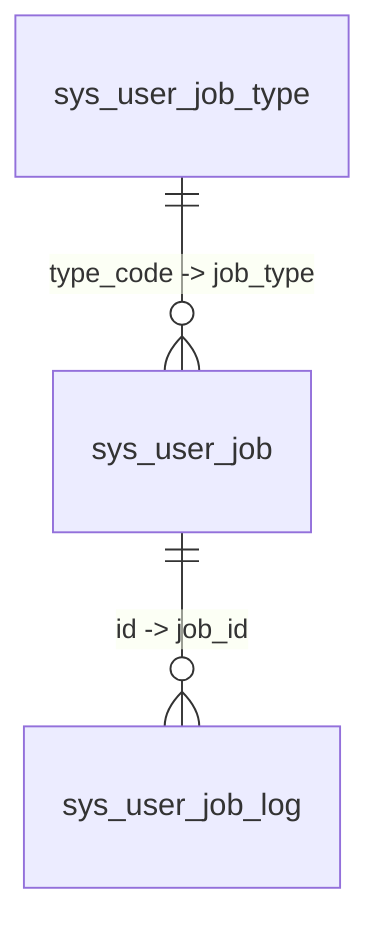

# 定时任务系统

> 本文档描述 Omni-Stack 定时任务系统的架构、实现细节和扩展指南。  
> 架构概览详见 [architecture.md](architecture.md)。Docker 部署配置详见 [docker-deployment.md](docker-deployment.md)。

Omni-Stack 提供基于 **XXL-JOB 3.3.1** 的双轨定时任务架构，覆盖系统级运维任务和用户级自助任务。

## 1. 架构概览

定时任务系统分为两个独立的轨道，共享同一套 `omni-common-job` 基础设施：

```
┌────────────────────────────────────────────────────────────────────────┐
│                         定时任务系统                                    │
├────────────────────────────┬───────────────────────────────────────────┤
│        系统任务             │           用户任务                         │
│  ─────────────────         │   ─────────────────                       │
│  @XxlJob + @SystemJobMeta  │   UserJobHandler SPI + Registry           │
│  管理员通过控制台管理        │   用户通过工作台自助管理                    │
│  示例: OperLogArchiver      │   示例: DrinkWaterRemindHandler           │
│  Handler = XXL-JOB Bean    │   共享 userJobExecuteHandler               │
├────────────────────────────┴───────────────────────────────────────────┤
│                    omni-common-job（共享类库）                           │
│  XxlJobAutoConfiguration · XxlJobAdminClient · SystemJobRegistry      │
│  XxlJobProperties · SystemJobMeta · ParamDef                          │
├───────────────────────────────────────────────────────────────────────┤
│                    omni-common-core（SPI 接口）                         │
│  UserJobHandler · UserJobMessage                                      │
├───────────────────────────────────────────────────────────────────────┤
│                       XXL-JOB Admin :18080                             │
│              (Docker: xuxueli/xxl-job-admin:3.3.1)                     │
└───────────────────────────────────────────────────────────────────────┘
```

**模块依赖**：

- `omni-common-core` — 定义 `UserJobHandler` SPI 接口和 `UserJobMessage` POJO（零 Spring 依赖）
- `omni-common-job` — XXL-JOB 集成：自动配置、Admin HTTP 客户端、系统任务注册、元数据注解
- `omni-base` — 业务层：系统任务控制器、用户任务服务、Handler 实现、工作台 API

**关键设计决策**：

- 选用 **XXL-JOB** 作为调度引擎：成熟的分布式调度方案，具备可视化控制台、Cron 管理和执行日志
- **双轨分离**：系统任务（管理员管理、代码定义）与用户任务（自助服务、数据定义）
- 用户任务**共享单一 Handler**：所有用户任务在 XXL-JOB 中注册为 `userJobExecuteHandler`，通过 JSON `executorParam` 区分

## 2. 系统任务

系统任务通过双重注解在代码中定义，由管理员在管理控制台中管理。

### 注解模式

每个系统任务 Handler 方法同时使用 `@XxlJob` 和 `@SystemJobMeta` 注解：

```java
@XxlJob("operLogArchiveHandler")
@SystemJobMeta(
    name = "操作日志归档",
    description = "将超过保留天数的热表记录迁移到冷表",
    defaultCron = "0 0 2 * * ?",
    routeStrategy = "FIRST",
    params = {
        @ParamDef(name = "retentionDays", label = "保留天数",
                  type = "number", defaultValue = "180", required = true, min = 1, max = 3650)
    }
)
public void archive() { ... }
```

| 注解 | 来源 | 用途 |
|------|------|------|
| `@XxlJob` | XXL-JOB Core | 声明 Handler 名称，用于 XXL-JOB 执行器路由 |
| `@SystemJobMeta` | `omni-common-job` | 声明展示元数据（名称、描述、默认 Cron、路由策略、参数定义），供管理界面使用 |
| `@ParamDef` | `omni-common-job` | 定义可配置参数（名称、标签、类型、默认值、最小/最大值） |

### 注册机制

`SystemJobRegistry` 在启动时（`@PostConstruct`）扫描所有 Spring Bean，收集同时标注了 `@XxlJob` 和 `@SystemJobMeta` 的方法。收集到的元数据存储在内存中的 `LinkedHashMap<String, SystemJobInfo>`，供控制器查询。

自动配置：`XxlJobAutoConfiguration` 通过 `@ConditionalOnMissingBean` 将 `SystemJobRegistry` 注册为 `@Bean`。

### 管理流程

1. 管理员在系统任务管理页面查看未注册的 Handler
2. 管理员将 Handler 注册到 XXL-JOB，自定义 Cron 和参数
3. 管理员可在同一页面启动/停止/触发/注销任务
4. 执行日志在 XXL-JOB 原生控制台（`http://localhost:18080`）中查看

### REST API

| 方法 | 路径 | 权限 | 描述 |
|------|------|------|------|
| `GET` | `/api/job/system-job/list` | `job:system-job:list` | 列出所有 Handler 及其 XXL-JOB 状态（UNREGISTERED/RUNNING/STOPPED） |
| `POST` | `/api/job/system-job/register` | `job:system-job:manage` | 将 Handler 注册到 XXL-JOB，自定义 Cron/参数 |
| `POST` | `/api/job/system-job/{xxlJobId}/start` | `job:system-job:manage` | 启动调度 |
| `POST` | `/api/job/system-job/{xxlJobId}/stop` | `job:system-job:manage` | 停止调度 |
| `POST` | `/api/job/system-job/{xxlJobId}/trigger` | `job:system-job:manage` | 触发立即执行 |
| `DELETE` | `/api/job/system-job/{xxlJobId}` | `job:system-job:manage` | 从 XXL-JOB 注销 |

### 示例：操作日志归档

操作日志归档任务将超过 `retentionDays` 的记录从热表（`sys_oper_log`）迁移到冷表（`sys_oper_log_archive`）：

- **Handler**：`omni-base` 中的 `OperLogArchiver.archive()`
- **默认 Cron**：`0 0 2 * * ?`（每天凌晨 02:00）
- **参数**：`retentionDays`（数字，1-3650，默认 180）
- **批处理**：每批 1000 条记录，每批使用 `@Transactional`
- **执行日志**：在 XXL-JOB 控制台查看，不在应用界面展示

## 3. 用户任务

用户任务是由终端用户通过工作台界面创建的自助式定时任务。每个任务直接注册到 XXL-JOB，充分利用原生 Cron 调度精度。

### SPI 接口

`UserJobHandler`（位于 `omni-common-core`）是定义新任务类型的扩展点：

```java
public interface UserJobHandler {
    void execute(UserJobMessage message) throws Exception;
    default String getResultMessage(UserJobMessage message) { return null; }
}
```

`UserJobMessage` 承载任务上下文：

| 字段 | 类型 | 描述 |
|------|------|------|
| `jobId` | `Long` | 任务 ID（`sys_user_job.id`） |
| `tenantId` | `Long` | 租户 ID |
| `jobType` | `String` | 任务类型编码（对应 `sys_user_job_type.type_code`） |
| `jobName` | `String` | 用户自定义的任务名称 |
| `jobParams` | `String` | 任务参数 JSON |

### Handler 注册与路由

`UserJobHandlerRegistry` 通过 Spring 的 `Map<String, UserJobHandler>` 注入自动发现所有 `UserJobHandler` 实现。Map 的 key 为 Bean 名称，**必须与** `sys_user_job_type.type_code` **完全一致**。

所有用户任务共享同一个 XXL-JOB Handler：`@XxlJob("userJobExecuteHandler")`。当 XXL-JOB 触发执行时，`UserJobExecuteHandler` 读取 JSON 格式的 `executorParam`，反序列化为 `UserJobMessage`，然后通过 `UserJobHandlerRegistry.getHandler(jobType)` 路由到正确的 Handler。

### 执行流程

```
XXL-JOB 调度器触发
    → XxlJobSpringExecutor 分发到 userJobExecuteHandler
    → UserJobExecuteHandler.execute()：
        1. XxlJobHelper.getJobParam() → JSON 字符串
        2. objectMapper.readValue(param, UserJobMessage.class)
        3. handlerRegistry.getHandler(jobType) → UserJobHandler
        4. handler.execute(message)
        5. handler.getResultMessage(message) → 结果文本
        6. INSERT INTO sys_user_job_log (status, executeTimeMs, resultMessage, errorMessage)
        7. UPDATE sys_user_job SET last_fire_time = fireTime
        8. XxlJobHelper.handleSuccess() 或 handleFail()
```

### 服务层

`UserJobServiceImpl` 管理完整的生命周期：

| 操作 | 流程 |
|------|------|
| **创建** | 验证类型 → INSERT `sys_user_job` → `XxlJobAdminClient.addJob()` → 更新 `xxlJobId` → XXL-JOB 失败时回滚数据库 |
| **更新** | 检查归属 → UPDATE `sys_user_job` → 若 Cron/参数变更则调用 `XxlJobAdminClient.updateJob()` |
| **删除** | 检查归属 → `XxlJobAdminClient.removeJob()` → DELETE `sys_user_job` |
| **切换状态** | 检查归属 → UPDATE 状态 → `startJob()` 或 `stopJob()` |
| **触发执行** | 检查归属 → `triggerJob(xxlJobId, executorParam)` |

### 工作台 API（MyJobController）

| 方法 | 路径 | 认证 | 描述 |
|------|------|------|------|
| `GET` | `/api/base/my-job/list` | JWT | 列出当前用户的任务（分页） |
| `GET` | `/api/base/my-job/types` | JWT | 列出已启用的任务类型（下拉选项） |
| `GET` | `/api/base/my-job/stats` | JWT | 仪表盘统计（总数、今日执行数、今日失败数） |
| `POST` | `/api/base/my-job` | JWT | 创建任务 |
| `PUT` | `/api/base/my-job/{id}` | JWT + 归属验证 | 更新任务 |
| `DELETE` | `/api/base/my-job/{id}` | JWT + 归属验证 | 删除任务 |
| `PUT` | `/api/base/my-job/{id}/status` | JWT + 归属验证 | 切换状态 |
| `POST` | `/api/base/my-job/{id}/trigger` | JWT + 归属验证 | 触发立即执行 |
| `GET` | `/api/base/my-job/{id}/logs` | JWT + 归属验证 | 列出执行日志 |

**归属模型**：`MyJobController` 使用 `verifyOwnership(id, username)` 而非 `@PreAuthorize`。每个操作都检查任务的 `createBy` 是否与当前用户匹配。这提供了逐行的数据隔离，无需基于角色的权限编码。

## 4. 创建新的用户任务类型（教程）

本章以**喝水提醒**（`Task-00001`）为例，演示如何创建新的用户任务类型。

### 第一步：注册任务类型

在 `sys_user_job_type` 中插入一条记录：

```sql
INSERT INTO sys_user_job_type (type_code, type_name, description, param_template)
VALUES (
    'Task-00001',
    '喝水提醒',
    '定时提醒用户喝水，保持身体健康',
    '[{"fieldKey":"cupShape","fieldLabel":"杯型","fieldType":"select","required":false,"options":["小杯","中杯","大杯"]}]'
);
```

| 列名 | 值 | 用途 |
|------|-----|------|
| `type_code` | `Task-00001` | 唯一标识符；**必须与 Spring Bean 名称一致** |
| `type_name` | `喝水提醒` | 工作台界面中的显示名称 |
| `param_template` | JSON 数组 | 定义任务创建对话框的动态表单字段 |

`param_template` JSON Schema 驱动工作台界面中的动态表单。每个字段定义支持以下属性：

| 属性 | 描述 |
|------|------|
| `fieldKey` | 参数键名（用于 `jobParams` JSON 中） |
| `fieldLabel` | 显示标签 |
| `fieldType` | `input`、`select`、`number`、`textarea` |
| `required` | 该字段是否为必填项 |
| `options` | `select` 类型的可选项 |

### 第二步：实现 UserJobHandler

创建一个带有 `@Component` 注解的 Handler 类，Bean 名称需与 `type_code` 一致：

```java
@Slf4j
@Component("Task-00001")  // Bean 名称必须与 sys_user_job_type.type_code 一致
@RequiredArgsConstructor
public class DrinkWaterRemindHandler implements UserJobHandler {

    private final ObjectMapper objectMapper;

    @Override
    public void execute(UserJobMessage message) throws Exception {
        String cupShape = parseCupShape(message.getJobParams());
        log.info("【喝水提醒】任务 [{}] 已触发：请喝一杯{}水", message.getJobName(), cupShape);
    }

    @Override
    public String getResultMessage(UserJobMessage message) {
        try {
            String cupShape = parseCupShape(message.getJobParams());
            return "请喝一杯" + cupShape + "水，保持身体健康！";
        } catch (Exception e) {
            return "请喝水，保持身体健康！";
        }
    }

    private String parseCupShape(String jobParams) {
        if (jobParams == null || jobParams.isBlank()) return "中杯";
        try {
            JsonNode params = objectMapper.readTree(jobParams);
            JsonNode cupNode = params.get("cupShape");
            if (cupNode != null && !cupNode.isNull() && !cupNode.asText().isBlank()) {
                return cupNode.asText();
            }
        } catch (Exception ignored) { }
        return "中杯";
    }
}
```

**关键规则**：`@Component` 的 Bean 名称（`"Task-00001"`）必须与 `sys_user_job_type` 中的 `type_code` 完全一致。不匹配会导致静默路由失败——任务会创建成功，但执行时会报错"未找到任务类型对应的处理器"。

### 第三步：用户创建任务

1. 用户打开工作台 → 点击"创建任务"
2. 从类型下拉框中选择"喝水提醒"
3. 填写动态表单（如 `cupShape = 大杯`）
4. 设置 Cron 表达式（如 `0 */30 9-18 * * ?`，表示工作时间每 30 分钟执行一次）
5. 点击"确认创建"

后台处理流程：
- `MyJobController.create()` → `UserJobServiceImpl.createJob()`：
  - 验证 `type_code` 在 `sys_user_job_type` 中存在且已启用
  - INSERT 到 `sys_user_job`
  - 构建 `UserJobMessage` JSON 作为 `executorParam`
  - 调用 `XxlJobAdminClient.addJob()` 注册到 XXL-JOB
  - 用返回的 ID 更新 `sys_user_job.xxl_job_id`

### 第四步：验证执行

1. **XXL-JOB 控制台**（`http://localhost:18080`）：任务出现在任务列表中，显示已配置的 Cron
2. **自动触发**：XXL-JOB 在指定时间触发 → `userJobExecuteHandler` → `DrinkWaterRemindHandler.execute()`
3. **执行日志**：`sys_user_job_log` 中新增一条包含 `result_message` 的记录
4. **前端通知**：工作台每 10 秒轮询，检测到新日志后弹出 `ElNotification` 通知，显示结果消息

## 5. XXL-JOB Admin 客户端

`XxlJobAdminClient` 是一个 HTTP 客户端，封装了 XXL-JOB Admin 的 REST API。它由 `SystemJobService` 和 `UserJobServiceImpl` 使用 `XxlJobProperties` 中的配置实例化。

### 认证方式

XXL-JOB Admin 使用基于 Session 的认证。`XxlJobAdminClient` 的处理方式：
1. 使用 `userName` 和 `password` 调用 `POST /login`
2. 将 Session Cookie 缓存在 `volatile` 字段中
3. 后续 API 调用时，在 `Cookie` 请求头中包含该 Cookie
4. 若检测到 302 重定向（登录页面），自动重新认证并重试

### 主要 API 方法

| 方法 | XXL-JOB 端点 | 用途 |
|------|-------------|------|
| `addJob(jobGroup, jobDesc, cron, routeStrategy, handler, param)` | `POST /jobinfo/insert` | 创建新的定时任务 |
| `updateJob(xxlJobId, cron, param)` | `POST /jobinfo/update` | 更新已有任务的 Cron/参数 |
| `removeJob(xxlJobId)` | `POST /jobinfo/remove` | 删除任务 |
| `startJob(xxlJobId)` | `POST /jobinfo/start` | 启动调度 |
| `stopJob(xxlJobId)` | `POST /jobinfo/stop` | 停止调度 |
| `triggerJob(xxlJobId, param)` | `POST /jobinfo/trigger` | 触发立即执行 |
| `getJobGroupId(appname)` | `POST /jobgroup/pageList` | 根据 appname 查找执行器组 ID |
| `pageList(jobGroup, handler)` | `POST /jobinfo/pageList` | 查询任务列表（用于合并元数据与实时状态） |

### 配置项

```yaml
xxl:
  job:
    admin:
      addresses: http://127.0.0.1:18080/xxl-job-admin
      username: admin
      password: 123456
    executor:
      appname: omni-base        # 为空时回退到 spring.application.name
      port: 9999               # 执行器回调端口
      logPath: /data/applogs/xxl-job/jobhandler
      logRetentionDays: 30
```

所有属性通过 `XxlJobProperties` 中的 `@ConfigurationProperties(prefix = "xxl.job")` 绑定。

## 6. 前端集成

### 三个前端入口

| 区域 | 路径 | 受众 | 权限 |
|------|------|------|------|
| 系统任务管理 | `src/views/job/system-job/index.vue` | 管理员 | `job:system-job:list`、`job:system-job:manage` |
| 任务类型管理 | `src/views/job/user-job-type/index.vue` | 管理员 | `job:user-job-type:*` |
| 工作台（我的任务） | `src/views/home/index.vue` | 所有用户 | 仅需 JWT（基于归属验证） |

### API 模块

| 模块 | 文件 | 函数 |
|------|------|------|
| 系统任务 | `src/api/systemJob.ts` | `listSystemJobs`、`registerSystemJob`、`startSystemJob`、`stopSystemJob`、`triggerSystemJob`、`unregisterSystemJob` |
| 任务类型 | `src/api/userJobType.ts` | `listJobTypes`、`createJobType`、`updateJobType`、`deleteJobType` |
| 我的任务 | `src/api/myJob.ts` | `getMyJobs`、`getMyJobStats`、`createMyJob`、`updateMyJob`、`deleteMyJob`、`toggleMyJobStatus`、`triggerMyJob`、`getMyJobLogs`、`getEnabledJobTypes` |

### 关键交互模式

- **Cron 生成器**：专用组件（`CronGenerator.vue`）提供频率类型选择器（每分钟 / 每 X 分钟 / 每小时 / 每 X 小时 / 每天 / 每周 / 每月），并附带可读的预览（如"每周一 09:00 执行"）
- **动态表单渲染器**：`DynamicFormRenderer.vue` 根据 `sys_user_job_type` 的 `param_template` JSON Schema 渲染表单。支持 `input`、`select`、`number` 和 `textarea` 字段类型。
- **全局轮询**：工作台每 10 秒（`setInterval`）轮询所有活跃任务的新执行日志。使用 `lastLogIdMap`（Map<jobId, lastSeenLogId>）检测新日志并弹出 `ElNotification` 通知。首次轮询初始化基线，不显示通知（防止弹出旧日志通知）。

## 7. 配置

### Docker 部署

XXL-JOB Admin 通过 `docker-compose.yml` 以 Docker 容器方式部署：

```yaml
xxl-job-admin:
  image: xuxueli/xxl-job-admin:3.3.1
  container_name: omni-xxl-job-admin
  ports:
    - "18080:8080"
  environment:
    PARAMS: >
      --spring.datasource.url=jdbc:mysql://mysql:3306/xxl_job?...
      --spring.datasource.username=root
      --spring.datasource.password=root123
```

`xxl_job` 数据库由一次性 `omni-db-migrator` 通过 `database/changelog/xxl-job/` 初始化，正式调度种子位于 `scripts/sql/seed/xxl-job.sql`，并受 seed manifest 校验。

### 数据库表（omni_base 库）

| 表名 | 用途 |
|------|------|
| `sys_user_job_type` | 任务类型目录。`type_code`（唯一）对应 `UserJobHandler` Bean 名称。`param_template`（JSON）驱动动态表单。 |
| `sys_user_job` | 用户任务实例。`xxl_job_id` 关联 XXL-JOB。包含 `cron_expression`、`job_params`、`status`、`last_fire_time`。 |
| `sys_user_job_log` | 执行历史记录。包含 `job_id`、`fire_time`、`execute_time_ms`、`status`（0=失败，1=成功）、`result_message`、`error_message`。 |



### 自动配置

`XxlJobAutoConfiguration`（位于 `omni-common-job`）通过 `META-INF/spring/AutoConfiguration.imports` 注册，在以下条件满足时激活：
- classpath 中存在 `XxlJobSpringExecutor` 类（`@ConditionalOnClass`）
- `xxl.job.executor.enabled` 未显式设置为 `false`（`@ConditionalOnProperty`，默认为 `true`）

提供以下 Bean：
1. `XxlJobSpringExecutor` Bean — 启动时向 XXL-JOB Admin 注册
2. `SystemJobRegistry` Bean — 扫描标注了 `@XxlJob` + `@SystemJobMeta` 的方法（`@ConditionalOnMissingBean`）

### 服务集成清单

要为新的微服务添加调度能力：

1. 添加 POM 依赖：`omni-common-job`
2. 在 `application.yml` 中配置 `xxl.job.admin.*` 和 `xxl.job.executor.*`
3. 确保 XXL-JOB Admin 已启动且可访问
4. 系统任务：在 Handler 方法上添加 `@XxlJob` + `@SystemJobMeta` 注解
5. 用户任务：实现 `UserJobHandler`，Bean 名称与 `type_code` 一致
6. 执行器会在服务启动时自动向 XXL-JOB Admin 注册

---

## 8. 技术选型思考：为什么选择 XXL-JOB 而非 Quartz

| 考量 | XXL-JOB | Quartz |
|------|---------|--------|
| **可视化管理** | 内置 Web 控制台，支持任务 CRUD、执行日志、调度报表 | 无内置 UI，需第三方工具（如 Quartz Web UI） |
| **分布式支持** | 原生支持多执行器、分片广播、故障转移 | 需额外配置 JDBC JobStore + 集群模式 |
| **动态调度** | 运行时修改 cron/参数立即生效，无需重启 | 运行时修改需通过 API 重新调度 |
| **运维友好** | 执行日志可视化、失败重试、邮件报警 | 日志需自定义集成 |
| **Spring Boot 集成** | 提供 `xxl-job-core` SDK，集成简单 | Spring 内置 `@Scheduled`，但分布式功能有限 |
| **社区活跃度** | GitHub 25k+ stars，中文社区活跃 | 历史悠久，但社区活跃度下降 |

**结论**：XXL-JOB 在可视化管理、分布式调度、运维友好性方面明显优于 Quartz，特别适合需要管理员动态配置任务的场景。

## 9. XXL-JOB Docker 部署配置详解

### 容器配置

```yaml
# docker-compose.yml
xxl-job-admin:
  image: xuxueli/xxl-job-admin:3.3.1
  container_name: omni-xxl-job-admin
  ports:
    - "18080:8080"              # 宿主机 18080 → 容器内部 8080
  environment:
    PARAMS: >
      --spring.datasource.url=jdbc:mysql://mysql:3306/xxl_job?useUnicode=true&characterEncoding=UTF-8&autoReconnect=true&serverTimezone=Asia/Shanghai
      --spring.datasource.username=root
      --spring.datasource.password=root123
  depends_on:
    mysql:
      condition: service_healthy
  networks:
    - omni-network
```

### 关键配置说明

| 配置项 | 值 | 说明 |
|---------|-----|------|
| 容器内部端口 | 8080 | XXL-JOB Admin 默认端口 |
| 宿主机映射端口 | 18080 | 避免与 Gateway (8102) 冲突 |
| 数据库连接 | `mysql:3306` | 使用 Docker 内部网络解析 `mysql` 主机名 |
| 数据库结构 | `database/changelog/xxl-job/` | 由一次性 migrator 在 XXL-JOB 启动前执行 |
| 调度种子 | `scripts/sql/seed/xxl-job.sql` | 幂等写入并由 `database/seed/manifest.yaml` 校验 |
| 默认账号 | admin / 123456 | 生产环境必须修改 |

### 执行器注册

各微服务的执行器通过 `xxl.job.executor.appname` 注册到 XXL-JOB Admin：

| 服务 | appname | 端口 | 说明 |
|------|---------|------|------|
| omni-base | `omni-base` | 9999 | 系统任务 + 用户任务 + MQ 中继 |
| omni-auth | `omni-auth` | 9998 | 认证相关任务（如配置了执行器） |
| omni-workflow | `omni-workflow` | 9997 | 工作流相关任务（如配置了执行器） |

---

## 10. 故障排查指南

| 问题 | 可能原因 | 排查方法 |
|------|---------|----------|
| **执行器未注册** | XXL-JOB Admin 未启动或网络不通 | 检查 XXL-JOB Admin 容器状态；确认 `xxl.job.admin.addresses` 配置正确 |
| **任务未触发** | 任务未启动或 Cron 表达式错误 | XXL-JOB 控制台检查任务状态；使用在线 Cron 工具验证表达式 |
| **执行失败** | Handler 抛出异常 | XXL-JOB 控制台查看执行日志；检查服务日志中的异常堆栈 |
| **用户任务「未找到处理器」** | Bean name 与 type_code 不匹配 | 确认 `@Component("Task-XXXXX")` 中的名称与 `sys_user_job_type.type_code` 完全一致 |
| **XXL-JOB 注册失败回滚** | `XxlJobAdminClient.addJob()` 返回失败 | 检查 XXL-JOB Admin 日志；确认执行器 appname 已注册 |
| **任务重复注册** | 多次点击创建 | `dynamicRouteNames` Set 防重复，但若服务重启需重新注册 |
