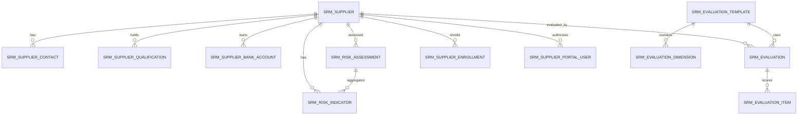

# SRM Supplier Relationship Management

> This document is the single source of truth for the SRM module. AI agents **must** read it before modifying any SRM code.
> Related docs: [architecture.en.md](architecture.en.md) · [api-contract.en.md](api-contract.en.md) · [backend-patterns.en.md](backend-patterns.en.md) · [frontend-patterns.en.md](frontend-patterns.en.md) · [srm.md](srm.md) (中文) · [srm.jp.md](srm.jp.md) (日本語) · [srm.kr.md](srm.kr.md) (한국어)
> Design baseline archive: [design/srm-design.md](design/srm-design.md).

SRM is a standalone microservice (`omni-srm`) covering the full supplier lifecycle management closed loop: supplier registration/admission → review → classification/grading → performance evaluation → risk control → phase-out/elimination. Procurement execution (requisitions, RFQs, purchase orders, goods receipt) and asset disposal are **out of scope** for SRM and will be built in `omni-procurement` and `omni-asset` respectively.

## 1. Service Boundaries

| Item | Value |
|---|---|
| Maven module | `omni-srm` |
| Service port | `8105` |
| Management port | `19905` |
| XXL-JOB executor | `omni-srm` / `9905` |
| Database | `omni_srm` |
| Gateway route | `/api/srm/**` → `lb://omni-srm` (no StripPrefix) |
| Redis | DB 0, shares Auth's XSS config, key prefix `srm:` |

**Depends on**: `omni-common-core`, `omni-common`, `omni-common-mybatis`, `omni-common-redis`, `omni-common-operlog`, `omni-common-job`, `omni-common-mqlog`.

**Do NOT depend on** `omni-common-workflow` — MVP supplier admission review uses a simple state machine, not the Flowable engine.

**Cross-service calls**: Calls Auth internal APIs via OpenFeign + `X-Internal-Token`. SRM only stores userId/unitId and never reads `omni_auth` across databases.

## 2. Domain Model

### 2.1 Aggregates & Tables

| Aggregate | Tables | Responsibility |
|---|---|---|
| Supplier | `srm_supplier`, `srm_supplier_contact`, `srm_supplier_qualification`, `srm_supplier_bank_account` | Supplier master data, contacts, qualifications, bank accounts |
| Evaluation | `srm_evaluation_template`, `srm_evaluation_dimension`, `srm_evaluation`, `srm_evaluation_item` | Evaluation templates, dimensions, records, scoring items |
| Risk | `srm_risk_indicator`, `srm_risk_assessment` | Risk indicators, overall risk assessments |
| Portal | `srm_supplier_invite`, `srm_supplier_enrollment`, `srm_supplier_portal_user` | Enrollment invitations, enrollment records (Saga), portal account associations |



### 2.2 Common Field Rules

Every `srm_*` table must have `tenant_id`. Authorizable business tables additionally require:

- `tenant_id` — tenant isolation
- `owner_user_id` — SELF scope and business owner
- `owner_unit_id` — DEPT/DEPT_AND_BELOW/CUSTOM scope
- `version` — optimistic locking
- `deleted` — soft delete
- `id/create_time/update_time/create_by/update_by` — audit fields

**Key constraints**:

- User/organization IDs are managed by Auth; no cross-database foreign keys; never trust frontend-submitted usernames or ownerUnitId
- `supplier_no` is generated from the database ID, unique within tenant; `SELECT MAX(...) + 1` is forbidden
- `credit_code` (Unified Social Credit Code) is unique within tenant
- Bank account numbers use PII masking; full values are only returned to users with `srm:pii:view`
- All date-time values use `yyyy-MM-dd HH:mm:ss` format
- Plain PUT must not modify owner or lifecycle status directly
- External requests must not use bare `selectById/updateById/deleteById`
- `owner_user_id` represents the internal procurement owner only; portal accounts must be linked via `srm_supplier_portal_user`, never reuse owner fields

### 2.3 Key Table Details

**`srm_supplier`** — Supplier master: `supplier_no/name/normalized_name/supplier_type/industry_code/credit_code/website/phone/email/region/address/category_code/level_code/status/assigned_time/last_evaluation_time`. `level_code` enum: STRATEGIC/PREFERRED/QUALIFIED/ELIMINATED, auto-adjusted by evaluation or set manually. `status` has eight states (see state machine).

**`srm_supplier_contact`** — Contacts: at most one active primary contact per supplier (`primary_flag` + `status` + `deleted` generating a `primary_supplier_guard` unique constraint). Owner is a snapshot of the Supplier's owner; synced in the same transaction during supplier transfer.

**`srm_supplier_qualification`** — Qualifications: `qualification_name/certificate_no/issuing_authority/issue_date/expiry_date/status`. `expiry_date` is used for certificate expiry alerts (≤30 days → YELLOW, expired → RED). MVP does not store file attachments.

**`srm_supplier_bank_account`** — Bank accounts: `account_no` is a PII field. Multiple bank accounts per supplier; one marked as default (same `primary_supplier_guard` unique constraint).

**`srm_supplier_portal_user`** — Portal user association: `tenant_id + user_id` is unique, ensuring one Auth user maps to one supplier per tenant.

**`srm_supplier_enrollment`** — Enrollment record (Saga): `request_id` for idempotency. `status` is PENDING_ROLE_ASSIGN/ROLE_ASSIGN_FAILED/COMPLETED/CANCELLED. `active_user_guard` ensures at most one active enrollment per tenant + userId.

**`srm_supplier_invite`** — Invitations: the original inviteToken is returned only once at creation; the database stores only its SHA-256 hash. Uses `version`-conditional atomic increment of `used_count` to prevent concurrent over-use.

**`srm_evaluation_template`** + **`srm_evaluation_dimension`** — Evaluation templates: MVP provides one default template per tenant (`default_flag=1`) with four preset dimensions: Quality (30%), Delivery (30%), Price (20%), Service (20%). `weight` sum must equal 100.

**`srm_evaluation`** + **`srm_evaluation_item`** — Evaluation records: `score` is 1–5 (`DECIMAL(3,1)`). `total_score` is auto-calculated as a weighted percentage (range 20–100). After evaluation, the supplier level is auto-mapped: ≥90 Strategic, ≥75 Preferred, ≥60 Qualified, <60 Pending Elimination. Evaluation items are append-only; no modification interface is provided.

**`srm_risk_indicator`** — Risk indicators: `indicator_type` enum: FINANCIAL/COMPLIANCE/SUPPLY/COOPERATION/QUALITY/CERTIFICATE. `risk_level` enum: GREEN/YELLOW/RED. The CERTIFICATE indicator auto-calculates from qualification expiry dates.

**`srm_risk_assessment`** — Overall risk assessment: `overall_level` takes the highest level across all indicators (RED > YELLOW > GREEN).

## 3. Security Architecture

### 3.1 Five-Layer Trust Chain

```
Gateway JWT validation → SRM Tenant check → Spring Security @PreAuthorize
→ @SrmDataScope aspect → MyBatis DataPermission interceptor → SrmRecordAccessGuard row-level write authorization
```

1. Gateway verifies RS256 JWT, overwrites and injects `X-User-*`, `X-Tenant-Id`, `X-Gateway-Forwarded`
2. `GatewayPreAuthFilter` builds `Authentication`, validates userId/tenantId
3. Controller `@PreAuthorize` checks functional permissions
4. `@SrmDataScope(permissionCode)` aspect calls Auth internal API to resolve dataScope
5. MyBatis-Plus appends tenant + owner conditions
6. `SrmRecordAccessGuard` validates row-level write authorization

**Fail closed**: missing tenant → 401, missing scope → `id=-1` (zero data visible), Auth unavailable → 503. Never degrades to unfiltered.

### 3.2 MyBatis Interceptor Order

SRM defines its own `mybatisPlusInterceptor` bean; order is fixed and cannot be swapped:

```
TenantLineInnerInterceptor → DataPermissionInterceptor → PaginationInnerInterceptor
```

- TenantLine only processes `srm_*` tables
- `sys_mq_message` is excluded from both permission interceptors (Relay scans all tenants by design)
- DataPermission must come before Pagination so that COUNT and records share the same scope

### 3.3 DataScope Mapping

| dataScope | SQL Condition |
|---|---|
| SELF | `owner_user_id = currentUserId` |
| DEPT | `owner_unit_id = primaryUnitId` |
| DEPT_AND_BELOW / CUSTOM | `owner_unit_id IN accessibleUnitIds` |
| TENANT / ALL | No owner condition; TenantLine always preserved |

Evaluation and risk inherit scope via `supplier_id` linked to Supplier's owner. Template/Dimension is tenant-scoped with functional permission only. Portal users (SUPPLIER role) do not use internal owner dataScope — they must first query `srm_supplier_portal_user` to resolve their associated supplierId; failure to find one results in fail-closed behavior.

### 3.4 Row-Level Write Authorization

DataPermissionInterceptor does not protect writes. Every update/delete/approve/suspend/blacklist command must:

1. Query visible records with `tenant_id + id + data scope` (not visible → 404, preventing ID enumeration)
2. Validate state machine and business invariants
3. Update with `tenant_id + id + version` condition
4. Return conflict when affected rows ≠ 1

### 3.5 Permission Code Reference

| Resource | Permission Codes |
|---|---|
| Overview | `srm:overview:list` |
| Supplier | `srm:supplier:list/create/update/delete/approve/reject/suspend/resume/blacklist/restore/eliminate/transfer` |
| Contact | `srm:contact:list/create/update/delete` |
| Qualification | `srm:qualification:list/create/update/delete` |
| Bank Account | `srm:bank-account:list/create/update/delete` |
| Evaluation | `srm:evaluation:list/create/view` |
| Risk | `srm:risk:list/update/assess` |
| Invite | `srm:invite:list/create/revoke`, `srm:portal:invite` |
| Owner Options | `srm:owner:list` |
| PII View | `srm:pii:view` |
| Portal | `srm:portal:enroll/profile/evaluation` |

The `/` shorthand represents multiple full permission codes under the same resource; each is stored individually in the database. `@PreAuthorize` and `@SrmDataScope` use the same full permission code.

### 3.6 PII Masking

- Full bank account numbers, contact phone numbers, and emails are only returned to users with `srm:pii:view`
- Other users receive masked values from the backend VO directly (e.g., `6222****1234`, `138****1234`, `a***@example.com`); not relying on frontend masking
- Lists are masked by default; detail views depend on permissions
- Portal SUPPLIER role implicitly grants full access to their own data

### 3.7 XSS Defense

SRM implements the `XssConfigProvider` SPI, reading `xss:enabled:{tenantId}` and `xss:rules:{tenantId}` from Redis DB 0. On cache miss, falls back to Auth or uses built-in baseline rules; never disables protection. MVP notes allow plain text only; `v-html` is forbidden on the frontend.

### 3.8 Roles & dataScope

| Role | dataScope | Capability |
|---|---|---|
| `SRM_ADMIN` | TENANT | Full SRM functions/data within the current tenant |
| `PROCUREMENT_MANAGER` | DEPT_AND_BELOW | Department and subordinates, supplier evaluation, risk management |
| `PROCUREMENT_STAFF` | SELF | Own data and routine operations |
| `SUPPLIER` | SELF | Portal self-service: post-enrollment profile maintenance, own performance viewing |
| `SUPER_ADMIN` | ALL | All functions; SRM data still limited to the current tenant |

Default USER role only grants `srm:portal:enroll`; no SRM admin or portal profile/evaluation permissions. Portal profile/evaluation access requires the SUPPLIER role added after enrollment.

## 4. State Machines & Core Flows

### 4.1 Supplier Lifecycle

```
[*] → REGISTERING → PENDING_REVIEW (Auth user and role creation succeeded)
[*] → REGISTERING → REGISTERING_FAILED (Auth creation/role assignment failed)
REGISTERING_FAILED → REGISTERING (backend retry)
[*] → PENDING_REVIEW (admin creation)
PENDING_REVIEW → APPROVED (approved)
PENDING_REVIEW → REJECTED (rejected)
REJECTED → PENDING_REVIEW (resubmit)
APPROVED → SUSPENDED (suspend cooperation)
SUSPENDED → APPROVED (resume cooperation)
APPROVED → BLACKLISTED (add to blacklist)
BLACKLISTED → APPROVED (remove from blacklist, requires srm:supplier:restore)
APPROVED/SUSPENDED → ELIMINATED (phase out)
ELIMINATED → [*] (terminal state, non-recoverable)
```

- Only `APPROVED` suppliers can be referenced by the procurement module
- `BLACKLISTED` requires `srm:supplier:blacklist` permission
- `ELIMINATED` is terminal and non-recoverable
- Admin-created suppliers enter `PENDING_REVIEW` directly
- `REGISTERING/REGISTERING_FAILED` are only used for portal cross-service registration

### 4.2 Performance Evaluation Flow

```
POST /evaluation (supplierId, period, items[])
→ SELECT Supplier FOR UPDATE + tenant/scope
→ Query Template (default)
→ INSERT Evaluation + Items (transactional)
→ Calculate percentage totalScore = SUM(item.score / 5 × item.weight)
→ Map level and UPDATE Supplier.level_code
→ INSERT Outbox event (same transaction)
```

Evaluation is recommended quarterly but not enforced in MVP; initiated manually by administrators. After evaluation, the system automatically:
1. Calculates weighted total score (1–5 normalized to percentage, range 20–100)
2. Maps new supplier level (≥90 Strategic, ≥75 Preferred, ≥60 Qualified, <60 Pending Elimination)
3. Updates `srm_supplier.level_code`
4. Records `last_evaluation_time`

### 4.3 Risk Assessment Flow

```
Manual/automatic risk indicator update
→ Recalculate overall risk level (takes highest level across all indicators)
→ INSERT/UPDATE srm_risk_assessment
→ If level changes to RED, write Outbox event notification
```

Certificate expiry alert logic: `expiry_date - today ≤ 30 days` → CERTIFICATE indicator auto-set to YELLOW; `expiry_date < today` → CERTIFICATE indicator auto-set to RED. Proactive scanning via XXL-JOB scheduled task is planned for Phase 2 (MVP: manual trigger or disabled).

### 4.4 Portal Account Opening & Enrollment

```
POST /api/auth/register (public Auth self-registration, assigns default USER role)
→ Login to obtain JWT
→ POST /api/srm/portal/enroll (authenticated, with inviteToken + company info)
→ INSERT enrollment request and Supplier (status=REGISTERING)
→ INSERT Outbox srm.portal-role.assign-requested.v1
→ Auth consumes Outbox and assigns SUPPLIER role
→ MQ auth.portal-role.assigned.v1 returned
→ SRM consumes: INSERT PortalUser association, Supplier → PENDING_REVIEW
```

Portal account opening and enrollment are separated into two security boundaries:
- Account opening uses only the public `POST /api/auth/register`; SRM never handles passwords
- Enrollment must include a tenant-specific inviteToken; validates tenant, expiry, and usage count
- Unified Social Credit Code (credit_code) is unique within tenant
- Enrollment uses requestId for idempotency; one userId maps to one supplier only
- SRM requests Auth to add SUPPLIER role via Outbox/Saga; role assignment failure keeps enrollment in `REGISTERING_FAILED` — no half-authorized state

## 5. API Endpoint Index

### 5.1 Common Contract

- All responses: `R<T>`; paginated: `R<PageResult<T>>`
- `page=1`, `size=10`, maximum `size=100`
- Entities are not used as Request/Response; state commands use dedicated DTOs
- Date parameters: `@DateTimeFormat(pattern = "yyyy-MM-dd HH:mm:ss")`
- State/approval/evaluation requests carry `version`
- Write endpoints declare both `@PreAuthorize` and `@OperLog`

### 5.2 Endpoint Overview

All endpoints are prefixed with `/api/srm`.

| Domain | Endpoints |
|---|---|
| Overview | `GET /overview/summary`, `/risk-dashboard` |
| Supplier | `GET /supplier/list`, `/{id}`, `/{id}/overview`, `POST /supplier`, `PUT/DELETE /supplier/{id}` |
| Supplier Commands | `POST /supplier/{id}/submit`, `/approve`, `/reject`, `/suspend`, `/resume`, `/blacklist`, `/restore-from-blacklist`, `/eliminate`, `/transfer` |
| Contact | `GET /supplier/{id}/contact/list`, `POST /supplier/{id}/contact`, `PUT/DELETE /contact/{id}` |
| Qualification | `GET /supplier/{id}/qualification/list`, `POST /supplier/{id}/qualification`, `PUT/DELETE /qualification/{id}` |
| Bank Account | `GET /supplier/{id}/bank-account/list`, `POST /supplier/{id}/bank-account`, `PUT/DELETE /bank-account/{id}` |
| Insight | `GET /supplier/{id}/evaluation/history`, `/supplier/{id}/risk` |
| Evaluation | `GET /evaluation/list`, `/{id}`, `POST /evaluation` |
| Risk | `GET /risk/list`, `PUT /risk/indicator/{id}`, `POST /risk/assessment/{supplierId}` |
| Owner Options | `GET /options/owners` |
| Portal Invite | `GET /portal/invite/list`, `POST /portal/invite`, `POST /portal/invite/{id}/revoke` (admin) |
| Portal Enroll | `POST /portal/enroll` (authenticated, with inviteToken) |
| Portal Profile | `GET /portal/profile`, `PUT /portal/profile`, `GET /portal/contacts`, `GET /portal/qualifications`, `GET /portal/bank-accounts` |
| Portal Evaluation | `GET /portal/evaluations`, `GET /portal/evaluations/{id}` |

### 5.3 Supplier 360 Chunked Permissions

`/supplier/{id}/overview` returns contacts, qualifications, bank accounts, evaluation history, and risk profile. Each chunk uses its own list permission to independently resolve data scope; missing a permission means that chunk is not queried. Implementation uses `SrmPermissionScopeExecutor` to establish and clean up scope per chunk.

## 6. Cross-Service Integration

### 6.1 Auth Feign

- SRM only stores userId/unitId; validates user existence, enabled status, and same-tenant via Auth internal API before assignment
- ownerUnitId is taken from Auth's authoritative primary organization; never trusted from frontend
- List display collects IDs first, then makes one batch API call; per-row Feign (N+1) is forbidden
- Auth unavailable: dataScope → 503 fail closed; display enrichment → may return ID/unknown user

### 6.2 Outbox Events

Uses `ReliableMessageRelay.send("srm-domain-out-0", envelope, tenantId, eventId)` to write to the local outbox; tenantId must be passed explicitly.

Event envelopes include `eventId`, `eventType`, `tenantId`, `payload`. Defined events:

- `srm.supplier.registered.v1`
- `srm.supplier.approved.v1`
- `srm.supplier.rejected.v1`
- `srm.supplier.suspended.v1`
- `srm.supplier.blacklisted.v1`
- `srm.supplier.eliminated.v1`
- `srm.portal-role.assign-requested.v1`
- `auth.portal-role.assigned.v1` (published by Auth, consumed by SRM)
- `auth.portal-role.assign-failed.v1` (published by Auth, SRM marks failure)
- `srm.evaluation.completed.v1`
- `srm.risk.level-changed.v1`

Events only carry IDs and status snapshots; no full bank account numbers, contact phones, emails, or inviteTokens. Consumers must be idempotent.

### 6.3 Operation Log

`@OperLog` supports PII desensitization (bank account numbers, contact phones, emails, supplier phones). Enrollment inviteToken is treated as a credential and must never be written to logs.

### 6.4 Internal APIs

SRM pre-provisions the following capabilities for future Procurement/Asset services:
- `GET /api/internal/supplier/{id}?tenantId={tenantId}` — supplier summary
- `GET /api/internal/supplier/search?tenantId={tenantId}&status=APPROVED&categoryCode={code}` — search approved suppliers
- All internal APIs use `X-Internal-Token` authentication; not exposed via Gateway

## 7. Hard Constraints

Rules that must be followed before modifying SRM code:

1. **Tenant isolation**: All `srm_*` tables must have `tenant_id`; TenantLine is always appended; normal APIs never cross tenants
2. **Optimistic locking**: All writes must update with `tenant_id + id + version` condition
3. **Fail closed**: Missing tenant → 401, missing scope → `id=-1`, Auth unavailable → 503, never degrades
4. **ThreadLocal cleanup**: `SrmDataScopeContext` and `SrmTenantContext` must be cleared in `finally` blocks to prevent memory leaks
5. **Dual permission declaration**: Write endpoints must declare both `@PreAuthorize` (functional) and `@SrmDataScope` (data scope) using the same full permission code
6. **Backend PII masking**: Without `srm:pii:view`, backend VO returns masked values directly; not relying on frontend
7. **Explicit Outbox tenantId**: `ReliableMessageRelay.send()` must explicitly pass `Long tenantId`; ThreadLocal implicit resolution is forbidden
8. **Interceptor order**: TenantLine → DataPermission → Pagination; order cannot be swapped
9. **Write authorization**: DataPermissionInterceptor does not protect writes; AccessGuard row-level validation is required
10. **State machine**: Plain PUT must not accept status changes; dedicated command endpoints must be used
11. **MySQL DATETIME range**: `LocalDateTime.MIN/MAX` must not be used as query parameters
12. **Read-only evaluation templates**: MVP templates are created by tenant initialization; no dynamic configuration UI
13. **Portal isolation**: Portal users must be linked via `srm_supplier_portal_user`; internal owner dataScope must not be reused
14. **`sys_mq_message` excluded from permission interceptors**: Relay scans all tenants; user queries still require explicit tenant filtering
15. **Owner vs. portal separation**: `owner_user_id` is the internal procurement owner; portal `user_id` is the supplier login account; mixing is forbidden

## 8. Frontend Structure

```
omni-frontend/src/
├── api/
│   ├── srm-overview.ts          # Overview stats + risk dashboard
│   ├── srm-supplier.ts          # Supplier CRUD + commands + sub-resources
│   ├── srm-evaluation.ts        # Evaluation CRUD
│   ├── srm-risk.ts              # Risk indicators + assessments
│   └── srm-portal.ts            # Portal enrollment/profile/performance
├── views/
│   ├── srm/
│   │   ├── overview/index.vue   # Supplier overview + risk dashboard
│   │   ├── supplier/index.vue   # Supplier management
│   │   ├── evaluation/index.vue # Performance evaluation
│   │   ├── risk/index.vue       # Risk management
│   │   └── invite/index.vue     # Invitation management
│   └── supplier-portal/
│       └── index.vue            # Supplier portal workspace (single page)
└── components/srm/
    ├── SupplierOverview.vue     # Supplier 360 view
    ├── SupplierPicker.vue       # Supplier selector
    ├── SupplierResourcesDrawer.vue  # Supplier sub-resource drawer
    ├── EvaluationScorecard.vue  # Evaluation scorecard
    ├── RiskIndicator.vue        # Risk indicator card
    └── RiskDashboard.vue        # Risk dashboard component
```

- `ApiResponse/PageResult` must only be imported from `src/types/api.ts`
- Buttons use `v-permission` with the same permission code; backend is the final security boundary
- Supplier 360 uses Drawer component
- Risk dashboard uses red/yellow/green traffic-light cards, supporting risk level filtering
- Supplier portal uses role-based routing; SUPPLIER role only sees portal pages

## 9. Extension Guide

### Adding a New Aggregate Root

1. Add table to `omni_srm` database; must include `tenant_id`, `owner_user_id`, `owner_unit_id`, `version`, `deleted`, and audit fields
2. Create Entity (extends SrmOwnedEntity), Mapper, Service interface + Impl, Controller
3. Register new table's owner column mapping in `SrmDataPermissionHandler`
4. Append DDL and permission seed data in `init-all.sql`
5. Controller write endpoints declare `@PreAuthorize` + `@SrmDataScope` with new `srm:<resource>:<action>` permission codes

### Adding Permission Codes

1. Insert new permissions in `sys_permission` in `init-all.sql`, type `API`
2. Assign to roles in `sys_role_permission`
3. Controller method declares `@PreAuthorize("hasAuthority('srm:<resource>:<action>')")` + `@SrmDataScope("srm:<resource>:<action>")`
4. Add `v-permission="'srm:<resource>:<action'"` to the corresponding frontend button

### Integrating Outbox Events

1. In the Service business method, call `ReliableMessageRelay.send("srm-domain-out-0", envelope, tenantId, eventId)` within the same transaction
2. `tenantId` must be explicitly obtained from context; ThreadLocal is forbidden
3. Event envelopes follow the unified format; payload must not contain full PII
4. Consumers must be idempotent, deduplicating by `payload.eventId`

### Procurement Quotation Integration

Portal endpoints:

- `GET /api/srm/portal/quotation/invitations`: lists the RFQ invitations of the current PortalUser and merges the local quotation status.
- `GET /api/srm/portal/quotation/invitations/{rfqId}`: returns the invitation, the RFQ line snapshot and the current quotation.
- `POST /api/srm/portal/quotation`: submits a quotation, or updates it by `version`.

The submit request only accepts `requestId/rfqId/version/validUntil/lines[{rfqLineId,unitPrice,deliveryDays,remark}]`. tenantId, supplierId, supplier name, RFQ number, material, unit, quantity, currency, line amount and total amount are all taken from the trusted identity, the PortalUser and the Procurement invitation detail, or computed server-side.

`srm_quotation.request_id` stores the last successful request. `srm_quotation_request` permanently keeps the request history and the SHA-256 requestHash keyed by `(tenant_id, request_id)`, and links the resulting version through `(tenant_id, quotation_id, target_version)`. `srm_quotation` uses `(tenant_id, rfq_id, active_supplier_guard)` to guarantee that one supplier holds exactly one non-deleted quotation per RFQ. `srm_quotation_line.rfq_line_id` is mandatory, and the submitted line set must match the RFQ snapshot exactly. Amount precision: unit price/quantity `DECIMAL(19,6)` and greater than 0; line amount/total amount `DECIMAL(19,4)` and greater than 0.

The quotation, its lines, `srm_quotation_request` and the `srm.quotation.submitted.v1` Outbox record must be committed in the same transaction. A retry with the same requestId+requestHash returns the current quotation snapshot and must not re-publish the event; a different intent under the same requestId returns 409. The first request uses the creation sentinel `version=0` and the first quotation version starts at `version=1`, so concurrent creation intents cannot mistake the first version for an updatable one. The event payload contains at least `requestId/quotationId/quotationVersion/rfqId/rfqNo/supplierId/status/totalAmount/currencyCode/validUntil`; Procurement consumes it idempotently through the eventId Inbox.

### Supplier Quotation Flow Screenshots (four languages)

The official images are generated on a real running stack by the docs-only Playwright suite `omni-frontend/e2e-docs/flows/srm.flows.spec.ts`, stored per language directory, never reused across languages, and never replaced by placeholders or mocked success responses. The three steps share one real fixture (the same RFQ and the same quotation), so the three images are consecutive states of one business chain rather than unrelated page snapshots.

Common preconditions (identical for all three steps):

| Item | Content |
|---|---|
| Environment | Local Compose full stack, frontend `127.0.0.1:3000`, reaching `omni-procurement` and `omni-srm` through the gateway |
| Data precondition | `admin` creates a unique category and material through official APIs → creates a requisition approval rule bound to the `procurement-approval` process model → creates a requisition and submits it for approval → after approval creates an RFQ and calls `send` (DRAFT→SENT, inviting `supplier1`) |
| Operator | Data setup as `admin` (requires the `SUPER_ADMIN` and `PROCUREMENT_MANAGER` roles plus a `SAME_UNIT` candidate scope); the operator in the captured pages is `supplier1` (the `SUPPLIER` role with an established `srm_supplier_portal_user` association) |
| Token | A short-lived JWT (TTL 1200 seconds) issued inside the test process by `E2eTokenFixture`, living only in process memory and a temporary file outside the repository, destroyed at teardown; never written into docs, logs or version control |
| Mutation switch | Runs only when `E2E_MUTATIONS=true` is set explicitly; otherwise the whole group is skipped and every mutating call throws |
| Viewport | 1440×900, fixed docs clock and disabled animations, identical across the four languages |

On a shared local environment the list may also show other historical RFQ rows; the suite's assertions and capture decisions target only the single RFQ identified by this run's `runStamp`, and teardown only cleans data whose ownership is confirmed for this run.

#### Step 1: Invitation list (not quoted)

- Operator: `supplier1`
- Action: open the supplier portal and switch to the "RFQ Quotations" tab
- Expected state: this run's single RFQ appears in the list with invitation status `INVITED`, the current quotation column shows "Not Quoted", and the action column shows "Submit Quotation"

| zh-CN | en-US |
|---|---|
|  |  |

| ja-JP | ko-KR |
|---|---|
|  |  |

#### Step 2: Quotation form (unit price and validity)

- Operator: `supplier1`
- Action: click "Submit Quotation" on the target row to open the dialog, enter unit price `123.45`, and set the quotation validity to the RFQ deadline
- Expected state: the dialog title carries this run's RFQ number, the line snapshot shows the material code and name, quantity `2`, unit and currency `CNY`, the RFQ status is `SENT`, and both unit price and validity are filled in

| zh-CN | en-US |
|---|---|
|  |  |

| ja-JP | ko-KR |
|---|---|
|  |  |

#### Step 3: Submission success (QUOTED and total amount)

- Operator: `supplier1`
- Action: click "Submit Quotation" in the dialog to submit a real quotation, then click "Refresh RFQs"
- Expected state: the "Quotation submitted" toast appears and the dialog closes; the invitation status turns `QUOTED` asynchronously through the `srm.quotation.submitted.v1` MQ event, the current quotation column shows the total `CNY 246.9` (unit price `123.45` × quantity `2`), and the action column becomes "Edit Quotation"

| zh-CN | en-US |
|---|---|
|  |  |

| ja-JP | ko-KR |
|---|---|
|  |  |

### SRM Administration Page Screenshots (four languages)

Also generated on a real running stack by `omni-frontend/e2e-docs/flows/management.flows.spec.ts`. These are **read-only captures**: no supplier data is created, modified or deleted, so no mutation switch and no data teardown are needed. Preconditions and operator are the same as the previous section (`admin` / `SUPER_ADMIN`, short-lived JWT issued inside the process by `E2eTokenFixture` and destroyed at teardown).

- Action: after login, open the Supplier, Evaluation, Risk, Risk Indicator Config and Invitation pages in turn.
- Expected state: page titles and column labels render in the current language; at capture time the database held one real supplier/evaluation/risk/invitation record each and nine risk indicator configurations.

| Page | zh-CN | en-US | ja-JP | ko-KR |
|---|---|---|---|---|
| Suppliers (lifecycle) |  |  |  |  |
| Evaluations (evaluation) |  |  |  |  |
| Risk management (risk) |  |  |  |  |
| Risk indicator config (risk) |  |  |  |  |
| Invitations (invite) |  |  |  |  |

This group only closes the list/configuration views. It is **not equivalent** to closing `admission-lifecycle` (which needs the full Portal registration Saga and admission approval) or `detail-and-action-states` (which needs detail dialogs and action results); `stable-mobile-flow` is closed by the responsive captures in the next subsection. SRM therefore remains `partial`.

### Supplier Portal Responsive Stability Screenshots (four languages)

Generated on a real running stack by `omni-frontend/e2e-docs/flows/srm-portal-responsive.flows.spec.ts`. **Read-only capture**: it only opens the portal, switches tab and clicks refresh, never submitting or modifying any quotation.

- Preconditions: same as the two previous sections (local Compose full stack, `supplier1` with an established Portal association, short-lived JWT issued inside the process and destroyed at teardown).
- Operator: `supplier1`.
- Action: open the supplier portal at **390×844 (mobile)** and **1024×768 (tablet)** viewports, then switch to the "RFQ Quotations" tab.
- Expected state: the tab is visible and clickable; "Refresh RFQs" and the per-row quotation actions are not squeezed out or obscured at the narrow width; the list collapses columns responsively (mobile keeps only RFQ No. / Title / Action) without overflow.
- Measured result: 8 passed / 0 skipped (four languages × two viewports).

| Viewport | zh-CN | en-US | ja-JP | ko-KR |
|---|---|---|---|---|
| 390×844 mobile |  |  |  |  |
| 1024×768 tablet |  |  |  |  |

At capture time the list showed the environment's pre-existing historical RFQ rows (this batch's quotation data had already been cleaned by ownership); the images keep the real list content as-is and are not padded with fabricated data.

## 10. Testing

SRM module covers the following test suite:

- Supplier state machine: valid/invalid transitions
- Evaluation weighted score calculation correctness (all 1s = 20, all 5s = 100)
- Evaluation auto-level mapping correctness (60/75/90 thresholds)
- Risk overall level takes highest indicator level
- PII masking (bank accounts, contact phones/emails)
- All six dataScope levels for list and aggregation queries
- Cross-tenant read/update/delete all fail
- Missing tenant/scope fails closed
- `tenant_id + id + version` concurrent update conflict
- Portal enrollment idempotency (duplicate credit_code or same userId rejected)
- Expired, revoked, cross-tenant, and concurrent over-use inviteToken all rejected
- SUPPLIER role can only view data for their associated supplier

Run tests:

```bash
cd omni-backend && ./mvnw clean install -pl omni-srm -am
```
