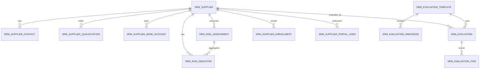

# SRM 공급업체 관계 관리

> 이 문서는 SRM 모듈의 단일 진실 출처(Single Source of Truth)입니다. AI가 SRM 코드를 수정하기 전에 반드시 읽어야 합니다.
> 아키텍처 개요는 [architecture.md](architecture.md), API 계약은 [api-contract.md](api-contract.md), 개발 규범은 [backend-patterns.md](backend-patterns.md) / [frontend-patterns.md](frontend-patterns.md)를 참조하십시오.
> 설계 베이스라인 아카이브는 [design/srm-design.md](design/srm-design.md)를 참조하십시오.

[中文](srm.md) | [English](srm.en.md) | [日本語](srm.jp.md)

SRM은 독립 마이크로서비스 `omni-srm`으로, 공급업체 전체 수명주기 관리 폐쇄 루프를 담당합니다: 공급업체 등록/입점 → 심사 → 등급 분류 → 성과 평가 → 리스크 관리 → 도태/퇴출. 조달 실행(청구, 견적 요청, 발주, 입고)과 자산 처분은 SRM 범위에 포함되지 않으며, 향후 구축될 `omni-procurement`와 `omni-asset`에서 각각 구현됩니다.

## 1. 서비스 경계

| 항목 | 값 |
|---|---|
| Maven 모듈 | `omni-srm` |
| 서비스 포트 | `8105` |
| 관리 포트 | `19905` |
| XXL-JOB 실행기 | `omni-srm` / `9905` |
| 데이터베이스 | `omni_srm` |
| Gateway 라우트 | `/api/srm/**` → `lb://omni-srm`(StripPrefix 사용하지 않음) |
| Redis | DB 0, Auth의 XSS 설정 공유, 키 접두사 `srm:` |

**의존 모듈**: `omni-common-core`, `omni-common`, `omni-common-mybatis`, `omni-common-redis`, `omni-common-operlog`, `omni-common-job`, `omni-common-mqlog`.

**의존 금지**: `omni-common-workflow`를 의존하면 안 됩니다. MVP 단계의 공급업체 입점 심사는 간단한 상태 머신으로 구현하며, Flowable 엔진을 도입하지 않습니다.

**크로스 서비스 호출**: OpenFeign + `X-Internal-Token`을 통해 Auth 내부 API를 호출합니다. SRM은 userId/unitId만 저장하며, `omni_auth` 데이터베이스를 크로스 조회하지 않습니다.

## 2. 도메인 모델

### 2.1 집합체와 테이블

| 집합체 | 테이블 | 책임 |
|---|---|---|
| Supplier | `srm_supplier`, `srm_supplier_contact`, `srm_supplier_qualification`, `srm_supplier_bank_account` | 공급업체 마스터 데이터, 연락처, 자격, 은행 계좌 |
| Evaluation | `srm_evaluation_template`, `srm_evaluation_dimension`, `srm_evaluation`, `srm_evaluation_item` | 평가 템플릿, 평가 차원, 평가 기록, 채점 항목 |
| Risk | `srm_risk_indicator`, `srm_risk_assessment` | 리스크 지표, 종합 리스크 평가 |
| Portal | `srm_supplier_invite`, `srm_supplier_enrollment`, `srm_supplier_portal_user` | 초대, 입점 기록(Saga), 포털 계정 연결 |



### 2.2 공통 필드 규칙

모든 `srm_*` 테이블에 `tenant_id`가 필수입니다. 인가 가능한 비즈니스 테이블에는 추가적으로 다음이 필요합니다:

- `tenant_id` — 테넌트 격리
- `owner_user_id` — SELF 범위 및 업무 담당자
- `owner_unit_id` — DEPT/DEPT_AND_BELOW/CUSTOM 범위
- `version` — 낙관적 잠금
- `deleted` — 논리 삭제
- `id/create_time/update_time/create_by/update_by` — 감사 필드

**주요 제약**:

- 사용자/조직 ID는 Auth가 관리. 크로스 데이터베이스 외부 키 없음, 프론트엔드에서 전송한 사용자명이나 ownerUnitId를 신뢰하지 않음
- `supplier_no`는 데이터베이스 ID에서 생성, 테넌트 내에서 고유. `SELECT MAX(...) + 1` 금지
- `credit_code`(통일사회신용코드)는 테넌트 내에서 고유
- 은행 계좌 번호는 PII 마스킹 사용, 전체 값은 `srm:pii:view`를 가진 사용자에게만 반환
- 일시는 통일 `yyyy-MM-dd HH:mm:ss` 형식
- 일반 PUT으로 owner나 수명주기 status를 직접 변경 불가
- 외부 요청에서 `selectById/updateById/deleteById` 직접 사용 금지
- `owner_user_id`는 내부 조달 담당자만 표시; 포털 계정은 `srm_supplier_portal_user`로 연결, owner 필드 재사용 금지

### 2.3 주요 테이블 상세

**`srm_supplier`** — 공급업체 마스터: `supplier_no/name/normalized_name/supplier_type/industry_code/credit_code/website/phone/email/region/address/category_code/level_code/status/assigned_time/last_evaluation_time`. `level_code` 열거: STRATEGIC/PREFERRED/QUALIFIED/ELIMINATED, 평가에 의해 자동 조정 또는 수동 설정. `status`는 8개 상태(상태 머신 참조).

**`srm_supplier_contact`** — 연락처: 공급업체당 유효한 주요 연락처 최대 1개(`primary_flag` + `status` + `deleted`로 생성된 `primary_supplier_guard` 고유 제약). owner는 Supplier owner의 권한 스냅샷; 공급업체 이전 시 동일 트랜잭션에서 동기화.

**`srm_supplier_qualification`** — 자격: `qualification_name/certificate_no/issuing_authority/issue_date/expiry_date/status`. `expiry_date`는 자격 만료 알림에 사용(30일 이내 → YELLOW, 만료 → RED). MVP에서는 첨부파일을 저장하지 않습니다.

**`srm_supplier_bank_account`** — 은행 계좌: `account_no`는 PII 필드. 공급업체당 여러 은행 계좌 관리 가능; 하나를 기본값으로 표시.

**`srm_supplier_portal_user`** — 포털 사용자 연결: `tenant_id + user_id`가 고유, 하나의 Auth 사용자가 동일 테넌트에서 하나의 공급업체에만 매핑.

**`srm_supplier_enrollment`** — 입점 기록(Saga): `request_id`로 멱등성 확보. `status`는 PENDING_ROLE_ASSIGN/ROLE_ASSIGN_FAILED/COMPLETED/CANCELLED. `active_user_guard`로 동일 tenant + userId의 활성 입점 최대 1개.

**`srm_supplier_invite`** — 초대: 원본 inviteToken은 생성 시 한 번만 반환, 데이터베이스에는 SHA-256 해시만 저장. `version` 조건 원자 증가로 `used_count` 관리, 동시 초과 사용 방지.

**`srm_evaluation_template`** + **`srm_evaluation_dimension`** — 평가 템플릿: MVP에서는 테넌트당 하나의 기본 템플릿(`default_flag=1`)을 제공하며, 4개 사전 설정 차원: 품질(30%), 납기(30%), 가격(20%), 서비스(20%). `weight` 합계는 100.

**`srm_evaluation`** + **`srm_evaluation_item`** — 평가 기록: `score`는 1-5점(`DECIMAL(3,1)`). `total_score`는 가중 백분율로 자동 계산(범위 20-100). 평가 완료 후 공급업체 등급 자동 매핑: ≥90 전략급, ≥75 우선급, ≥60 합격급, <60 도태 후보. 평가 항목은 추가만 가능, 수정 인터페이스 없음.

**`srm_risk_indicator`** — 리스크 지표: `indicator_type` 열거: FINANCIAL/COMPLIANCE/SUPPLY/COOPERATION/QUALITY/CERTIFICATE. `risk_level` 열거: GREEN/YELLOW/RED. CERTIFICATE 지표는 자격 만료일에서 자동 계산.

**`srm_risk_assessment`** — 종합 리스크 평가: `overall_level`은 모든 지표의 최고 등급(RED > YELLOW > GREEN).

## 3. 보안 아키텍처

### 3.1 5계층 신뢰 체인

```
Gateway JWT 검증 → SRM 테넌트 확인 → Spring Security @PreAuthorize
→ @SrmDataScope 애스펙트 → MyBatis DataPermission 인터셉터 → SrmRecordAccessGuard 행 수준 쓰기 인가
```

1. Gateway가 RS256 JWT 검증, `X-User-*`, `X-Tenant-Id`, `X-Gateway-Forwarded` 덮어쓰기 주입
2. `GatewayPreAuthFilter`가 `Authentication` 구축, userId/tenantId 검증
3. Controller `@PreAuthorize`로 기능 권한 검증
4. `@SrmDataScope(permissionCode)` 애스펙트가 Auth 내부 API를 호출하여 dataScope 해결
5. MyBatis-Plus가 tenant + owner 조건 추가
6. `SrmRecordAccessGuard`가 행 수준 쓰기 인가 검증

**실패 시 닫힘**: tenant 누락 → 401, scope 누락 → `id=-1`(데이터 표시 없음), Auth 사용 불가 → 503. 절대 무필터링으로 저하되지 않음.

### 3.2 MyBatis 인터셉터 순서

SRM은 자체 `mybatisPlusInterceptor` Bean을 정의; 순서는 고정이며 변경 불가:

```
TenantLineInnerInterceptor → DataPermissionInterceptor → PaginationInnerInterceptor
```

- TenantLine은 `srm_*` 테이블만 처리
- `sys_mq_message`는 두 권한 인터셉터에서 제외(Relay는 설계상 모든 테넌트 스캔)
- DataPermission은 Pagination 앞에 배치, COUNT와 레코드가 동일한 범위 공유

### 3.3 DataScope 매핑

| dataScope | SQL 조건 |
|---|---|
| SELF | `owner_user_id = currentUserId` |
| DEPT | `owner_unit_id = primaryUnitId` |
| DEPT_AND_BELOW / CUSTOM | `owner_unit_id IN accessibleUnitIds` |
| TENANT / ALL | owner 조건 없음, TenantLine 항상 유지 |

평가와 리스크는 `supplier_id`를 통해 Supplier의 owner로 범위 상속. Template/Dimension은 테넌트 범위 + 기능 권한만. 포털 사용자(SUPPLIER 역할)는 내부 owner dataScope를 사용하지 않으며, `srm_supplier_portal_user`에서 supplierId를 해결, 찾지 못하면 실패 시 닫힘.

### 3.4 행 수준 쓰기 인가

DataPermissionInterceptor는 쓰기를 보호하지 않습니다. 모든 업데이트/삭제/승인/동결/블랙리스트 명령은 다음이 필수:

1. `tenant_id + id + data scope`로 가시 레코드 조회(비가시 → 404, ID 열거 방지)
2. 상태 머신 및 비즈니스 불변량 검증
3. `tenant_id + id + version` 조건으로 업데이트
4. 영향 행 수 ≠ 1인 경우 충돌 반환

### 3.5 권한 코드 목록

| 리소스 | 권한 코드 |
|---|---|
| Overview | `srm:overview:list` |
| Supplier | `srm:supplier:list/create/update/delete/approve/reject/suspend/resume/blacklist/restore/eliminate/transfer` |
| Contact | `srm:contact:list/create/update/delete` |
| Qualification | `srm:qualification:list/create/update/delete` |
| Bank Account | `srm:bank-account:list/create/update/delete` |
| Evaluation | `srm:evaluation:list/create/view` |
| Risk | `srm:risk:list/update/assess` |
| Invite | `srm:invite:list/create/revoke`, `srm:portal:invite` |
| Owner 후보 | `srm:owner:list` |
| PII 조회 | `srm:pii:view` |
| Portal | `srm:portal:enroll/profile/evaluation` |

`/`는 동일 리소스 내 여러 완전한 권한 코드의 약어; 데이터베이스에는 개별 저장. `@PreAuthorize`와 `@SrmDataScope`는 동일한 완전한 권한 코드 사용.

### 3.6 PII 마스킹

- 전체 은행 계좌 번호, 연락처 전화번호, 이메일은 `srm:pii:view`를 가진 사용자에게만 반환
- 기타 사용자에게는 백엔드 VO가 마스크 값을 직접 반환(`6222****1234`, `138****1234`, `a***@example.com`); 프론트엔드에 의존하지 않음
- 목록은 기본적으로 마스크; 상세는 권한에 따라 결정
- 포털 SUPPLIER 역할은 자체 데이터에 대한 전체 접근을 암묵적으로 허가

### 3.7 XSS 방어

SRM은 `XssConfigProvider` SPI를 구현하여 Redis DB 0의 `xss:enabled:{tenantId}`와 `xss:rules:{tenantId}`를 읽습니다. 캐시 미스 시 Auth에 폴백 또는 내장 기본 규칙 사용; 보호를 비활성화하지 않음. MVP 비고는 일반 텍스트만 허용, 프론트엔드에서 `v-html` 금지.

### 3.8 역할과 dataScope

| 역할 | dataScope | 능력 |
|---|---|---|
| `SRM_ADMIN` | TENANT | 현재 테넌트의 모든 SRM 기능/데이터 |
| `PROCUREMENT_MANAGER` | DEPT_AND_BELOW | 부서 및 하위, 공급업체 평가, 리스크 관리 |
| `PROCUREMENT_STAFF` | SELF | 자체 데이터 및 일상 업무 |
| `SUPPLIER` | SELF | 포털 셀프 서비스: 입점 후 기업 정보 관리, 자체 성과 조회 |
| `SUPER_ADMIN` | ALL | 모든 기능, SRM 데이터는 현재 테넌트에 한정 |

기본 USER 역할은 `srm:portal:enroll`만 부여; SRM 관리 또는 포털 자료/성과 권한 없음. 입점 완료 후 SUPPLIER 역할을 추가해야 profile/evaluation 접근 가능.

## 4. 상태 머신 및 핵심 흐름

### 4.1 공급업체 수명주기

```
[*] → REGISTERING → PENDING_REVIEW(Auth 사용자와 역할 생성 성공)
[*] → REGISTERING → REGISTERING_FAILED(Auth 생성/역할 할당 실패)
REGISTERING_FAILED → REGISTERING(백엔드 재시도)
[*] → PENDING_REVIEW(관리자 생성)
PENDING_REVIEW → APPROVED(승인)
PENDING_REVIEW → REJECTED(반려)
REJECTED → PENDING_REVIEW(재제출)
APPROVED → SUSPENDED(협력 중단)
SUSPENDED → APPROVED(협력 재개)
APPROVED → BLACKLISTED(블랙리스트 추가)
BLACKLISTED → APPROVED(블랙리스트 해제, srm:supplier:restore 필요)
APPROVED/SUSPENDED → ELIMINATED(도태 퇴출)
ELIMINATED → [*](종단 상태, 복구 불가)
```

- `APPROVED` 상태의 공급업체만 조달 모듈에서 참조 가능
- `BLACKLISTED`는 `srm:supplier:blacklist` 권한 필요
- `ELIMINATED`는 종단 상태이며 복구 불가
- 관리자 생성 공급업체는 직접 `PENDING_REVIEW`로 진입
- `REGISTERING/REGISTERING_FAILED`는 포털 크로스 서비스 등록 전용

### 4.2 성과 평가 흐름

```
POST /evaluation (supplierId, period, items[])
→ SELECT Supplier FOR UPDATE + tenant/scope
→ Query Template (default)
→ INSERT Evaluation + Items(트랜잭션 내)
→ 백분율 totalScore = SUM(item.score / 5 × item.weight) 계산
→ 등급 매핑 후 Supplier.level_code UPDATE
→ INSERT Outbox event(동일 트랜잭션)
```

평가는 분기별을 권장하지만 MVP에서는 강제하지 않으며, 관리자가 수동으로 시작합니다. 평가 완료 후 시스템은 자동으로:
1. 가중 총점 계산(1-5점을 백분율로 정규화, 범위 20-100)
2. 새 공급업체 등급 매핑(≥90 전략급, ≥75 우선급, ≥60 합격급, <60 도태 후보)
3. `srm_supplier.level_code` 업데이트
4. `last_evaluation_time` 기록

### 4.3 리스크 평가 흐름

```
수동/자동 리스크 지표 업데이트
→ 종합 리스크 레벨 재계산(모든 지표의 최고 레벨)
→ INSERT/UPDATE srm_risk_assessment
→ 레벨이 RED로 변경 시 Outbox 이벤트 알림 작성
```

자격 만료 알림 로직: `expiry_date - today ≤ 30일` → CERTIFICATE 지표 자동 YELLOW; `expiry_date < today` → CERTIFICATE 지표 자동 RED. XXL-JOB 정기 작업을 통한 사전 스캔은 Phase 2에서 활성화 예정(MVP: 수동 트리거 또는 비활성).

### 4.4 포털 계좌 개설 및 입점

```
POST /api/auth/register(공개 Auth 자체 등록, 기본 USER 역할 할당)
→ 로그인하여 JWT 획득
→ POST /api/srm/portal/enroll(인증됨, inviteToken + 기업 정보)
→ INSERT 입점 신청과 Supplier (status=REGISTERING)
→ INSERT Outbox srm.portal-role.assign-requested.v1
→ Auth가 Outbox 소비 후 SUPPLIER 역할 할당
→ MQ auth.portal-role.assigned.v1 반환
→ SRM 소비: INSERT PortalUser 연결, Supplier → PENDING_REVIEW
```

포털 계좌 개설과 입점은 두 개의 보안 경계로 분리:
- 계좌 개설은 공개 `POST /api/auth/register`만 사용; SRM은 비밀번호를 다루지 않음
- 입점에는 테넌트 고유 inviteToken이 필수; 테넌트, 유효 기간, 사용 횟수 확인
- 통일사회신용코드(credit_code)는 테넌트 내에서 고유
- 입점은 requestId로 멱등성 확보; 하나의 userId는 하나의 공급업체에만 매핑
- SRM은 Outbox/Saga로 Auth에 기존 USER 계정에 SUPPLIER 역할 추가 요청; 역할 할당 실패 시 `REGISTERING_FAILED` 유지

## 5. API 엔드포인트 인덱스

### 5.1 공통 계약

- 모든 응답: `R<T>`, 페이지네이션: `R<PageResult<T>>`
- `page=1`, `size=10`, 최대 `size=100`
- Entity는 Request/Response로 사용하지 않음; 상태 명령은 전용 DTO 사용
- 날짜 파라미터: `@DateTimeFormat(pattern = "yyyy-MM-dd HH:mm:ss")`
- 상태/승인/평가 요청은 `version` 포함
- 쓰기 엔드포인트는 `@PreAuthorize`와 `@OperLog` 모두 선언

### 5.2 엔드포인트 목록

모든 엔드포인트는 `/api/srm` 접두사 사용.

| 도메인 | 엔드포인트 |
|---|---|
| Overview | `GET /overview/summary`, `/risk-dashboard` |
| Supplier | `GET /supplier/list`, `/{id}`, `/{id}/overview`, `POST /supplier`, `PUT/DELETE /supplier/{id}` |
| Supplier 명령 | `POST /supplier/{id}/submit`, `/approve`, `/reject`, `/suspend`, `/resume`, `/blacklist`, `/restore-from-blacklist`, `/eliminate`, `/transfer` |
| Contact | `GET /supplier/{id}/contact/list`, `POST /supplier/{id}/contact`, `PUT/DELETE /contact/{id}` |
| Qualification | `GET /supplier/{id}/qualification/list`, `POST /supplier/{id}/qualification`, `PUT/DELETE /qualification/{id}` |
| Bank Account | `GET /supplier/{id}/bank-account/list`, `POST /supplier/{id}/bank-account`, `PUT/DELETE /bank-account/{id}` |
| Insight | `GET /supplier/{id}/evaluation/history`, `/supplier/{id}/risk` |
| Evaluation | `GET /evaluation/list`, `/{id}`, `POST /evaluation` |
| Risk | `GET /risk/list`, `PUT /risk/indicator/{id}`, `POST /risk/assessment/{supplierId}` |
| Owner 옵션 | `GET /options/owners` |
| Portal 초대 | `GET /portal/invite/list`, `POST /portal/invite`, `POST /portal/invite/{id}/revoke`(관리측) |
| Portal 입점 | `POST /portal/enroll`(인증됨, inviteToken 포함) |
| Portal 기업 정보 | `GET /portal/profile`, `PUT /portal/profile`, `GET /portal/contacts`, `GET /portal/qualifications`, `GET /portal/bank-accounts` |
| Portal 성과 | `GET /portal/evaluations`, `GET /portal/evaluations/{id}` |

### 5.3 공급업체 360 청크 권한

`/supplier/{id}/overview`는 연락처, 자격, 은행 계좌, 평가 이력, 리스크 개요를 반환. 각 청크는 해당 list 권한으로 독립적으로 데이터 범위 해결; 권한 누락 시 해당 청크 조회 안 함. 구현은 `SrmPermissionScopeExecutor`로 청크별 범위 설정 및 정리.

## 6. 크로스 서비스 통합

### 6.1 Auth Feign

- SRM은 userId/unitId만 저장; 할당 전 Auth 내부 API로 사용자 존재, 활성화, 동일 테넌트 검증
- ownerUnitId는 Auth의 권위 있는 주 조직에서 가져옴; 프론트엔드 신뢰 안 함
- 목록 표시는 ID 수집 후 1회 배치 API 호출; 행별 Feign(N+1) 금지
- Auth 사용 불가 시: dataScope → 503 실패 시 닫힘; 표시 보강 → ID/알 수 없는 사용자 반환 가능

### 6.2 Outbox 이벤트

`ReliableMessageRelay.send("srm-domain-out-0", envelope, tenantId, eventId)`로 로컬 Outbox에 작성; tenantId는 명시적으로 전달해야 함.

이벤트 봉투는 `eventId`, `eventType`, `tenantId`, `payload`를 포함. 정의된 이벤트:

- `srm.supplier.registered.v1`
- `srm.supplier.approved.v1`
- `srm.supplier.rejected.v1`
- `srm.supplier.suspended.v1`
- `srm.supplier.blacklisted.v1`
- `srm.supplier.eliminated.v1`
- `srm.portal-role.assign-requested.v1`
- `auth.portal-role.assigned.v1`(Auth 발행, SRM 소비)
- `auth.portal-role.assign-failed.v1`(Auth 발행, SRM 실패 표시)
- `srm.evaluation.completed.v1`
- `srm.risk.level-changed.v1`

이벤트는 ID와 상태 스냅샷만 전달; 전체 은행 계좌 번호, 연락처 전화, 이메일, inviteToken은 포함하지 않음. 소비자는 멱등이어야 함.

### 6.3 운영 로그

`@OperLog`는 PII 비식별화를 지원(은행 계좌 번호, 연락처 전화, 이메일, 공급업체 전화). 입점 초대 inviteToken은 자격 증명으로 취급, 로그 작성 금지.

### 6.4 내부 API

SRM은 향후 Procurement/Asset 서비스를 위해 다음 기능을 사전 준비:
- `GET /api/internal/supplier/{id}?tenantId={tenantId}` — 공급업체 요약
- `GET /api/internal/supplier/search?tenantId={tenantId}&status=APPROVED&categoryCode={code}` — 승인된 공급업체 검색
- 모든 내부 API는 `X-Internal-Token` 인증 사용; Gateway를 통해 노출하지 않음

## 7. 하드 제약

SRM 코드를 수정하기 전에 반드시 준수해야 할 규칙:

1. **테넌트 격리**: 모든 `srm_*` 테이블에 `tenant_id` 필수; TenantLine은 항상 추가; 일반 API는 크로스 테넌트 불가
2. **낙관적 잠금**: 모든 쓰기는 `tenant_id + id + version` 조건으로 업데이트
3. **실패 시 닫힘**: tenant 누락 → 401, scope 누락 → `id=-1`, Auth 불가용 → 503, 절대 저하 안 됨
4. **ThreadLocal 정리**: `SrmDataScopeContext`와 `SrmTenantContext`는 `finally` 블록에서 반드시 클리어, 메모리 누수 방지
5. **권한 이중 선언**: 쓰기 엔드포인트는 `@PreAuthorize`(기능 권한)와 `@SrmDataScope`(데이터 범위) 모두 동일한 완전한 권한 코드로 선언
6. **백엔드 PII 마스킹**: `srm:pii:view` 없이 백엔드 VO는 마스크 값을 직접 반환; 프론트엔드에 의존 안 함
7. **명시적 Outbox tenantId**: `ReliableMessageRelay.send()`는 `Long tenantId`를 명시적으로 전달; ThreadLocal 암시적 해결 금지
8. **인터셉터 순서**: TenantLine → DataPermission → Pagination, 변경 불가
9. **쓰기 인가**: DataPermissionInterceptor는 쓰기를 보호하지 않음; AccessGuard 행 수준 검증 필수
10. **상태 머신**: 일반 PUT은 status 변경을 받지 않음; 전용 명령 엔드포인트 사용
11. **MySQL DATETIME 범위**: `LocalDateTime.MIN/MAX`를 쿼리 파라미터로 사용 불가
12. **평가 템플릿 읽기 전용**: MVP 템플릿은 테넌트 초기화에서 자동 생성; 동적 설정 UI 없음
13. **포털 격리**: 포털 사용자는 `srm_supplier_portal_user`로 연결; 내부 owner dataScope 재사용 금지
14. **`sys_mq_message` 권한 인터셉터 제외**: Relay는 모든 테넌트 스캔; 사용자 쿼리는 여전히 명시적 테넌트 필터링 필요
15. **owner와 포털 분리**: `owner_user_id`는 내부 조달 담당자; 포털 `user_id`는 공급업체 로그인 계정; 혼용 금지

## 8. 프론트엔드 구조

```
omni-frontend/src/
├── api/
│   ├── srm-overview.ts          # 개요 통계 + 리스크 대시보드
│   ├── srm-supplier.ts          # 공급업체 CRUD + 명령 + 하위 리소스
│   ├── srm-evaluation.ts        # 평가 CRUD
│   ├── srm-risk.ts              # 리스크 지표 + 평가
│   └── srm-portal.ts            # 포털 입점/자료/성과
├── views/
│   ├── srm/
│   │   ├── overview/index.vue   # 공급업체 개요 + 리스크 대시보드
│   │   ├── supplier/index.vue   # 공급업체 관리
│   │   ├── evaluation/index.vue # 성과 평가
│   │   ├── risk/index.vue       # 리스크 관리
│   │   └── invite/index.vue     # 초대 관리
│   └── supplier-portal/
│       └── index.vue            # 공급업체 포털 워크스페이스(단일 페이지)
└── components/srm/
    ├── SupplierOverview.vue     # 공급업체 360 뷰
    ├── SupplierPicker.vue       # 공급업체 선택기
    ├── SupplierResourcesDrawer.vue  # 공급업체 하위 리소스 드로어
    ├── EvaluationScorecard.vue  # 평가 스코어카드
    ├── RiskIndicator.vue        # 리스크 지표 카드
    └── RiskDashboard.vue        # 리스크 대시보드 컴포넌트
```

- `ApiResponse/PageResult`는 `src/types/api.ts`에서만 가져오기
- 버튼은 `v-permission`으로 동일 코드 사용; 백엔드가 최종 보안 경계
- 공급업체 360은 Drawer 컴포넌트 사용
- 리스크 대시보드는 빨강/노랑/초록 신호등 카드 사용, 리스크 레벨별 필터링 지원
- 공급업체 포털은 역할 기반 라우팅; SUPPLIER 역할은 포털 페이지만 표시

## 9. 확장 가이드

### 새 집합체 추가

1. `omni_srm` 데이터베이스에 테이블 추가; `tenant_id`, `owner_user_id`, `owner_unit_id`, `version`, `deleted`, 감사 필드 필수
2. Entity(SrmOwnedEntity 상속), Mapper, Service 인터페이스 + Impl, Controller 생성
3. `SrmDataPermissionHandler`에 새 테이블의 owner 열 매핑 등록
4. `init-all.sql`에 DDL과 권한 시드 데이터 추가
5. Controller 쓰기 엔드포인트에 `@PreAuthorize` + `@SrmDataScope` 선언, 새 `srm:<resource>:<action>` 권한 코드 사용

### 권한 코드 추가

1. `init-all.sql`의 `sys_permission`에 새 권한 삽입, type은 `API`
2. `sys_role_permission`에서 역할에 할당
3. Controller 메서드에 `@PreAuthorize("hasAuthority('srm:<resource>:<action>')")` + `@SrmDataScope("srm:<resource>:<action>")` 선언
4. 프론트엔드 해당 버튼에 `v-permission="'srm:<resource>:<action'"` 추가

### Outbox 이벤트 통합

1. Service 비즈니스 메서드에서 동일 트랜잭션 내 `ReliableMessageRelay.send("srm-domain-out-0", envelope, tenantId, eventId)` 호출
2. `tenantId`는 컨텍스트에서 명시적으로 획득; ThreadLocal 금지
3. 이벤트 봉투는 통일 형식 준수; payload에 전체 PII 포함 안 함
4. 소비자는 `payload.eventId`로 중복 제거하여 멱등이어야 함

### Procurement 견적 통합

포털 엔드포인트:

- `GET /api/srm/portal/quotation/invitations`: 현재 PortalUser의 RFQ 초대를 목록하고 로컬 견적 상태를 병합.
- `GET /api/srm/portal/quotation/invitations/{rfqId}`: 초대, RFQ 행 스냅숏과 현재 견적 반환.
- `POST /api/srm/portal/quotation`: 견적을 제출하거나 `version`으로 업데이트.

제출 요청은 `requestId/rfqId/version/validUntil/lines[{rfqLineId,unitPrice,deliveryDays,remark}]` 만 허용. tenantId, supplierId, 공급업체명, RFQ 번호, 자재, 단위, 수량, 통화, 행 금액과 총액은 모두 신뢰할 수 있는 신원 정보·PortalUser·Procurement 초대 상세에서 획득하거나 서버측에서 계산.

`srm_quotation.request_id` 는 마지막 성공 요청을 저장하고, `srm_quotation_request` 는 `(tenant_id, request_id)` 로 요청 이력과 SHA-256 requestHash 를 영구 보존하며 `(tenant_id, quotation_id, target_version)` 으로 결과 버전을 연관. `srm_quotation` 은 `(tenant_id, rfq_id, active_supplier_guard)` 로 동일 공급업체가 동일 RFQ 에 대해 미삭제 견적을 딱 1 건만 갖도록 보장. `srm_quotation_line.rfq_line_id` 는 필수이며 제출 행 집합은 RFQ 스냅숏과 완전히 일치해야 함. 금액 정밀도: 단가/수량 `DECIMAL(19,6)` 이고 0 보다 큼, 행 금액/총액 `DECIMAL(19,4)` 이고 0 보다 큼.

견적, 명세, `srm_quotation_request` 와 `srm.quotation.submitted.v1` Outbox 는 반드시 동일 트랜잭션으로 커밋; 동일 requestId+requestHash 재시도는 현재 견적 스냅숏을 반환하고 이벤트를 중복 발행하면 안 됨, 동일 requestId 에 다른 의도는 409 반환. 첫 요청은 생성 센티널 `version=0` 을 사용하고 첫 버전 견적은 `version=1` 부터 시작하여, 동시 생성 의도가 첫 버전을 업데이트 가능 버전으로 오인하는 것을 방지. 이벤트 payload 에는 최소한 `requestId/quotationId/quotationVersion/rfqId/rfqNo/supplierId/status/totalAmount/currencyCode/validUntil` 를 포함하며, Procurement 은 eventId Inbox 로 멱등 소비.

## 10. 테스트

SRM 모듈은 다음 테스트 스위트를 커버:

- 공급업체 상태 머신: 유효/무효 전이
- 평가 가중 총점 계산 정확성(모두 1=20, 모두 5=100)
- 평가 자동 등급 매핑 정확성(60/75/90 임계값)
- 리스크 종합 레벨은 최고 지표 레벨
- PII 마스킹(은행 계좌, 연락처 전화/이메일)
- 6종 dataScope의 목록과 집계
- 크로스 테넌트 읽기/수정/삭제 모두 실패
- tenant/scope 누락 시 실패 시 닫힘
- `tenant_id + id + version` 동시 업데이트 충돌
- 포털 입점 멱등성(중복 credit_code 또는 동일 userId 거부)
- 만료, 무효화, 크로스 테넌트, 동시 초과 사용 inviteToken 모두 거부
- SUPPLIER 역할은 연결된 공급업체의 데이터만 조회 가능

테스트 실행:

```bash
cd omni-backend && ./mvnw clean install -pl omni-srm -am
```
