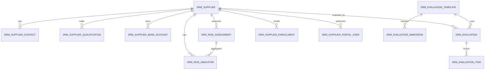

# SRM 供应商关系管理

> 本文档是 SRM 模块的系统真相，AI 修改 SRM 代码前必须先读。
> 架构总览见 [architecture.md](architecture.md)，API 契约见 [api-contract.md](api-contract.md)，开发规范见 [backend-patterns.md](backend-patterns.md) / [frontend-patterns.md](frontend-patterns.md)。
> 设计基线存档见 [design/srm-design.md](design/srm-design.md)。

[English](srm.en.md) | [日本語](srm.jp.md) | [한국어](srm.kr.md)

SRM 是独立微服务 `omni-srm`，覆盖供应商全生命周期管理闭环：供应商注册/准入 → 审核 → 分级分类 → 绩效评估 → 风险管控 → 淘汰退出。采购执行（请购、询价、订单、收货）和资产处置不在 SRM 范围内，分别在后续建设的 `omni-procurement` 和 `omni-asset` 中实现。

## 1. 服务边界

| 项目 | 值 |
|---|---|
| Maven 模块 | `omni-srm` |
| 服务端口 | `8105` |
| 管理端口 | `19905` |
| XXL-JOB 执行器 | `omni-srm` / `9905` |
| 数据库 | `omni_srm` |
| Gateway 路由 | `/api/srm/**` → `lb://omni-srm`（不使用 StripPrefix） |
| Redis | DB 0，共享 Auth 的 XSS 配置，键前缀 `srm:` |

**依赖模块**：`omni-common-core`、`omni-common`、`omni-common-mybatis`、`omni-common-redis`、`omni-common-operlog`、`omni-common-job`、`omni-common-mqlog`。

**不要依赖** `omni-common-workflow`，MVP 阶段的供应商准入审核用简单状态机实现，不引入 Flowable 引擎。

**跨服务调用**：通过 OpenFeign + `X-Internal-Token` 调用 Auth 内部 API，SRM 只存 userId/unitId，不跨库读取 `omni_auth`。

## 2. 领域模型

### 2.1 聚合与表

| 聚合 | 表 | 职责 |
|---|---|---|
| Supplier | `srm_supplier`、`srm_supplier_contact`、`srm_supplier_qualification`、`srm_supplier_bank_account` | 供应商主数据、联系人、资质、银行账户 |
| Evaluation | `srm_evaluation_template`、`srm_evaluation_dimension`、`srm_evaluation`、`srm_evaluation_item` | 评估模板、评估维度、评估记录、评分明细 |
| Risk | `srm_risk_indicator`、`srm_risk_assessment` | 风险指标、综合风险评估 |
| Portal | `srm_supplier_invite`、`srm_supplier_enrollment`、`srm_supplier_portal_user` | 入驻邀请、入驻记录（Saga）、门户账号关联 |



### 2.2 通用字段规则

每张 `srm_*` 表都必须有 `tenant_id`。可授权业务表还必须有：

- `tenant_id` — 租户隔离
- `owner_user_id` — SELF 范围和业务负责人
- `owner_unit_id` — DEPT/DEPT_AND_BELOW/CUSTOM 范围
- `version` — 乐观锁
- `deleted` — 逻辑删除
- `id/create_time/update_time/create_by/update_by` — 审计字段

**关键约束**：

- 用户/组织 ID 由 Auth 管理，不建跨库外键，不信任前端提交的用户名或 ownerUnitId
- `supplier_no` 由数据库 ID 生成，tenant 内唯一，禁止 `SELECT MAX(...) + 1`
- `credit_code`（统一社会信用代码）在 tenant 内唯一
- 银行账户账号使用 PII 掩码，完整值只返回给 `srm:pii:view`
- 时间统一 `yyyy-MM-dd HH:mm:ss`
- 普通 PUT 不允许直接修改 owner 或生命周期 status
- 外部请求不得使用裸 `selectById/updateById/deleteById`
- `owner_user_id` 只表示内部采购负责人；门户账号必须通过 `srm_supplier_portal_user` 关联，禁止复用 owner 字段

### 2.3 主要表说明

**`srm_supplier`** — 供应商主表：`supplier_no/name/normalized_name/supplier_type/industry_code/credit_code/website/phone/email/region/address/category_code/level_code/status/assigned_time/last_evaluation_time`。`level_code` 枚举：STRATEGIC/PREFERRED/QUALIFIED/ELIMINATED，由评估自动调整或手动设置。`status` 八状态见状态机。

**`srm_supplier_contact`** — 联系人：每个供应商最多一个有效主要联系人（`primary_flag` + `status` + `deleted` 生成的 `primary_supplier_guard` 唯一约束）。owner 是 Supplier owner 的权限快照，供应商转移时同一事务同步。

**`srm_supplier_qualification`** — 资质：`qualification_name/certificate_no/issuing_authority/issue_date/expiry_date/status`。`expiry_date` 用于资质到期预警（30 天内到期标黄，已过期标红）。MVP 不存储附件。

**`srm_supplier_bank_account`** — 银行账户：`account_no` 是 PII 字段。每个供应商可维护多个银行账户，标记一个为默认（同样使用 `primary_supplier_guard` 唯一约束）。

**`srm_supplier_portal_user`** — 门户用户关联：`tenant_id + user_id` 唯一，确保一个 Auth 用户在同一租户只关联一个供应商主体。

**`srm_supplier_enrollment`** — 入驻记录（Saga）：`request_id` 幂等，`status` 为 PENDING_ROLE_ASSIGN/ROLE_ASSIGN_FAILED/COMPLETED/CANCELLED。`active_user_guard` 保证同一 tenant + userId 同时最多一个活动入驻申请。

**`srm_supplier_invite`** — 邀请：原始 inviteToken 只在创建时返回一次，数据库仅保存 SHA-256 摘要。使用 `version` 条件原子递增 `used_count`，防止并发超用。

**`srm_evaluation_template`** + **`srm_evaluation_dimension`** — 评估模板：MVP 每个租户一套默认模板（`default_flag=1`），预设四个维度：质量（30%）、交期（30%）、价格（20%）、服务（20%）。`weight` 之和必须等于 100。

**`srm_evaluation`** + **`srm_evaluation_item`** — 评估记录：`score` 为 1-5 分（`DECIMAL(3,1)`），`total_score` 由系统自动加权百分制汇总（20-100 分）。评估完成后自动映射供应商等级：≥90 战略级、≥75 优选级、≥60 合格级、<60 待淘汰。评估项只追加，不提供修改接口。

**`srm_risk_indicator`** — 风险指标：`indicator_type` 枚举 FINANCIAL/COMPLIANCE/SUPPLY/COOPERATION/QUALITY/CERTIFICATE，`risk_level` 枚举 GREEN/YELLOW/RED。资质到期日距今天数自动计算 CERTIFICATE 指标。

**`srm_risk_assessment`** — 综合风险评估：`overall_level` 取各指标最高等级（RED > YELLOW > GREEN）。

## 3. 安全架构

### 3.1 五层信任链

```
Gateway JWT 验证 → SRM Tenant 校验 → Spring Security @PreAuthorize
→ @SrmDataScope 切面 → MyBatis DataPermission 拦截器 → SrmRecordAccessGuard 行级写授权
```

1. Gateway 验证 RS256 JWT，覆盖注入 `X-User-*`、`X-Tenant-Id`、`X-Gateway-Forwarded`
2. `GatewayPreAuthFilter` 构建 `Authentication`，校验 userId/tenantId
3. Controller `@PreAuthorize` 验证功能权限
4. `@SrmDataScope(permissionCode)` 切面调 Auth 内部 API 解析 dataScope
5. MyBatis-Plus 追加 tenant + owner 条件
6. `SrmRecordAccessGuard` 校验写操作行级授权

**失败关闭**：缺 tenant → 401，缺 scope → `id=-1`（零数据可见），Auth 不可用 → 503。绝不降级为无过滤。

### 3.2 MyBatis 拦截器顺序

SRM 自定义同名 `mybatisPlusInterceptor`，顺序固定不可调换：

```
TenantLineInnerInterceptor → DataPermissionInterceptor → PaginationInnerInterceptor
```

- TenantLine 只处理 `srm_*` 表
- `sys_mq_message` 排除两个权限拦截器（Relay 按设计扫描所有租户）
- DataPermission 必须在 Pagination 前，保证 COUNT 和 records 同范围

### 3.3 DataScope 映射

| dataScope | SQL 条件 |
|---|---|
| SELF | `owner_user_id = currentUserId` |
| DEPT | `owner_unit_id = primaryUnitId` |
| DEPT_AND_BELOW / CUSTOM | `owner_unit_id IN accessibleUnitIds` |
| TENANT / ALL | 不加 owner 条件，TenantLine 始终保留 |

评估和风险通过 `supplier_id` 关联到 Supplier 的 owner 进行权限检查。Template/Dimension 只受 tenant + 功能权限控制。门户用户（SUPPLIER 角色）不使用内部 owner dataScope，必须先查 `srm_supplier_portal_user` 获取关联的 supplierId，找不到时失败关闭。

### 3.4 写操作行级授权

DataPermissionInterceptor 不保护写入。每个更新/删除/审核/冻结/黑名单命令必须：

1. 以 `tenant_id + id + data scope` 查询可见记录（不可见 → 404，防 ID 枚举）
2. 校验状态机和业务不变量
3. 以 `tenant_id + id + version` 条件更新
4. 更新行数非 1 时返回并发冲突

### 3.5 权限码清单

| 资源 | 权限码 |
|---|---|
| Overview | `srm:overview:list` |
| Supplier | `srm:supplier:list/create/update/delete/approve/reject/suspend/resume/blacklist/restore/eliminate/transfer` |
| Contact | `srm:contact:list/create/update/delete` |
| Qualification | `srm:qualification:list/create/update/delete` |
| Bank Account | `srm:bank-account:list/create/update/delete` |
| Evaluation | `srm:evaluation:list/create/view` |
| Risk | `srm:risk:list/update/assess` |
| Invite | `srm:invite:list/create/revoke`、`srm:portal:invite` |
| Owner 候选 | `srm:owner:list` |
| PII 查看 | `srm:pii:view` |
| Portal | `srm:portal:enroll/profile/evaluation` |

表中 `/` 是同一资源下多个完整权限码的简写，落库时逐条保存完整 code。`@PreAuthorize` 与 `@SrmDataScope` 使用同一个完整权限码。

### 3.6 PII 掩码

- 完整银行账户、联系人手机、邮箱只返回给持有 `srm:pii:view` 的用户
- 其他用户后端 VO 直接返回掩码值（`6222****1234`、`138****1234`、`a***@example.com`），不依赖前端遮挡
- 列表默认掩码，详情按权限决定
- 供应商门户中，SUPPLIER 角色隐含对自身数据的完整查看权限

### 3.7 XSS 防护

SRM 实现 `XssConfigProvider` SPI，读取 Redis DB 0 的 `xss:enabled:{tenantId}` 和 `xss:rules:{tenantId}`。缓存 miss 时回源 Auth 或使用内置基线规则，不关闭防护。MVP 备注只允许纯文本，前端禁止 `v-html`。

### 3.8 角色与 dataScope

| 角色 | dataScope | 能力 |
|---|---|---|
| `SRM_ADMIN` | TENANT | 当前租户全部 SRM 功能/数据 |
| `PROCUREMENT_MANAGER` | DEPT_AND_BELOW | 部门及下级、供应商评估、风险管理 |
| `PROCUREMENT_STAFF` | SELF | 自己负责的数据及日常操作 |
| `SUPPLIER` | SELF | 门户自助：入驻后企业信息维护、查看自身绩效 |
| `SUPER_ADMIN` | ALL | 所有功能，SRM 数据仍限当前租户 |

默认 USER 仅授予 `srm:portal:enroll`，不授予 SRM 管理或门户资料/绩效权限；入驻完成并增加 SUPPLIER 角色后才能访问 profile/evaluation。

## 4. 状态机与核心流程

### 4.1 Supplier 生命周期

```
[*] → REGISTERING → PENDING_REVIEW（Auth 用户和角色创建成功）
[*] → REGISTERING → REGISTERING_FAILED（Auth 创建/角色分配失败）
REGISTERING_FAILED → REGISTERING（后台重试）
[*] → PENDING_REVIEW（管理员创建）
PENDING_REVIEW → APPROVED（审核通过）
PENDING_REVIEW → REJECTED（审核驳回）
REJECTED → PENDING_REVIEW（重新提交）
APPROVED → SUSPENDED（暂停合作）
SUSPENDED → APPROVED（恢复合作）
APPROVED → BLACKLISTED（加入黑名单）
BLACKLISTED → APPROVED（移出黑名单，需 srm:supplier:restore）
APPROVED/SUSPENDED → ELIMINATED（淘汰退出）
ELIMINATED → [*]（终态，不可恢复）
```

- 只有 `APPROVED` 状态的供应商可被采购模块引用
- `BLACKLISTED` 需要 `srm:supplier:blacklist` 权限
- `ELIMINATED` 为终态，不可恢复
- 管理员创建的供应商直接进入 `PENDING_REVIEW`
- `REGISTERING/REGISTERING_FAILED` 仅用于门户跨服务注册

### 4.2 绩效评估流程

```
POST /evaluation (supplierId, period, items[])
→ SELECT Supplier FOR UPDATE + tenant/scope
→ Query Template (default)
→ INSERT Evaluation + Items（事务）
→ 计算百分制 totalScore = SUM(item.score / 5 × item.weight)
→ 映射等级并 UPDATE Supplier.level_code
→ INSERT Outbox event（同事务）
```

评估周期建议每季度一次，MVP 不强制，由管理员手动发起。评估完成后系统自动：
1. 计算加权总分（1-5 分归一化为百分制，范围 20-100）
2. 根据总分映射新的供应商等级（≥90 战略级、≥75 优选级、≥60 合格级、<60 待淘汰）
3. 更新 `srm_supplier.level_code`
4. 记录 `last_evaluation_time`

### 4.3 风险评估流程

```
手动/自动更新风险指标
→ 重新计算综合风险等级（取各指标最高等级）
→ INSERT/UPDATE srm_risk_assessment
→ 若等级变更为 RED，写 Outbox 事件通知
```

资质到期预警逻辑：`expiry_date - today <= 30` 天 → CERTIFICATE 指标自动设为 YELLOW；`expiry_date < today` → CERTIFICATE 指标自动设为 RED。预警扫描通过 XXL-JOB 定时任务实现（Phase 2 启用，MVP 手动触发或不启用）。

### 4.4 供应商门户开户与入驻

```
POST /api/auth/register（公开 Auth 自注册，分配默认 USER 角色）
→ 登录获取 JWT
→ POST /api/srm/portal/enroll（已认证，携带 inviteToken + 企业信息）
→ INSERT 入驻申请和 Supplier (status=REGISTERING)
→ INSERT Outbox srm.portal-role.assign-requested.v1
→ Auth 消费 Outbox 并分配 SUPPLIER 角色
→ MQ auth.portal-role.assigned.v1 返回
→ SRM 消费：INSERT PortalUser 关联，Supplier → PENDING_REVIEW
```

门户开户与入驻分成两个安全边界：
- 账号开户只使用公开 `POST /api/auth/register`，SRM 不接收或传递密码
- 入驻必须携带租户专属 inviteToken，校验其 tenant、有效期、使用次数
- 统一社会信用代码（credit_code）在 tenant 内唯一
- 入驻请求使用 requestId 做幂等，同一 userId 只能关联一个供应商主体
- SRM 通过 Outbox/Saga 请求 Auth 为既有 USER 账号增加 SUPPLIER 角色，角色分配失败时保持 `REGISTERING_FAILED`，不出现半成功授权

## 5. API 入口索引

### 5.1 通用契约

- 所有响应 `R<T>`，分页 `R<PageResult<T>>`
- `page=1`、`size=10`，最大 `size=100`
- Entity 不作为 Request/Response，状态命令使用独立 DTO
- 日期参数 `@DateTimeFormat(pattern = "yyyy-MM-dd HH:mm:ss")`
- 状态/审核/评估请求携带 `version`
- 写接口同时声明 `@PreAuthorize` 和 `@OperLog`

### 5.2 端点总览

所有端点以 `/api/srm` 为前缀。

| 领域 | 端点 |
|---|---|
| Overview | `GET /overview/summary`、`/risk-dashboard` |
| Supplier | `GET /supplier/list`、`/{id}`、`/{id}/overview`、`POST /supplier`、`PUT/DELETE /supplier/{id}` |
| Supplier 命令 | `POST /supplier/{id}/submit`、`/approve`、`/reject`、`/suspend`、`/resume`、`/blacklist`、`/restore-from-blacklist`、`/eliminate`、`/transfer` |
| Contact | `GET /supplier/{id}/contact/list`、`POST /supplier/{id}/contact`、`PUT/DELETE /contact/{id}` |
| Qualification | `GET /supplier/{id}/qualification/list`、`POST /supplier/{id}/qualification`、`PUT/DELETE /qualification/{id}` |
| Bank Account | `GET /supplier/{id}/bank-account/list`、`POST /supplier/{id}/bank-account`、`PUT/DELETE /bank-account/{id}` |
| Insight | `GET /supplier/{id}/evaluation/history`、`/supplier/{id}/risk` |
| Evaluation | `GET /evaluation/list`、`/{id}`、`POST /evaluation` |
| Risk | `GET /risk/list`、`PUT /risk/indicator/{id}`、`POST /risk/assessment/{supplierId}` |
| Owner 选项 | `GET /options/owners` |
| Portal 邀请 | `GET /portal/invite/list`、`POST /portal/invite`、`POST /portal/invite/{id}/revoke`（管理端） |
| Portal 入驻 | `POST /portal/enroll`（已认证，携带 inviteToken） |
| Portal 企业信息 | `GET /portal/profile`、`PUT /portal/profile`、`GET /portal/contacts`、`GET /portal/qualifications`、`GET /portal/bank-accounts` |
| Portal 绩效 | `GET /portal/evaluations`、`GET /portal/evaluations/{id}` |

### 5.3 Supplier 360 分块权限

`/supplier/{id}/overview` 返回联系人、资质、银行账户、评估历史、风险概况。每块用各自的 list permission 独立解析数据范围，缺少某块权限时不查询该块。实现用 `SrmPermissionScopeExecutor` 逐块建立和清理 scope。

## 6. 跨服务集成

### 6.1 Auth Feign

- SRM 只存 userId/unitId，分配前通过 Auth 内部 API 验证用户存在、启用、同租户
- ownerUnitId 取 Auth 权威主组织，不信任前端
- 列表展示先收集 ID 再一次 batch API，禁止逐行 Feign（N+1）
- Auth 不可用时：dataScope → 503 失败关闭；展示 enrich → 可返回 ID/未知用户

### 6.2 Outbox 事件

使用 `ReliableMessageRelay.send("srm-domain-out-0", envelope, tenantId, eventId)` 写本地 Outbox，tenantId 必须显式传入。

事件信封包含 `eventId`、`eventType`、`tenantId`、`payload`。已定义事件：

- `srm.supplier.registered.v1`
- `srm.supplier.approved.v1`
- `srm.supplier.rejected.v1`
- `srm.supplier.suspended.v1`
- `srm.supplier.blacklisted.v1`
- `srm.supplier.eliminated.v1`
- `srm.portal-role.assign-requested.v1`
- `auth.portal-role.assigned.v1`（Auth 发布，SRM 消费）
- `auth.portal-role.assign-failed.v1`（Auth 发布，SRM 标记失败）
- `srm.evaluation.completed.v1`
- `srm.risk.level-changed.v1`

事件只传 ID 和状态快照，不传完整银行账户、联系人手机、邮箱或 inviteToken。消费者必须幂等。

### 6.3 操作日志

`@OperLog` 已支持 PII 脱敏（银行账户、联系人手机、邮箱、供应商电话）。入驻邀请 inviteToken 按凭证处理，禁止写入日志。

### 6.4 内部 API

SRM 预留以下能力供后续 Procurement/Asset 服务调用：
- `GET /api/internal/supplier/{id}?tenantId={tenantId}` — 供应商摘要
- `GET /api/internal/supplier/search?tenantId={tenantId}&status=APPROVED&categoryCode={code}` — 搜索合格供应商
- 所有内部 API 使用 `X-Internal-Token` 认证，不经 Gateway 暴露

## 7. 硬约束

修改 SRM 代码前必须遵守的规则：

1. **租户隔离**：所有 `srm_*` 表必须有 `tenant_id`，TenantLine 始终追加，普通 API 永不跨租户
2. **乐观锁**：所有写操作必须 `tenant_id + id + version` 条件更新
3. **失败关闭**：缺 tenant → 401，缺 scope → `id=-1`，Auth 不可用 → 503，绝不降级
4. **ThreadLocal 清理**：`SrmDataScopeContext` 和 `SrmTenantContext` 必须在 `finally` 块清理，防内存泄漏
5. **权限双声明**：写接口必须同时声明 `@PreAuthorize`（功能权限）和 `@SrmDataScope`（数据范围），使用同一个完整权限码
6. **PII 后端掩码**：无 `srm:pii:view` 时后端 VO 直接返回掩码，不依赖前端
7. **Outbox tenantId 显式**：`ReliableMessageRelay.send()` 必须显式传 `Long tenantId`，禁止 ThreadLocal 隐式
8. **拦截器顺序**：TenantLine → DataPermission → Pagination，不可调换
9. **写授权**：DataPermissionInterceptor 不保护写入，必须 AccessGuard 行级校验
10. **状态机**：普通 PUT 不接受 status 变更，必须走专用命令端点
11. **MySQL DATETIME 范围**：不可用 `LocalDateTime.MIN/MAX` 作为查询参数
12. **评估模板只读**：MVP 模板由租户初始化自动创建，不提供动态配置 UI
13. **门户隔离**：门户用户必须通过 `srm_supplier_portal_user` 关联，不复用内部 owner dataScope
14. **`sys_mq_message` 排除权限拦截器**：Relay 扫描所有租户，用户查询仍需显式 tenant 过滤
15. **owner 与门户分离**：`owner_user_id` 是内部采购负责人，门户 `user_id` 是供应商登录账号，禁止混用

## 8. 前端结构

```
omni-frontend/src/
├── api/
│   ├── srm-overview.ts          # 概览统计 + 风险看板
│   ├── srm-supplier.ts          # 供应商 CRUD + 命令 + 子资源
│   ├── srm-evaluation.ts        # 评估 CRUD
│   ├── srm-risk.ts              # 风险指标 + 评估
│   └── srm-portal.ts            # 门户入驻/资料/绩效
├── views/
│   ├── srm/
│   │   ├── overview/index.vue   # 供应商概览 + 风险看板
│   │   ├── supplier/index.vue   # 供应商管理
│   │   ├── evaluation/index.vue # 绩效评估
│   │   ├── risk/index.vue       # 风险管理
│   │   └── invite/index.vue     # 邀请管理
│   └── supplier-portal/
│       └── index.vue            # 供应商门户工作台（单页面）
└── components/srm/
    ├── SupplierOverview.vue     # 供应商 360 视图
    ├── SupplierPicker.vue       # 供应商选择器
    ├── SupplierResourcesDrawer.vue  # 供应商子资源抽屉
    ├── EvaluationScorecard.vue  # 评估评分卡
    ├── RiskIndicator.vue        # 风险指标卡片
    └── RiskDashboard.vue        # 风险看板组件
```

- `ApiResponse/PageResult` 只从 `src/types/api.ts` 导入
- 按钮使用 `v-permission` 同码指令，但后端是最终安全边界
- 供应商 360 使用 Drawer 组件
- 风险看板使用红黄绿灯卡片组件，支持按风险等级筛选
- 供应商门户使用角色路由，SUPPLIER 角色只可见门户页面

## 9. 扩展指南

### 新增聚合根

1. 在 `omni_srm` 数据库加表，必须包含 `tenant_id`、`owner_user_id`、`owner_unit_id`、`version`、`deleted` 和审计字段
2. 创建 Entity（extends SrmOwnedEntity）、Mapper、Service 接口 + Impl、Controller
3. 在 `SrmDataPermissionHandler` 中注册新表的 owner 列映射
4. 在 `init-all.sql` 中追加 DDL 和权限种子数据
5. Controller 写接口声明 `@PreAuthorize` + `@SrmDataScope`，使用新的 `srm:<resource>:<action>` 权限码

### 新增权限码

1. 在 `init-all.sql` 的 `sys_permission` 中插入新权限，type 为 `API`
2. 按角色分配到 `sys_role_permission`
3. Controller 方法声明 `@PreAuthorize("hasAuthority('srm:<resource>:<action>')")` + `@SrmDataScope("srm:<resource>:<action>")`
4. 前端对应按钮添加 `v-permission="'srm:<resource>:<action'"`

### 接入 Outbox 事件

1. 在 Service 业务方法中，同事务调用 `ReliableMessageRelay.send("srm-domain-out-0", envelope, tenantId, eventId)`
2. `tenantId` 必须显式从上下文获取，禁止 ThreadLocal
3. 事件信封遵循统一格式，payload 不含完整 PII
4. 消费者必须幂等，以 `payload.eventId` 做业务去重

### Phase 2 报价预留

报价依赖尚未建设的 `omni-procurement` RFQ 与邀请关系。MVP 不创建报价表、不注册报价端点、不下发 `srm:portal:quotation` 权限。Phase 2 接入时再落地 `srm_quotation`/`srm_quotation_line`，并同步补充 DDL、迁移脚本、权限与事件契约。

## 10. 测试

SRM 模块覆盖以下测试集：

- 供应商状态机合法/非法迁移
- 评估加权汇总计算正确性（全 1 分=20、全 5 分=100）
- 评估自动调级映射正确性（60/75/90 阈值）
- 风险综合等级取最高等级逻辑
- PII 掩码（银行账户、联系人手机/邮箱）
- 六种 dataScope 的列表和聚合
- 跨租户读、改、删全部失败
- 缺 tenant/scope 时失败关闭
- `tenant_id + id + version` 并发更新
- 门户入驻幂等性（重复 credit_code 或同一 userId 重复入驻拒绝）
- inviteToken 过期、作废、跨租户和并发超用均拒绝
- SUPPLIER 角色只能看到自己关联的供应商数据

运行测试：

```bash
cd omni-backend && ./mvnw clean install -pl omni-srm -am
```
