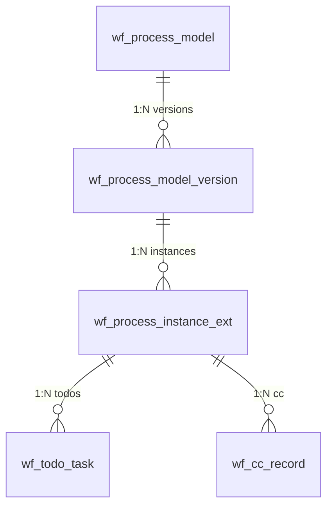

# Workflow Engine

> This document covers the architecture, core flows, constraints, and extension guide for the Omni-Stack workflow engine.  
> For architecture overview, see [architecture.en.md](architecture.en.md). For Docker deployment configuration, see [docker-deployment.en.md](docker-deployment.en.md).

Omni-Stack provides a visual BPMN workflow engine built on **Flowable 8.x**, supporting model design, dual-version management, multi-instance countersign approval, and end-to-end process tracking.

## 1. Architecture Overview

The workflow system is organized into a standalone microservice and a shared starter library:

```
┌──────────────────────────────────────────────────────────────────────────┐
│                          Workflow Engine                                  │
├──────────────────────────────────────────────────────────────────────────┤
│                      omni-workflow (port 8103)                            │
│  ─────────────────────────────────────────────────────────────────────   │
│  Controllers (7): WorkflowModel · ProcessDefinition · ProcessInstance    │
│                   Approval · Task · WorkflowStats · WorkflowIdentity     │
│  Services (8): WorkflowModel · ProcessDefinition · ProcessInstance       │
│                WorkflowApproval · WorkflowTask · WorkflowStats            │
│                WorkflowIdentity · WorkflowTodoSync                       │
│  Delegates:  ScopedRoleAssignmentListener · CandidateResolverDelegate    │
│              CandidateResolverBean · CcNotifyDelegate                    │
│  Engine:     BpmnXmlBuilder · BpmnXmlValidator                           │
├──────────────────────────────────────────────────────────────────────────┤
│                  omni-common-workflow (shared starter)                    │
│  FlowableAutoConfiguration · ApprovalService(Impl) · UserGroupLookup     │
│  WorkflowNotificationService · TenantInfoFilter · TenantInfoHolder       │
├──────────────────────────────────────────────────────────────────────────┤
│                        Flowable BPMN Engine 7.x                           │
│  repositoryService · runtimeService · taskService · historyService       │
├──────────────────────────────────────────────────────────────────────────┤
│                       omni_workflow (MySQL)                               │
│  wf_process_model · wf_process_model_version · wf_process_instance_ext   │
│  wf_todo_task · wf_cc_record · wf_form_schema · wf_delegation_rule      │
└──────────────────────────────────────────────────────────────────────────┘
```

**Module dependencies**:

- `omni-common-core` — POJOs (`R<T>`, `PageResult`), XSS SPI interface
- `omni-common-mybatis` — MyBatis-Plus + MySQL driver + tenant interceptor
- `omni-common-redis` — Redis cache for XSS config and session data
- `omni-common-workflow` — Flowable auto-configuration, approval SPI, tenant filter, notification SPI
- `omni-workflow` — business layer: controllers, services, delegates, BPMN engine tools

**Key design decisions**:

- **Flowable** as the BPMN engine: open-source, mature Spring Boot integration, native multi-instance (MI) support
- **Dual-version management**: business versions tracked in `wf_process_model_version` (DRAFT → PUBLISHED → ARCHIVED), engine versions managed by Flowable deployment
- **Visual designer**: front-end BPMN modeler generates designer JSON, `BpmnXmlBuilder` converts to BPMN 2.0 XML
- **Dynamic candidate resolution**: `omni:assignment` JSON extension element parsed at task start by `ScopedRoleAssignmentListener`, no hardcoded assignees

### Data Model



### Database Tables (omni_workflow)

| Table | Purpose |
|-------|---------|
| `wf_process_model` | Process model registry, `model_key` unique per tenant |
| `wf_process_model_version` | Version history: BPMN XML, designer JSON, deployment info |
| `wf_process_instance_ext` | Instance extension: links Flowable instance to model version |
| `wf_todo_task` | Pending task cache for fast assignee-scoped queries |
| `wf_cc_record` | CC notification records with read status |
| `wf_form_schema` | JSON Schema form definitions |
| `wf_delegation_rule` | Approval delegation rules (user-to-user, optional process scope) |

---

## 2. Core Flow Walkthrough

### 2.1 Model Creation

```
POST /api/workflow/model  (workflow:model:create)
```

1. `WorkflowModelController.createModel(CreateModelRequest)` → `WorkflowModelService.createModel()`
2. Creates `wf_process_model` row with `model_key` (unique per tenant)
3. Creates initial `wf_process_model_version` row with `status = DRAFT`
4. Links `wf_process_model.current_draft_version_id` to the new version

### 2.2 Draft Saving (Visual Designer)

```
PUT /api/workflow/model/{id}/draft  (workflow:model:update)
```

1. `WorkflowModelController.saveDraft(id, SaveDraftRequest)` → `WorkflowModelService.saveDraft()`
2. Updates the draft version's `designer_json`, regenerates `bpmn_xml` via `BpmnXmlBuilder.build()`
3. Computes `xml_sha256` for change detection
4. Syncs model name and category from request

**BpmnXmlBuilder** converts designer JSON nodes to BPMN 2.0 XML elements:

| Designer Node Type | BPMN Element | Extension |
|---|---|---|
| `StartEvent` | `<startEvent>` | — |
| `EndEvent` | `<endEvent>` | — |
| `UserTask` | `<userTask>` | `<omni:assignment>` + `flowable:executionListener` |
| `ServiceTask` (CC) | `<serviceTask>` | `<omni:cc>` + `flowable:delegateExpression` |
| `ExclusiveGateway` | `<exclusiveGateway>` | `default` attribute |
| `ParallelGateway` | `<parallelGateway>` | — |

### 2.3 Model Validation

```
POST /api/workflow/model/{id}/validate  (workflow:model:validate)
```

`BpmnXmlValidator.validate()` checks:
1. XML well-formedness (with XXE protection)
2. Exactly one executable `<process>` with id matching `model_key`
3. At least one `StartEvent` and one `EndEvent`
4. Every `UserTask` has `<omni:assignment>` extension
5. CC `ServiceTask` has `<omni:cc>` extension
6. `ExclusiveGateway` has a `default` flow (without `conditionExpression`)
7. All `SequenceFlow` references valid source/target

### 2.4 Model Publishing

```
POST /api/workflow/model/{id}/publish  (workflow:model:publish)
```

1. `SELECT FOR UPDATE` pessimistic lock on the model row
2. Validates BPMN XML via `BpmnXmlValidator`
3. Replaces `targetNamespace` with model category
4. Deploys to Flowable: `repositoryService.createDeployment().addString(bpmnXml).deploy()`
5. Computes business version number (`max(existing) + 1`)
6. Updates version record: `status = PUBLISHED`, `deploymentId`, `processDefinitionId`, `engineVersion`
7. Archives previous PUBLISHED versions (`status = ARCHIVED`)
8. Updates model's `current_published_version_id`

### 2.5 Process Instance Start

```
POST /api/workflow/process-instance/start  (workflow:instance:start)
```

1. `ProcessInstanceController.start(StartProcessRequest)` → `ProcessInstanceService.start()`
2. Resolves the latest PUBLISHED version to get `processDefinitionId`
3. Starts Flowable instance: `runtimeService.startProcessInstanceById(processDefinitionId, businessKey, variables)`
4. Creates `wf_process_instance_ext` row linking model, version, and Flowable instance
5. `ScopedRoleAssignmentListener` fires on each UserTask start event to resolve candidates

### 2.6 Approval Completion

```
POST /api/workflow/approval/{taskId}/complete  (workflow:approval:complete)
```

1. `ApprovalController.complete(taskId, ApprovalRequest)` → `WorkflowApprovalService.complete()`
2. Sets process variables: `approved = true/false`, `comment = "..."`
3. Calls `taskService.complete(taskId, variables)`
4. `ApprovalServiceImpl` updates MI counters (`approvedCount` / `rejectedCount`)
5. MI `completionCondition` evaluates: `${rejectedCount > 0 || approvedCount >= requiredApprovals}`
6. If condition met → remaining MI instances are skipped (deleteReason = `MI_END`)

### 2.7 Progress & Records

**Progress** (`GET /{id}/progress`):
- Queries `HistoricActivityInstance` for all activities
- Aggregates by `activityId` (deduplicates MI sub-instances)
- For pending UserTasks, pre-resolves candidates via `CandidateResolverBean`
- Returns `ProcessProgressResponse` with `List<ActivityInfo>` including per-assignee status

**Approval Records** (`GET /{id}/approval-records`):
- Queries `HistoricTaskInstance` (ascending by creation time)
- Determines result per task: `approved` / `rejected` / `auto-approved` (MI_END) / `cancelled` / `pending`
- Fetches `Comment` for approval opinions and `approved` variable for approve/reject distinction

---

## 3. Constraints & Pitfalls

### 3.1 MI DeleteReason

When a multi-instance `completionCondition` is triggered, remaining tasks are deleted by Flowable with `deleteReason = "MI_END"` — **not** `"deleted"`. The `"deleted"` reason is used when the entire process instance is terminated or rejected.

**Rule**: Always use `HistoricTaskInstance.getDeleteReason()` to determine skip vs cancel:

| `deleteReason` | Meaning | Result |
|---|---|---|
| `null` | Task completed normally | Check `approved` variable → approved / rejected |
| `MI_END` | Skipped by MI completionCondition | auto-approved |
| `deleted` | Process terminated / rejected | cancelled |

**Pitfall**: Do NOT rely on `HistoricActivityInstance` parent lookup. Multiple rows may share the same `ACT_ID_` (one with `NULL` deleteReason, another with `MI_END`). `putIfAbsent` may store the wrong row. Use task-level `deleteReason` directly.

### 3.2 omni:assignment Extension Element

The `omni:assignment` JSON is the **sole configuration entry** for candidate resolution:

```xml
<userTask id="dept-leader-approve" flowable:assignee="${userId}">
  <extensionElements>
    <flowable:executionListener event="start"
        delegateExpression="${scopedRoleAssignmentListener}" />
    <omni:assignment>{
      "roleCode": "DEPT_LEADER",
      "anchorType": "PARENT",
      "anchorParams": {},
      "scopeMode": "SAME_UNIT",
      "fallbackStrategy": "ERROR",
      "approvalMode": "ANY"
    }</omni:assignment>
  </extensionElements>
  <multiInstanceLoopCharacteristics isSequential="false"
      flowable:collection="candidateUserIds"
      flowable:elementVariable="userId">
    <completionCondition>${rejectedCount > 0 || approvedCount >= requiredApprovals}</completionCondition>
  </multiInstanceLoopCharacteristics>
</userTask>
```

**Fields**:

| Field | Values | Description |
|---|---|---|
| `roleCode` | Any role code (e.g. `TEAM_LEADER`, `DEPT_LEADER`) | Target role to resolve |
| `anchorType` | `START_USER_PRIMARY_UNIT`, `PARENT`, `ABSOLUTE_UNIT`, `PARENT_BY_TYPE`, `CHILD_BY_CODE`, `SIBLING_BY_CODE`, `PARENT_CHILDREN`, `DEPT_BY_CODE`, `CHILD_UNIT`, `SIBLING_UNIT` | How to locate the anchor org unit |
| `anchorParams` | JSON object (e.g. `{"unitIds": [200]}`) | Parameters for anchor resolution |
| `scopeMode` | `SAME_UNIT`, `UNIT_AND_BELOW`, `CHILDREN_ONLY` | Candidate search scope |
| `fallbackStrategy` | `ERROR`, `ASSIGN_ADMIN`, `ESCALATE_PARENT` | Behavior when no candidates found |
| `approvalMode` | `ALL` (default), `ANY` | MI countersign mode |

### 3.3 Approval Modes

- **ALL**: All candidates must approve. `requiredApprovals = candidateUserIds.size()`. Flow advances when `approvedCount >= requiredApprovals`.
- **ANY**: Any single approval is sufficient. `requiredApprovals = 1`. Flow advances on first approval; remaining tasks are auto-completed with `deleteReason = MI_END`.

Both modes share the same `completionCondition` expression: `${rejectedCount > 0 || approvedCount >= requiredApprovals}`. The difference is in the `requiredApprovals` value set by `ScopedRoleAssignmentListener`.

**Rejection shortcut**: In both modes, any single rejection (`rejectedCount > 0`) immediately triggers the reject branch, skipping remaining approvers.

### 3.4 Tenant Isolation

`MybatisPlusConfig` in `omni-workflow` registers `TenantLineInnerInterceptor` that:
- Reads tenant ID from `TenantInfoHolder` (set by `TenantInfoFilter` from `X-Tenant-Id` header)
- **Excludes** Flowable internal tables (`ACT_*` / `act_*` prefix) from tenant filtering

Flowable tables are tenant-isolated via Flowable's built-in `tenantId` mechanism, not MyBatis-Plus interception.

### 3.5 XSS Integration

`omni-workflow` implements `XssConfigProvider` SPI via `XssConfigProviderImpl`:
- Reads XSS config from Redis cache (`xss:enabled:{tenantId}`, `xss:rules:{tenantId}`)
- Cache is written by `omni-auth` service; workflow service is a **read-only consumer**
- On cache miss, returns `enabled = false` (fail-open)

### 3.6 Candidate Resolution Components

| Component | Bean Name | Trigger |
|---|---|---|
| `ScopedRoleAssignmentListener` | `scopedRoleAssignmentListener` | ExecutionListener on UserTask `start` event |
| `CandidateResolverDelegate` | `candidateResolverDelegate` | JavaDelegate in ServiceTask before UserTask |
| `CandidateResolverBean` | `candidateResolver` | UEL expression or offline pre-resolution |

`CandidateResolverBean` exposes `resolveCandidates(processDefinitionId, activityId, startUserId, tenantId)` for offline use (e.g., `getProgress()` needs to show who *would* approve a pending task).

### 3.7 Publish Locking

`publishModel()` uses `SELECT FOR UPDATE` pessimistic lock on `wf_process_model` to prevent concurrent deployments of the same model. This is critical because Flowable deployment is not atomic — it involves multiple engine API calls.

---

## 4. Extension Guide

### 4.1 Adding a New Approval Process Type

1. Design BPMN XML with `<omni:assignment>` on each UserTask
2. Validate with `BpmnXmlValidator` (enforces required extensions)
3. Create model via API: `POST /api/workflow/model`
4. Save BPMN XML: `PUT /api/workflow/model/{id}/draft`
5. Publish: `POST /api/workflow/model/{id}/publish`

No code changes required — the framework is data-driven through BPMN XML + `omni:assignment` configuration.

### 4.2 Adding a New Anchor Type

1. Add the new anchor type string to the resolution logic in `ScopedRoleAssignmentListener`
2. Implement the org unit lookup query (e.g., query `sys_org_unit` by specific criteria)
3. Add the anchor type to `BpmnXmlValidator`'s known values if validation is desired
4. Update front-end `UserTaskPanel.vue` to expose the new anchor type in the property panel

### 4.3 Adding a New Fallback Strategy

1. Add the strategy constant to `ScopedRoleAssignmentListener`
2. Implement the fallback behavior (e.g., `ASSIGN_ADMIN` → query admin user, `ESCALATE_PARENT` → find parent unit candidates)
3. Update `omni:assignment` JSON schema validation

### 4.4 Custom Notification Service

Implement `WorkflowNotificationService` interface from `omni-common-workflow`:

```java
@Service
public class MyNotificationService implements WorkflowNotificationService {
    @Override
    public void notifyPendingTask(String assigneeId, String taskId, String title) { ... }

    @Override
    public void clearPendingTask(String taskId) { ... }
}
```

The default `NoOpNotificationService` (registered by `FlowableAutoConfiguration`) is replaced by your implementation via `@ConditionalOnMissingBean`.

### 4.5 CC (Carbon Copy) Notifications

Add a `ServiceTask` node in the BPMN designer with the `ccNotifyDelegate` delegate expression. Configure `<omni:cc>` extension element with target user IDs or role-based resolution. The `CcNotifyDelegate` creates `wf_cc_record` entries at runtime.

---

## 5. Technology Selection: Why Flowable 8.x

| Consideration | Flowable | Camunda | Activiti |
|------|---------|---------|----------|
| **Open-Source License** | Apache 2.0 (commercially friendly) | Commercial edition requires license (Community edition MIT) | Apache 2.0 |
| **Spring Boot Integration** | Native Spring Boot Starter with auto-configuration | Requires additional Spring Boot Starter configuration | No longer maintained (Flowable is its fork) |
| **Multi-Instance Support** | Native MI (Multi-Instance) support with flexible completionCondition | Similar functionality | Basic MI support |
| **CMMN/DMN** | Supports BPMN + CMMN + DMN | Supports BPMN + DMN (CMMN in commercial edition) | BPMN only |
| **Community Activity** | Active (GitHub 8k+ stars) | Active (commercially backed) | No longer maintained |
| **Version 7.x** | Jakarta EE compatible, Spring Boot 3/4 support | Version 8 has major architectural changes | No new versions |

**Conclusion**: Flowable 8.x has clear advantages in open-source licensing, native Spring Boot integration, and multi-instance support, making it the optimal choice for the Omni-Stack workflow engine.

## 6. BPMN Modeling Best Practices

### Naming Conventions

| Element | Naming Rule | Example |
|------|---------|------|
| Process ID | Consistent with `model_key` | `leave-request`, `expense-approval` |
| UserTask ID | kebab-case, describing role + action | `dept-leader-approve`, `hr-review` |
| SequenceFlow ID | `flow-{source}-{target}` | `flow-start-submit` |
| Gateway ID | `{type}-gw-{purpose}` | `exclusive-gw-amount`, `parallel-gw-notify` |

### Modeling Principles

1. **Every UserTask must configure `<omni:assignment>`**: Dynamic candidate resolution; hardcoding `assignee` is prohibited
2. **ExclusiveGateway must set a default flow**: The unconditional branch serves as a fallback to avoid process deadlocks
3. **Multi-instance countersign uses a unified completionCondition**: `${rejectedCount > 0 \|\| approvedCount >= requiredApprovals}`
4. **CC notifications use ServiceTask + `ccNotifyDelegate`**: Non-blocking, does not affect the main flow
5. **Models must pass `BpmnXmlValidator` before publishing**: Ensures XML validity and extension element completeness

### Process Designer Front-End Architecture

```
bpmn-js Modeler (open-source BPMN 2.0 modeling tool)
    │
    ├── useBpmnModeler.ts      — Modeler create/destroy lifecycle
    ├── useBpmnExtension.ts    — Read/write extension elements such as omni:assignment
    ├── bpmnContextPadI18n.ts  — Context menu internationalization
    └── bpmnContextPadProvider.ts — Custom context menu items

Property Panels (panels/)
    ├── UserTaskPanel.vue      — Role resolution config (roleCode, anchorType, scopeMode)
    ├── ServiceTaskPanel.vue   — CC notification config
    └── GatewayPanel.vue       — Gateway condition config
```

## 7. Troubleshooting Guide

| Issue | Possible Cause | Troubleshooting Method |
|------|---------|----------|
| **Model publishing failed** | BPMN XML validation failed | Call `POST /api/workflow/model/{id}/validate` to get specific error details |
| **Candidate resolution failed** | `omni:assignment` configuration error | Verify `roleCode`, `anchorType`, `scopeMode` values are valid; check service logs for exceptions |
| **Process instance not started** | Model not published or version archived | Check `wf_process_model_version` table for a version with `status=PUBLISHED` |
| **Multi-instance tasks not skipped** | completionCondition not triggered | Check `approvedCount`, `rejectedCount`, `requiredApprovals` variable values |
| **deleteReason displayed incorrectly** | MI_END vs deleted confusion | Refer to §3.1 MI DeleteReason table; `MI_END` = auto-completed, `deleted` = process terminated |
| **Tenant isolation not working** | TenantInfoHolder not set | Confirm Gateway has injected `X-Tenant-Id` request header; verify `TenantInfoFilter` is executing normally |
| **BPMN designer fails to load** | bpmn-js version incompatible | Confirm `bpmn-js` version is 18.x; check browser console for errors |
