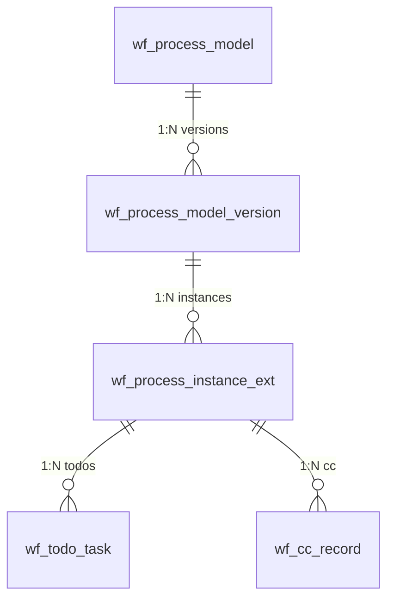

# ワークフローエンジン

> 本文書は、Omni-Stack ワークフローエンジンのアーキテクチャ、コアフロー、制約事項、および拡張ガイドについて説明します。  
> アーキテクチャの概要は [architecture.jp.md](architecture.jp.md) を参照してください。Docker デプロイメント構成は [docker-deployment.jp.md](docker-deployment.jp.md) を参照してください。

Omni-Stack は、**Flowable 7.x** をベースにした可視化 BPMN ワークフローエンジンであり、モデル設計、デュアルバージョン管理、マルチインスタンス回覧承認、およびエンドツーエンドのプロセス追跡をサポートします。

## 1. Architecture Overview

ワークフローシステムは、スタンドアロンマイクロサービスと共有スターターライブラリで構成されています：

```
┌──────────────────────────────────────────────────────────────────────────┐
│                          Workflow Engine                                  │
├──────────────────────────────────────────────────────────────────────────┤
│                      omni-workflow (port 8103)                            │
│  ─────────────────────────────────────────────────────────────────────   │
│  Controllers (7): WorkflowModel · ProcessDefinition · ProcessInstance    │
│                   Approval · Task · WorkflowStats · WorkflowIdentity     │
│  Services (8): WorkflowModel · ProcessDefinition · ProcessInstance       │
│                WorkflowApproval · WorkflowTask · WorkflowStats            │
│                WorkflowIdentity · WorkflowTodoSync                       │
│  Delegates:  ScopedRoleAssignmentListener · CandidateResolverDelegate    │
│              CandidateResolverBean · CcNotifyDelegate                    │
│  Engine:     BpmnXmlBuilder · BpmnXmlValidator                           │
├──────────────────────────────────────────────────────────────────────────┤
│                  omni-common-workflow (shared starter)                    │
│  FlowableAutoConfiguration · ApprovalService(Impl) · UserGroupLookup     │
│  WorkflowNotificationService · TenantInfoFilter · TenantInfoHolder       │
├──────────────────────────────────────────────────────────────────────────┤
│                        Flowable BPMN Engine 7.x                           │
│  repositoryService · runtimeService · taskService · historyService       │
├──────────────────────────────────────────────────────────────────────────┤
│                       omni_workflow (MySQL)                               │
│  wf_process_model · wf_process_model_version · wf_process_instance_ext   │
│  wf_todo_task · wf_cc_record · wf_form_schema · wf_delegation_rule      │
└──────────────────────────────────────────────────────────────────────────┘
```

**モジュール依存関係**：

- `omni-common-core` — POJOs (`R<T>`, `PageResult`)、XSS SPI インターフェース
- `omni-common-mybatis` — MyBatis-Plus + MySQL ドライバ + テナントインターセプター
- `omni-common-redis` — XSS 構成およびセッションデータ用の Redis キャッシュ
- `omni-common-workflow` — Flowable 自動構成、承認 SPI、テナントフィルター、通知 SPI
- `omni-workflow` — ビジネス層：コントローラー、サービス、デリゲート、BPMN エンジンツール

**主要な設計判断**：

- **Flowable** を BPMN エンジンとして採用：オープンソース、成熟した Spring Boot 統合、ネイティブマルチインスタンス（MI）サポート
- **デュアルバージョン管理**：ビジネスバージョンは `wf_process_model_version` で追跡（DRAFT → PUBLISHED → ARCHIVED）、エンジンバージョンは Flowable デプロイメントで管理
- **ビジュアルデザイナー**：フロントエンド BPMN モデラーがデザイナー JSON を生成し、`BpmnXmlBuilder` が BPMN 2.0 XML に変換
- **動的候補解決**：`omni:assignment` JSON 拡張要素がタスク開始時に `ScopedRoleAssignmentListener` によって解析され、ハードコードされた担当者はいません

### データモデル



### データベーステーブル (omni_workflow)

| テーブル | 用途 |
|-------|---------|
| `wf_process_model` | プロセスモデルレジストリ、`model_key` はテナントごとに一意 |
| `wf_process_model_version` | バージョン履歴：BPMN XML、デザイナー JSON、デプロイメント情報 |
| `wf_process_instance_ext` | インスタンス拡張：Flowable インスタンスとモデルバージョンを関連付け |
| `wf_todo_task` | 担当者スコープの高速クエリ用の未処理タスクキャッシュ |
| `wf_cc_record` | 既読ステータス付き CC 通知レコード |
| `wf_form_schema` | JSON Schema フォーム定義 |
| `wf_delegation_rule` | 承認委任ルール（ユーザー間、任意のプロセススコープ） |

---

## 2. Core Flow Walkthrough

### 2.1 モデル作成

```
POST /api/workflow/model  (workflow:model:create)
```

1. `WorkflowModelController.createModel(CreateModelRequest)` → `WorkflowModelService.createModel()`
2. `model_key`（テナントごとに一意）を持つ `wf_process_model` 行を作成
3. `status = DRAFT` の初期 `wf_process_model_version` 行を作成
4. `wf_process_model.current_draft_version_id` を新バージョンにリンク

### 2.2 ドラフト保存（ビジュアルデザイナー）

```
PUT /api/workflow/model/{id}/draft  (workflow:model:update)
```

1. `WorkflowModelController.saveDraft(id, SaveDraftRequest)` → `WorkflowModelService.saveDraft()`
2. ドラフトバージョンの `designer_json` を更新し、`BpmnXmlBuilder.build()` で `bpmn_xml` を再生成
3. 変更検知のため `xml_sha256` を計算
4. リクエストからモデル名とカテゴリを同期

**BpmnXmlBuilder** はデザイナー JSON ノードを BPMN 2.0 XML 要素に変換します：

| デザイナーノードタイプ | BPMN 要素 | 拡張 |
|---|---|---|
| `StartEvent` | `<startEvent>` | — |
| `EndEvent` | `<endEvent>` | — |
| `UserTask` | `<userTask>` | `<omni:assignment>` + `flowable:executionListener` |
| `ServiceTask` (CC) | `<serviceTask>` | `<omni:cc>` + `flowable:delegateExpression` |
| `ExclusiveGateway` | `<exclusiveGateway>` | `default` 属性 |
| `ParallelGateway` | `<parallelGateway>` | — |

### 2.3 モデル検証

```
POST /api/workflow/model/{id}/validate  (workflow:model:validate)
```

`BpmnXmlValidator.validate()` のチェック項目：
1. XML の整形式（XXE 保護付き）
2. 実行可能な `<process>` がちょうど1つで、id が `model_key` と一致
3. 少なくとも1つの `StartEvent` と1つの `EndEvent` が存在
4. すべての `UserTask` に `<omni:assignment>` 拡張が存在
5. CC `ServiceTask` に `<omni:cc>` 拡張が存在
6. `ExclusiveGateway` に `default` フロー（`conditionExpression` なし）が存在
7. すべての `SequenceFlow` が有効な source/target を参照

### 2.4 モデル公開

```
POST /api/workflow/model/{id}/publish  (workflow:model:publish)
```

1. `SELECT FOR UPDATE` でモデル行に悲観的ロックを取得
2. `BpmnXmlValidator` で BPMN XML を検証
3. `targetNamespace` をモデルカテゴリに置換
4. Flowable にデプロイ：`repositoryService.createDeployment().addString(bpmnXml).deploy()`
5. ビジネスバージョン番号を計算（`max(existing) + 1`）
6. バージョンレコードを更新：`status = PUBLISHED`、`deploymentId`、`processDefinitionId`、`engineVersion`
7. 以前の PUBLISHED バージョンをアーカイブ（`status = ARCHIVED`）
8. モデルの `current_published_version_id` を更新

### 2.5 プロセスインスタンス開始

```
POST /api/workflow/process-instance/start  (workflow:instance:start)
```

1. `ProcessInstanceController.start(StartProcessRequest)` → `ProcessInstanceService.start()`
2. 最新の PUBLISHED バージョンを解決して `processDefinitionId` を取得
3. Flowable インスタンスを開始：`runtimeService.startProcessInstanceById(processDefinitionId, businessKey, variables)`
4. モデル、バージョン、Flowable インスタンスを関連付ける `wf_process_instance_ext` 行を作成
5. `ScopedRoleAssignmentListener` が各 UserTask 開始イベントで発火し、候補者を解決

### 2.6 承認完了

```
POST /api/workflow/approval/{taskId}/complete  (workflow:approval:complete)
```

1. `ApprovalController.complete(taskId, ApprovalRequest)` → `WorkflowApprovalService.complete()`
2. プロセス変数を設定：`approved = true/false`、`comment = "..."`
3. `taskService.complete(taskId, variables)` を呼び出し
4. `ApprovalServiceImpl` が MI カウンターを更新（`approvedCount` / `rejectedCount`）
5. MI `completionCondition` の評価：`${rejectedCount > 0 || approvedCount >= requiredApprovals}`
6. 条件が満たされた場合 → 残りの MI インスタンスがスキップされる（deleteReason = `MI_END`）

### 2.7 進捗と記録

**進捗**（`GET /{id}/progress`）：
- すべてのアクティビティについて `HistoricActivityInstance` をクエリ
- `activityId` で集約（MI サブインスタンスを重複排除）
- 未処理の UserTask について、`CandidateResolverBean` で候補者を事前解決
- 担当者ごとのステータスを含む `List<ActivityInfo>` を持つ `ProcessProgressResponse` を返却

**承認記録**（`GET /{id}/approval-records`）：
- `HistoricTaskInstance` をクエリ（作成時刻の昇順）
- タスクごとの結果を判定：`approved` / `rejected` / `auto-approved`（MI_END）/ `cancelled` / `pending`
- 承認意見の `Comment` と承認/却下の区別のための `approved` 変数を取得

---

## 3. Constraints & Pitfalls

### 3.1 MI DeleteReason

マルチインスタンスの `completionCondition` がトリガーされると、残りのタスクは Flowable によって `deleteReason = "MI_END"` で削除されます — `"deleted"` **ではありません**。`"deleted"` の理由は、プロセスインスタンス全体が終了または却下された場合に使用されます。

**ルール**：スキップとキャンセルの判定には、必ず `HistoricTaskInstance.getDeleteReason()` を使用してください：

| `deleteReason` | 意味 | 結果 |
|---|---|---|
| `null` | タスクが正常に完了 | `approved` 変数をチェック → 承認 / 却下 |
| `MI_END` | MI completionCondition によりスキップ | 自動承認 |
| `deleted` | プロセス終了 / 却下 | キャンセル済み |

**落とし穴**：`HistoricActivityInstance` の親ルックアップに依存しないでください。複数の行が同じ `ACT_ID_` を共有する可能性があります（1つは `NULL` の deleteReason、もう1つは `MI_END`）。`putIfAbsent` が誤った行を保存する可能性があります。タスクレベルの `deleteReason` を直接使用してください。

### 3.2 omni:assignment 拡張要素

`omni:assignment` JSON は候補者解決の**唯一の設定エントリ**です：

```xml
<userTask id="dept-leader-approve" flowable:assignee="${userId}">
  <extensionElements>
    <flowable:executionListener event="start"
        delegateExpression="${scopedRoleAssignmentListener}" />
    <omni:assignment>{
      "roleCode": "DEPT_LEADER",
      "anchorType": "PARENT",
      "anchorParams": {},
      "scopeMode": "SAME_UNIT",
      "fallbackStrategy": "ERROR",
      "approvalMode": "ANY"
    }</omni:assignment>
  </extensionElements>
  <multiInstanceLoopCharacteristics isSequential="false"
      flowable:collection="candidateUserIds"
      flowable:elementVariable="userId">
    <completionCondition>${rejectedCount > 0 || approvedCount >= requiredApprovals}</completionCondition>
  </multiInstanceLoopCharacteristics>
</userTask>
```

**フィールド**：

| フィールド | 値 | 説明 |
|---|---|---|
| `roleCode` | 任意のロールコード（例：`TEAM_LEADER`、`DEPT_LEADER`） | 解決対象のロール |
| `anchorType` | `START_USER_PRIMARY_UNIT`、`PARENT`、`ABSOLUTE_UNIT`、`PARENT_BY_TYPE`、`CHILD_BY_CODE`、`SIBLING_BY_CODE`、`PARENT_CHILDREN`、`DEPT_BY_CODE`、`CHILD_UNIT`、`SIBLING_UNIT` | アンカー組織単位の特定方法 |
| `anchorParams` | JSON オブジェクト（例：`{"unitIds": [200]}`) | アンカー解決のパラメータ |
| `scopeMode` | `SAME_UNIT`、`UNIT_AND_BELOW`、`CHILDREN_ONLY` | 候補者検索スコープ |
| `fallbackStrategy` | `ERROR`、`ASSIGN_ADMIN`、`ESCALATE_PARENT` | 候補者が見つからない場合の動作 |
| `approvalMode` | `ALL`（デフォルト）、`ANY` | MI 回覧モード |

### 3.3 承認モード

- **ALL**：すべての候補者が承認する必要があります。`requiredApprovals = candidateUserIds.size()`。`approvedCount >= requiredApprovals` の場合にフローが進行します。
- **ANY**：1つの承認があれば十分です。`requiredApprovals = 1`。最初の承認でフローが進行し、残りのタスクは `deleteReason = MI_END` で自動完了します。

両モードとも同じ `completionCondition` 式を共有します：`${rejectedCount > 0 || approvedCount >= requiredApprovals}`。違いは `ScopedRoleAssignmentListener` が設定する `requiredApprovals` の値です。

**却下ショートカット**：両モードとも、1つの却下（`rejectedCount > 0`）で即座に却下ブランチがトリガーされ、残りの承認者がスキップされます。

### 3.4 テナント分離

`omni-workflow` の `MybatisPlusConfig` は `TenantLineInnerInterceptor` を登録し、以下を行います：
- `TenantInfoHolder` からテナント ID を読み取り（`TenantInfoFilter` により `X-Tenant-Id` ヘッダーから設定）
- Flowable 内部テーブル（`ACT_*` / `act_*` プレフィックス）をテナントフィルタリングから**除外**

Flowable テーブルは、MyBatis-Plus インターセプションではなく、Flowable の組み込み `tenantId` メカニズムによってテナント分離されます。

### 3.5 XSS 統合

`omni-workflow` は `XssConfigProviderImpl` を通じて `XssConfigProvider` SPI を実装します：
- Redis キャッシュから XSS 構成を読み取り（`xss:enabled:{tenantId}`、`xss:rules:{tenantId}`）
- キャッシュは `omni-auth` サービスによって書き込まれ、ワークフローサービスは**読み取り専用コンシューマー**です
- キャッシュミスの場合、`enabled = false` を返却（フェイルオープン）

### 3.6 候補者解決コンポーネント

| コンポーネント | Bean 名 | トリガー |
|---|---|---|
| `ScopedRoleAssignmentListener` | `scopedRoleAssignmentListener` | UserTask `start` イベントの ExecutionListener |
| `CandidateResolverDelegate` | `candidateResolverDelegate` | UserTask の前の ServiceTask の JavaDelegate |
| `CandidateResolverBean` | `candidateResolver` | UEL 式またはオフライン事前解決 |

`CandidateResolverBean` は `resolveCandidates(processDefinitionId, activityId, startUserId, tenantId)` をオフライン使用のために公開します（例：`getProgress()` で未処理タスクの承認予定者を表示する必要がある場合）。

### 3.7 公開ロック

`publishModel()` は `wf_process_model` に `SELECT FOR UPDATE` 悲観的ロックを使用して、同一モデルの同時デプロイメントを防止します。これは Flowable デプロイメントがアトミックではなく、複数のエンジン API 呼び出しを伴うため重要です。

---

## 4. Extension Guide

### 4.1 新しい承認プロセスタイプの追加

1. 各 UserTask に `<omni:assignment>` を設定した BPMN XML を設計
2. `BpmnXmlValidator` で検証（必須拡張を強制）
3. API でモデルを作成：`POST /api/workflow/model`
4. BPMN XML を保存：`PUT /api/workflow/model/{id}/draft`
5. 公開：`POST /api/workflow/model/{id}/publish`

コード変更は不要です — フレームワークは BPMN XML + `omni:assignment` 構成によるデータ駆動です。

### 4.2 新しいアンカータイプの追加

1. `ScopedRoleAssignmentListener` の解決ロジックに新しいアンカータイプ文字列を追加
2. 組織単位ルックアップクエリを実装（例：特定の条件で `sys_org_unit` をクエリ）
3. 検証が必要な場合、`BpmnXmlValidator` の既知の値にアンカータイプを追加
4. フロントエンドの `UserTaskPanel.vue` を更新して、プロパティパネルに新しいアンカータイプを公開

### 4.3 新しいフォールバック戦略の追加

1. `ScopedRoleAssignmentListener` に戦略定数を追加
2. フォールバック動作を実装（例：`ASSIGN_ADMIN` → 管理者ユーザーを検索、`ESCALATE_PARENT` → 親単位の候補者を検索）
3. `omni:assignment` JSON スキーマ検証を更新

### 4.4 カスタム通知サービス

`omni-common-workflow` の `WorkflowNotificationService` インターフェースを実装します：

```java
@Service
public class MyNotificationService implements WorkflowNotificationService {
    @Override
    public void notifyPendingTask(String assigneeId, String taskId, String title) { ... }

    @Override
    public void clearPendingTask(String taskId) { ... }
}
```

デフォルトの `NoOpNotificationService`（`FlowableAutoConfiguration` により登録）は、`@ConditionalOnMissingBean` を通じて独自の実装に置き換えられます。

### 4.5 CC（カーボンコピー）通知

BPMN デザイナーで `ccNotifyDelegate` デリゲート式を持つ `ServiceTask` ノードを追加します。`<omni:cc>` 拡張要素に対象ユーザー ID またはロールベースの解決を設定します。`CcNotifyDelegate` が実行時に `wf_cc_record` エントリを作成します。

---

## 5. 技術選定：Flowable 7.x を選択した理由

| 検討項目 | Flowable | Camunda | Activiti |
|------|---------|---------|----------|
| **オープンソースライセンス** | Apache 2.0（商用利用に優しい） | 商用版はライセンス必要（コミュニティ版は MIT） | Apache 2.0 |
| **Spring Boot 統合** | ネイティブ Spring Boot Starter、自動構成 | Spring Boot Starter の追加構成が必要 | メンテナンス停止（Flowable はそのフォーク） |
| **マルチインスタンスサポート** | ネイティブ MI（Multi-Instance）サポート、柔軟な completionCondition | 類似機能 | 基本的 MI サポート |
| **CMMN/DMN** | BPMN + CMMN + DMN をサポート | BPMN + DMN をサポート（CMMN は商用版） | BPMN のみ |
| **コミュニティ活発度** | 活発（GitHub 8k+ stars） | 活発（商用サポート） | メンテナンス停止 |
| **バージョン 7.x** | Jakarta EE 互換、Spring Boot 3/4 サポート | バージョン 8 は大幅なアーキテクチャ変更 | 新バージョンなし |

**結論**：Flowable 7.x はオープンソースライセンス、Spring Boot ネイティブ統合、マルチインスタンスサポートにおいて明確な優位性があり、Omni-Stack ワークフローエンジンの最適な選択です。

## 6. BPMN モデリングベストプラクティス

### 命名規則

| 要素 | 命名規則 | 例 |
|------|---------|------|
| Process ID | `model_key` と一致 | `leave-request`、`expense-approval` |
| UserTask ID | kebab-case、ロール+アクションを記述 | `dept-leader-approve`、`hr-review` |
| SequenceFlow ID | `flow-{source}-{target}` | `flow-start-submit` |
| Gateway ID | `{type}-gw-{purpose}` | `exclusive-gw-amount`、`parallel-gw-notify` |

### モデリング原則

1. **すべての UserTask に `<omni:assignment>` を設定する必要があります**：動的候補者解決、`assignee` のハードコードは禁止
2. **ExclusiveGateway には必ず default flow を設定してください**：無条件ブランチをフォールバックとして設定し、プロセスのデッドロックを回避
3. **マルチインスタンス回覧には統一された completionCondition を使用**：`${rejectedCount > 0 \|\| approvedCount >= requiredApprovals}`
4. **CC 通知は ServiceTask + `ccNotifyDelegate` を使用**：非ブロッキング、メインフローに影響しません
5. **モデル公開前に必ず `BpmnXmlValidator` をパスしてください**：XML の正当性と拡張要素の完全性を確保

### プロセスデザイナー フロントエンドアーキテクチャ

```
bpmn-js Modeler (オープンソース BPMN 2.0 モデリングツール)
    │
    ├── useBpmnModeler.ts      — Modeler の作成/破棄ライフサイクル
    ├── useBpmnExtension.ts    — omni:assignment などの拡張要素の読み書き
    ├── bpmnContextPadI18n.ts  — コンテキストメニューの国際化
    └── bpmnContextPadProvider.ts — カスタムコンテキストメニュー項目

プロパティパネル (panels/)
    ├── UserTaskPanel.vue      — ロール解決設定（roleCode, anchorType, scopeMode）
    ├── ServiceTaskPanel.vue   — CC 通知設定
    └── GatewayPanel.vue       — ゲートウェイ条件設定
```

## 7. トラブルシューティングガイド

| 問題 | 考えられる原因 | トラブルシューティング方法 |
|------|---------|----------|
| **モデル公開失敗** | BPMN XML 検証に失敗 | `POST /api/workflow/model/{id}/validate` を呼び出して具体的なエラー情報を取得 |
| **候補者解決失敗** | `omni:assignment` 設定エラー | `roleCode`、`anchorType`、`scopeMode` の値が有効か確認；サービスログで例外を確認 |
| **プロセスインスタンスが開始されない** | モデルが未公開またはバージョンがアーカイブ済み | `wf_process_model_version` テーブルで `status=PUBLISHED` のバージョンがあるか確認 |
| **マルチインスタンスタスクがスキップされない** | completionCondition がトリガーされていない | `approvedCount`、`rejectedCount`、`requiredApprovals` の変数値を確認 |
| **deleteReason が誤って表示される** | MI_END と deleted の混同 | §3.1 MI DeleteReason テーブルを参照；`MI_END` = 自動完了、`deleted` = プロセス終了 |
| **テナント分離が機能しない** | TenantInfoHolder が未設定 | Gateway が `X-Tenant-Id` リクエストヘッダーを注入しているか確認；`TenantInfoFilter` が正常に実行されているか確認 |
| **BPMN デザイナーが読み込めない** | bpmn-js のバージョン非互換 | `bpmn-js` のバージョンが 18.x であることを確認；ブラウザコンソールエラーを確認 |
