# 워크플로우 엔진

> 본 문서는 Omni-Stack 워크플로우 엔진의 아키텍처, 핵심 플로우, 제약 사항 및 확장 가이드를 다룹니다.  
> 아키텍처 개요는 [architecture.kr.md](architecture.kr.md)를 참조하십시오. Docker 배포 구성은 [docker-deployment.kr.md](docker-deployment.kr.md)를 참조하십시오.

Omni-Stack은 **Flowable 8.x** 기반의 시각적 BPMN 워크플로우 엔진을 제공하며, 모델 설계, 이중 버전 관리, 다중 인스턴스 합의 승인 및 엔드투엔드 프로세스 추적을 지원합니다.

## 1. Architecture Overview

워크플로우 시스템은 독립 실행형 마이크로서비스와 공유 스타터 라이브러리로 구성됩니다:

```
┌──────────────────────────────────────────────────────────────────────────┐
│                          Workflow Engine                                  │
├──────────────────────────────────────────────────────────────────────────┤
│                      omni-workflow (port 8103)                            │
│  ─────────────────────────────────────────────────────────────────────   │
│  Controllers (7): WorkflowModel · ProcessDefinition · ProcessInstance    │
│                   Approval · Task · WorkflowStats · WorkflowIdentity     │
│  Services (8): WorkflowModel · ProcessDefinition · ProcessInstance       │
│                WorkflowApproval · WorkflowTask · WorkflowStats            │
│                WorkflowIdentity · WorkflowTodoSync                       │
│  Delegates:  ScopedRoleAssignmentListener · CandidateResolverDelegate    │
│              CandidateResolverBean · CcNotifyDelegate                    │
│  Engine:     BpmnXmlBuilder · BpmnXmlValidator                           │
├──────────────────────────────────────────────────────────────────────────┤
│                  omni-common-workflow (shared starter)                    │
│  FlowableAutoConfiguration · ApprovalService(Impl) · UserGroupLookup     │
│  WorkflowNotificationService · TenantInfoFilter · TenantInfoHolder       │
├──────────────────────────────────────────────────────────────────────────┤
│                        Flowable BPMN Engine 7.x                           │
│  repositoryService · runtimeService · taskService · historyService       │
├──────────────────────────────────────────────────────────────────────────┤
│                       omni_workflow (MySQL)                               │
│  wf_process_model · wf_process_model_version · wf_process_instance_ext   │
│  wf_todo_task · wf_cc_record · wf_form_schema · wf_delegation_rule      │
└──────────────────────────────────────────────────────────────────────────┘
```

**모듈 의존성**:

- `omni-common-core` — POJOs (`R<T>`, `PageResult`), XSS SPI 인터페이스
- `omni-common-mybatis` — MyBatis-Plus + MySQL 드라이버 + 테넌트 인터셉터
- `omni-common-redis` — XSS 구성 및 세션 데이터용 Redis 캐시
- `omni-common-workflow` — Flowable 자동 구성, 승인 SPI, 테넌트 필터, 알림 SPI
- `omni-workflow` — 비즈니스 레이어: 컨트롤러, 서비스, 델리게이트, BPMN 엔진 도구

**주요 설계 결정**:

- **Flowable**을 BPMN 엔진으로 채택: 오픈소스, 성숙한 Spring Boot 통합, 네이티브 다중 인스턴스(MI) 지원
- **이중 버전 관리**: 비즈니스 버전은 `wf_process_model_version`에서 추적(DRAFT → PUBLISHED → ARCHIVED), 엔진 버전은 Flowable 배포에서 관리
- **비주얼 디자이너**: 프론트엔드 BPMN 모델러가 디자이너 JSON을 생성하고, `BpmnXmlBuilder`가 BPMN 2.0 XML로 변환
- **동적 후보자 해결**: `omni:assignment` JSON 확장 요소가 작업 시작 시 `ScopedRoleAssignmentListener`에 의해 파싱되며, 하드코딩된 담당자는 없습니다

### 데이터 모델

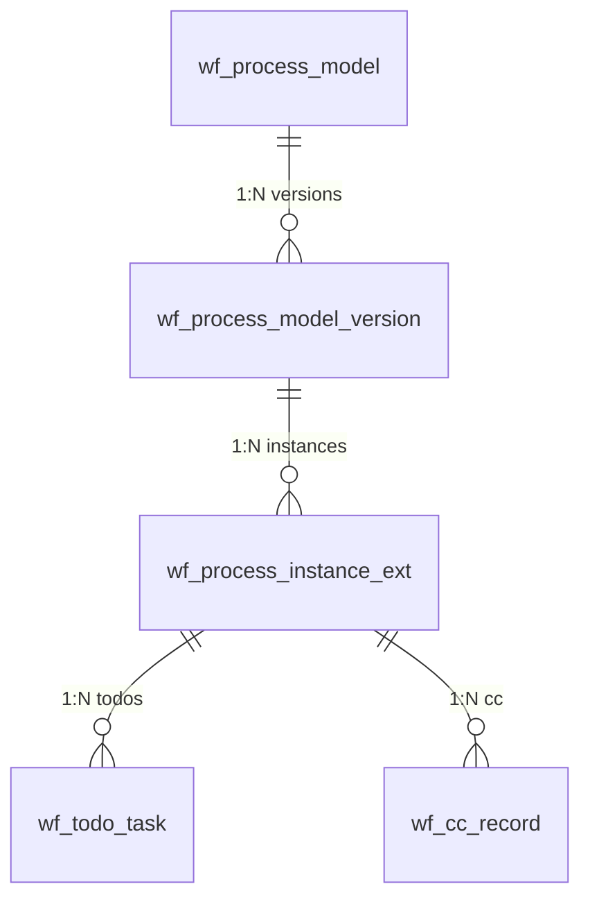

### 데이터베이스 테이블 (omni_workflow)

| 테이블 | 용도 |
|-------|---------|
| `wf_process_model` | 프로세스 모델 레지스트리, `model_key`는 테넌트별 고유 |
| `wf_process_model_version` | 버전 이력: BPMN XML, 디자이너 JSON, 배포 정보 |
| `wf_process_instance_ext` | 인스턴스 확장: Flowable 인스턴스와 모델 버전 연결 |
| `wf_todo_task` | 담당자 범위 고속 쿼리용 대기 작업 캐시 |
| `wf_cc_record` | 읽음 상태가 포함된 CC 알림 레코드 |
| `wf_form_schema` | JSON Schema 폼 정의 |
| `wf_delegation_rule` | 승인 위임 규칙(사용자 간, 선택적 프로세스 범위) |

---

## 2. Core Flow Walkthrough

### 2.1 모델 생성

```
POST /api/workflow/model  (workflow:model:create)
```

1. `WorkflowModelController.createModel(CreateModelRequest)` → `WorkflowModelService.createModel()`
2. `model_key`(테넌트별 고유)를 가진 `wf_process_model` 행 생성
3. `status = DRAFT`인 초기 `wf_process_model_version` 행 생성
4. `wf_process_model.current_draft_version_id`를 새 버전에 연결

### 2.2 초안 저장 (비주얼 디자이너)

```
PUT /api/workflow/model/{id}/draft  (workflow:model:update)
```

1. `WorkflowModelController.saveDraft(id, SaveDraftRequest)` → `WorkflowModelService.saveDraft()`
2. 초안 버전의 `designer_json`를 업데이트하고, `BpmnXmlBuilder.build()`로 `bpmn_xml`를 재생성
3. 변경 감지를 위해 `xml_sha256` 계산
4. 요청에서 모델명과 카테고리를 동기화

**BpmnXmlBuilder**는 디자이너 JSON 노드를 BPMN 2.0 XML 요소로 변환합니다:

| 디자이너 노드 유형 | BPMN 요소 | 확장 |
|---|---|---|
| `StartEvent` | `<startEvent>` | — |
| `EndEvent` | `<endEvent>` | — |
| `UserTask` | `<userTask>` | `<omni:assignment>` + `flowable:executionListener` |
| `ServiceTask` (CC) | `<serviceTask>` | `<omni:cc>` + `flowable:delegateExpression` |
| `ExclusiveGateway` | `<exclusiveGateway>` | `default` 속성 |
| `ParallelGateway` | `<parallelGateway>` | — |

### 2.3 모델 검증

```
POST /api/workflow/model/{id}/validate  (workflow:model:validate)
```

`BpmnXmlValidator.validate()` 검증 항목:
1. XML 정형성(XXE 보호 포함)
2. 실행 가능한 `<process>`가 정확히 하나이며, id가 `model_key`와 일치
3. 최소 하나의 `StartEvent`과 하나의 `EndEvent` 존재
4. 모든 `UserTask`에 `<omni:assignment>` 확장이 존재
5. CC `ServiceTask`에 `<omni:cc>` 확장이 존재
6. `ExclusiveGateway`에 `default` 플로우(`conditionExpression` 없음)가 존재
7. 모든 `SequenceFlow`가 유효한 source/target을 참조

### 2.4 모델 게시

```
POST /api/workflow/model/{id}/publish  (workflow:model:publish)
```

1. `SELECT FOR UPDATE`로 모델 행에 비관적 잠금 획득
2. `BpmnXmlValidator`로 BPMN XML 검증
3. `targetNamespace`를 모델 카테고리로 교체
4. Flowable에 배포: `repositoryService.createDeployment().addString(bpmnXml).deploy()`
5. 비즈니스 버전 번호 계산(`max(existing) + 1`)
6. 버전 레코드 업데이트: `status = PUBLISHED`, `deploymentId`, `processDefinitionId`, `engineVersion`
7. 이전 PUBLISHED 버전을 아카이브(`status = ARCHIVED`)
8. 모델의 `current_published_version_id` 업데이트

### 2.5 프로세스 인스턴스 시작

```
POST /api/workflow/process-instance/start  (workflow:instance:start)
```

1. `ProcessInstanceController.start(StartProcessRequest)` → `ProcessInstanceService.start()`
2. 최신 PUBLISHED 버전을 해결하여 `processDefinitionId` 획득
3. Flowable 인스턴스 시작: `runtimeService.startProcessInstanceById(processDefinitionId, businessKey, variables)`
4. 모델, 버전, Flowable 인스턴스를 연결하는 `wf_process_instance_ext` 행 생성
5. `ScopedRoleAssignmentListener`가 각 UserTask 시작 이벤트에서 발동하여 후보자를 해결

### 2.6 승인 완료

```
POST /api/workflow/approval/{taskId}/complete  (workflow:approval:complete)
```

1. `ApprovalController.complete(taskId, ApprovalRequest)` → `WorkflowApprovalService.complete()`
2. 프로세스 변수 설정: `approved = true/false`, `comment = "..."`
3. `taskService.complete(taskId, variables)` 호출
4. `ApprovalServiceImpl`이 MI 카운터를 업데이트(`approvedCount` / `rejectedCount`)
5. MI `completionCondition` 평가: `${rejectedCount > 0 || approvedCount >= requiredApprovals}`
6. 조건 충족 시 → 나머지 MI 인스턴스가 스킵됨(deleteReason = `MI_END`)

### 2.7 진행 상황 및 기록

**진행 상황** (`GET /{id}/progress`):
- 모든 활동에 대해 `HistoricActivityInstance` 쿼리
- `activityId`로 집계(MI 하위 인스턴스 중복 제거)
- 대기 중인 UserTask에 대해 `CandidateResolverBean`으로 후보자를 사전 해결
- 담당자별 상태를 포함한 `List<ActivityInfo>`를 가진 `ProcessProgressResponse` 반환

**승인 기록** (`GET /{id}/approval-records`):
- `HistoricTaskInstance` 쿼리(생성 시간 오름차순)
- 작업별 결과 판정: `approved` / `rejected` / `auto-approved`(MI_END) / `cancelled` / `pending`
- 승인 의견의 `Comment`와 승인/거부 구분을 위한 `approved` 변수 조회

### 2.8 크로스 서비스 내부 계약

모든 서비스 간 인터페이스는 통일적으로 `/api/internal/**` 경로를 사용하며, Gateway 사용자 사전 인증을 거치지 않습니다. 호출자는 둘 다 휴대해야 합니다:

```http
X-Internal-Token: <공유 내부 토큰>
X-Tenant-Id: 1
Content-Type: application/json
```

컨테이너 수준 `InternalApiAuthFilter` 는 Spring Security 체인 전에 공유 토큰을 검증하고 모든 `/api/internal/**` 에 대해 실패 차단합니다; 이 경로는 Gateway 사용자 사전 인증을 다시 사용하지 않습니다. 토큰 누락 또는 불일치는 HTTP 401 을 반환; 서버측에 공유 토큰이 미구성된 경우 HTTP 503 을 반환합니다. 내부 요청의 `X-Tenant-Id` 는 요청 본문이나 쿼리 파라미터의 `tenantId` 와 완전히 일치해야 하며, 불일치는 비즈니스 코드 403 을 반환합니다.

#### 2.8.1 멱등 프로세스 시작

```http
POST /api/internal/workflow/process-instance/start
```

요청 본문:

```json
{
  "requestId": "6d2f4d1a-41d7-4f68-a60a-8a2e9425a703",
  "tenantId": 1,
  "modelVersionId": 42,
  "businessType": "PROCUREMENT_REQUISITION",
  "businessKey": "10001",
  "startUserId": 7,
  "startUserName": "buyer",
  "title": "구매 신청 PR-202607-0001",
  "variables": {
    "amount": 120000
  }
}
```

| 필드 | 필수 | 제약 | 설명 |
|---|---|---|---|
| `requestId` | 예 | 비어 있지 않음, 최대 64 | 호출자 생성 멱등 요청 ID |
| `tenantId` | 예 | 양의 정수 | `X-Tenant-Id` 와 같아야 함 |
| `modelVersionId` | 예 | 양의 정수 | 현재 테넌트에 속하고 Flowable `processDefinitionId` 와 연결되어 있어야 함 |
| `businessType` | 예 | 비어 있지 않음, 최대 100 | 안정된 크로스 서비스 비즈니스 타입 |
| `businessKey` | 예 | 비어 있지 않음, 최대 255 | 호출자 비즈니스 기본 키 |
| `startUserId` | 예 | 양의 정수 | 프로세스 발기인 |
| `startUserName` | 아니오 | 최대 100 | 발기인 표시 이름 |
| `title` | 아니오 | 최대 500 | 비어 있으면 `{businessType}:{businessKey}` 생성 |
| `variables` | 아니오 | JSON 객체 | 비즈니스 프로세스 변수; 서비스가 세 개의 연관 변수를 덮어씀 |

서비스는 항상 `modelVersionId` 로 `processDefinitionId` 를 해석한 뒤
`startProcessInstanceById` 를 호출합니다. `requestId`, `businessType`, `businessKey` 는 프로세스 변수와 인스턴스 확장 기록 양쪽에 기록됩니다.

성공 응답:

```json
{
  "code": 200,
  "message": "success",
  "data": {
    "requestId": "6d2f4d1a-41d7-4f68-a60a-8a2e9425a703",
    "businessType": "PROCUREMENT_REQUISITION",
    "businessKey": "10001",
    "processInstanceId": "22501",
    "replayed": false
  }
}
```

멱등 규칙:

- `wf_process_start_request` 는 `(tenant_id, request_id)` 와
  `(tenant_id, business_type, business_key)` 유일 제약을 각각 확립; 어떤 차원도 프로세스를 중복 생성할 수 없습니다.
- 동일 요청 의도(동일 비즈니스 키, `modelVersionId`, `startUserId`)가 이미 성공한 경우, 재시도는 원래
  `processInstanceId` 를 반환하고 `replayed = true` 로 설정합니다.
- 기존 예약이 여전히 처리 중이면 비즈니스 코드 409 를 반환; 호출자는 동일 `requestId` 로 백오프 재시도해야 합니다.
- 동일 `requestId` 가 다른 비즈니스에 사용되거나, 동일 비즈니스 키가 프로세스 모델/발기인을 교체하면 비즈니스 코드 409 를 반환하며, 조용한 재사용을 금지합니다.

#### 2.8.2 작업 처리 자격 검증

```http
POST /api/internal/workflow/task/assignment/validate
```

요청 본문:

```json
{
  "tenantId": 1,
  "taskId": "25017",
  "userId": 7,
  "businessType": "PROCUREMENT_REQUISITION",
  "businessKey": "10001"
}
```

검증은 네 개의 경계 층을 동시에 커버합니다: Flowable 작업 테넌트, 인스턴스 확장 기록 테넌트, `businessType + businessKey`
비즈니스 귀속, 그리고 사용자가 현재 `ASSIGNEE` 또는 미수령 작업의 `CANDIDATE` 인지. 어떤 층의 불일치도 처리 자격을 부여하지 않습니다.

```json
{
  "code": 200,
  "message": "success",
  "data": {
    "valid": true,
    "processInstanceId": "22501",
    "assignmentType": "ASSIGNEE",
    "message": "검증 통과"
  }
}
```

`assignmentType` 은 `ASSIGNEE`, `CANDIDATE`, `NONE` 만 사용합니다. 작업이 존재하지 않거나 경계가 불일치할 때 정상적으로
`valid = false` 를 반환; 요청 헤더와 요청 본문의 테넌트 불일치는 호출자 보안 오류로, 비즈니스 코드 403 을 반환합니다.

#### 2.8.3 프로세스 완료 이벤트

크로스 서비스 프로세스는 최종 승인이 끝나거나 종료될 때 `workflow.process.completed.v1` 을 생성합니다. 이벤트는
`workflow-domain-out-0` binding 을 통해 `workflow-domain-event` 에 기록되며, 페이로드는 다음과 같습니다:

```json
{
  "eventId": "3f206832-9dc1-4422-870a-a286a979404d",
  "eventType": "workflow.process.completed.v1",
  "occurredAt": "2026-07-21 10:30:00",
  "tenantId": 1,
  "producer": "omni-workflow",
  "businessType": "PROCUREMENT_REQUISITION",
  "businessKey": "10001",
  "processInstanceId": "22501",
  "result": "APPROVED",
  "completedTime": "2026-07-21 10:30:00"
}
```

| 필드 | 설명 |
|---|---|
| `eventId` | UUID; Outbox `msgKey` 와 소비자측 멱등 키도 겸함 |
| `eventType` | `workflow.process.completed.v1` 로 고정 |
| `occurredAt` | 이벤트 기록 생성 시간 |
| `tenantId` | 비즈니스 테넌트 ID |
| `producer` | `omni-workflow` 로 고정 |
| `businessType` / `businessKey` | 호출자 집계를 재조회하는 안정 비즈니스 식별자 |
| `processInstanceId` | Flowable 프로세스 인스턴스 ID |
| `result` | `APPROVED`, `REJECTED`, `CANCELLED` |
| `completedTime` | 프로세스 실제 완료 또는 종료 시간 |

인스턴스 상태/완료 메타데이터 갱신과 `sys_mq_message` 의 PENDING Outbox 기록은 동일 로컬 트랜잭션에서 커밋됩니다.
`completion_event_id IS NULL` 조건부 갱신은 데이터베이스 발행 래치로, 동일 프로세스 인스턴스가 하나의 논리 완료 이벤트만 생성함을 보장; 트랜잭션 실패 시 둘이 함께 롤백됩니다.
릴레이 작업은 커밋 후 비동기로 전달·재시도하므로, 메시지 전송 의미는 **최소 한 번**이며, 컨슈머는 여전히 `eventId` 로 멱등 소비해야 합니다.

#### 2.8.4 게시된 모델 버전 조회

```http
GET /api/internal/workflow/model-version/{modelVersionId}
X-Internal-Token: <공유 내부 토큰>
X-Tenant-Id: 1
```

응답은 `id/modelId/modelKey/category/version/processDefinitionId/status` 를 포함합니다. 그중:

- `modelKey` 는 테넌트 내 유일하고 BPMN process id 와 일치해야 하는 모델 식별자.
- `category` 는 비즈니스 서비스가 승인 용도를 바인딩하기 위한 안정 분류로, 자유롭게 표시할 수 있는 모델 이름과 같지 않습니다.
- 모델 주 기록이 보관되었거나, 버전이 `PUBLISHED` 가 아니거나, 버전이 요청 테넌트에 속하지 않거나,
  `processDefinitionId` 가 누락된 경우 통일적으로 404 를 반환합니다.

비즈니스 서비스는 시작 전에 자신의 안정 `businessType` 과 `category` 를 정확히 일치시켜, 다른 비즈니스의 게시된 모델 오용을 방지할 수 있습니다. Workflow 내부 시작 엔드포인트는 실제로 인스턴스를 생성하기 전에
`ASSET_TRANSFER/ASSET_DISPOSAL` 과 모델 분류를 재검증하며, 불일치는 404 로 명시적으로 거부하고 인스턴스를 생성하지 않습니다; 기존
Procurement 승인 라우트는 이 Asset 전용 바인딩의 영향을 받지 않습니다. 이 조회는 모델 메타데이터만 제공하고 프로세스 시작이나 승인 권한을 부여하지 않습니다.

---

## 3. Constraints & Pitfalls

### 3.1 MI DeleteReason

다중 인스턴스 `completionCondition`가 트리거되면, 나머지 작업은 Flowable에 의해 `deleteReason = "MI_END"`로 삭제됩니다 — `"deleted"`가 **아닙니다**. `"deleted"` 이유는 전체 프로세스 인스턴스가 종료되거나 거부된 경우에 사용됩니다.

**규칙**: 스킵과 취소 판정에는 반드시 `HistoricTaskInstance.getDeleteReason()`을 사용하십시오:

| `deleteReason` | 의미 | 결과 |
|---|---|---|
| `null` | 작업이 정상 완료됨 | `approved` 변수 확인 → 승인 / 거부 |
| `MI_END` | MI completionCondition에 의해 스킵됨 | 자동 승인 |
| `deleted` | 프로세스 종료 / 거부 | 취소됨 |

**주의사항**: `HistoricActivityInstance` 부모 조회에 의존하지 마십시오. 여러 행이 동일한 `ACT_ID_`를 공유할 수 있습니다(하나는 `NULL` deleteReason, 다른 하나는 `MI_END`). `putIfAbsent`가 잘못된 행을 저장할 수 있습니다. 작업 수준의 `deleteReason`을 직접 사용하십시오.

### 3.2 omni:assignment 확장 요소

`omni:assignment` JSON은 후보자 해결을 위한 **유일한 구성 항목**입니다:

```xml
<userTask id="dept-leader-approve" flowable:assignee="${userId}">
  <extensionElements>
    <flowable:executionListener event="start"
        delegateExpression="${scopedRoleAssignmentListener}" />
    <omni:assignment>{
      "roleCode": "DEPT_LEADER",
      "anchorType": "PARENT",
      "anchorParams": {},
      "scopeMode": "SAME_UNIT",
      "fallbackStrategy": "ERROR",
      "approvalMode": "ANY"
    }</omni:assignment>
  </extensionElements>
  <multiInstanceLoopCharacteristics isSequential="false"
      flowable:collection="candidateUserIds"
      flowable:elementVariable="userId">
    <completionCondition>${rejectedCount > 0 || approvedCount >= requiredApprovals}</completionCondition>
  </multiInstanceLoopCharacteristics>
</userTask>
```

**필드**:

| 필드 | 값 | 설명 |
|---|---|---|
| `roleCode` | 임의의 역할 코드(예: `TEAM_LEADER`, `DEPT_LEADER`) | 해결 대상 역할 |
| `anchorType` | `START_USER_PRIMARY_UNIT`, `PARENT`, `ABSOLUTE_UNIT`, `PARENT_BY_TYPE`, `CHILD_BY_CODE`, `SIBLING_BY_CODE`, `PARENT_CHILDREN`, `DEPT_BY_CODE`, `CHILD_UNIT`, `SIBLING_UNIT` | 앵커 조직 단위 찾는 방법 |
| `anchorParams` | JSON 객체(예: `{"unitIds": [200]}`) | 앵커 해결 파라미터 |
| `scopeMode` | `SAME_UNIT`, `UNIT_AND_BELOW`, `CHILDREN_ONLY` | 후보자 검색 범위 |
| `fallbackStrategy` | `ERROR`, `ASSIGN_ADMIN`, `ESCALATE_PARENT` | 후보자를 찾지 못한 경우의 동작 |
| `approvalMode` | `ALL`(기본값), `ANY` | MI 합의 모드 |

### 3.3 승인 모드

- **ALL**: 모든 후보자가 승인해야 합니다. `requiredApprovals = candidateUserIds.size()`. `approvedCount >= requiredApprovals`일 때 플로우가 진행됩니다.
- **ANY**: 단일 승인으로 충분합니다. `requiredApprovals = 1`. 첫 번째 승인 시 플로우가 진행되며, 나머지 작업은 `deleteReason = MI_END`로 자동 완료됩니다.

두 모드 모두 동일한 `completionCondition` 수식을 공유합니다: `${rejectedCount > 0 || approvedCount >= requiredApprovals}`. 차이는 `ScopedRoleAssignmentListener`가 설정하는 `requiredApprovals` 값에 있습니다.

**거부 단축**: 두 모드 모두 단일 거부(`rejectedCount > 0`)가 즉시 거부 분기를 트리거하여 나머지 승인자를 스킵합니다.

### 3.4 테넌트 격리

`omni-workflow`의 `MybatisPlusConfig`는 `TenantLineInnerInterceptor`를 등록하며:
- `TenantInfoHolder`에서 테넌트 ID를 읽음(`TenantInfoFilter`가 `X-Tenant-Id` 헤더에서 설정)
- Flowable 내부 테이블(`ACT_*` / `act_*` 접두사)을 테넌트 필터링에서 **제외**

Flowable 테이블은 MyBatis-Plus 인터셉션이 아닌 Flowable의 내장 `tenantId` 메커니즘을 통해 테넌트 격리됩니다.

### 3.5 XSS 통합

`omni-workflow`는 `XssConfigProviderImpl`을 통해 `XssConfigProvider` SPI를 구현합니다:
- Redis 캐시에서 XSS 구성을 읽음(`xss:enabled:{tenantId}`, `xss:rules:{tenantId}`)
- 캐시는 `omni-auth` 서비스에 의해 기록되며, 워크플로우 서비스는 **읽기 전용 소비자**입니다
- 캐시 미스 시 `enabled = false`를 반환(페일오픈)

### 3.6 후보자 해결 컴포넌트

| 컴포넌트 | Bean 이름 | 트리거 |
|---|---|---|
| `ScopedRoleAssignmentListener` | `scopedRoleAssignmentListener` | UserTask `start` 이벤트의 ExecutionListener |
| `CandidateResolverDelegate` | `candidateResolverDelegate` | UserTask 이전 ServiceTask의 JavaDelegate |
| `CandidateResolverBean` | `candidateResolver` | UEL 표현식 또는 오프라인 사전 해결 |

`CandidateResolverBean`은 `resolveCandidates(processDefinitionId, activityId, startUserId, tenantId)`를 오프라인 사용용으로 노출합니다(예: `getProgress()`에서 대기 중인 작업의 승인 예정자를 표시해야 하는 경우).

### 3.7 게시 잠금

`publishModel()`은 `wf_process_model`에 `SELECT FOR UPDATE` 비관적 잠금을 사용하여 동일한 모델의 동시 배포를 방지합니다. 이는 Flowable 배포가 원자적이지 않고 여러 엔진 API 호출을 수반하기 때문에 중요합니다.

---

## 4. Extension Guide

### 4.1 새 승인 프로세스 유형 추가

1. 각 UserTask에 `<omni:assignment>`를 설정한 BPMN XML 설계
2. `BpmnXmlValidator`로 검증(필수 확장 강제)
3. API를 통해 모델 생성: `POST /api/workflow/model`
4. BPMN XML 저장: `PUT /api/workflow/model/{id}/draft`
5. 게시: `POST /api/workflow/model/{id}/publish`

코드 변경이 필요 없습니다 — 프레임워크는 BPMN XML + `omni:assignment` 구성을 통한 데이터 기반입니다.

### 4.2 새 앵커 유형 추가

1. `ScopedRoleAssignmentListener`의 해결 로직에 새 앵커 유형 문자열 추가
2. 조직 단위 조회 쿼리 구현(예: 특정 조건으로 `sys_org_unit` 쿼리)
3. 검증이 필요한 경우 `BpmnXmlValidator`의 알려진 값에 앵커 유형 추가
4. 프론트엔드 `UserTaskPanel.vue`를 업데이트하여 속성 패널에 새 앵커 유형 노출

### 4.3 새 폴백 전략 추가

1. `ScopedRoleAssignmentListener`에 전략 상수 추가
2. 폴백 동작 구현(예: `ASSIGN_ADMIN` → 관리자 사용자 조회, `ESCALATE_PARENT` → 상위 단위 후보자 검색)
3. `omni:assignment` JSON 스키마 검증 업데이트

### 4.4 커스텀 알림 서비스

`omni-common-workflow`의 `WorkflowNotificationService` 인터페이스를 구현합니다:

```java
@Service
public class MyNotificationService implements WorkflowNotificationService {
    @Override
    public void notifyPendingTask(String assigneeId, String taskId, String title) { ... }

    @Override
    public void clearPendingTask(String taskId) { ... }
}
```

기본 `NoOpNotificationService`(`FlowableAutoConfiguration`에 의해 등록됨)는 `@ConditionalOnMissingBean`을 통해 사용자 구현으로 대체됩니다.

### 4.5 CC(참조) 알림

BPMN 디자이너에서 `ccNotifyDelegate` 델리게이트 표현식을 가진 `ServiceTask` 노드를 추가하십시오. `<omni:cc>` 확장 요소에 대상 사용자 ID 또는 역할 기반 해결을 구성하십시오. `CcNotifyDelegate`가 실행 시 `wf_cc_record` 항목을 생성합니다.

---

## 5. 기술 선정: Flowable 8.x를 선택한 이유

| 고려 사항 | Flowable | Camunda | Activiti |
|------|---------|---------|----------|
| **오픈소스 라이선스** | Apache 2.0(상업 친화적) | 상업 버전은 라이선스 필요(커뮤니티 버전 MIT) | Apache 2.0 |
| **Spring Boot 통합** | 네이티브 Spring Boot Starter, 자동 구성 | Spring Boot Starter 추가 구성 필요 | 유지보수 중단(Flowable은 이 포크) |
| **다중 인스턴스 지원** | 네이티브 MI(Multi-Instance) 지원, 유연한 completionCondition | 유사 기능 | 기본 MI 지원 |
| **CMMN/DMN** | BPMN + CMMN + DMN 지원 | BPMN + DMN 지원(CMMN은 상업 버전) | BPMN만 지원 |
| **커뮤니티 활성도** | 활발(GitHub 8k+ stars) | 활발(상업 지원) | 유지보수 중단 |
| **버전 7.x** | Jakarta EE 호환, Spring Boot 3/4 지원 | 버전 8은 대규모 아키텍처 변경 | 새 버전 없음 |

**결론**: Flowable 8.x는 오픈소스 라이선스, Spring Boot 네이티브 통합, 다중 인스턴스 지원 측면에서 명확한 우위를 가지며, Omni-Stack 워크플로우 엔진의 최적 선택입니다.

## 6. BPMN 모델링 모범 사례

### 명명 규칙

| 요소 | 명명 규칙 | 예시 |
|------|---------|------|
| Process ID | `model_key`와 일치 | `leave-request`, `expense-approval` |
| UserTask ID | kebab-case, 역할+동작 설명 | `dept-leader-approve`, `hr-review` |
| SequenceFlow ID | `flow-{source}-{target}` | `flow-start-submit` |
| Gateway ID | `{type}-gw-{purpose}` | `exclusive-gw-amount`, `parallel-gw-notify` |

### 모델링 원칙

1. **모든 UserTask에 `<omni:assignment>`를 구성해야 합니다**: 동적 후보자 해결, `assignee` 하드코딩 금지
2. **ExclusiveGateway에는 반드시 default flow를 설정하십시오**: 무조건 분기를 폴백으로 설정하여 프로세스 데드락 방지
3. **다중 인스턴스 합의에 통일된 completionCondition 사용**: `${rejectedCount > 0 \|\| approvedCount >= requiredApprovals}`
4. **CC 알림은 ServiceTask + `ccNotifyDelegate` 사용**: 비상쇄, 메인 플로우에 영향 없음
5. **모델 게시 전 반드시 `BpmnXmlValidator`를 통과하십시오**: XML 유효성과 확장 요소 완전성 보장

### 프로세스 디자이너 프론트엔드 아키텍처

```
bpmn-js Modeler (오픈소스 BPMN 2.0 모델링 도구)
    │
    ├── useBpmnModeler.ts      — Modeler 생성/파괴 라이프사이클
    ├── useBpmnExtension.ts    — omni:assignment 등 확장 요소 읽기/쓰기
    ├── bpmnContextPadI18n.ts  — 컨텍스트 메뉴 국제화
    └── bpmnContextPadProvider.ts — 커스텀 컨텍스트 메뉴 항목

속성 패널 (panels/)
    ├── UserTaskPanel.vue      — 역할 해결 구성(roleCode, anchorType, scopeMode)
    ├── ServiceTaskPanel.vue   — CC 알림 구성
    └── GatewayPanel.vue       — 게이트웨이 조건 구성
```

## 7. 문제 해결 가이드

| 문제 | 가능한 원인 | 문제 해결 방법 |
|------|---------|----------|
| **모델 게시 실패** | BPMN XML 검증 실패 | `POST /api/workflow/model/{id}/validate`를 호출하여 구체적인 오류 정보 확인 |
| **후보자 해결 실패** | `omni:assignment` 구성 오류 | `roleCode`, `anchorType`, `scopeMode` 값이 유효한지 확인; 서비스 로그에서 예외 확인 |
| **프로세스 인스턴스가 시작되지 않음** | 모델이 게시되지 않았거나 버전이 아카이브됨 | `wf_process_model_version` 테이블에서 `status=PUBLISHED` 버전이 있는지 확인 |
| **다중 인스턴스 작업이 스킵되지 않음** | completionCondition가 트리거되지 않음 | `approvedCount`, `rejectedCount`, `requiredApprovals` 변수 값 확인 |
| **deleteReason이 잘못 표시됨** | MI_END vs deleted 혼동 | §3.1 MI DeleteReason 테이블 참조; `MI_END` = 자동 완료, `deleted` = 프로세스 종료 |
| **테넌트 격리가 작동하지 않음** | TenantInfoHolder가 설정되지 않음 | Gateway가 `X-Tenant-Id` 요청 헤더를 주입했는지 확인; `TenantInfoFilter`가 정상 실행되는지 확인 |
| **BPMN 디자이너를 로드할 수 없음** | bpmn-js 버전 비호환 | `bpmn-js` 버전이 18.x인지 확인; 브라우저 콘솔 오류 확인 |

## 8. 관리 화면 스크린샷(4개 언어)

공식 이미지는 문서 전용 Playwright 케이스 `omni-frontend/e2e-docs/flows/management.flows.spec.ts` 에 의해 실제 실행 스택에서 생성되며, 언어별 디렉토리에 저장되고, 다른 언어 이미지를 재사용하지 않으며, 자리표시자 이미지나 목 응답을 사용하지 않습니다.

- 전제 조건: 로컬 Compose 전체 스택 실행 중, 프론트엔드 `127.0.0.1:3000`; `omni-workflow` 헬스; DB에 실제 프로세스 모델과 인스턴스 존재(수집 시 8개 모델/버전, 23건 인스턴스).
- 조작자: `admin`(`SUPER_ADMIN`, 워크플로 메뉴 권한 보유).
- 조작: 로그인 후 「프로세스 정의」「프로세스 인스턴스」「통계 대시보드」 페이지에 순차 진입.
- 기대 상태: 페이지 제목과 열 레이블이 현재 언어로 렌더링; 프로세스 인스턴스 목록은 프로세스 제목, 프로세스 Key, 비즈니스 기본 키, 발기인, 상태 및 시작 시간을 표시하고, 「프로세스 진행」과 「승인 기록」 입구를 제공.
- 토큰: `E2eTokenFixture` 가 테스트 프로세스 내에서 단기 JWT(TTL 1200초)를 발급, 마무리 시 파기하며, 문서, 로그, 저장소에 쓰지 않습니다.
- 본 그룹은 모두 **읽기 전용 수집**: 프로세스 데이터를 전혀 생성, 수정, 삭제하지 않으므로, 쓰기 스위치가 불필요하고 데이터 마무리도 없습니다.

내용 설명: 현재 환경의 프로세스 인스턴스는 모두 역대 엔드투엔드 검증으로 생성되었으며 제목에 테스트 식별(예 `E2ESQ`)을 가집니다. `wf_process_instance_ext` 와 Flowable `ACT_HI_*` 는 엔진 관리 감사 이력으로 소프트 삭제 열이 없어 SQL 하드 삭제가 불가하므로, 이미지는 실제 제목을 그대로 보존하고 데이터 조작이나 자르기로 미화하지 않습니다.

| 페이지 | zh-CN | en-US | ja-JP | ko-KR |
|---|---|---|---|---|
| 프로세스 정의(publish) |  |  |  |  |
| 프로세스 인스턴스 추적(instance-tracking) |  |  |  |  |
| 통계 대시보드(요약 뷰) |  |  |  |  |

### 읽기 전용 상세 오버레이(4개 언어)

`omni-frontend/e2e-docs/flows/detail-overlays.flows.spec.ts` 에 의해 생성되며, 마찬가지로 **읽기 전용 수집**: 행 내 보기형 액션만 클릭해 오버레이를 열고, 폼을 제출하지 않으며, 설계/검증/게시/삭제/종료 등 어떤 쓰기 조작도 트리거하지 않습니다.

- 조작자: `admin`; 전제 조건은 전 절과 동일.
- 조작: 프로세스 인스턴스 첫 행에서 「프로세스 진행」과 「승인 기록」을 클릭, 프로세스 모델 첫 행에서 「버전」을 클릭.
- 기대 상태: 오버레이 제목이 현재 언어로 렌더링; 프로세스 진행 오버레이는 **BPMN 그래픽이 실제로 렌더링 완료될 때까지 기다린 후** 촬영해야 하며(케이스는 `.bpmn-viewer-wrap .djs-element` 가 보이고 `.el-loading-mask` 가 사라졌음을 단정), 비동기 로딩 중인 스피너 상태를 촬영해서는 안 됩니다.
- 실측 결과: 16 passed / 0 skipped(본 문서와 신뢰성 메시지 문서가 공용하는 네 개의 오버레이 시나리오 × 4 언어 포함).

| 오버레이 | zh-CN | en-US | ja-JP | ko-KR |
|---|---|---|---|---|
| 프로세스 진행(instance-tracking) | 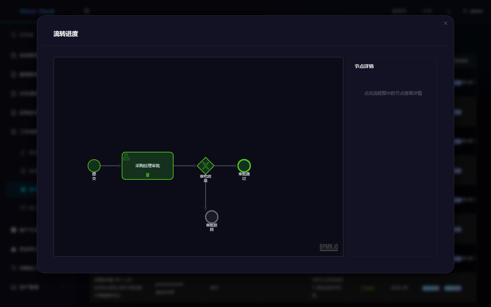 | 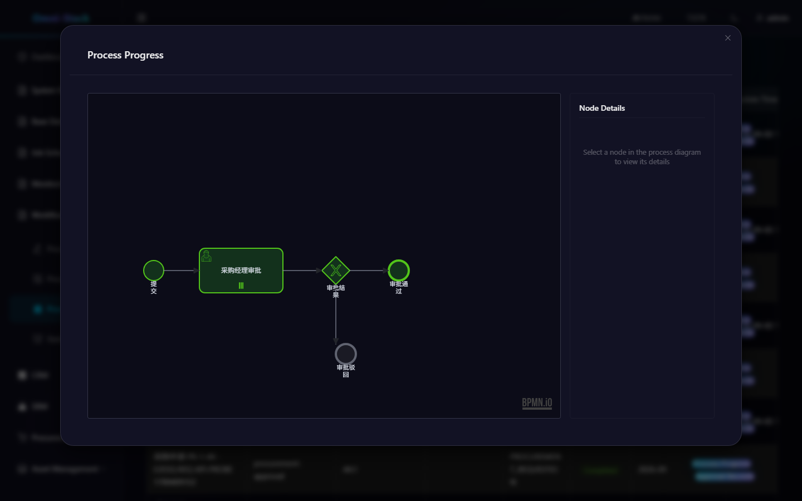 | 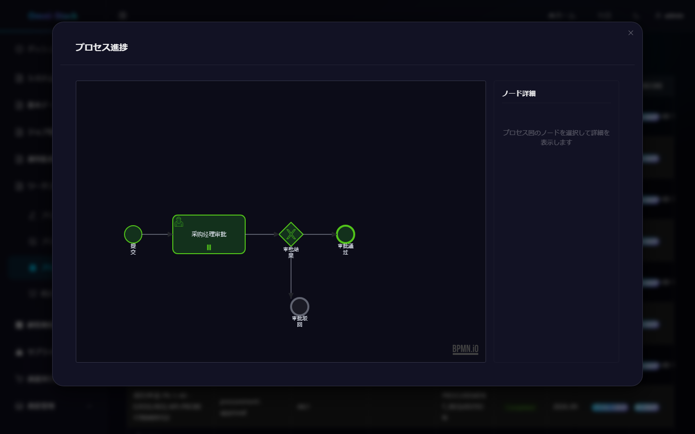 | 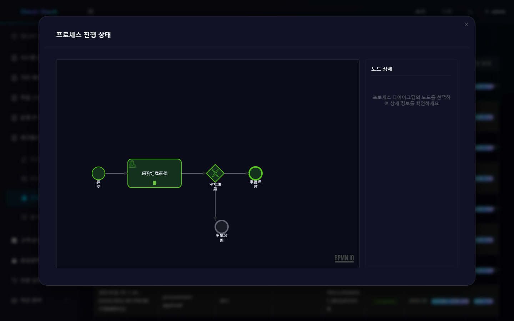 |
| 승인 기록(approval) | 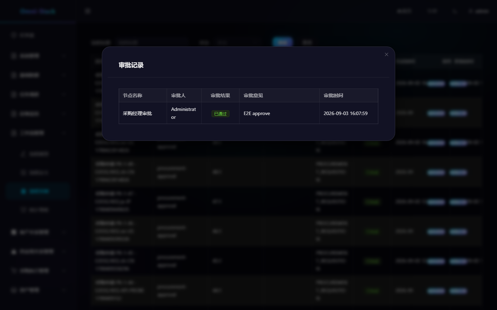 | 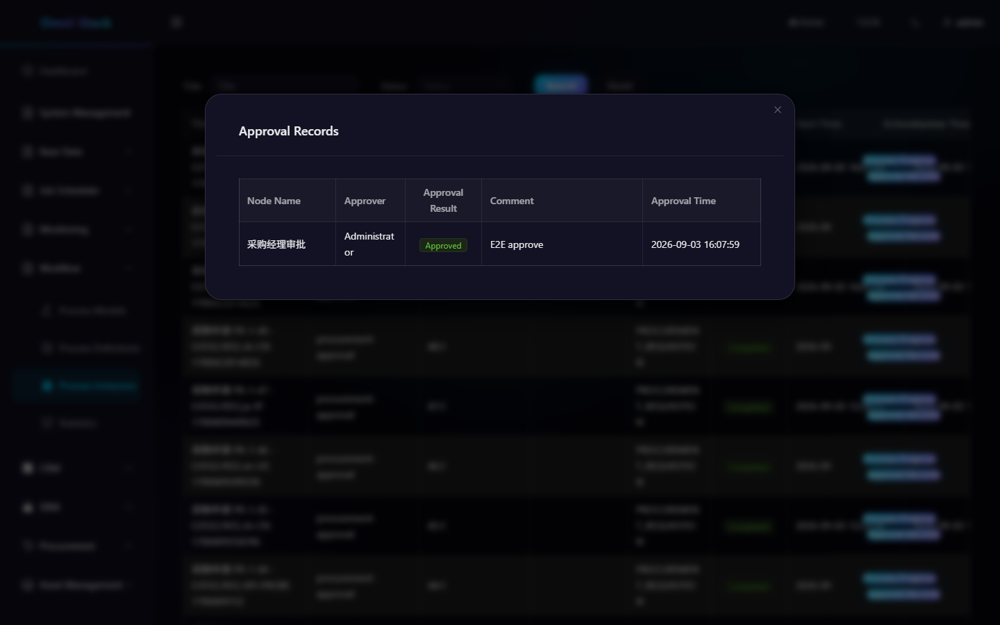 | 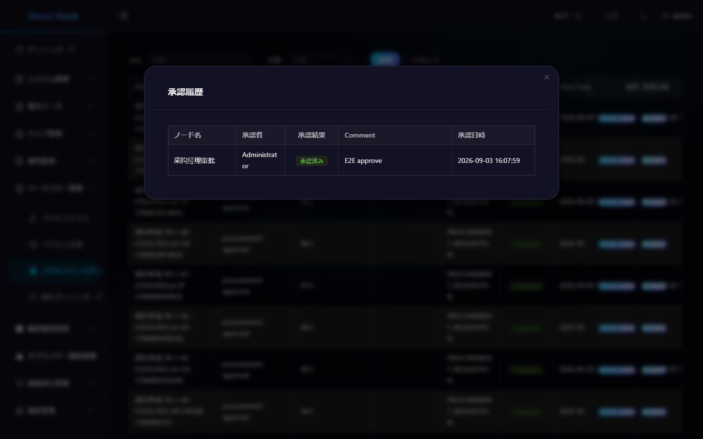 | 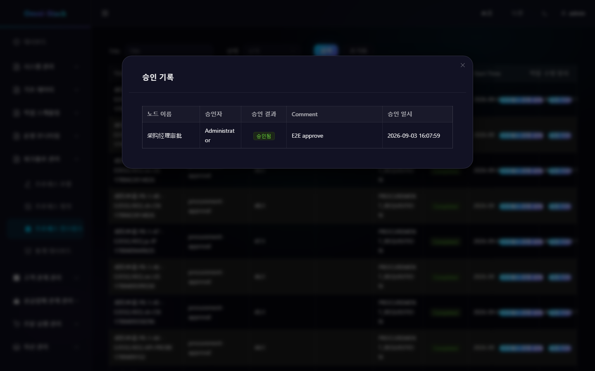 |
| 버전 이력(publish) | 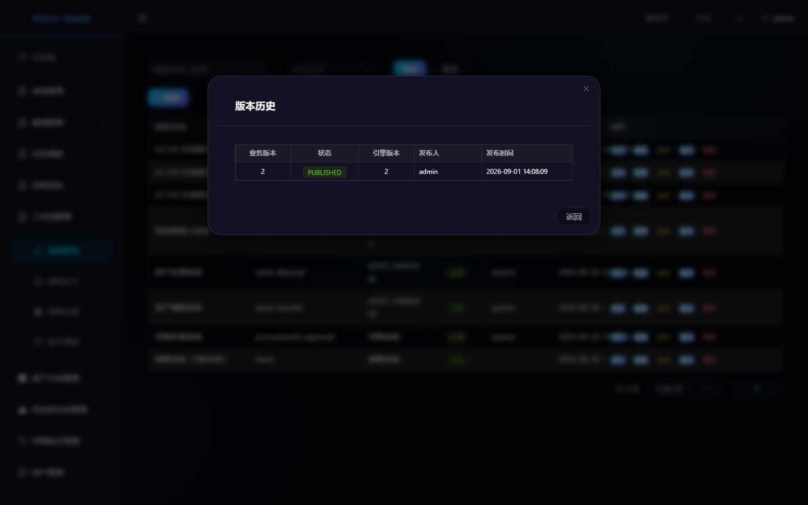 | 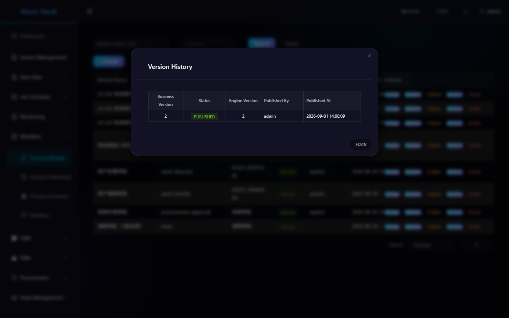 | 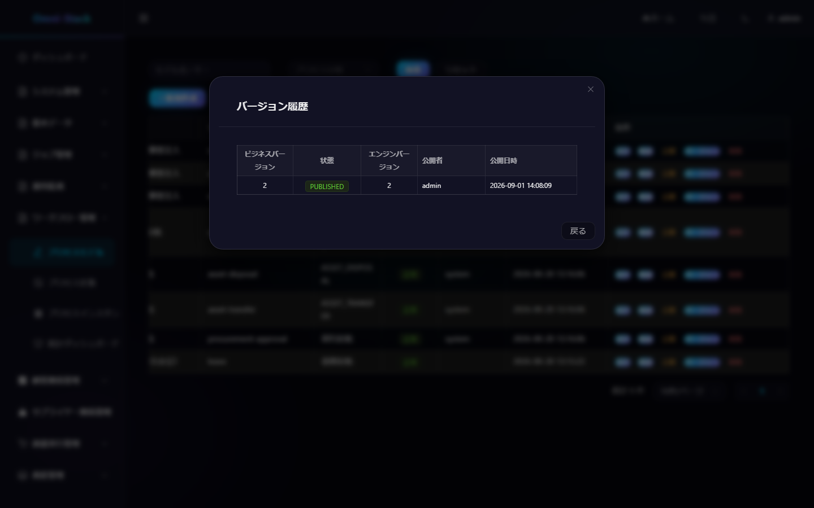 | 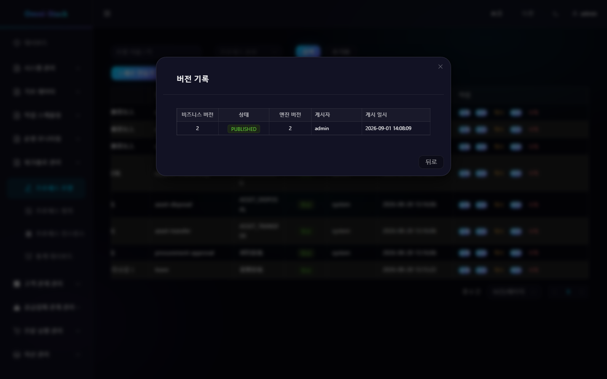 |

프로세스 진행 그림에서 녹색 노드는 본 인스턴스가 실행한 활동(`completed-node` 마크), 회색은 지나지 않은 분기(예 「승인 거부」)로, §2.7 「진행 상황 및 기록」의 의미와 일치합니다.

아직 커버되지 않은 프로세스: `model-lifecycle` / `detail-and-action-states` / `failure-states` 는 「모델링 → BPMN 설계 → 검증 → 게시」 쓰기 체인이 필요하고, 게시는 공유 Flowable 엔진에 프로세스 정의(`ACT_RE_*`)를 배포하며 검증된 깨끗한 삭제/롤백 경로가 아직 없습니다; `countersign` 는 다중 인스턴스 합동 결재 모델과 여러 승인자 신분이 필요합니다. 네 항목 모두 **개별 승인/신규 테스트 신분이 필요**하며, 본 라운드에서는 임의 배포도 일시적 권한 초과도 하지 않고, 커버리지 목록에서 명시적 gap 으로 보존합니다.
