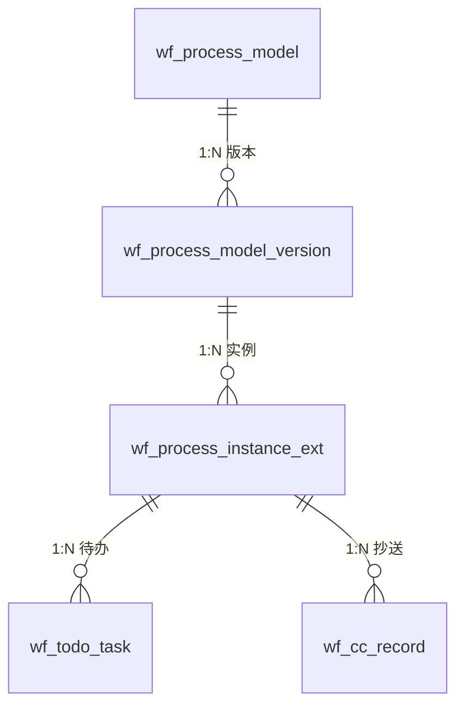

# 工作流引擎

> 本文档覆盖 Omni-Stack 工作流引擎的架构、核心流程、约束和扩展指南。  
> 架构概览详见 [architecture.md](architecture.md)。Docker 部署配置详见 [docker-deployment.md](docker-deployment.md)。

Omni-Stack 提供基于 **Flowable 7.x** 的可视化 BPMN 工作流引擎，支持模型设计、双版本管理、多实例会签审批和端到端流程跟踪。

## 1. 架构概览

工作流系统由一个独立微服务和一个共享 Starter 库组成：

```
┌──────────────────────────────────────────────────────────────────────────┐
│                          Workflow Engine                                  │
├──────────────────────────────────────────────────────────────────────────┤
│                      omni-workflow (port 8103)                            │
│  ─────────────────────────────────────────────────────────────────────   │
│  Controllers (7): WorkflowModel · ProcessDefinition · ProcessInstance    │
│                   Approval · Task · WorkflowStats · WorkflowIdentity     │
│  Services (8): WorkflowModel · ProcessDefinition · ProcessInstance       │
│                WorkflowApproval · WorkflowTask · WorkflowStats            │
│                WorkflowIdentity · WorkflowTodoSync                       │
│  Delegates:  ScopedRoleAssignmentListener · CandidateResolverDelegate    │
│              CandidateResolverBean · CcNotifyDelegate                    │
│  Engine:     BpmnXmlBuilder · BpmnXmlValidator                           │
├──────────────────────────────────────────────────────────────────────────┤
│                  omni-common-workflow (shared starter)                    │
│  FlowableAutoConfiguration · ApprovalService(Impl) · UserGroupLookup     │
│  WorkflowNotificationService · TenantInfoFilter · TenantInfoHolder       │
├──────────────────────────────────────────────────────────────────────────┤
│                        Flowable BPMN Engine 7.x                           │
│  repositoryService · runtimeService · taskService · historyService       │
├──────────────────────────────────────────────────────────────────────────┤
│                       omni_workflow (MySQL)                               │
│  wf_process_model · wf_process_model_version · wf_process_instance_ext   │
│  wf_todo_task · wf_cc_record · wf_form_schema · wf_delegation_rule      │
└──────────────────────────────────────────────────────────────────────────┘
```

**模块依赖**：

- `omni-common-core` — POJO（`R<T>`、`PageResult`）、XSS SPI 接口
- `omni-common-mybatis` — MyBatis-Plus + MySQL 驱动 + 租户拦截器
- `omni-common-redis` — Redis 缓存，用于 XSS 配置和会话数据
- `omni-common-workflow` — Flowable 自动配置、审批 SPI、租户过滤器、通知 SPI
- `omni-workflow` — 业务层：控制器、服务、委托器、BPMN 引擎工具

**关键设计决策**：

- 选择 **Flowable** 作为 BPMN 引擎：开源、成熟的 Spring Boot 集成、原生多实例（MI）支持
- **双版本管理**：业务版本在 `wf_process_model_version` 中跟踪（DRAFT → PUBLISHED → ARCHIVED），引擎版本由 Flowable 部署管理
- **可视化设计器**：前端 BPMN 建模器生成设计器 JSON，`BpmnXmlBuilder` 转换为 BPMN 2.0 XML
- **动态候选人解析**：`omni:assignment` JSON 扩展元素在任务启动时由 `ScopedRoleAssignmentListener` 解析，无需硬编码审批人

### 数据模型



### 数据库表（omni_workflow）

| 表名 | 用途 |
|------|------|
| `wf_process_model` | 流程模型注册表，`model_key` 在租户内唯一 |
| `wf_process_model_version` | 版本历史：BPMN XML、设计器 JSON、部署信息 |
| `wf_process_instance_ext` | 实例扩展：将 Flowable 实例关联到模型版本 |
| `wf_todo_task` | 待办任务缓存，支持按审批人快速查询 |
| `wf_cc_record` | 抄送通知记录，含已读状态 |
| `wf_form_schema` | JSON Schema 表单定义 |
| `wf_delegation_rule` | 审批委托规则（用户到用户，可选流程范围） |

---

## 2. 核心流程详解

### 2.1 模型创建

```
POST /api/workflow/model  (workflow:model:create)
```

1. `WorkflowModelController.createModel(CreateModelRequest)` → `WorkflowModelService.createModel()`
2. 创建 `wf_process_model` 记录，包含 `model_key`（租户内唯一）
3. 创建初始 `wf_process_model_version` 记录，`status = DRAFT`
4. 将 `wf_process_model.current_draft_version_id` 指向新版本

### 2.2 草稿保存（可视化设计器）

```
PUT /api/workflow/model/{id}/draft  (workflow:model:update)
```

1. `WorkflowModelController.saveDraft(id, SaveDraftRequest)` → `WorkflowModelService.saveDraft()`
2. 更新草稿版本的 `designer_json`，通过 `BpmnXmlBuilder.build()` 重新生成 `bpmn_xml`
3. 计算 `xml_sha256` 用于变更检测
4. 从请求中同步模型名称和分类

**BpmnXmlBuilder** 将设计器 JSON 节点转换为 BPMN 2.0 XML 元素：

| 设计器节点类型 | BPMN 元素 | 扩展 |
|---|---|---|
| `StartEvent` | `<startEvent>` | — |
| `EndEvent` | `<endEvent>` | — |
| `UserTask` | `<userTask>` | `<omni:assignment>` + `flowable:executionListener` |
| `ServiceTask`（抄送） | `<serviceTask>` | `<omni:cc>` + `flowable:delegateExpression` |
| `ExclusiveGateway` | `<exclusiveGateway>` | `default` 属性 |
| `ParallelGateway` | `<parallelGateway>` | — |

### 2.3 模型校验

```
POST /api/workflow/model/{id}/validate  (workflow:model:validate)
```

`BpmnXmlValidator.validate()` 检查项：
1. XML 格式正确性（含 XXE 防护）
2. 恰好一个可执行的 `<process>`，其 id 与 `model_key` 匹配
3. 至少一个 `StartEvent` 和一个 `EndEvent`
4. 每个 `UserTask` 都有 `<omni:assignment>` 扩展
5. 抄送 `ServiceTask` 有 `<omni:cc>` 扩展
6. `ExclusiveGateway` 有一个 `default` 流（不带 `conditionExpression`）
7. 所有 `SequenceFlow` 引用有效的源/目标

### 2.4 模型发布

```
POST /api/workflow/model/{id}/publish  (workflow:model:publish)
```

1. `SELECT FOR UPDATE` 对模型记录加悲观锁
2. 通过 `BpmnXmlValidator` 校验 BPMN XML
3. 将 `targetNamespace` 替换为模型分类
4. 部署到 Flowable：`repositoryService.createDeployment().addString(bpmnXml).deploy()`
5. 计算业务版本号（`max(现有版本) + 1`）
6. 更新版本记录：`status = PUBLISHED`、`deploymentId`、`processDefinitionId`、`engineVersion`
7. 归档之前的已发布版本（`status = ARCHIVED`）
8. 更新模型的 `current_published_version_id`

### 2.5 流程实例启动

```
POST /api/workflow/process-instance/start  (workflow:instance:start)
```

1. `ProcessInstanceController.start(StartProcessRequest)` → `ProcessInstanceService.start()`
2. 解析最新的已发布版本以获取 `processDefinitionId`
3. 启动 Flowable 实例：`runtimeService.startProcessInstanceById(processDefinitionId, businessKey, variables)`
4. 创建 `wf_process_instance_ext` 记录，关联模型、版本和 Flowable 实例
5. `ScopedRoleAssignmentListener` 在每个 UserTask 启动事件触发时解析候选人

### 2.6 审批完成

```
POST /api/workflow/approval/{taskId}/complete  (workflow:approval:complete)
```

1. `ApprovalController.complete(taskId, ApprovalRequest)` → `WorkflowApprovalService.complete()`
2. 设置流程变量：`approved = true/false`、`comment = "..."`
3. 调用 `taskService.complete(taskId, variables)`
4. `ApprovalServiceImpl` 更新多实例计数器（`approvedCount` / `rejectedCount`）
5. 多实例 `completionCondition` 求值：`${rejectedCount > 0 || approvedCount >= requiredApprovals}`
6. 若条件满足 → 剩余的多实例被跳过（deleteReason = `MI_END`）

### 2.7 进度与记录

**进度**（`GET /{id}/progress`）：
- 查询 `HistoricActivityInstance` 获取所有活动
- 按 `activityId` 聚合（去重多实例子实例）
- 对于待办的 UserTask，通过 `CandidateResolverBean` 预解析候选人
- 返回 `ProcessProgressResponse`，包含 `List<ActivityInfo>` 及每个审批人的状态

**审批记录**（`GET /{id}/approval-records`）：
- 查询 `HistoricTaskInstance`（按创建时间升序）
- 判定每个任务的结果：`approved`（通过）/ `rejected`（驳回）/ `auto-approved`（自动通过，MI_END）/ `cancelled`（已取消）/ `pending`（待办）
- 获取 `Comment` 作为审批意见，获取 `approved` 变量用于区分通过/驳回

---

## 3. 约束与注意事项

### 3.1 多实例 DeleteReason

当多实例 `completionCondition` 触发时，剩余任务会被 Flowable 以 `deleteReason = "MI_END"` 删除——**而非** `"deleted"`。`"deleted"` 原因在整个流程实例被终止或驳回时使用。

**规则**：始终使用 `HistoricTaskInstance.getDeleteReason()` 来区分跳过与取消：

| `deleteReason` | 含义 | 结果 |
|---|---|---|
| `null` | 任务正常完成 | 检查 `approved` 变量 → 通过 / 驳回 |
| `MI_END` | 被多实例 completionCondition 跳过 | 自动通过 |
| `deleted` | 流程终止 / 已驳回 | 已取消 |

**注意**：不要依赖 `HistoricActivityInstance` 的父级查找。多行可能共享相同的 `ACT_ID_`（一行 deleteReason 为 `NULL`，另一行为 `MI_END`）。`putIfAbsent` 可能存入错误的行。应直接使用任务级别的 `deleteReason`。

### 3.2 omni:assignment 扩展元素

`omni:assignment` JSON 是候选人解析的**唯一配置入口**：

```xml
<userTask id="dept-leader-approve" flowable:assignee="${userId}">
  <extensionElements>
    <flowable:executionListener event="start"
        delegateExpression="${scopedRoleAssignmentListener}" />
    <omni:assignment>{
      "roleCode": "DEPT_LEADER",
      "anchorType": "PARENT",
      "anchorParams": {},
      "scopeMode": "SAME_UNIT",
      "fallbackStrategy": "ERROR",
      "approvalMode": "ANY"
    }</omni:assignment>
  </extensionElements>
  <multiInstanceLoopCharacteristics isSequential="false"
      flowable:collection="candidateUserIds"
      flowable:elementVariable="userId">
    <completionCondition>${rejectedCount > 0 || approvedCount >= requiredApprovals}</completionCondition>
  </multiInstanceLoopCharacteristics>
</userTask>
```

**字段说明**：

| 字段 | 取值 | 描述 |
|---|---|---|
| `roleCode` | 任意角色编码（如 `TEAM_LEADER`、`DEPT_LEADER`） | 要解析的目标角色 |
| `anchorType` | `START_USER_PRIMARY_UNIT`、`PARENT`、`ABSOLUTE_UNIT`、`PARENT_BY_TYPE`、`CHILD_BY_CODE`、`SIBLING_BY_CODE`、`PARENT_CHILDREN`、`DEPT_BY_CODE`、`CHILD_UNIT`、`SIBLING_UNIT` | 如何定位锚点组织单元 |
| `anchorParams` | JSON 对象（如 `{"unitIds": [200]}`) | 锚点解析参数 |
| `scopeMode` | `SAME_UNIT`、`UNIT_AND_BELOW`、`CHILDREN_ONLY` | 候选人搜索范围 |
| `fallbackStrategy` | `ERROR`、`ASSIGN_ADMIN`、`ESCALATE_PARENT` | 未找到候选人时的行为 |
| `approvalMode` | `ALL`（默认）、`ANY` | 多实例会签模式 |

### 3.3 审批模式

- **ALL**：所有候选人都必须审批。`requiredApprovals = candidateUserIds.size()`。当 `approvedCount >= requiredApprovals` 时流程推进。
- **ANY**：任意一人审批即可。`requiredApprovals = 1`。首个审批通过后流程推进；剩余任务自动完成，`deleteReason = MI_END`。

两种模式共享相同的 `completionCondition` 表达式：`${rejectedCount > 0 || approvedCount >= requiredApprovals}`。区别在于 `ScopedRoleAssignmentListener` 设置的 `requiredApprovals` 值不同。

**驳回快捷方式**：在两种模式下，任意一个驳回（`rejectedCount > 0`）都会立即触发驳回分支，跳过剩余审批人。

### 3.4 租户隔离

`omni-workflow` 中的 `MybatisPlusConfig` 注册了 `TenantLineInnerInterceptor`，其行为如下：
- 从 `TenantInfoHolder` 读取租户 ID（由 `TenantInfoFilter` 从 `X-Tenant-Id` 请求头设置）
- **排除** Flowable 内部表（`ACT_*` / `act_*` 前缀）不参与租户过滤

Flowable 表通过 Flowable 内置的 `tenantId` 机制实现租户隔离，而非 MyBatis-Plus 拦截。

### 3.5 XSS 集成

`omni-workflow` 通过 `XssConfigProviderImpl` 实现 `XssConfigProvider` SPI：
- 从 Redis 缓存读取 XSS 配置（`xss:enabled:{tenantId}`、`xss:rules:{tenantId}`）
- 缓存由 `omni-auth` 服务写入；工作流服务是**只读消费者**
- 缓存未命中时，返回 `enabled = false`（失败开放策略）

### 3.6 候选人解析组件

| 组件 | Bean 名称 | 触发时机 |
|---|---|---|
| `ScopedRoleAssignmentListener` | `scopedRoleAssignmentListener` | UserTask `start` 事件上的 ExecutionListener |
| `CandidateResolverDelegate` | `candidateResolverDelegate` | UserTask 之前 ServiceTask 中的 JavaDelegate |
| `CandidateResolverBean` | `candidateResolver` | UEL 表达式或离线预解析 |

`CandidateResolverBean` 暴露 `resolveCandidates(processDefinitionId, activityId, startUserId, tenantId)` 供离线使用（例如 `getProgress()` 需要显示谁*将会*审批一个待办任务）。

### 3.7 发布锁定

`publishModel()` 使用 `SELECT FOR UPDATE` 对 `wf_process_model` 加悲观锁，以防止同一模型的并发部署。这很关键，因为 Flowable 部署不是原子操作——涉及多个引擎 API 调用。

---

## 4. 扩展指南

### 4.1 添加新的审批流程类型

1. 设计 BPMN XML，在每个 UserTask 上配置 `<omni:assignment>`
2. 使用 `BpmnXmlValidator` 校验（强制检查必需的扩展）
3. 通过 API 创建模型：`POST /api/workflow/model`
4. 保存 BPMN XML：`PUT /api/workflow/model/{id}/draft`
5. 发布：`POST /api/workflow/model/{id}/publish`

无需修改代码——框架通过 BPMN XML + `omni:assignment` 配置实现数据驱动。

### 4.2 添加新的锚点类型

1. 在 `ScopedRoleAssignmentListener` 的解析逻辑中添加新的锚点类型字符串
2. 实现组织单元查询（例如按特定条件查询 `sys_org_unit`）
3. 如需校验，将锚点类型添加到 `BpmnXmlValidator` 的已知值中
4. 更新前端 `UserTaskPanel.vue`，在属性面板中展示新的锚点类型

### 4.3 添加新的降级策略

1. 在 `ScopedRoleAssignmentListener` 中添加策略常量
2. 实现降级行为（例如 `ASSIGN_ADMIN` → 查询管理员用户，`ESCALATE_PARENT` → 查找上级单元候选人）
3. 更新 `omni:assignment` JSON Schema 校验

### 4.4 自定义通知服务

实现 `omni-common-workflow` 中的 `WorkflowNotificationService` 接口：

```java
@Service
public class MyNotificationService implements WorkflowNotificationService {
    @Override
    public void notifyPendingTask(String assigneeId, String taskId, String title) { ... }

    @Override
    public void clearPendingTask(String taskId) { ... }
}
```

默认的 `NoOpNotificationService`（由 `FlowableAutoConfiguration` 注册）会通过 `@ConditionalOnMissingBean` 被你的实现替换。

### 4.5 抄送（CC）通知

在 BPMN 设计器中添加一个 `ServiceTask` 节点，使用 `ccNotifyDelegate` 委托表达式。配置 `<omni:cc>` 扩展元素指定目标用户 ID 或基于角色的解析。`CcNotifyDelegate` 在运行时创建 `wf_cc_record` 记录。

---

## 5. 技术选型思考：为什么选择 Flowable 7.x

| 考量 | Flowable | Camunda | Activiti |
|------|---------|---------|----------|
| **开源许可** | Apache 2.0（商业友好） | 商业版需许可（社区版 MIT） | Apache 2.0 |
| **Spring Boot 集成** | 原生 Spring Boot Starter，自动配置 | 需额外配置 Spring Boot Starter | 已停止维护（Flowable 是其分叉） |
| **多实例支持** | 原生 MI（Multi-Instance）支持，completionCondition 灵活 | 类似功能 | 基础 MI 支持 |
| **CMMN/DMN** | 支持 BPMN + CMMN + DMN | 支持 BPMN + DMN（CMMN 商业版） | 仅 BPMN |
| **社区活跃度** | 活跃（GitHub 8k+ stars） | 活跃（商业支持） | 已停止维护 |
| **版本 7.x** | Jakarta EE 兼容，Spring Boot 3/4 支持 | 版本 8 架构变动大 | 无新版 |

**结论**：Flowable 7.x 在开源许可、Spring Boot 原生集成、多实例支持方面优势明显，是 Omni-Stack 工作流引擎的最佳选择。

## 6. BPMN 建模最佳实践

### 命名约定

| 元素 | 命名规则 | 示例 |
|------|---------|------|
| Process ID | 与 `model_key` 一致 | `leave-request`, `expense-approval` |
| UserTask ID | kebab-case，描述角色+动作 | `dept-leader-approve`, `hr-review` |
| SequenceFlow ID | `flow-{source}-{target}` | `flow-start-submit` |
| Gateway ID | `{type}-gw-{purpose}` | `exclusive-gw-amount`, `parallel-gw-notify` |

### 建模原则

1. **每个 UserTask 必须配置 `<omni:assignment>`**：动态候选人解析，禁止硬编码 `assignee`
2. **ExclusiveGateway 必须设置 default flow**：无条件分支作为兑底，避免流程死锁
3. **多实例会签使用统一的 completionCondition**：`${rejectedCount > 0 \|\| approvedCount >= requiredApprovals}`
4. **CC 通知使用 ServiceTask + `ccNotifyDelegate`**：非阻塞，不影响主流程
5. **模型发布前必须通过 `BpmnXmlValidator`**：确保 XML 合法性和扩展元素完整性

### 流程设计器前端架构

```
bpmn-js Modeler (开源 BPMN 2.0 建模工具)
    │
    ├── useBpmnModeler.ts      — Modeler 创建/销毁生命周期
    ├── useBpmnExtension.ts    — omni:assignment 等扩展元素读写
    ├── bpmnContextPadI18n.ts  — 上下文菜单国际化
    └── bpmnContextPadProvider.ts — 自定义上下文菜单项

属性面板 (panels/)
    ├── UserTaskPanel.vue      — 角色解析配置（roleCode, anchorType, scopeMode）
    ├── ServiceTaskPanel.vue   — CC 通知配置
    └── GatewayPanel.vue       — 网关条件配置
```

## 7. 故障排查指南

| 问题 | 可能原因 | 排查方法 |
|------|---------|----------|
| **模型发布失败** | BPMN XML 校验未通过 | 调用 `POST /api/workflow/model/{id}/validate` 获取具体错误信息 |
| **候选人解析失败** | `omni:assignment` 配置错误 | 检查 `roleCode`、`anchorType`、`scopeMode` 值是否合法；查看服务日志中的异常信息 |
| **流程实例未启动** | 模型未发布或版本已归档 | 检查 `wf_process_model_version` 表中是否有 `status=PUBLISHED` 的版本 |
| **多实例任务未跳过** | completionCondition 未触发 | 检查 `approvedCount`、`rejectedCount`、`requiredApprovals` 变量值 |
| **deleteReason 显示错误** | MI_END vs deleted 混淆 | 参考 §3.1 MI DeleteReason 表格，`MI_END` = 自动完成，`deleted` = 流程终止 |
| **租户隔离失效** | TenantInfoHolder 未设置 | 确认 Gateway 已注入 `X-Tenant-Id` 请求头；检查 `TenantInfoFilter` 是否正常执行 |
| **BPMN 设计器无法加载** | bpmn-js 版本不兼容 | 确认 `bpmn-js` 版本为 18.x；检查浏览器控制台错误 |
